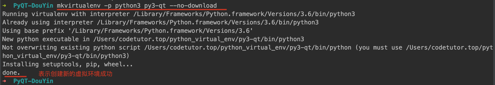
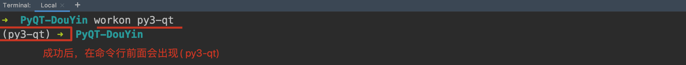
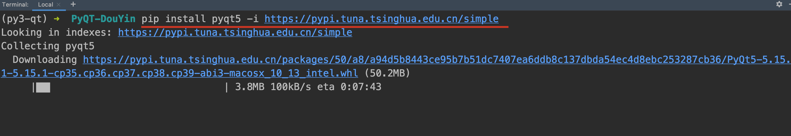
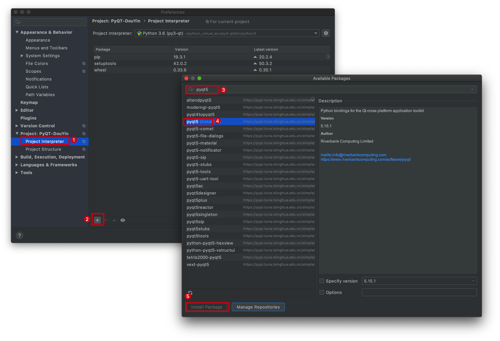

# 001-PyQt介绍与安装

## 一、介绍

### 1. Qt


Qt（官方发音 `[kju:t]`）是一个跨平台的C++开发库，主要用来开发图形用户界面（Graphical User Interface，GUI）程序

Qt 是纯 C++ 开发的，正常情况下需要先学习C语言、然后在学习C++然后才能使用Qt开发带界面的程序

多亏了开源社区使得**Qt 还可以用Python、Ruby、Perl 等脚本语言进行开发。**

**Qt 支持的操作系统有很多，例如通用操作系统 Windows、Linux、Unix，智能手机系统Android、iOS， 嵌入式系统等等**。可以说是跨平台的

QT官网：https://doc.qt.io/qt-5/index.html

### 2. PyQt

PyQt的开发者是英国的“Riverbank  Computing”公司。它提供了GPL（简单的说，以GPL协议发布到网上的素材，你可以使用，也可以更改，但是经过你更改然后再次发布的素材必须也遵守GPL协议，主要要求是必须开源，而且不能删减原作者的声明信息等）与商业协议两种授权方式，因此它可以免费地用于自由软件的开发。

**PyQt可以运行于Microsoft Windows、Mac OS X、Linux以及Unix的多数变种上**。

PyQt是Python语言的GUI（Graphical User Interface，简称 GUI，又称图形用户接口）编程解决方案之一

可以用来代替Python内置的`Tkinter`。其它替代者还有`PyGTK`、`wxPython`等，与Qt一样，PyQt是一个自由软件

文档相关地址：https://www.riverbankcomputing.com/software/pyqt/

比较不错的参考资料：https://wiki.python.org/moin/PyQt/Tutorials

### 3. 一句话概括

- Qt (C++ 语言 GUI  )
- PyQt =  Python  +  Qt技术

### 4. Python GUI开发热门选择

- Tkinter

  Python官方采用的标准库，优点是作为Python标准库、稳定、发布程序较小，缺点是控件相对较少。

- wxPython

  基于wxWidgets的Python库，优点是控件比较丰富，缺点是稳定性相对差点、文档少、用户少。

- PySide2、PyQt5 

  基于Qt 的Python库，优点是控件比较丰富、跨平台体验好、文档完善、用户多。

  缺点是 库比较大，发布出来的程序比较大。

  PyQt5 的开发者是英国的“Riverbank Computing”公司  ， 而 PySide2 则是 qt 针对python语言提供的专门

## 二、安装

下面我们以在Python虚拟环境中，使用pip进行安装PyQT

### 1. 创建新的虚拟环境

```
mkvirtualenv -p python3 py3-qt --no-download
```



### 2. 安装pyqt5（命令行）

1. 切换到指定的虚拟环境

   ```
   workon py3-qt
   ```



安装pyqt5

```
pip install pyqt5 -i https://pypi.tuna.tsinghua.edu.cn/simple
```

1. 

### 3. 安装pyqt5（pycharm图形界面）



### 4. 安装成功效果如下


在当前安装PyQt的虚拟环境中输入如下测试代码：

```python
# 如果执行成功，没有任何错误提示，则表明环境搭建成功
from PyQt5 import QtWidgets

# 当然也可以查看PyQt版本
from PyQt5.QtCore import *
print(QT_VERSION_STR)
```

### 5. 注意

如果安装缓慢，可以尝试修改pip加速，加速地址如下

```
阿里云  https://mirrors.aliyun.com/pypi/simple/

中国科技大学 https://pypi.mirrors.ustc.edu.cn/simple/

豆瓣(douban) https://pypi.douban.com/simple/

清华大学 https://pypi.tuna.tsinghua.edu.cn/simple/

中国科学技术大学 https://pypi.mirrors.ustc.edu.cn/simple/
```