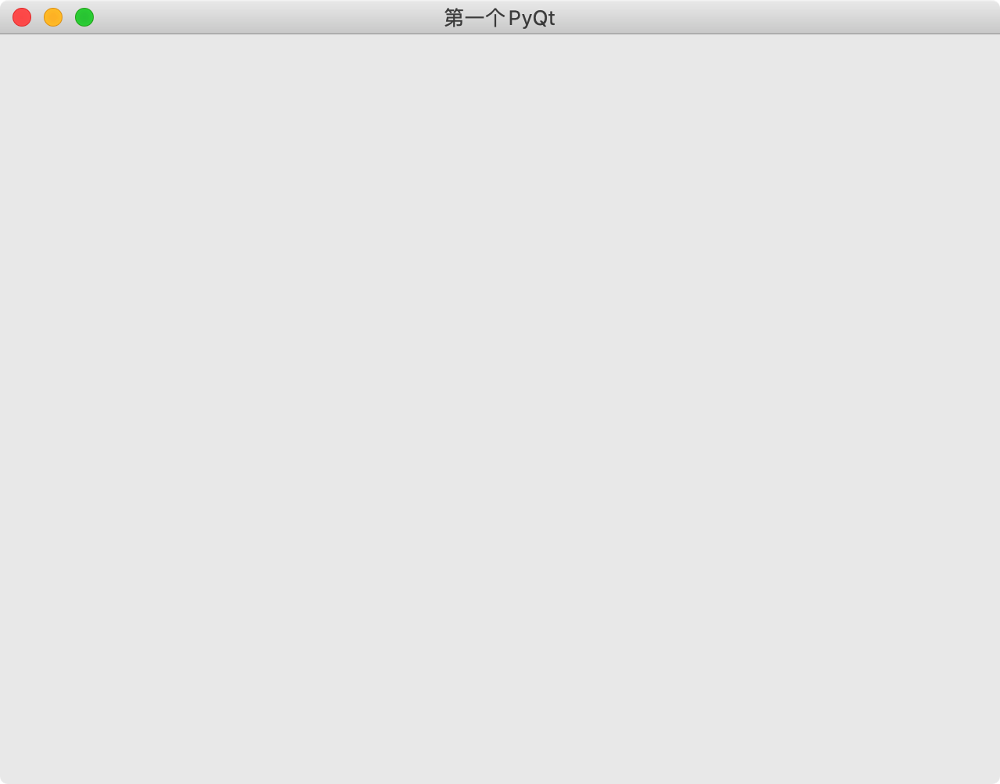
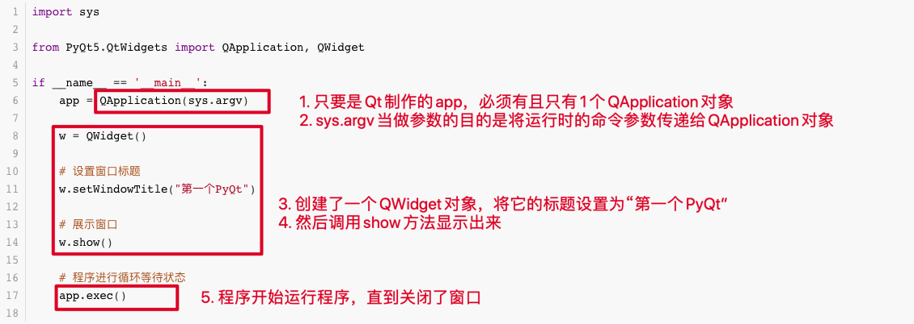
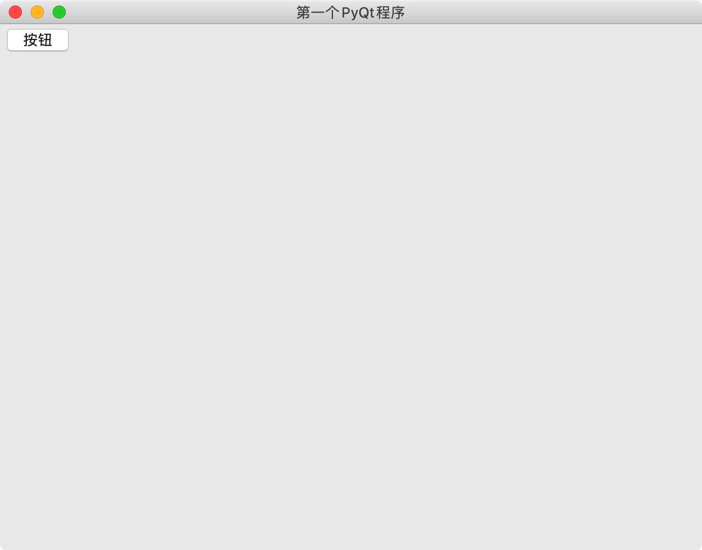
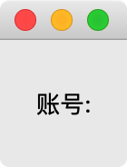
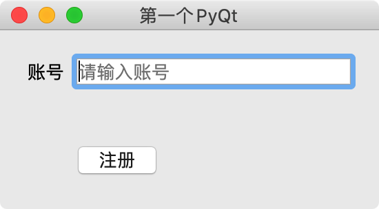
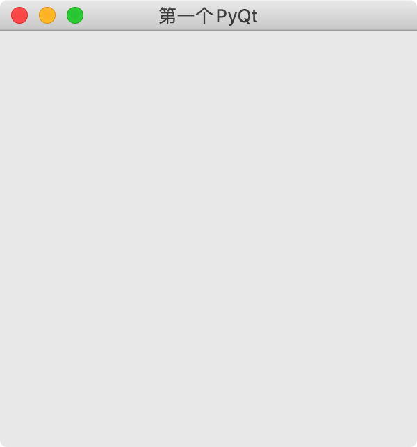
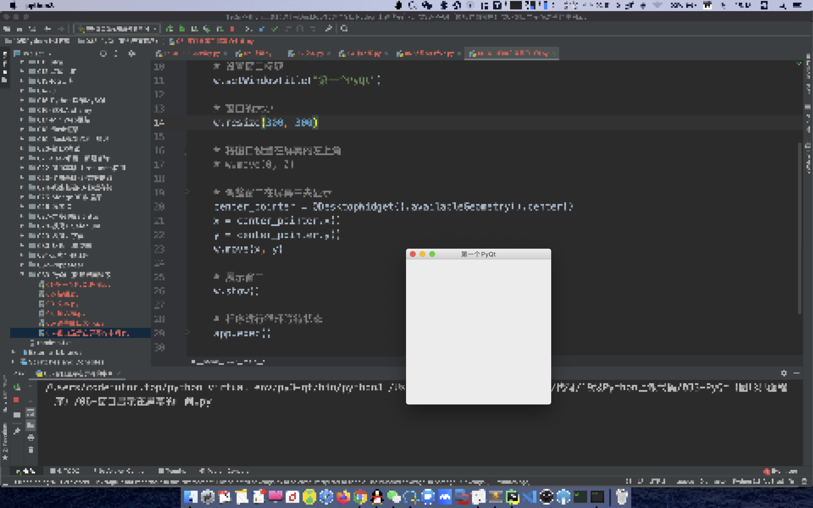
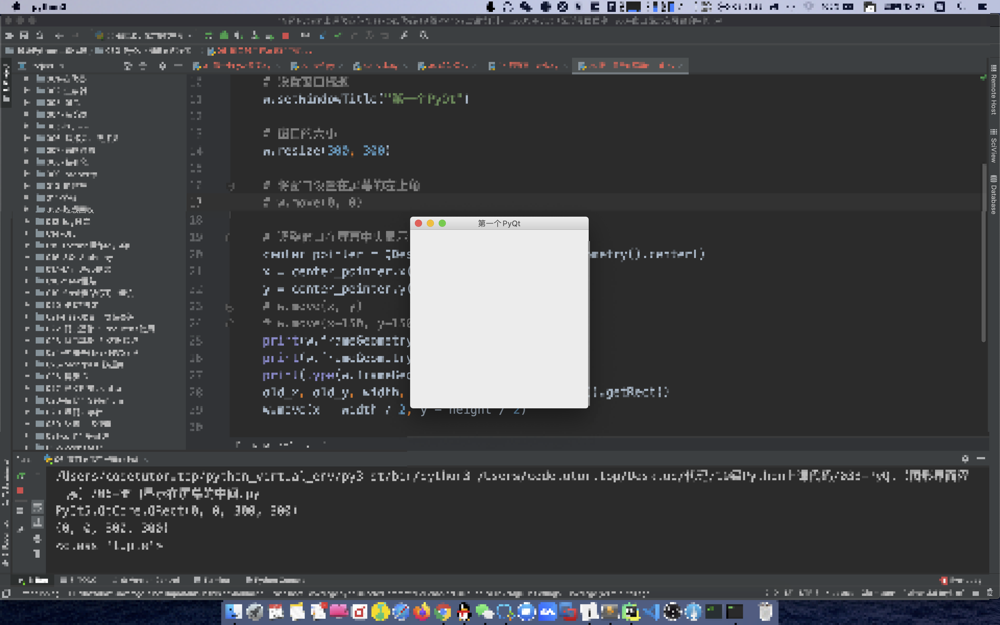

# 002-PyQt基本UI

## 一、第一个PyQt程序

```python
import sys

from PyQt5.QtWidgets import QApplication, QWidget

if __name__ == '__main__':
    app = QApplication(sys.argv)

    w = QWidget()

    # 设置窗口标题
    w.setWindowTitle("第一个PyQt")

    # 展示窗口
    w.show()

    # 程序进行循环等待状态
    app.exec()
```

运行上述代码的效果如下：



程序解释说明：



## 二、模块介绍

PyQt中有非常多的功能模块,开发中最常用的功能模块主要有三个:

- **QtCore**:包含了核心的非GUI的功能。主要和时间、文件与文件夹、各种数据、流、URLs、mime类文件、进程与线程一起使用
- **QtGui**:包含了窗口系统、事件处理、2D图像、基本绘画、字体和文字类
- **QtWidgets**:包含了一些列创建桌面应用的UI元素

可以参考PyQt官网的所有模块，地址：https://www.riverbankcomputing.com/static/Docs/PyQt5/module_index.html#ref-module-index

C++具体实现的API文档，地址：https://doc.qt.io/qt-5/qtwidgets-module.html

**用到什么功能就它相关的api或者别人分享的使用心得，这是学习最快的方式**

## 三、基本UI

窗口内的所有控件，若想在窗口中显示，都需要表示它的父亲是谁，而不能直接使用 show 函数显示

### 1. 按钮

按钮对应的控件名称为 ` QPushButton`  ， 位于 `PyQt5.QtWidgets`  里面

```python
import sys

from PyQt5.QtWidgets import QApplication, QWidget, QPushButton

if __name__ == '__main__':
    app = QApplication(sys.argv)

    w = QWidget()

    # 设置窗口标题
    w.setWindowTitle("第一个PyQt程序")

    # 在窗口里面添加控件
    btn = QPushButton("按钮")

    # 设置按钮的父亲是当前窗口，等于是添加到窗口中显示
    btn.setParent(w)

    # 展示窗口
    w.show()

    # 程序进行循环等待状态
    app.exec()
```

运行效果：



### 2. 文本

纯文本控件名称为 ` QLabel`  ， 位于 `PyQt5.QtWidgets`  里面

纯文本控件仅仅作为标识显示而已，类似输入内容前的一段标签提示（账号 、密码）

```python
import sys

from PyQt5.QtWidgets import QApplication, QWidget, QPushButton, QLabel

if __name__ == '__main__':
    app = QApplication(sys.argv)

    w = QWidget()

    # 设置窗口标题
    w.setWindowTitle("第一个PyQt")

    # # 下面创建一个Label，然后调用方法指定父类
    # label = QLabel("账号: ", w)
    # # 设置父对象
    # label.setParent(w)

    # 下面创建一个Label（纯文本），在创建的时候指定了父对象
    label = QLabel("账号: ", w)

    # 显示位置与大小 ： x, y , w, h
    label.setGeometry(20, 20, 30, 30)

    # 展示窗口
    w.show()

    # 程序进行循环等待状态
    app.exec()
```

运行效果：



### 3. 输入框

输入框的控件名称为 `QLineEdit`， 位于 `PyQt5.QtWidgets`  里面

```python
import sys

from PyQt5.QtWidgets import QApplication, QWidget, QPushButton, QLabel, QLineEdit

if __name__ == '__main__':
    app = QApplication(sys.argv)

    w = QWidget()

    # 设置窗口标题
    w.setWindowTitle("第一个PyQt")

    # 纯文本
    label = QLabel("账号", w)
    label.setGeometry(20, 20, 30, 20)

    # 文本框
    edit = QLineEdit(w)
    edit.setPlaceholderText("请输入账号")
    edit.setGeometry(55, 20, 200, 20)

    # 在窗口里面添加控件
    btn = QPushButton("注册", w)
    btn.setGeometry(50, 80, 70, 30)

    # 展示窗口
    w.show()

    # 程序进行循环等待状态
    app.exec()
```

运行效果：



### 4. 调整窗口大小

```python
import sys

from PyQt5.QtWidgets import QApplication, QWidget

if __name__ == '__main__':
    app = QApplication(sys.argv)

    w = QWidget()

    # 设置窗口标题
    w.setWindowTitle("第一个PyQt")

    # 窗口的大小
    w.resize(300, 300)

    # 展示窗口
    w.show()

    # 程序进行循环等待状态
    app.exec()
```

运行效果：



### 5. 窗口显示在屏幕的中间

```python
import sys

from PyQt5.QtWidgets import QApplication, QWidget, QDesktopWidget

if __name__ == '__main__':
    app = QApplication(sys.argv)

    w = QWidget()

    # 设置窗口标题
    w.setWindowTitle("第一个PyQt")

    # 窗口的大小
    w.resize(300, 300)

    # 将窗口设置在屏幕的左上角
    # w.move(0, 0)

    # 调整窗口在屏幕中央显示
    center_pointer = QDesktopWidget().availableGeometry().center()
    x = center_pointer.x()
    y = center_pointer.y()
    # w.move(x, y)
    # w.move(x-150, y-150)
    print(w.frameGeometry())
    print(w.frameGeometry().getRect())
    print(type(w.frameGeometry().getRect()))
    old_x, old_y, width, height = w.frameGeometry().getRect()
    w.move(x - width / 2, y - height / 2)

    # 展示窗口
    w.show()

    # 程序进行循环等待状态
    app.exec()
```

不在中央的样子



在中央的样子



### 6. 设置窗口icon

可以下载icon图标网站：https://www.easyicon.net/

```python
import sys

from PyQt5.QtGui import QIcon
from PyQt5.QtWidgets import QApplication, QWidget

if __name__ == '__main__':
    app = QApplication(sys.argv)

    # 创建一个QWidget
    w = QWidget()
    # 设置标题
    w.setWindowTitle("看看我图标帅吗")
    # 设置图标
    w.setWindowIcon(QIcon('panda.png'))
    # 显示QWidget
    w.show()

    app.exec()
```