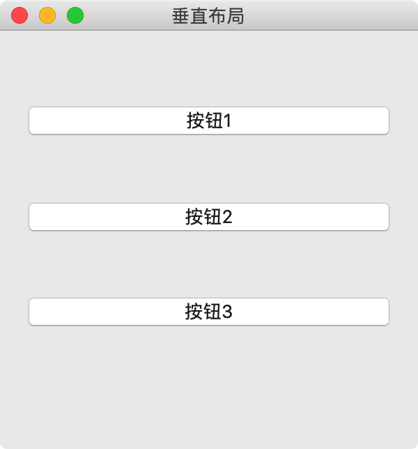
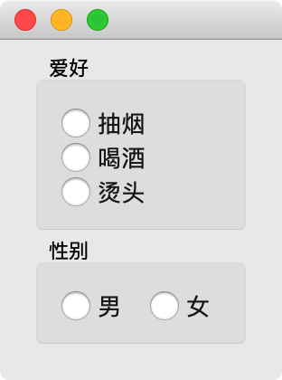
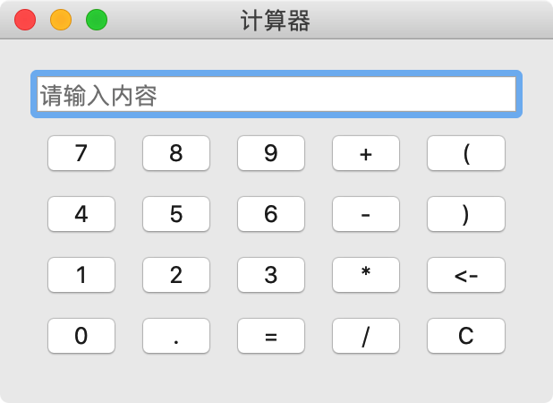

# 003-布局

在Qt里面布局分为四个大类 ：

- QBoxLayout 
- QGridLayout
- QFormLayout
- QStackedLayout

## 一、QBoxLayout

直译为：盒子布局

一般使用它的两个子类`QHBoxLayout`  和  `QVBoxLayout` 负责水平和垂直布局 

垂直布局示例：

```python
import sys
from PyQt5.QtWidgets import QApplication, QVBoxLayout, QWidget, QPushButton, QGroupBox, QMainWindow
from PyQt5.QtCore import Qt


class MyWindow(QWidget):
    def __init__(self):
        # 切记一定要调用父类的__init__方法，因为它里面有很多对UI空间的初始化操作
        super().__init__()

        # 设置大小
        self.resize(300, 300)
        # 设置标题
        self.setWindowTitle("垂直布局")

        # 垂直布局
        layout = QVBoxLayout()

        # 作用是在布局器中增加一个伸缩量，里面的参数表示QSpacerItem的个数，默认值为零
        # 会将你放在layout中的空间压缩成默认的大小
        # 下面的笔试1：1：1：2
        layout.addStretch(1)

        # 按钮1
        btn1 = QPushButton("按钮1")
        # 添加到布局器中
        # layout.addWidget(btn1, Qt.AlignmentFlag.AlignTop)
        layout.addWidget(btn1)

        layout.addStretch(1)

        # 按钮2
        btn2 = QPushButton("按钮2")
        # 添加到布局器
        layout.addWidget(btn2)

        layout.addStretch(1)

        # 按钮3
        btn3 = QPushButton("按钮3")
        # 添加到布局器
        layout.addWidget(btn3)

        layout.addStretch(2)

        self.setLayout(layout)


if __name__ == '__main__':
    app = QApplication(sys.argv)

    # 创建一个QWidget子类
    w = MyWindow()
    w.show()

    app.exec()
```

运行效果：



水平布局

```python
import sys
from PyQt5.QtWidgets import QApplication, QWidget, QGroupBox, QVBoxLayout, QHBoxLayout, QRadioButton


class MyWindow(QWidget):

    def __init__(self):
        super().__init__()
        self.init_ui()

    def init_ui(self):
        # 最外层的垂直布局，包含两部分：爱好和性别
        container = QVBoxLayout()

        # -----创建第1个组，添加多个组件-----
        # hobby 主要是保证他们是一个组。
        hobby_box = QGroupBox("爱好")
        # v_layout 保证三个爱好是垂直摆放
        v_layout = QVBoxLayout()
        btn1 = QRadioButton("抽烟")
        btn2 = QRadioButton("喝酒")
        btn3 = QRadioButton("烫头")
        # 添加到v_layout中
        v_layout.addWidget(btn1)
        v_layout.addWidget(btn2)
        v_layout.addWidget(btn3)
        # 把v_layout添加到hobby_box中
        hobby_box.setLayout(v_layout)

        # -----创建第2个组，添加多个组件-----
        # 性别组
        gender_box = QGroupBox("性别")
        # 性别容器
        h_layout = QHBoxLayout()
        # 性别选项
        btn4 = QRadioButton("男")
        btn5 = QRadioButton("女")
        # 追加到性别容器中
        h_layout.addWidget(btn4)
        h_layout.addWidget(btn5)
        # 添加到 box中
        gender_box.setLayout(h_layout)

        # 把爱好的内容添加到容器中
        container.addWidget(hobby_box)
        # 把性别的内容添加到容器中
        container.addWidget(gender_box)

        # 设置窗口显示的内容是最外层容器
        self.setLayout(container)


if __name__ == '__main__':
    app = QApplication(sys.argv)

    w = MyWindow()
    w.show()

    app.exec()
```

运行效果：



**注意**

- 通过上面的示例，我们能够看到水平布局器与垂直布局器是可以混合使用即嵌套使用

## 二、QGridLayout

网格布局，有的人称之为九宫格布局

```python
import sys
from PyQt5.QtWidgets import QApplication, QWidget, QVBoxLayout, QPushButton, QLineEdit, QGridLayout


class MyWindow(QWidget):

    def __init__(self):
        super().__init__()
        self.init_ui()

    def init_ui(self):
        self.setWindowTitle("计算器")

        # 准备数据
        data = {
            0: ["7", "8", "9", "+", "("],
            1: ["4", "5", "6", "-", ")"],
            2: ["1", "2", "3", "*", "<-"],
            3: ["0", ".", "=", "/", "C"]
        }

        # 整体垂直布局
        layout = QVBoxLayout()

        # 输入框
        edit = QLineEdit()
        edit.setPlaceholderText("请输入内容")
        # 把输入框添加到容器中
        layout.addWidget(edit)

        # 网格布局
        grid = QGridLayout()

        # 循环创建追加进去
        for line_number, line_data in data.items():
            # 此时line_number是第几行，line_data是当前行的数据
            for col_number, number in enumerate(line_data):
                # 此时col_number是第几列，number是要显示的符号
                btn = QPushButton(number)
                # grid.addWidget(btn)
                grid.addWidget(btn, line_number, col_number)

        # 把网格布局追加到容器中
        layout.addLayout(grid)

        self.setLayout(layout)


if __name__ == '__main__':
    app = QApplication(sys.argv)

    w = MyWindow()
    w.show()

    app.exec()
```

运行效果：

