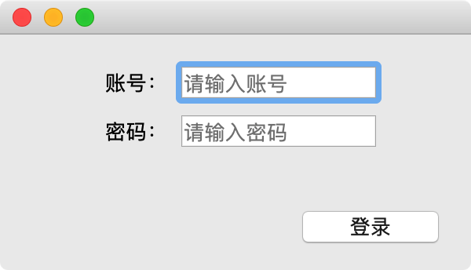
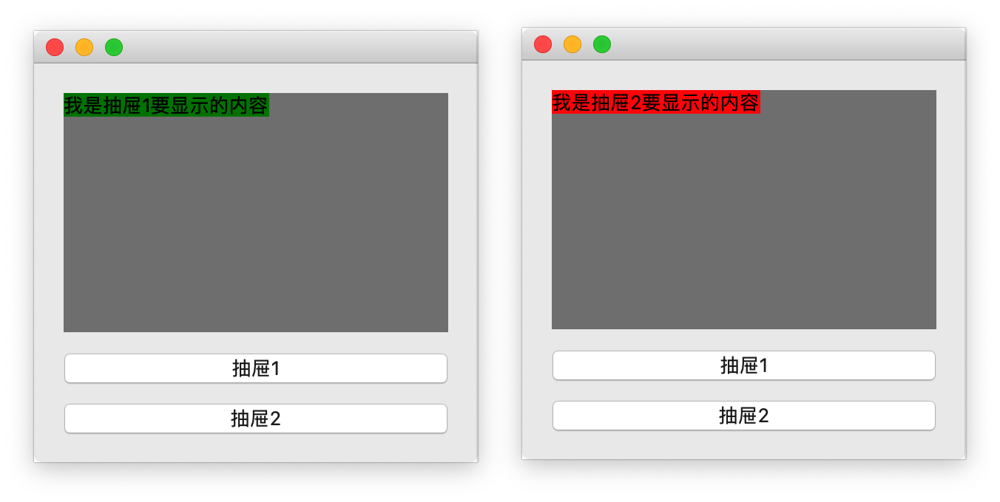

# 004-布局2

## 一、QFormLayout

 一般适用于提交数据**form表单**。比如： 登录，注册类似的场景

```python
import sys

from PyQt5.QtCore import Qt
from PyQt5.QtWidgets import QVBoxLayout, QFormLayout, QLineEdit, QPushButton, QApplication, QWidget


class MyWindow(QWidget):

    def __init__(self):
        super().__init__()
        self.init_ui()

    def init_ui(self):
        # 设定当前Widget的宽高(可以拉伸大小)
        # self.resize(300, 200)
        # 禁止改变宽高（不可以拉伸）
        self.setFixedSize(300, 150)

        # 外层容器
        container = QVBoxLayout()

        # 表单容器
        form_layout = QFormLayout()

        # 创建1个输入框
        edit = QLineEdit()
        edit.setPlaceholderText("请输入账号")
        form_layout.addRow("账号：", edit)

        # 创建另外1个输入框
        edit2 = QLineEdit()
        edit2.setPlaceholderText("请输入密码")
        form_layout.addRow("密码：", edit2)

        # 将from_layout添加到垂直布局器中
        container.addLayout(form_layout)

        # 按钮
        login_btn = QPushButton("登录")
        login_btn.setFixedSize(100, 30)

        # 把按钮添加到容器中，并且指定它的对齐方式
        container.addWidget(login_btn, alignment=Qt.AlignRight)

        # 设置当前Widget的布局器，从而显示这个布局器中的子控件
        self.setLayout(container)


if __name__ == '__main__':
    app = QApplication(sys.argv)

    w = MyWindow()
    w.show()

    app.exec()
```

运行效果：



## 二、QStackedLayout

提供了多页面切换的布局，一次只能看到一个界面。 **抽屉布局**

```python
import sys
from PyQt5.QtWidgets import QApplication, QWidget, QVBoxLayout, QPushButton, QStackedLayout, QLabel


class Window1(QWidget):
    def __init__(self):
        super().__init__()
        QLabel("我是抽屉1要显示的内容", self)
        self.setStyleSheet("background-color:green;")


class Window2(QWidget):
    def __init__(self):
        super().__init__()
        QLabel("我是抽屉2要显示的内容", self)
        self.setStyleSheet("background-color:red;")


class MyWindow(QWidget):
    def __init__(self, parent=None):
        super().__init__(parent)
        self.create_stacked_layout()
        self.init_ui()

    def create_stacked_layout(self):
        # 创建堆叠(抽屉)布局
        self.stacked_layout = QStackedLayout()
        # 创建单独的Widget
        win1 = Window1()
        win2 = Window2()
        # 将创建的2个Widget添加到抽屉布局器中
        self.stacked_layout.addWidget(win1)
        self.stacked_layout.addWidget(win2)

    def init_ui(self):
        # 设置Widget大小以及固定宽高
        self.setFixedSize(300, 270)

        # 1. 创建整体的布局器
        container = QVBoxLayout()

        # 2. 创建1个要显示具体内容的子Widget
        widget = QWidget()
        widget.setLayout(self.stacked_layout)
        widget.setStyleSheet("background-color:grey;")

        # 3. 创建2个按钮，用来点击进行切换抽屉布局器中的Widget
        btn_press1 = QPushButton("抽屉1")
        btn_press2 = QPushButton("抽屉2")
        # 给按钮添加事件（即点击后要调用的函数）
        btn_press1.clicked.connect(self.btn_press1_clicked)
        btn_press2.clicked.connect(self.btn_press2_clicked)

        # 4. 将需要显示的空间添加到布局器中
        container.addWidget(widget)
        container.addWidget(btn_press1)
        container.addWidget(btn_press2)

        # 5. 设置当前要显示的Widget，从而能够显示这个布局器中的控件
        self.setLayout(container)

    def btn_press1_clicked(self):
        # 设置抽屉布局器的当前索引值，即可切换显示哪个Widget
        self.stacked_layout.setCurrentIndex(0)

    def btn_press2_clicked(self):
        # 设置抽屉布局器的当前索引值，即可切换显示哪个Widget
        self.stacked_layout.setCurrentIndex(1)


if __name__ == "__main__":
    app = QApplication(sys.argv)

    win = MyWindow()
    win.show()

    app.exec()
```

效果：

