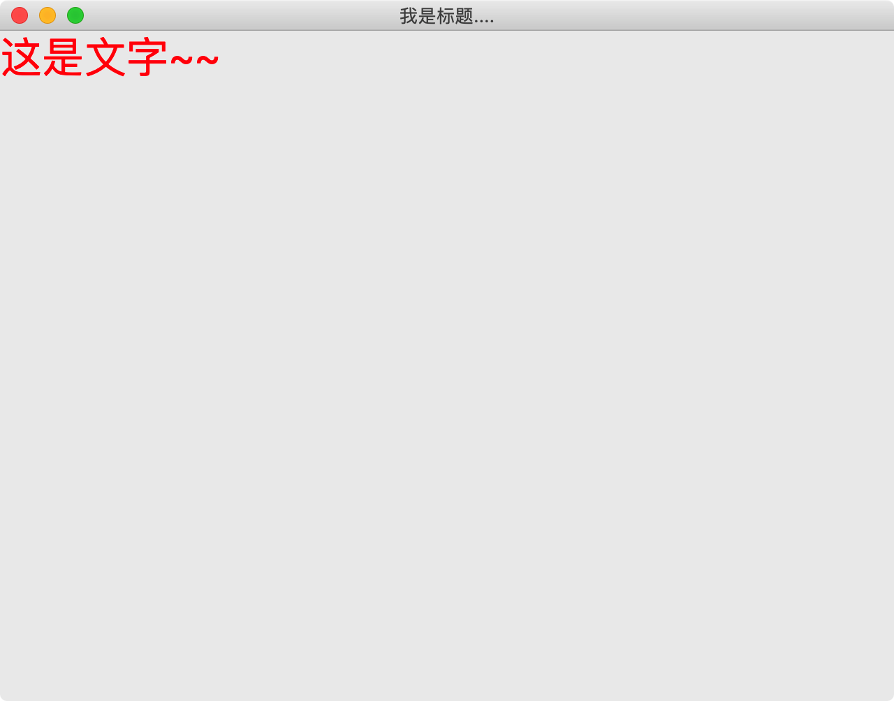
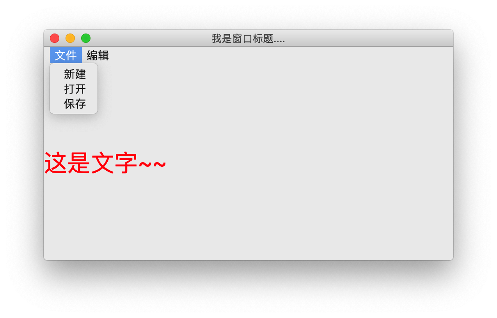
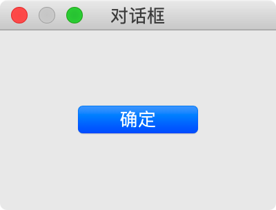

# 005-窗口

## 一、分类

在Qt中，生成窗口有三种方式：  `QWidget`  |  `QMainWindow` | `QDialog` 

### 1. QWidget

控件和窗口的父类 ，自由度高（什么都东西都没有），没有划分菜单、工具栏、状态栏、主窗口 等区域

### 2. QMainWindow

是` QWidget`的子类，包含菜单栏，工具栏，状态栏，标题栏等，中间部分则为主窗口区域

### 3. QDialog

对话框窗口的基类

## 二、QWidget

```python
import  sys

from PyQt5.QtWidgets import QWidget, QLabel , QApplication

class mywnd(QWidget):

    def __init__(self):
        super(mywnd, self).__init__()
        self.initUI()

    def initUI(self):
        label = QLabel("这是文字~~" )
        label.setStyleSheet("font-size:30px;color:red")
        label.setParent(self)

if __name__ == '__main__':
    app = QApplication(sys.argv)

    w = mywnd()

    #设置窗口标题
    w.setWindowTitle("qwidget")

    # 展示窗口
    w.show()

    # 程序进行循环等待状态
    app.exec()
```

效果：



## 三、QMainWindow

```python
import sys

from PyQt5.QtWidgets import QMainWindow, QLabel, QApplication


class MyWindow(QMainWindow):

    def __init__(self):
        super().__init__()
        self.init_ui()

    def init_ui(self):
        label = QLabel("这是文字~~")
        label.setStyleSheet("font-size:30px;color:red")

        # 调用父类中的menuBar，从而对菜单栏进行操作
        menu = self.menuBar()
        # 如果是Mac的话，菜单栏不会在Window中显示而是屏幕顶部系统菜单栏位置
        # 下面这一行代码使得Mac也按照Windows的那种方式在Window中显示Menu
        menu.setNativeMenuBar(False)

        file_menu = menu.addMenu("文件")
        file_menu.addAction("新建")
        file_menu.addAction("打开")
        file_menu.addAction("保存")

        edit_menu = menu.addMenu("编辑")
        edit_menu.addAction("复制")
        edit_menu.addAction("粘贴")
        edit_menu.addAction("剪切")

        # 设置中心内容显示
        self.setCentralWidget(label)


if __name__ == '__main__':
    app = QApplication(sys.argv)

    w = MyWindow()
    # 设置窗口标题
    w.setWindowTitle("我是窗口标题....")
    # 展示窗口
    w.show()

    # 程序进行循环等待状态
    app.exec()
```

效果（Mac与Windows效果稍有不同）



## 四、QDialog

不过对话框一般不应该作为主窗口的存在，而是通过点击操作弹出，起到提示作用

```python
import sys

from PyQt5.QtWidgets import QDialog, QPushButton, QApplication


class MyDialog(QDialog):

    def __init__(self):
        super().__init__()
        self.init_ui()

    def init_ui(self):
        ok_btn = QPushButton("确定", self)
        ok_btn.setGeometry(50, 50, 100, 30)


if __name__ == '__main__':
    app = QApplication(sys.argv)

    w = MyDialog()
    # 设置窗口标题
    w.setWindowTitle("对话框")
    # 展示窗口
    w.show()

    # 程序进行循环等待状态
    app.exec()
```

运行效果：

