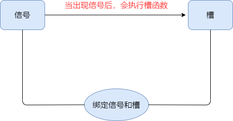
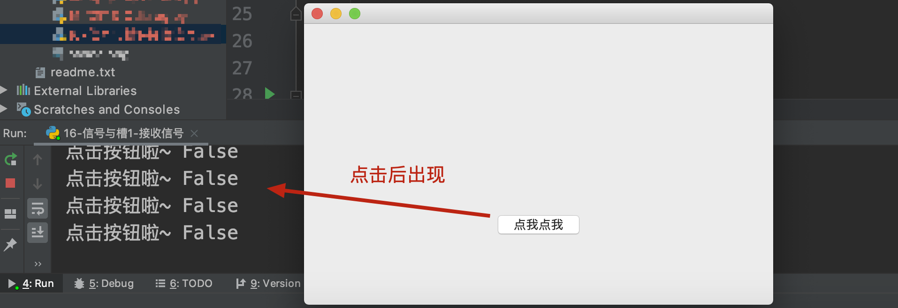
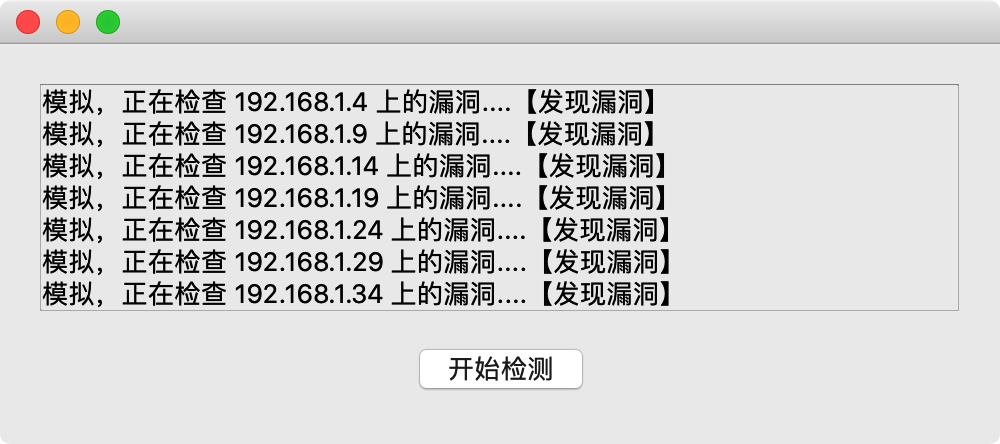
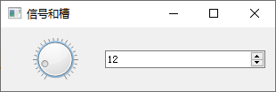

# 006-信号与槽

## 一、说明

`信号`和`槽`是 Qt的核心内容

### 1. 信号(signal)

其实就是事件（按钮点击 、内容发生改变 、窗口的关闭事件） 或者是 状态 （check选中了， togglebutton 切换。） 

当程序触发了某种状态或者发生了某种事件（比如：按钮被点击了, 内容改变等等），那么即可发射出来一个`信号`。

### 2. 槽( slot)

若想捕获这个信号，然后执行相应的逻辑代码，那么就需要使用到 `槽` ， `槽`实际上是一个函数， 当`信号`发射出来后，会执行与之绑定的`槽`函数

### 3. 将信号与槽链接

为了能够实现，当点击某个按钮时执行某个逻辑，需要把具体的`信号`和具体的`槽`函数绑定到一起.  

操作大体流程如下

```python
对象.信号.connect(槽函数)
```



需求： 

```txt
当出现了某一种信号（某一种事件）的时候，我们需要执行一段代码（用函数来包装这份代码。）
```

解决的办法：

```txt
信号和槽
```

## 二、案例 1

### 功能：接收信号

```python
import sys

from PyQt5.QtWidgets import QApplication, QWidget, QPushButton


class MyWindow(QWidget):
    def __init__(self):
        super().__init__()
        self.init_ui()

    def init_ui(self):
        # 更改当前Widge的宽高
        self.resize(500, 300)
        # 创建一个按钮
        btn = QPushButton("点我点我", self)
        # 设置窗口位置、宽高
        btn.setGeometry(200, 200, 100, 30)
        # 将按钮被点击时触发的信号与我们定义的函数（方法）进行绑定
        # 注意：这里没有()，即写函数的名字，而不是名字()
        btn.clicked.connect(self.click_my_btn)

    def click_my_btn(self, arg):
        # 槽函数，点击按钮则调用该函数
        # 这里的参数正好是信号发出，传递的参数
        print("点击按钮啦~", arg)


if __name__ == '__main__':
    app = QApplication(sys.argv)

    w = MyWindow()
    w.show()

    app.exec()
```

运行效果：



## 三、案例2：

### 自定义信号【重点】

除了接收Qt自带的信号之外，我们也可以自行定义信号，在合适的时机，自行发射信号

自定义信号需要使用到 `pyqtSignal`来声明信号  ，并且需要在类中的函数之外声明

如果会自定义信号，那么信号和槽基本上也就掌握了。否则永远只会接收别人发射出的信号

```python
import sys
import time

from PyQt5.QtWidgets import *
from PyQt5.QtCore import *


class MyWindow(QWidget):
    # 声明一个信号 只能放在函数的外面
    my_signal = pyqtSignal(str)

    def __init__(self):
        super().__init__()
        self.init_ui()
        self.msg_history = list()  # 用来存放消息

    def init_ui(self):
        self.resize(500, 200)

        # 创建一个整体布局器
        container = QVBoxLayout()

        # 用来显示检测到漏洞的信息
        self.msg = QLabel("")
        self.msg.resize(440, 15)
        # print(self.msg.frameSize())
        self.msg.setWordWrap(True)  # 自动换行
        self.msg.setAlignment(Qt.AlignTop)  # 靠上
        # self.msg.setStyleSheet("background-color: yellow; color: black;")

        # 创建一个滚动对象
        scroll = QScrollArea()
        scroll.setWidget(self.msg)

        # 创建垂直布局器，用来添加自动滚动条
        v_layout = QVBoxLayout()
        v_layout.addWidget(scroll)

        # 创建水平布局器
        h_layout = QHBoxLayout()
        btn = QPushButton("开始检测", self)
        # 绑定按钮的点击，点击按钮则开始检测
        btn.clicked.connect(self.check)
        h_layout.addStretch(1)  # 伸缩器
        h_layout.addWidget(btn)
        h_layout.addStretch(1)

        # 操作将要显示的控件以及子布局器添加到container
        container.addLayout(v_layout)
        container.addLayout(h_layout)

        # 设置布局器
        self.setLayout(container)

        # 绑定信号和槽
        self.my_signal.connect(self.my_slot)

    def my_slot(self, msg):
        # 更新内容
        print(msg)
        self.msg_history.append(msg)
        self.msg.setText("<br>".join(self.msg_history))
        self.msg.resize(440, self.msg.frameSize().height() + 15)
        self.msg.repaint()  # 更新内容，如果不更新可能没有显示新内容

    def check(self):
        for i, ip in enumerate(["192.168.1.%d" % x for x in range(1, 255)]):
            msg = "模拟，正在检查 %s 上的漏洞...." % ip
            # print(msg)
            if i % 5 == 3:
                # 表示发射信号 对象.信号.发射(参数)
                self.my_signal.emit(msg + "【发现漏洞】")
            time.sleep(0.01)


if __name__ == '__main__':
    app = QApplication(sys.argv)

    w = MyWindow()
    w.show()

    app.exec()
```

效果：



## 四、作业

左边的控件是 `QDial`   ， 右边的控件是 `QSpinBox` 。两者相互关联，转动刻度右边的数字随之改变，改变右边的数字，左边的刻度盘也跟着转到指定位置。

