# 007-QtDesigner

## 一、介绍

纯靠代码来编写界面，效率属实是有点底，今天我们用另外一个辅助设计图形化的软件 `QT Designer`

### 1. 下载

Mac版本：[http://download.codetutor.top/software/Mac/Qt%20Designer.dmg](http://download.codetutor.top/software/Mac/Qt Designer.dmg)

Windows版本：[http://download.codetutor.top/software/win/Qt Designer Setup.exe](http://download.codetutor.top/software/win/Qt Designer Setup.exe)

### 2. 安装&运行

安装过程很简单，按照正常软件安装即可，安装后的图片如下图：


**但Mac平台用户要注意，运行时会出现如下图问题**：

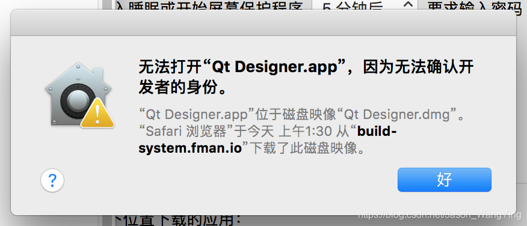

**解决办法**：在“应用程序”文件夹，按住`control`键然后运行。只需要这种方式运行第一次即可，以后运行就像普通软件一样打开

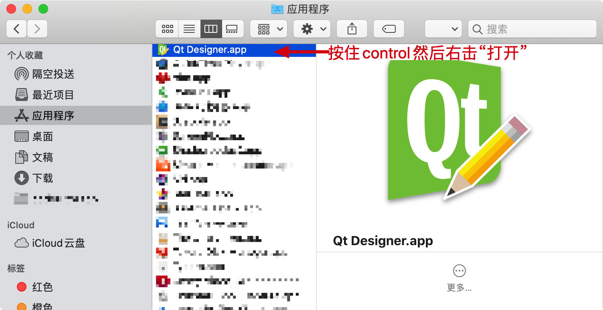

## 二、使用QT Designer

Mac运行之后的效果如下：

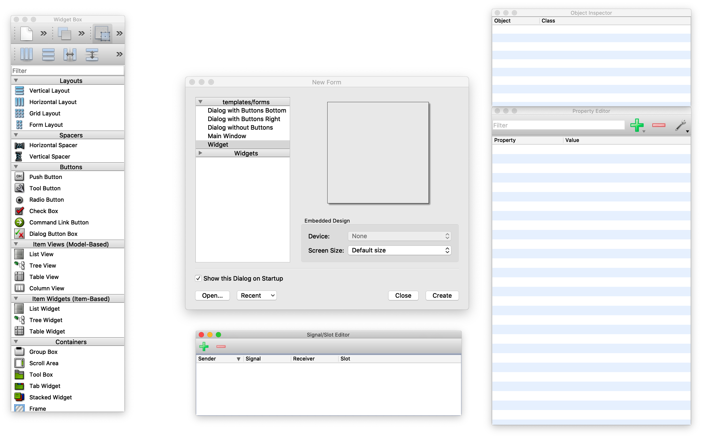

Windows基本也是如此，只是效果略有不同

## 三、使用流程

1.创建一个基于QWidget的界面

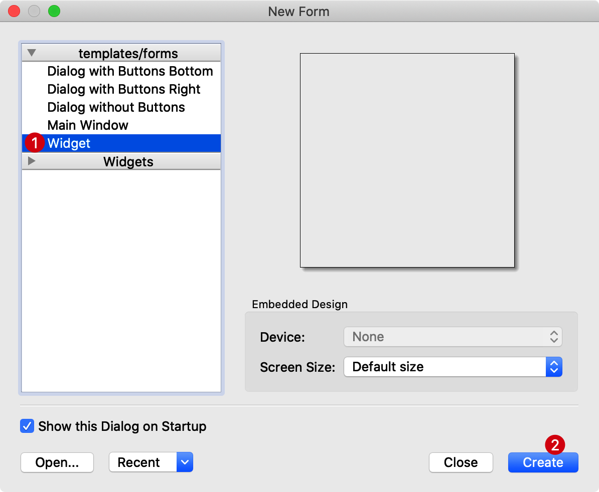

2.此时会创建一个新的窗口，如下效果

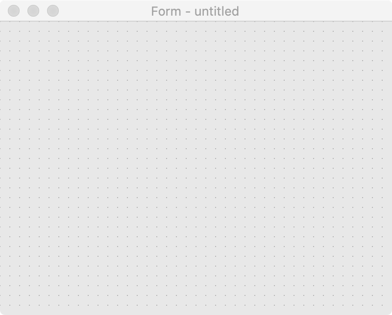

3.拖动想要的控件

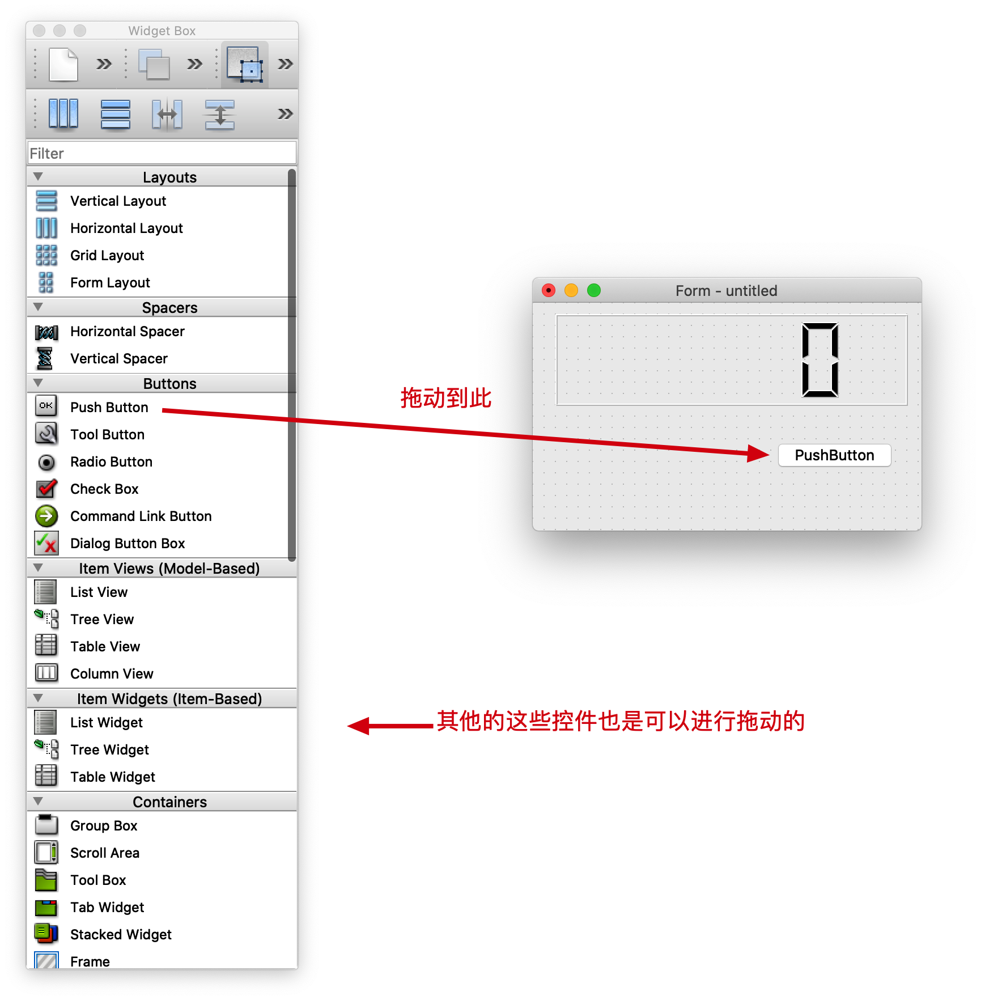

4.选中控件，看属性

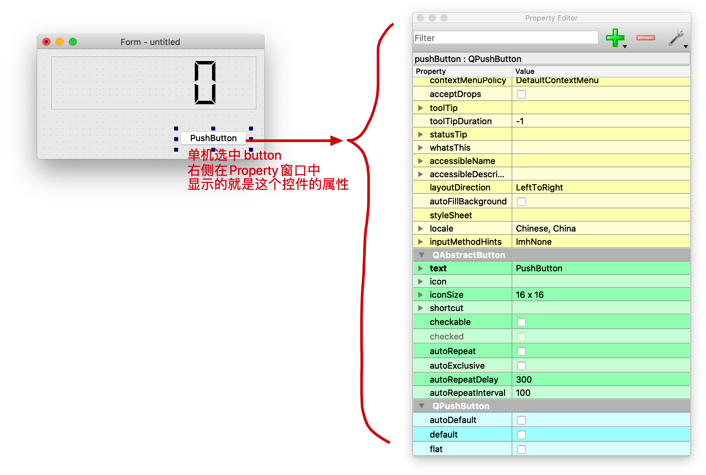

5.修改属性

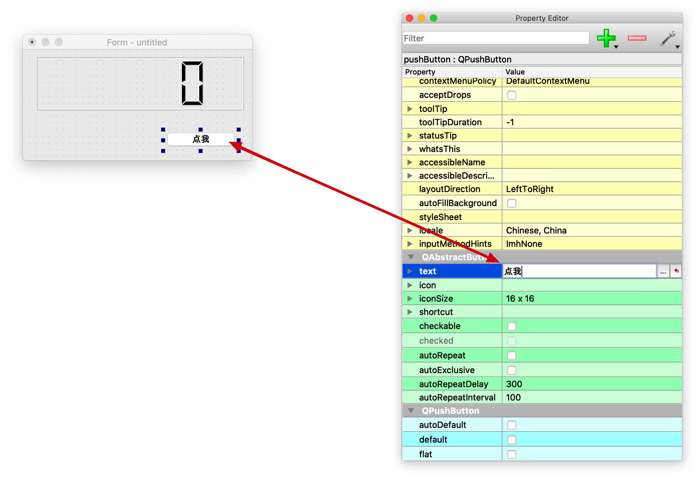

6.如果没有看到preperty等窗口怎么办？看下图

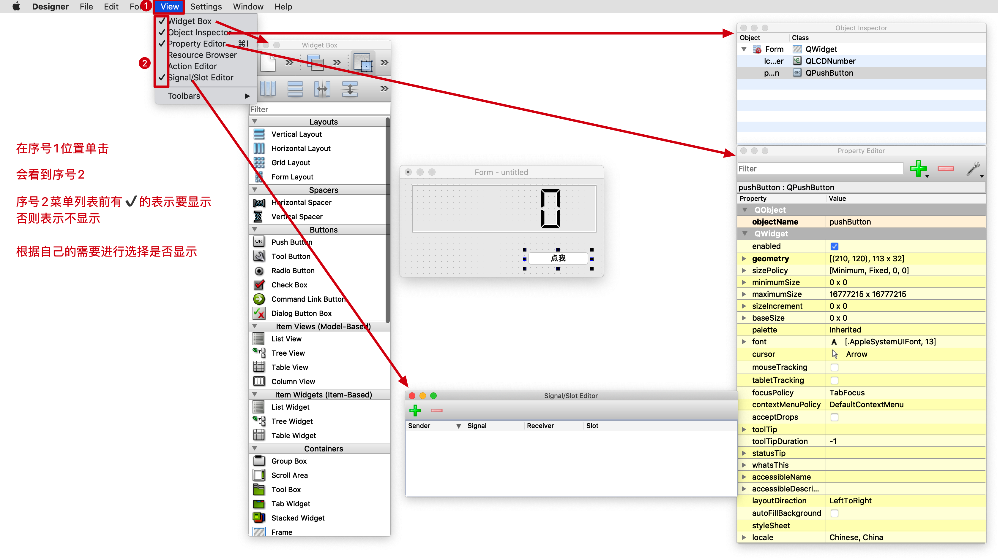

7.信号与槽（没有没有看到Singal/Slot Editor请按照上一步操作进行显示）

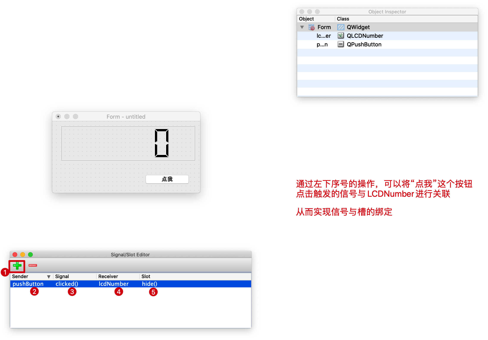

8.预览效果

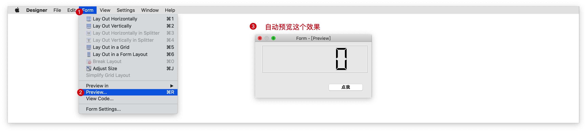

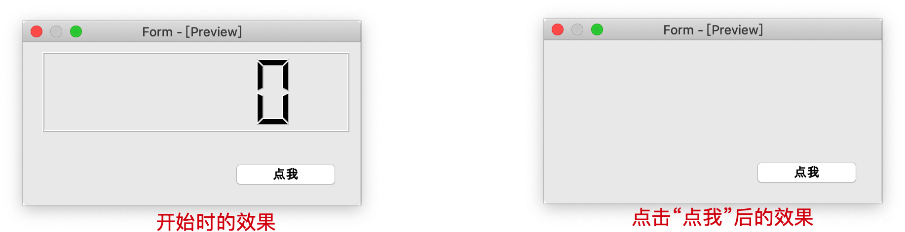

9.保存

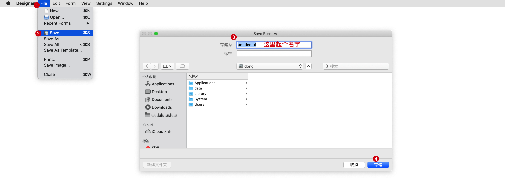

我起名叫`tset.ui`保存后的效果如下：


10.python代码使用`test.ui`文件

若要加载ui文件，则需要导入 `uic` 模块 , 它位于`PyQt5` 中

```python
"""
动态加载ui文件
"""

import sys

from PyQt5.QtWidgets import QApplication
from PyQt5 import uic

if __name__ == '__main__':
    app = QApplication(sys.argv)

    ui = uic.loadUi("./test.ui")
    # 展示窗口
    ui.show()

    app.exec()
```

将`test.ui`与上述代码文件放到同一个路径下，运行次`.py`文件后的效果 如下：

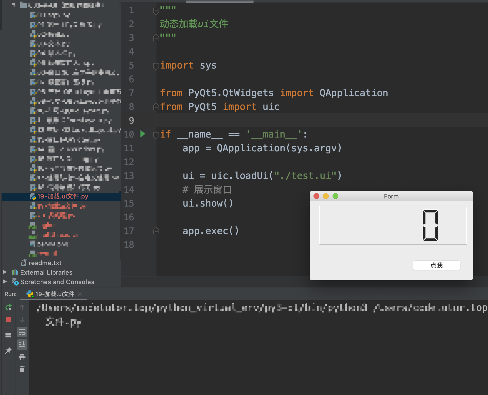

## 四、练习

请使用QT Designer设计如下效果

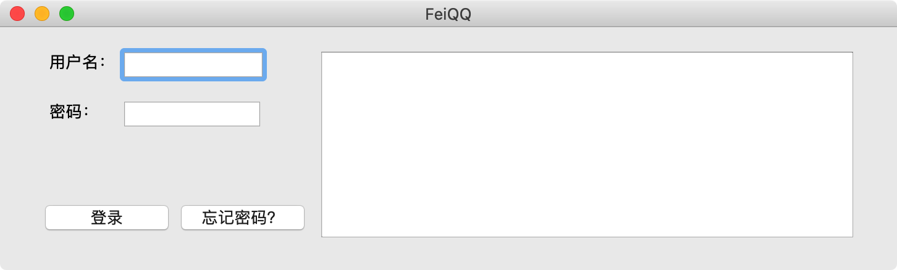

## 五、进阶使用案例

目的：获取用户名、密码，在TextBrowser中显示一些登录的信息

用到的技术：python加载`.ui`文件获取了界面，对`.ui`文件中的控件操作，完成信号与槽的绑定等

1.看看`.ui`文件有什么属性，如下图

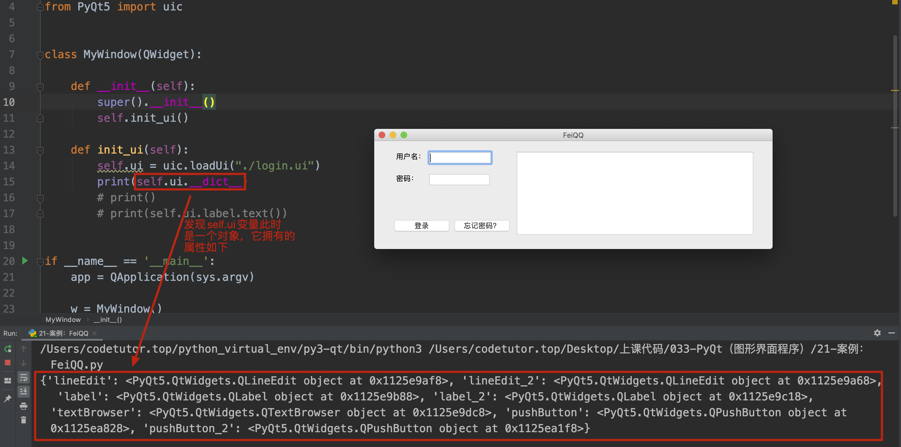

在这里，我们看到加载后的`.ui`文件有7个对象属性，正好与在设计`.ui`文件时控件的数量一致，可见属性的个数正好对应`.ui`文件中的空间个数，所以想要操作哪个空间，就通过`对象.属性`的方式从`.ui`对象中提取即可。当然了不能盲目的提取，这些属性的名字其实就是在`.ui`文件中的空间的`Object name`，如下图

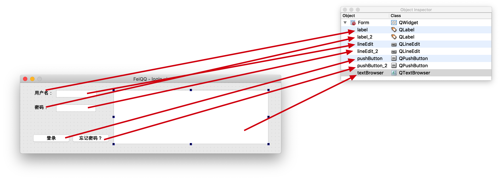

2.编写代码如下：

```python
import sys

from PyQt5.QtWidgets import *
from PyQt5 import uic


class MyWindow(QWidget):

    def __init__(self):
        super().__init__()
        self.init_ui()

    def init_ui(self):
        self.ui = uic.loadUi("./login.ui")
        # print(self.ui.__dict__)  # 查看ui文件中有哪些控件

        # 提取要操作的控件
        self.user_name_qwidget = self.ui.lineEdit  # 用户名输入框
        self.password_qwidget = self.ui.lineEdit_2  # 密码输入框
        self.login_btn = self.ui.pushButton  # 登录按钮
        self.forget_password_btn = self.ui.pushButton_2  # 忘记密码按钮
        self.textBrowser = self.ui.textBrowser  # 文本显示区域

        # 绑定信号与槽函数
        self.login_btn.clicked.connect(self.login)

    def login(self):
        """登录按钮的槽函数"""
        user_name = self.user_name_qwidget.text()
        password = self.password_qwidget.text()
        if user_name == "admin" and password == "123456":
            self.textBrowser.setText("欢迎%s" % user_name)
            self.textBrowser.repaint()
        else:
            self.textBrowser.setText("用户名或密码错误....请重试")
            self.textBrowser.repaint()


if __name__ == '__main__':
    app = QApplication(sys.argv)

    w = MyWindow()
    # 展示窗口
    w.ui.show()

    app.exec()
```

效果如下：

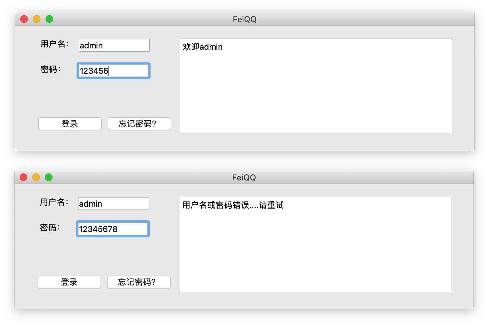