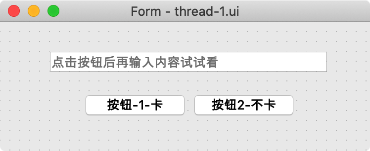
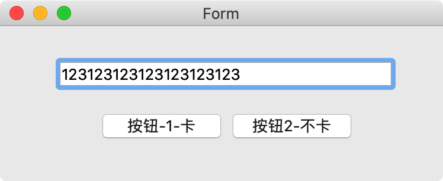

# 008-PyQt多线程

## 1. 引入

将上一节课讲解的最后一个FeiQQ登录的按钮，适当修改代码，详细如下

```python
import sys
import time

from PyQt5.QtWidgets import *
from PyQt5 import uic


class MyWindow(QWidget):

    def __init__(self):
        super().__init__()
        self.init_ui()

    def init_ui(self):
        self.ui = uic.loadUi("./login.ui")
        # print(self.ui.__dict__)  # 查看ui文件中有哪些控件

        # 提取要操作的控件
        self.user_name_qwidget = self.ui.lineEdit  # 用户名输入框
        self.password_qwidget = self.ui.lineEdit_2  # 密码输入框
        self.login_btn = self.ui.pushButton  # 登录按钮
        self.forget_password_btn = self.ui.pushButton_2  # 忘记密码按钮
        self.textBrowser = self.ui.textBrowser  # 文本显示区域

        # 绑定信号与槽函数
        self.login_btn.clicked.connect(self.login)

    def login(self):
        """登录按钮的槽函数"""
        user_name = self.user_name_qwidget.text()
        password = self.password_qwidget.text()

        for i in range(10):
            print("正在登录服务器....%d" % (i + 1))
            time.sleep(1)

        if user_name == "admin" and password == "123456":
            self.textBrowser.setText("欢迎%s" % user_name)
            self.textBrowser.repaint()
        else:
            self.textBrowser.setText("用户名或密码错误....请重试")
            self.textBrowser.repaint()


if __name__ == '__main__':
    app = QApplication(sys.argv)

    w = MyWindow()
    # 展示窗口
    w.ui.show()

    app.exec()
```

重新运行效果如下：


可以很明显的看到，程序是卡顿的

why？为什么会卡顿呢？大名鼎鼎的Qt不止于此吧！

答：只要是带界面的程序，一般来说程序运行后会用当前线程进行事件的检查、按钮等图形界面的更新操作，如果在执行某个逻辑代码（例如登录）时耗时非常验证，此时就会出现界面卡顿

怎样做更好？

答：我们一般将界面的显示用主线程来操作，逻辑功能代码或者耗时操作的代码都用另外线程进行处理

这也就是为什么要研究PyQt中的多线程了，因为它能实现多任务，让界面用一个线程更新，让逻辑代码在另外一个线程中，互不影响

## 二、PyQt使用线程

### 1. 使用QT Designer设计如下效果ui文件



### 2. 参考代码

```python
import sys
import time

from PyQt5 import uic
from PyQt5.Qt import QApplication, QWidget, QThread


class MyThread(QThread):
    def __init__(self):
        super().__init__()

    def run(self):
        for i in range(10):
            print("是MyThread线程中执行....%d" % (i + 1))
            time.sleep(1)


class MyWin(QWidget):
    def __init__(self):
        super().__init__()
        self.init_ui()

    def init_ui(self):
        self.ui = uic.loadUi("./thread-1.ui")

        # 从ui文件中加载控件
        lineedit = self.ui.lineEdit
        btn1 = self.ui.pushButton
        btn2 = self.ui.pushButton_2

        # 给2个按钮绑定槽函数
        btn1.clicked.connect(self.click_1)  # 绑定槽函数
        btn2.clicked.connect(self.click_2)  # 绑定槽函数

    def click_1(self):
        for i in range(10):
            print("是UI线程中执行....%d" % (i + 1))
            time.sleep(1)

    def click_2(self):
        self.my_thread = MyThread()  # 创建线程
        self.my_thread.start()  # 开始线程


if __name__ == "__main__":
    app = QApplication(sys.argv)
    myshow = MyWin()
    myshow.ui.show()
    app.exec()
```

### 3. 运行效果：(注意一定先点击某1个按钮后再输入内容)

