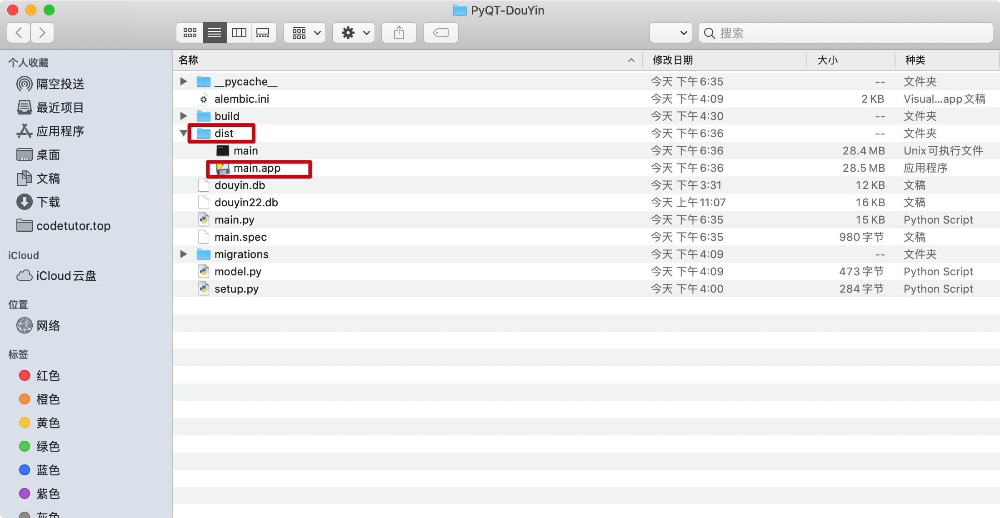
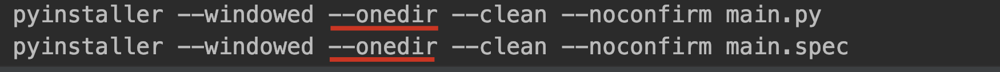
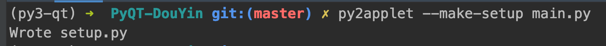
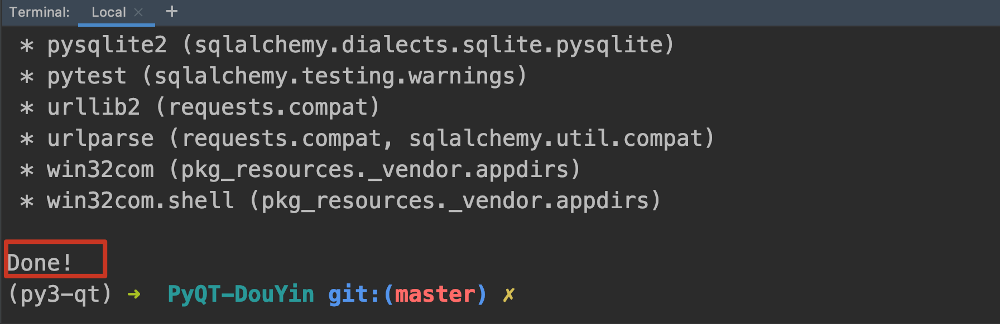
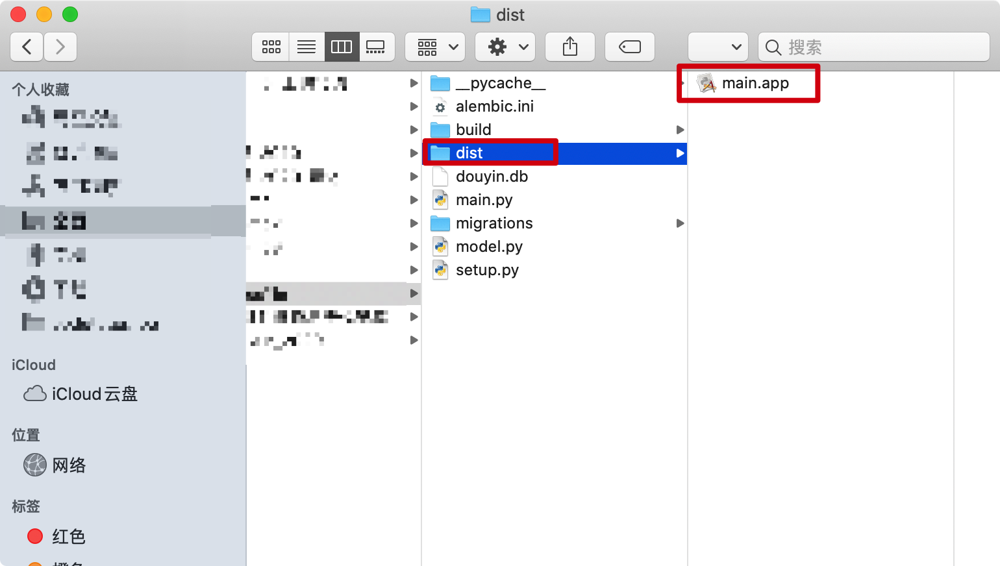

# 009-Mac下，发布PyQT为app程序

## 方式1：使用pyinstaller发布(推荐)

#### 1. 安装

```
pip install pyinstaller -i https://pypi.tuna.tsinghua.edu.cn/simple
```

#### 2. 终端运行

```
pyinstaller --windowed --onefile --clean --noconfirm main.py
pyinstaller --windowed --onefile --clean --noconfirm main.spec
```

#### 3. 效果



### 添加 Retina 支持

办法是`main.spec`向其中添加：

`info_plist={ 'NSHighResolutionCapable': 'True' }` 如下所示：

```
app = BUNDLE(exe,
             name='main.app',
             icon='icon.icns',
             bundle_identifier=None,
             info_plist={
                'NSHighResolutionCapable': 'True',
                })
```

解决双击APP启动慢的问题

> 可以不打包成单个.app文件，而是打包成一个目录中，然后去目录下把感觉没用到的内容删掉，，这样启动更快 ...

将`--onefile`改为`--onedir`



重新运行上述命令，得到的新的app如下


## 方式2：使用py2app发布

#### 1. 安装py2app

```
pip3 install py2app  -i https://pypi.tuna.tsinghua.edu.cn/simple
```

#### 2. 生成 setup.py 文件

```
py2applet --make-setup main.py
```



#### 3. 清空以前生成的编译文件

```
rm -rf build dist
```

#### 4. 生成mac下的应用

```
python setup.py py2app 
```



找到app

