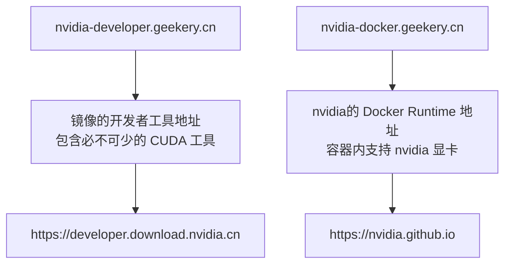

# Nvidia镜像站

在Ubuntu系统使用Nvidia显卡时下载驱动非常的慢，于是乎我做了个镜像加速。

这个镜像站共有两个地址，一个地址[nvidia-developer.geekery.cn](nvidia-developer.geekery.cn)是镜像的开发者工具地址，其中包含必不可少的 CUDA 工具。另一个地址是镜像的nvidia的Docker Runtime地址 [nvidia-docker.geekery.cn](nvidia-docker.geekery.cn)，实现这个功能的软件叫 libnvidia-container 让容器内支持nvidia显卡。



- [libnvidia-container ](https://nvidia-docker.geekery.cn/libnvidia-container/stable/)    https://nvidia-docker.geekery.cn/libnvidia-container/stable/

- [cuda镜像仓库](https://nvidia-developer.geekery.cn/compute/cuda/repos/)    https://nvidia-developer.geekery.cn/compute/cuda/repos/


## 一键部署脚本

```bash
curl -sSL https://www.geekery.cn/sh/nvidia/nvidia-driver-deploy.sh | bash
```

脚本中一键部署了

- cuda工具
- docker runtime
- docker

支持系统版本

- ubuntu
  - 18.04
  - 20.04
  - 22.04
- debian
  - 10
  - 11
- Windows_NT
  - wsl - ubuntu [Windows上需要手动安装驱动]