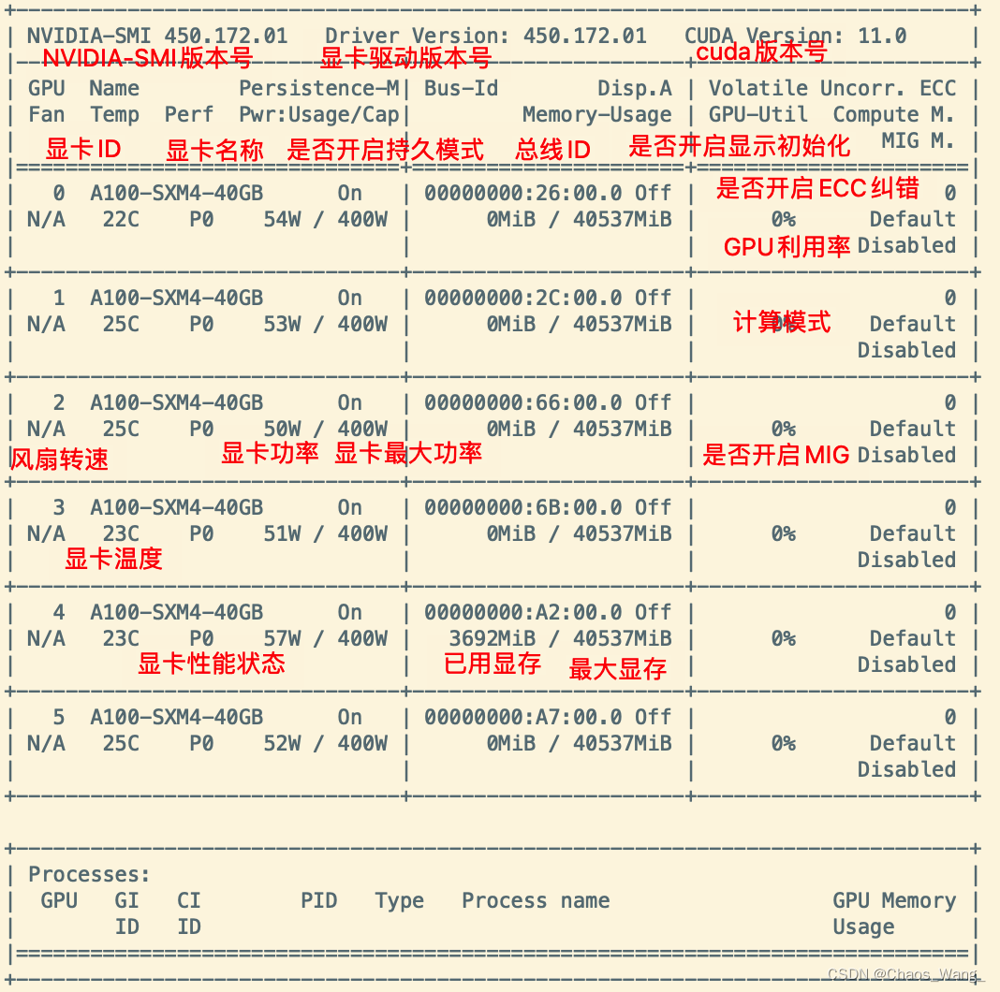

# Nvidia显卡在Ubuntu平台超频

## nvidia-smi

```bash
nvidia-smi
```

借用网络上的一张图，这个命令结束后代表的含义




对特殊参数进行解释

```
持久模式：persistence mode 能够让 GPU 更快响应任务，待机功耗增加。
    关闭 persistence mode 同样能够启动任务。
    持续模式虽然耗能大，但是在新的GPU应用启动时，花费的时间更少
风扇转速：主动散热的显卡一般会有这个参数，服务器显卡一般是被动散热，这个参数显示N/A。
    从0到100%之间变动，这个速度是计算机期望的风扇转速，实际情况下如果风扇堵转，可能打不到显示的转速。
    有的设备不会返回转速，因为它不依赖风扇冷却而是通过其他外设保持低温（比如有些实验室的服务器是常年放在空调房间里的）。 
温度：单位是摄氏度。 
性能状态：从P0到P12，P0表示最大性能，P12表示状态最小性能。 
Disp.A：Display Active，表示GPU的显示是否初始化。 
ECC纠错：这个只有近几年的显卡才具有这个功能，老版显卡不具备这个功能。 
MIG：Multi-Instance GPU，多实例显卡技术，支持将一张显卡划分成多张显卡使用，目前只支持安培架构显卡。
新的多实例GPU (MIG)特性允许GPU(从NVIDIA安培架构开始)被安全地划分为多达7个独立的GPU实例。
用于CUDA应用，为多个用户提供独立的GPU资源，以实现最佳的GPU利用率。
对于GPU计算能力未完全饱和的工作负载，该特性尤其有益，因此用户可能希望并行运行不同的工作负载，以最大化利用率。
```

## 开启持久模式

设置目标 GPUs 的持久模式。有关持久性模式的描述，请参见 (GPU ATTRIBUTES) 部分。需要 root。除非使用 -i 参数指定单个 GPU，否则它将影响所有 GPU。此操作的效果是立竿见影的。但是，它不会在重新启动后持续存在。每次重新启动后，持久性模式将默认为 Disabled。仅在 Linux 上可用。

persistence mode 持续模式默认关闭。persistence mode 能够让 GPU 更快响应任务，待机功耗增加。关闭 persistence mode 同样能够启动任务。

```
nvidia-smi -pm 1
```

Persistence-M 从 Off 变成 On，持续模式打开。

## 设置功耗

```bash
nvidia-smi -pl [330功耗]
```

## 锁核心频率

```bash
nvidia-smi -q -d CLOCK 
```

【功能】查看当前的 GPU 时钟速度、默认时钟速度和最大可能的时钟速度

```bash
nvidia-smi -q -d SUPPORTED_CLOCKS
```

【功能】显示每个 GPU 的可用时钟速度列表

```bash
nvidia-smi -lgc 1035
```

将显卡核心频率锁定在1035MHz

## 锁显存频率

```bash
nvidia-smi -lmc xxxx
```

将显存频率锁定到xxxx

使用nvidia-smi -rgc 即可恢复自动频率。

```bash
nvidia-smi -rgc
```

## 显存和核心频率同时设置


```bash
nvidia-smi -i 0 -ac 3003,1531
```

超频： nvidia-smi-i(显卡号） -ac（你想要的显存频率数字），（你想要的核心频率数字）

```bash
-ac, --applications-clocks=MEM_CLOCK,GRAPHICS_CLOCK
将最大[内存、图形]时钟指定为一对（例如 2000,800）
它定义了在 GPU 上运行应用程序时 GPU™的速度。为
来自 Kepler+ 系列的 Tesla 设备和基于 Maxwell 的 GeForce Titan。
需要 root，除非使用 -acp 命令放宽了限制。
```

