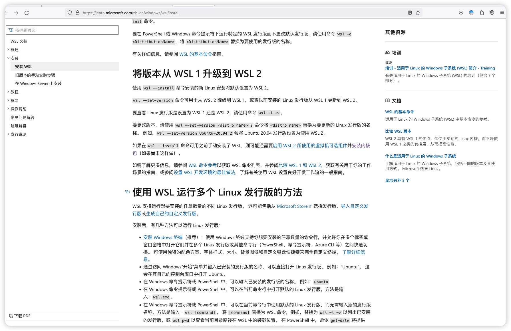
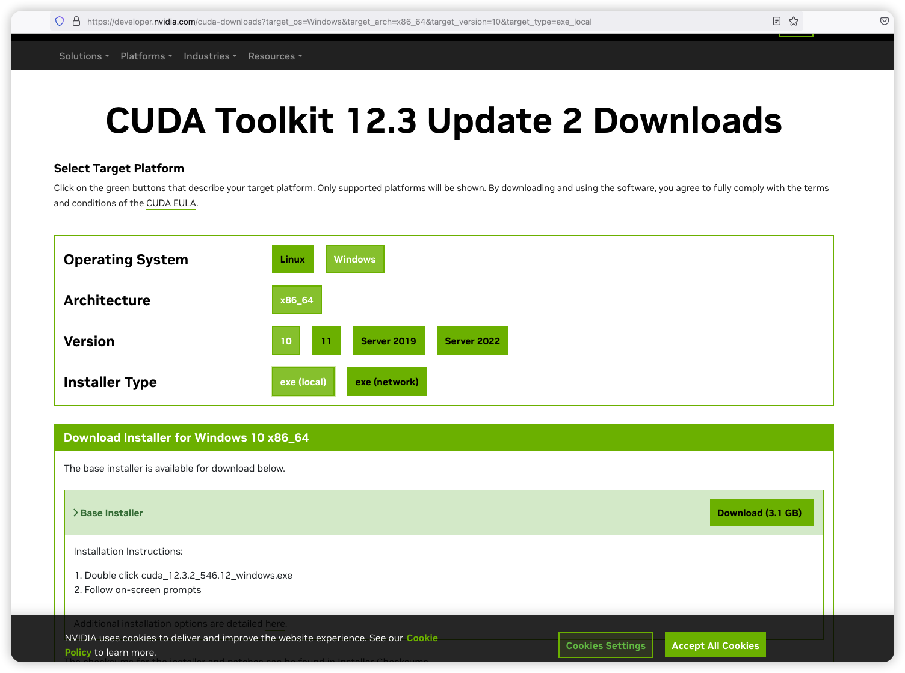
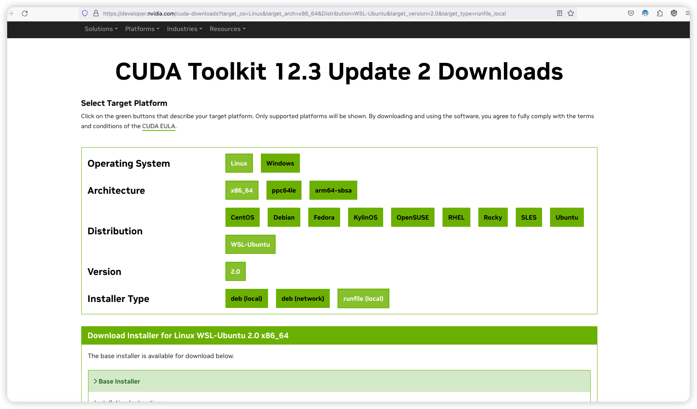

# Windows的WSL2安装cuda驱动

> 部分资料来自： https://www.bilibili.com/read/cv14608547/
>
> 感谢作者： https://space.bilibili.com/157323585

## 安装WSL2

这一步可以参考Windows官网，以及其他B站UP主的安装教程，贴两个链接（一定要装WSL2）。

```bash
https://learn.microsoft.com/zh-cn/windows/wsl/install
```




## 安装Windows的nvidia驱动（Windows下操作）

下载并安装带有WSL2驱动的nvidia-Windows驱动

根据自己电脑显卡类型，分GeForce和QUADRO两个版本，自己电脑是哪个就选哪个。下载驱动后，安装。（安装过程中可以直接选择“精简”模式） 


**注意！**

**有人会问：不是安装WSL2的驱动吗？为什么装Windows的？实际上，官网文档上标注 了，带有WSL2的官方nvidia驱动是整个过程唯一要装的GPU驱动！！！千万别被其他指南带错路了！（我就是没找到这个，白白浪费很多时间）**


## 检测是否安装成功

cmd命令行输入：

nvidia-smi

如果出现类似于下图效果，即安装完成。


记下图中的CUDA version 


## 在WSL２中安装CUDA（WSL２中操作）

参考CUDA官网，选择自己对应的版本。



```bash
https://developer.nvidia.com/cuda-downloads
```

这里的cuda版本，要比刚才cmd中标注的CUDA version要低。

比如我的CUDA　version是11.6，我在下载CUDA驱动时，可以安装最新的11.5版本。

**一定要选择标注的WSL版本！！！** 



选择完版本后，下面会有整个安装提示，在WSL２中按照方法来就行，如： 

```bash
wget https://developer.download.nvidia.com/compute/cuda/12.3.2/local_installers/cuda_12.3.2_545.23.08_linux.runsudo sh cuda_12.3.2_545.23.08_linux.run
```

安装相关依赖库

```bash
sudo apt-get install freeglut3-dev build-essential libx11-dev libxmu-dev libxi-dev libgl1-mesa-glx libglu1-mesa libglu1-mesa-dev
```

在Ubuntu上配置CUDA的环境变量，命令行输入：

```bash
sudo vim ~/.bashrc
```

在末尾添加（注意：将地址里面的11.5换成自己安装的版本！）：

```bash
export PATH=/usr/local/cuda-11.5/bin${PATH:+:${PATH}}
export LD_LIBRARY_PATH=/usr/local/cuda-11.5/lib64${LD_LIBRARY_PATH:+:${LD_LIBRARY_PATH}}
```

更新文件：

```bash
source ~/.bashrc
```


输入代码检测是否安装完成


```bash
nvcc -V 
```


## 安装CUDNN（在WSL２中安装）

需要注册账号，参考如下地址的3.2

```bash
https://blog.csdn.net/iwanvan/article/details/122119595
```


然后可以安装pytorch，可以直接安装最新版本，只要比驱动version低就行。 

