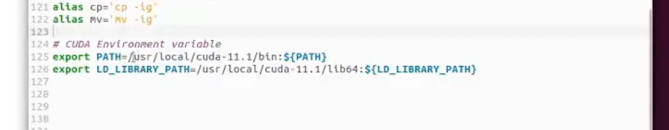

# Torch部署

# 安装Anaconda

推荐直接上官网下载
 [https://www.anaconda.com/products/individua](https://www.anaconda.com/products/individual)

# 安装CUDA和cuDNN

## 安装显卡驱动

首先需要下载和安装显卡驱动，进入下面网址选择合适的显卡驱动下载并按照提示安装。如果已安装此处略过。
 <https://www.nvidia.cn/geforce/drivers/>

## 下载CUDA

CUDA下载网站
 <https://developer.nvidia.com/cuda-toolkit-archive>

覆盖安装

```bash
sudo ./cuda*.run --override
```

**不选择重装驱动**



## 下载cuDNN

cuDNN网址
 <https://developer.nvidia.com/cuDnn>

下载cuDNN需要注册NVIDIA账号并登录，注册时安装官网提示填写用户名、密码、邮箱等，其中需要邮箱验证。

**邮箱验证时使用QQ邮箱接收不到验证邮件，使用163邮箱可以。**

# 安装Torch

```bash
pip install  torch torchvision torchaudio --extra-index-url https://download.pytorch.org/whl/cu116
pip install torch -i https://pypi.douban.com/simple
```

# pytorch：测试GPU是否可用

```bash
import torch
flag = torch.cuda.is_available()
print(flag)

ngpu= 1
# Decide which device we want to run on
device = torch.device("cuda:0" if (torch.cuda.is_available() and ngpu > 0) else "cpu")
print(device)
print(torch.cuda.get_device_name(0))
print(torch.rand(3,3).cuda()) 

```

```bash
True
cuda:0
GeForce GTX 1080
tensor([[0.9530, 0.4746, 0.9819],
        [0.7192, 0.9427, 0.6768],
        [0.8594, 0.9490, 0.6551]], device='cuda:0')

```

# 完全卸载CUDA

> <https://docs.nvidia.com/cuda/cuda-installation-guide-linux/>

```bash
 sudo apt-get --purge remove "*cublas*" "*cufft*" "*curand*" \
 "*cusolver*" "*cusparse*" "*npp*" "*nvjpeg*" "cuda*" "nsight*" 

```

在命令行中卸载

注意把下边的xx.x替换为自己的cuda版本。
cuda10.0及以下的卸载：

    cd /usr/local/cuda-xx.x/bin/
    sudo ./uninstall_cuda_xx.x.pl
    sudo rm -rf /usr/local/cuda-xx.x

cuda10.1及以上的卸载：

    cd /usr/local/cuda-xx.x/bin/
    sudo ./cuda-uninstaller
    sudo rm -rf /usr/local/cuda-xx.x

最后边加了一句sudo rm -rf /usr/local/cuda-xx.x，这是因为一般情况下cuda都配置了cudnn，在运行卸载程序时只会卸载cuda而不会一并删除cudnn的文件。因为cudnn文件还在的缘故，自己的cuda-xx.x文件夹仍然在，需要手动删除。
所以如果自己要卸载的cuda没有配置cudnn，那么cuda-xx.x文件夹在卸载完成后会被自动删除，也就没必要再运行最后一句了。

# 问题

## setup.py install is deprecated

解决方法——降档使用setuptools

不过，别担心，有个折中的处理方式。

换一个setuptools版本，选择与ROS2一起工作不产生任何warning的版本。

能满足这个条件的setuptools版本中，最新的是58.2.0。

```python
#回退安装指令
pip install setuptools==58.2.0
```

如何查询setuptools的版本

```python
#在python3环境中，执行以下代码
import setuptools
print(setuptools.__version__)
```
