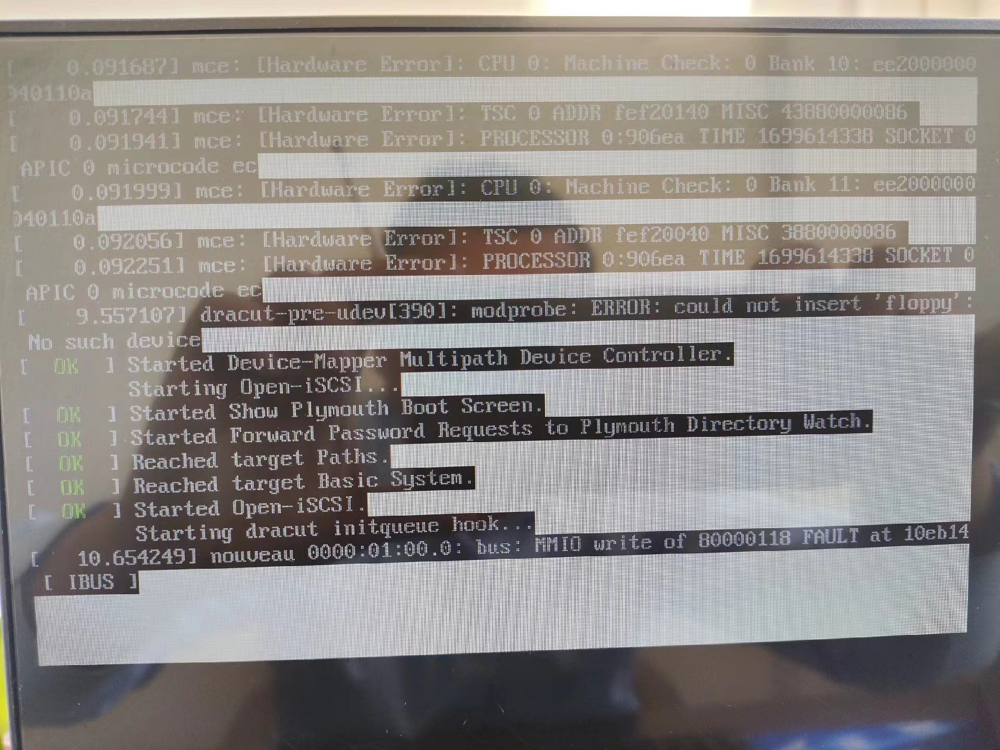

---
category： 
  - Nvidia
tag: 
  - Nvidia
  - nouveau
---


# 英伟达开源驱动和闭源驱动冲突问题

## 起因

今天朋友安装驱动遇到了一些问题，给了一张日志图片问我怎么办，我看着显示报错最后一行显示 PCI-E xxx.xxxx.xxx  nouveau。就是nvidia显卡驱动的问题八九不离十了。

nvidia给了不同类型的驱动多种版本，开源驱动对Linux支持较差，在切换闭源官方驱动的时候经常出现各种问题。



下面是安装步骤的总结


## 正常安装步骤

### 检查开源驱动的存在情况

运行如下指令：

```bash
lsmod | grep nouveau
```

如果有内容输出，则说明nouveau已被启用，需要执行下一个步骤以将nouveau禁用；

如果没有内容输出，则可以直接安装nvidia驱动。

### 开源驱动加入黑名单

blacklist.conf文件的位置：/etc/modprobe.d/blacklist.conf

```bash
vim /etc/modprobe.d/blacklist.conf 
```

在该文件最后插入以下两行内容：

    blacklist nouveau
    options nouveau modeset=0
### 更新验证生效

通过如下命令更新系统，使刚刚修改的文件生效：

```bash
update-initramfs -u
```

### 安装闭源驱动

首先通过如下命令获取该.run文件的执行权限。

```bash
chmod +x NVIDIA-Linux-x86_64-535.54.03.run
```

通过如下命令运行下载好的.run文件：

```bash
./NVIDIA-Linux-x86_64-535.54.03.run
```

### 重启

```bash
reboot
```


## 报错处理

### 无法安装

> you appear to be running an x server; please exit x before installing.`

```bash
./NVIDIAxxxx.run --no-x-check
```


### 无法开机

#### 引导界面更改mode

进入grub界面，将这个界面的最后部分的“quiet splash —”改为“nomodeset”。F10保存，就可以进入安装界面，进行安装。 

#### 按照正常安装步骤进行安装


