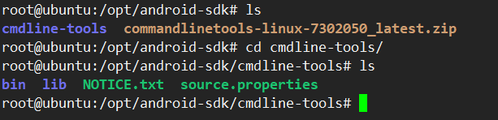
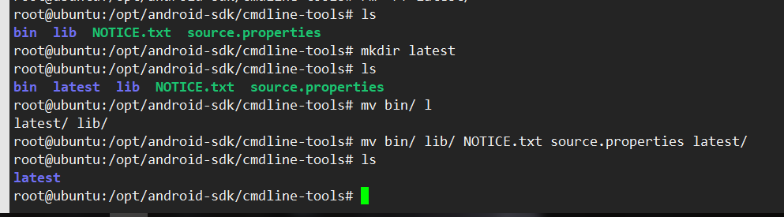
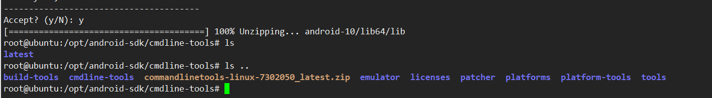

# Ubuntu命令行安装Android SDK

## 安装步骤

1. 新建 **android-sdk** 作为工作目录。

2. 下载命令行工具 sdkmanager:

   `wget https://dl.google.com/android/repository/commandlinetools-linux-7302050_latest.zip`

3. 解压：

   `unzip commandlinetools-linux-7302050_latest.zip`，

   进入目录如下所示

4. 

5. 进入 **cmdline-tools** 目录，执行 `./bin/sdkmanager` 报错 “Error: Could not deter mine SDK root.”

6. 在当前目录新建 **latest** 目录，并将原 **cmdline-tools** 下的所有文件移至 **latest**下，操作如下：

7. 下载完成后，执行 `ls ..` 查看上级目录中的文件：

   

   

## 引用

1. [cmdline-tools : could not determine SDK root](https://stackoverflow.com/questions/65262340/cmdline-tools-could-not-determine-sdk-root)
2. [sdkmanager](https://developer.android.com/studio/command-line/sdkmanager#list_installed_and_available_packages)