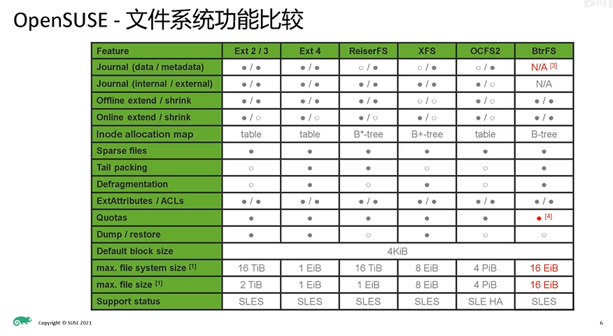
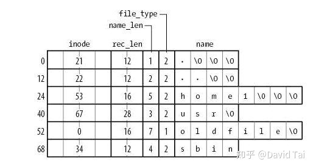
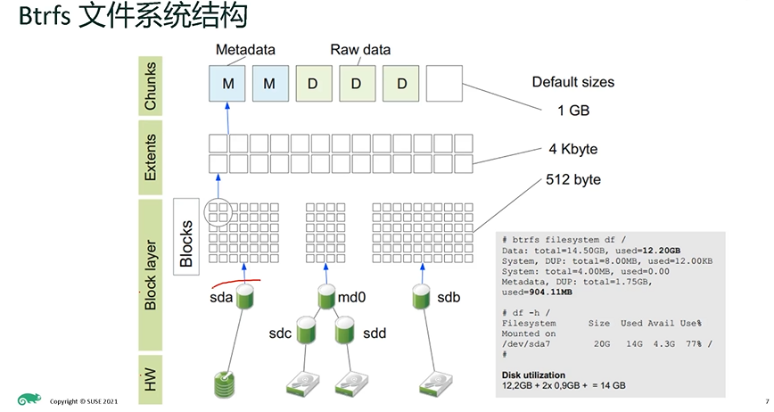
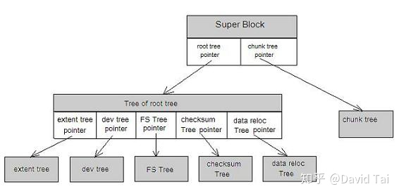
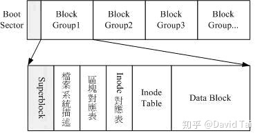
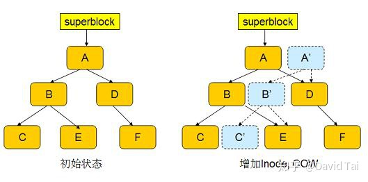
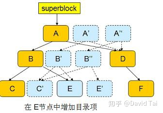
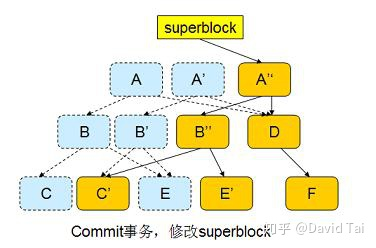
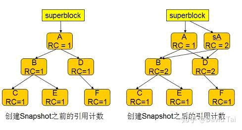
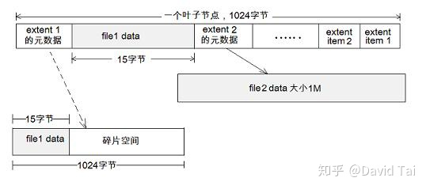

# Linux 文件系统的未来 btrfs

## Btrfs 简介

文件系统似乎是内核中比较稳定的部分，多年来，人们一直使用 ext2/3，ext 文件系统以其卓越的稳定性成为了事实上的 Linux 标准文件系统。近年来 ext2/3  暴露出了一些扩展性问题，于是便催生了 ext4 。在 2008 年发布的 Linux2.6.19 内核中集成了 ext4 的 dev 版本。  2.6.28 内核发布时，ext4 结束了开发版，开始接受用户的使用。似乎 ext 就将成为 Linux 文件系统的代名词。然而当您阅读很多有关 ext4 的文章时，会发现都不约而同地提到了 btrfs，并认为 ext4 将是一个过渡的文件系统。 ext4 的作者 Theodore  Tso 也盛赞 btrfs 并认为 btrfs 将成为下一代 Linux 标准文件系统。 Oracle，IBM， Intel 等厂商也对  btrfs 表现出了极大的关注，投入了资金和人力。为什么 btrfs 如此受人瞩目呢。这便是本文首先想探讨的问题。

Kevin Bowling[1] 有一篇介绍各种文件系统的文章，在他看来，ext2/3 等文件系统属于“古典时期”。文件系统的新时代是 2005 年由  Sun 公司的 ZFS 开创的。 ZFS 代表” last word in file system  ”，意思是此后再也不需要开发其他的文件系统了。 ZFS 的确带来了很多崭新的观念，对文件系统来讲是一个划时代的作品。

如果您比较 btrfs 的特性，将会发现 btrfs 和 ZFS 非常类似。也许我们可以认为 btrfs 就是 Linux 社区对 ZFS 所作出的回应。从此往后在 Linux 中也终于有了一个可以和 ZFS 相媲美的文件系统。

## btrfs 的特性

您可以在 btrfs 的主页上 [2] 看到 btrfs 的特性列表。我自作主张，将那张列表分成了四大部分。

首先是扩展性 (scalability) 相关的特性，btrfs 最重要的设计目标是应对大型机器对文件系统的扩展性要求。 Extent，B-Tree 和动态 inode 创建等特性保证了 btrfs 在大型机器上仍有卓越的表现，其整体性能而不会随着系统容量的增加而降低。

其次是数据一致性 (data integrity) 相关的特性。系统面临不可预料的硬件故障，Btrfs 采用 COW 事务技术来保证文件系统的一致性。  btrfs 还支持 checksum，避免了 silent corrupt 的出现。而传统文件系统则无法做到这一点。

第三是和多设备管理相关的特性。 Btrfs 支持创建快照 (snapshot)，和克隆 (clone) 。 btrfs 还能够方便的管理多个物理设备，使得传统的卷管理软件变得多余。

最后是其他难以归类的特性。这些特性都是比较先进的技术，能够显著提高文件系统的时间 / 空间性能，包括延迟分配，小文件的存储优化，目录索引等。

### 扩展性相关的特性

B-Tree

btrfs 文件系统中所有的 metadata 都由 BTree 管理。使用 BTree 的主要好处在于查找，插入和删除操作都很高效。可以说 BTree 是 btrfs 的核心。

一味地夸耀 BTree 很好很高效也许并不能让人信服，但假如稍微花费一点儿时间看看 ext2/3 中元数据管理的实现方式，便可以反衬出 BTree 的优点。

妨碍 ext2/3 扩展性的一个问题来自其目录的组织方式。目录是一种特殊的文件，在 ext2/3 中其内容是一张线性表格。如图 1-1 所示 [6]：

### 图 1. ext2 directory [6]

图 1 展示了一个 ext2 目录文件的内容，该目录中包含四个文件。分别是 "home1"，"usr"，"oldfile" 和 "sbin" 。如果需要在该目录中查找目录 sbin，ext2 将遍历前三项，直至找到 sbin 这个字符串为止。

这种结构在文件个数有限的情况下是比较直观的设计，但随着目录下文件数的增加，查找文件的时间将线性增长。 2003 年，ext3 设计者开发了目录索引技术，解决了这个问题。目录索引使用的数据结构就是 BTree 。如果同一目录下的文件数超过  2K，inode 中的 i_data 域指向一个特殊的 block 。在该 block 中存储着目录索引 BTree 。 BTree  的查找效率高于线性表，

但为同一个元数据设计两种数据结构总是不太优雅。在文件系统中还有很多其他的元数据，用统一的 BTree 管理是非常简单而优美的设计。

Btrfs 内部所有的元数据都采用 BTree 管理，拥有良好的可扩展性。 btrfs 内部不同的元数据由不同的 Tree 管理。在 superblock 中，有指针指向这些 BTree 的根。如图 2 所示：

### 图 2. btrfs btree

文件系统数据结构

文件目录结构

FS Tree 管理文件相关的元数据，如 inode，dir 等； Chunk tree 管理设备，每一个磁盘设备都在 Chunk Tree  中有一个 item ； Extent Tree 管理磁盘空间分配，btrfs 每分配一段磁盘空间，便将该磁盘空间的信息插入到 Extent  tree 。查询 Extent Tree 将得到空闲的磁盘空间信息； Tree of tree root 保存很多 BTree  的根节点。比如用户每建立一个快照，btrfs 便会创建一个 FS Tree 。为了管理所有的树，btrfs 采用 Tree of tree  root 来保存所有树的根节点； checksum Tree 保存数据块的校验和。

**基于 Extent 的文件存储**

现代很多文件系统都采用了 extent 替代 block 来管理磁盘。 Extent 就是一些连续的 block，一个 extent 由起始的 block 加上长度进行定义。

Extent 能有效地减少元数据开销。为了进一步理解这个问题，我们还是看看 ext2 中的反面例子。

ext2/3 以 block 为基本单位，将磁盘划分为多个 block 。为了管理磁盘空间，文件系统需要知道哪些 block 是空闲的。 Ext 使用  bitmap 来达到这个目的。 Bitmap 中的每一个 bit 对应磁盘上的一个 block，当相应 block 被分配后，bitmap  中的相应 bit 被设置为 1 。这是很经典也很清晰的一个设计，但不幸的是当磁盘容量变大时，bitmap  自身所占用的空间也将变大。这就导致了扩展性问题，随着存储设备容量的增加，bitmap  这个元数据所占用的空间也随之增加。而人们希望无论磁盘容量如何增加，元数据不应该随之线形增加，这样的设计才具有可扩展性。

下图比较了 block 和 extent 的区别：

### 图 3. 采用 extent 的 btrfs 和采用 bitmap 的 ext2/3

在 ext2/3 中，10 个 block 需要 10 个 bit 来表示；在 btrfs 中则只需要一个元数据。对于大文件，extent 表现出了更加优异的管理性能。

Extent 是 btrfs 管理磁盘空间的最小单位，由 extent tree 管理。 Btrfs 分配 data 或 metadata 都需要查询 extent tree 以便获得空闲空间的信息。

**动态 inode 分配**

为了理解动态 inode 分配，还是需要借助 ext2/3 。下表列举了 ext2 文件系统的限制：

### 表 1. ext2 限制

限制**最大文件数量**文件系统空间大小 V / 8192
比如 100G 大小的文件系统中，能创建的文件个数最大为 131072

图 4 显示了 ext2 的磁盘布局：

### 图 4. ext2 layout

在 ext2 中 inode 区是被预先固定分配的，且大小固定，比如一个 100G 的分区中，inode table 区中只能存放 131072 个 inode，这就意味着不可能创建超过 131072 个文件，因为每一个文件都必须有一个唯一的 inode 。

为了解决这个问题，必须动态分配 inode 。每一个 inode 只是 BTree 中的一个节点，用户可以无限制地任意插入新的 inode，其物理存储位置是动态分配的。所以 btrfs 没有对文件个数的限制。

**针对 SSD 的优化支持**

SSD 是固态存储 Solid State Disk 的简称。在过去的几十年中，CPU/RAM 等器件的发展始终遵循着摩尔定律，但硬盘 HDD 的读写速率却始终没有飞跃式的发展。磁盘 IO 始终是系统性能的瓶颈。

SSD 采用 flash memory 技术，内部没有磁盘磁头等机械装置，读写速率大幅度提升。 flash memory 有一些不同于 HDD  的特性。 flash 在写数据之前必须先执行擦除操作；其次，flash  对擦除操作的次数有一定的限制，在目前的技术水平下，对同一个数据单元最多能进行约 100 万次擦除操作，因此，为了延长 flash  的寿命，应该将写操作平均到整个 flash 上。

SSD 在硬件内部的微代码中实现了  wear leveling 等分布写操作的技术，因此系统无须再使用特殊的 MTD 驱动和 FTL 层。虽然 SSD  在硬件层面做了很多努力，但毕竟还是有限。文件系统针对 SSD 的特性做优化不仅能提高 SSD 的使用寿命，而且能提高读写性能。 Btrfs  是少数专门对 SSD 进行优化的文件系统。 btrfs 用户可以使用 mount 参数打开对 SSD 的特殊优化处理。

Btrfs 的 COW 技术从根本上避免了对同一个物理单元的反复写操作。如果用户打开了 SSD 优化选项，btrfs  将在底层的块空间分配策略上进行优化：将多次磁盘空间分配请求聚合成一个大小为 2M 的连续的块。大块连续地址的 IO 能够让固化在 SSD  内部的微代码更好的进行读写优化，从而提高 IO 性能。

### 数据一致性相关的特性

**COW 事务**

理解 COW 事务，必须首先理解 COW 和事务这两个术语。

什么是 COW?

所谓 COW，即每次写磁盘数据时，先将更新数据写入一个新的 block，当新数据写入成功之后，再更新相关的数据结构指向新 block 。

什么是事务？

COW 只能保证单一数据更新的原子性。但文件系统中很多操作需要更新多个不同的元数据，比如创建文件需要修改以下这些元数据：

1. 修改 extent tree，分配一段磁盘空间
2. 创建一个新的 inode，并插入 FS Tree 中
3. 增加一个目录项，插入到 FS Tree 中

任何一个步骤出错，文件便不能创建成功，因此可以定义为一个事务。

下面将演示一个 COW 事务。

A 是 FS Tree 的根节点，新的 inode 的信息将被插入节点 C 。首先，btrfs 将 inode 插入一个新分配的 block C  ’中，并修改上层节点 B，使其指向新的 block C ’；修改 B 也将引发 COW，以此类推，引发一个连锁反应，直到最顶层的 Root A  。当整个过程结束后，新节点 A ’变成了 FS Tree 的根。但此时事务并未结束，superblock 依然指向 A 。

### 图 5. COW transaction 1

接下来，修改目录项（E 节点），同样引发这一过程，从而生成新的根节点 A ’’。

### 图 6. COW transaction 2

此时，inode 和目录项都已经写入磁盘，可以认为事务已经结束。 btrfs 修改 superblock，使其指向 A ’’，如下图所示：

### 图 7. COW transaction 3

COW 事务能够保证文件系统的一致性，并且系统 Reboot 之后不需要执行 fsck 。因为 superblock 要么指向新的 A ’’，要么指向 A，无论哪个都是一致的数据。

**Checksum**

Checksum 技术保证了数据的可靠性，避免 silent corruption 现象。由于硬件原因，从磁盘上读出的数据会出错。比如 block A  中存放的数据为 0x55，但读取出来的数据变是 0x54，因为读取操作并未报错，所以这种错误不能被上层软件所察觉。

解决这个问题的方法是保存数据的校验和，在读取数据后检查校验和。如果不符合，便知道数据出现了错误。

ext2/3 没有校验和，对磁盘完全信任。而不幸的是，磁盘的错误始终存在，不仅发生在廉价的 IDE 硬盘上，昂贵的 RAID 也存在 silent  corruption 问题。而且随着存储网络的发展，即使数据从磁盘读出正确，也很难确保能够安全地穿越网络设备。

btrfs 在读取数据的同时会读取其相应的 checksum 。如果最终从磁盘读取出来的数据和 checksum 不相同，btrfs  会首先尝试读取数据的镜像备份，如果数据没有镜像备份，btrfs 将返回错误。写入磁盘数据之前，btrfs 计算数据的 checksum 。然后将 checksum 和数据同时写入磁盘。

Btrfs 采用单独的 checksum Tree 来管理数据块的校验和，把 checksum 和 checksum 所保护的数据块分离开，从而提供了更严格的保护。假如在每个数据 block 的 header 中加入一个域保存 checksum，那么这个数据 block  就成为一个自己保护自己的结构。这种结构下有一种错误无法检测出来，比如本来文件系统打算从磁盘上读 block A，但返回了 block B，由于  checksum 在 block 内部，因此 checksum 依旧是正确的。 btrfs 采用 checksum tree 来保存数据块的  checksum，避免了上述问题。

Btrfs 采用 crc32 算法计算 checksum，在将来的开发中会支持其他类型的校验算法。为了提高效率，btrfs 将写数据和 checksum 的工作分别用不同的内核线程并行执行。

### 多设备管理相关的特性

每个 Unix 管理员都曾面临为用户和各种应用分配磁盘空间的任务。多数情况下，人们无法事先准确地估计一个用户或者应用在未来究竟需要多少磁盘空间。磁盘空间被用尽的情况经常发生，此时人们不得不试图增加文件系统空间。传统的 ext2/3 无法应付这种需求。

很多卷管理软件被设计出来满足用户对多设备管理的需求，比如 LVM 。 Btrfs 集成了卷管理软件的功能，一方面简化了用户命令；另一方面提高了效率。

**多设备管理**

Btrfs 支持动态添加设备。用户在系统中增加新的磁盘之后，可以使用 btrfs 的命令将该设备添加到文件系统中。

为了灵活利用设备空间，Btrfs 将磁盘空间划分为多个 chunk 。每个 chunk 可以使用不同的磁盘空间分配策略。比如某些 chunk 只存放 metadata，某些  chunk 只存放数据。一些 chunk 可以配置为 mirror，而另一些 chunk 则可以配置为 stripe  。这为用户提供了非常灵活的配置可能性。

**Subvolume**

Subvolume 是很优雅的一个概念。即把文件系统的一部分配置为一个完整的子文件系统，称之为 subvolume 。

采用  subvolume，一个大的文件系统可以被划分为多个子文件系统，这些子文件系统共享底层的设备空间，在需要磁盘空间时便从底层设备中分配，类似应用程序调用 malloc() 分配内存一样。可以称之为存储池。这种模型有很多优点，比如可以充分利用 disk 的带宽，可以简化磁盘空间的管理等。

所谓充分利用 disk 的带宽，指文件系统可以并行读写底层的多个 disk，这是因为每个文件系统都可以访问所有的 disk 。传统的文件系统不能共享底层的 disk 设备，无论是物理的还是逻辑的，因此无法做到并行读写。

所谓简化管理，是相对于 LVM 等卷管理软件而言。采用存储池模型，每个文件系统的大小都可以自动调节。而使用 LVM，如果一个文件系统的空间不够了，该文件系统并不能自动使用其他磁盘设备上的空闲空间，而必须使用 LVM 的管理命令手动调节。

Subvolume 可以作为根目录挂载到任意 mount 点。 subvolume 是非常有趣的一个特性，有很多应用。

假如管理员只希望某些用户访问文件系统的一部分，比如希望用户只能访问 /var/test/ 下面的所有内容，而不能访问 /var/ 下面其他的内容。那么便可以将 /var/test 做成一个 subvolume 。 /var/test 这个 subvolume 便是一个完整的文件系统，可以用 mount 命令挂载。比如挂载到 /test 目录下，给用户访问 /test 的权限，那么用户便只能访问 /var/test 下面的内容了。

快照和克隆

快照是对文件系统某一时刻的完全备份。建立快照之后，对文件系统的修改不会影响快照中的内容。这是非常有用的一种技术。

比如数据库备份。假如在时间点  T1，管理员决定对数据库进行备份，那么他必须先停止数据库。备份文件是非常耗时的操作，假如在备份过程中某个应用程序修改了数据库的内容，那么将无法得到一个一致性的备份。因此在备份过程中数据库服务必须停止，对于某些关键应用这是不能允许的。

利用快照，管理员可以在时间点 T1  将数据库停止，对系统建立一个快照。这个过程一般只需要几秒钟，然后就可以立即重新恢复数据库服务。此后在任何时候，管理员都可以对快照的内容进行备份操作，而此时用户对数据库的修改不会影响快照中的内容。当备份完成，管理员便可以删除快照，释放磁盘空间。

快照一般是只读的，当系统支持可写快照，那么这种可写快照便被称为克隆。克隆技术也有很多应用。比如在一个系统中安装好基本的软件，然后为不同的用户做不同的克隆，每个用户使用自己的克隆而不会影响其他用户的磁盘空间。非常类似于虚拟机。

Btrfs 支持 snapshot 和 clone 。这个特性极大地增加了 btrfs 的使用范围，用户不需要购买和安装昂贵并且使用复杂的卷管理软件。下面简要介绍一下 btrfs 实现快照的基本原理。

如前所述 Btrfs 采用 COW 事务技术，从图 1-10 可以看到，COW 事务结束后，如果不删除原来的节点 A,C,E，那么 A,C,E,D,F 依然完整的表示着事务开始之前的文件系统。这就是 snapshot 实现的基本原理。

Btrfs 采用引用计数决定是否在事务 commit 之后删除原有节点。对每一个节点，btrfs  维护一个引用计数。当该节点被别的节点引用时，该计数加一，当该节点不再被别的节点引用时，该计数减一。当引用计数归零时，该节点被删除。对于普通的  Tree Root, 引用计数在创建时被加一，因为 Superblock 会引用这个 Root block  。很明显，初始情况下这棵树中的所有其他节点的引用计数都为一。当 COW 事务 commit 时，superblock 被修改指向新的 Root A ’’，原来 Root block A 的引用计数被减一，变为零，因此 A 节点被删除。 A 节点的删除会引发其子孙节点的引用计数也减一，图  1-10 中的 B，C 节点的引用计数因此也变成了 0，从而被删除。 D,E 节点在 COW 时，因为被 A  ’’所引用，计数器加一，因此计数器这时并未归零，从而没有被删除。

创建 Snapshot  时，btrfs 将的 Root A 节点复制到 sA，并将 sA 的引用计数设置为 2 。在事务 commit 的时候，sA  节点的引用计数不会归零，从而不会被删除，因此用户可以继续通过 Root sA 访问 snapshot 中的文件。

### 图 8. Snapshot

**软件 RAID**

RAID 技术有很多非常吸引人的特性，比如用户可以将多个廉价的 IDE 磁盘组合为 RAID0 阵列，从而变成了一个大容量的磁盘； RAID1 和更高级的 RAID 配置还提供了数据冗余保护，从而使得存储在磁盘中的数据更加安全。

Btrfs 很好的支持了软件 RAID，RAID 种类包括 RAID0,RAID1 和 RAID10.

Btrfs 缺省情况下对 metadata 进行 RAID1 保护。前面已经提及 btrfs 将设备空间划分为 chunk，一些 chunk 被配置为  metadata，即只存储 metadata 。对于这类 chunk，btrfs 将 chunk 分成两个条带，写 metadata  的时候，会同时写入两个条带内，从而实现对 metadata 的保护。

### 其他特性

Btrfs 主页上罗列的其他特性不容易分类，这些特性都是现代文件系统中比较先进的技术，能够提高文件系统的时间或空间效率。

**Delay allocation**

延迟分配技术能够减少磁盘碎片。在 Linux 内核中，为了提高效率，很多操作都会延迟。

在文件系统中，小块空间频繁的分配和释放会造成碎片。延迟分配是这样一种技术，当用户需要磁盘空间时，先将数据保存在内存中。并将磁盘分配需求发送给磁盘空间分配器，磁盘空间分配器并不立即分配真正的磁盘空间。只是记录下这个请求便返回。

磁盘空间分配请求可能很频繁，所以在延迟分配的一段时间内，磁盘分配器可以收到很多的分配请求，一些请求也许可以合并，一些请求在这段延迟期间甚至可能被取消。通过这样的“等待”，往往能够减少不必要的分配，也有可能将多个小的分配请求合并为一个大的请求，从而提高 IO 效率。

**Inline file**

系统中往往存在大量的小文件，比如几百个字节或者更小。如果为其分配单独的数据 block，便会引起内部碎片，浪费磁盘空间。 btrfs 将小文件的内容保存在元数据中，不再额外分配存放文件数据的磁盘块。改善了内部碎片问题，也增加了文件的访问效率。

### 图 9. inline file

上图显示了一个 BTree 的叶子节点。叶子中有两个 extent data item 元数据，分别用来表示文件 file1 和 file2 所使用的磁盘空间。

假设 file1 的大小仅为 15 个字节； file2 的大小为 1M 。如图所示，file2 采用普通的 extent 表示方法：extent2 元数据指向一段 extent，大小为 1M，其内容便是 file2 文件的内容。

而对于 file1， btrfs 会把其文件内容内嵌到元数据 extent1 中。如果不采用 inline file 技术。如虚线所示，extent1 指向一个最小的 extent，即一个 block，但 file1 有 15 个字节，其余的空间便成为了碎片空间。

采用 inline 技术，读取 file1 时只需要读取元数据 block，而无需先读取 extent1 这个元数据，再读取真正存放文件内容的 block，从而减少了磁盘 IO 。

得益于 inline file 技术，btrfs 处理小文件的效率非常高，也避免了磁盘碎片问题。

**目录索引 Directory index**

当一个目录下的文件数目巨大时，目录索引可以显著提高文件搜索时间。 Btrfs 本身采用 BTree 存储目录项，所以在给定目录下搜索文件的效率是非常高的。

然而，btrfs 使用 BTree 管理目录项的方式无法同时满足 readdir 的需求。 readdir 是 POSIX 标准  API，它要求返回指定目录下的所有文件，并且特别的，这些文件要按照 inode number 排序。而 btrfs 目录项插入 BTree 时的 Key 并不是 Inode number，而是根据文件名计算的一个 hash 值。这种方式在查找一个特定文件时非常高效，但却不适于  readdir 。为此，btrfs 在每次创建新的文件时，除了插入以 hash 值为 Key  的目录项外，还同时插入另外一种目录项索引，该目录项索引的 KEY 以 sequence number 作为 BTree 的键值。这个  sequence number 在每次创建新文件时线性增加。因为 Inode number 也是每次创建新文件时增加的，所以 sequence  number 和 inode number 的顺序相同。以这种 sequence number 作为 KEY 在 BTree  中查找便可以方便的得到一个以 inode number 排序的文件列表。

另外以 sequence number 排序的文件往往在磁盘上的位置也是相邻的，所以以 sequence number 为序访问大量文件会获得更好的 IO 效率。

压缩

大家都曾使用过 zip，winrar 等压缩软件，将一个大文件进行压缩可以有效节约磁盘空间。 Btrfs 内置了压缩功能。

通常人们认为将数据写入磁盘之前进行压缩会占用很多的 CPU 计算时间，必然降低文件系统的读写效率。但随着硬件技术的发展，CPU 处理时间和磁盘 IO 时间的差距不断加大。在某些情况下，花费一定的 CPU 时间和一些内存，但却能大大节约磁盘 IO 的数量，这反而能够增加整体的效率。

比如一个文件不经过压缩的情况下需要 100 次磁盘 IO 。但花费少量 CPU 时间进行压缩后，只需要 10 次磁盘 IO 就可以将压缩后的文件写入磁盘。在这种情况下，IO  效率反而提高了。当然，这取决于压缩率。目前 btrfs 采用 zlib 提供的 DEFALTE/INFLATE  算法进行压缩和解压。在将来，btrfs 应该可以支持更多的压缩算法，满足不同用户的不同需求。

目前 btrfs 的压缩特性还存在一些不足，当压缩使能后，整个文件系统下的所有文件都将被压缩，但用户可能需要更细粒度的控制，比如针对不同的目录采用不同的压缩算法，或者禁止压缩。我相信，btrfs 开发团队将在今后的版本中解决这个问题。

对于某些类型的文件，比如 jpeg 文件，已经无法再进行压缩。尝试对其压缩将纯粹浪费 CPU 。为此，当对某文件的若干个 block 压缩后发现压缩率不佳，btrfs 将不会再对文件的其余部分进行压缩操作。这个特性在某种程度上提高了文件系统的 IO 效率。

预分配

很多应用程序有预先分配磁盘空间的需要。他们可以通过 posix_fallocate 接口告诉文件系统在磁盘上预留一部分空间，但暂时并不写入数据。如果底层文件系统不支持  fallocate，那么应用程序只有使用 write 预先写一些无用信息以便为自己预留足够的磁盘空间。

由文件系统来支持预留空间更加有效，而且能够减少磁盘碎片，因为所有的空间都是一次分配，因而更有可能使用连续的空间。 Btrfs 支持 posix_fallocate 。

### 总结

至此，我们对 btrfs 的很多特性进行了较为详细的探讨，但 btrfs 能提供的特性却并不止这些。 btrfs 正处于试验开发阶段，还将有更多的特性。

Btrfs 也有一个重要的缺点，当 BTree 中某个节点出现错误时，文件系统将失去该节点之下的所有的文件信息。而 ext2/3 却避免了这种被称为”错误扩散”的问题。

但无论怎样，希望您和我一样，开始认同 btrfs 将是 Linux 未来最有希望的文件系统。