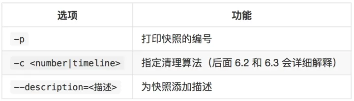
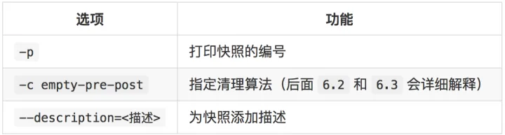
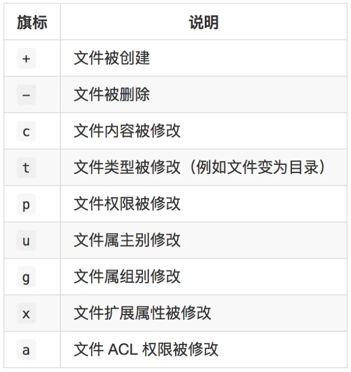
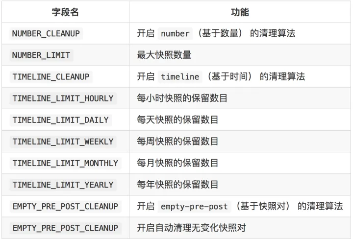

# Snapper玩转btrfs文件系统

>  https://zhuanlan.zhihu.com/p/31082518

## **配置 snapper**

在 Btrfs 中，snapper 是以子卷为单位管理快照的。我们要先为子卷建立配置文件才能管理快照。

这里我们不另外划分子卷，直接以 Btrfs 挂载点的根目录来进行操作（根目录也算是一个子卷）。

### 4.1 创建配置文件

命令基本用法

```text
snapper -c <配置名称> create-config <子卷路径> 
```

用法举例

创建 `/mnt/btrfs/` 的快照配置文件。

```text
snapper -c snap_test create-config /mnt/btrfs/ 
```

### 4.2 删除配置文件

命令基本用法

```text
snapper -c <配置名称> delete-config 
```

### 4.3 列出现有配置文件

命令基本用法

```text
snapper list-configs 
```

## **五、快照的管理**

### 5.1 拍摄一个快照

**5.1.1 拍摄一个普通快照**

命令基本用法

```text
snapper -c <配置名称> create [选项] 
```



用法举例

在 `/mnt/btrfs/` 上拍摄一个快照，描述信息为 `kuaizhao1`，并打印其编号。

```text
snapper -c snap_test create --description=kuaizhao1 -p 
```

**执行结果**

```text
1 
```

**5.1.2 拍摄一对快照**

快照对中包含了 `pre` 快照和 `post` 两种类型的快照。

一个 `pre` 快照需要对应一个 `post` 快照。

一般在进行文件系统操作之前拍摄一个 `pre` 快照，在操作完成后再拍摄一个 `post` 快照。

快照对其实跟普通快照并没有什么本质上的区别，只是做个标记便于识别和管理而已。

命令基本用法

拍摄 `pre` 快照

```text
snapper -c <配置名称> create -t pre [选项] 
```

拍摄 `post` 快照

```text
snapper -c <配置名称> create -t post --pre-number=<pre 快照编号> [选项] 
```



> **说明**
> 快照编号可通过执行 5.2 的命令来查看，下同。

### 5.2 列出所有快照

命令基本用法

```text
snapper -c <配置名称> list 
```

用法举例

列出 `/mnt/btrfs/` 中的所有快照。

```text
snapper -c snap_test list 
```

执行结果

```text
# 前期：指快照对中 post 快照所对应的 pre 快照名
# 清空：指清理算法

类型   | # | 前期 # | 日期                               | 用户 | 清空     | 描述      | 用户数据
-------+---+--------+------------------------------------+------+----------+-----------+---------
single | 0 |        |                                    | root |          | current   |             
single | 1 |        | 2017年10月29日 星期日 13时23分48秒 | root |          | kuaizhao1 |         
```

> **说明**
> 0 号快照并不是真正的快照，它表示当前文件系统的状态。

### 5.3 删除快照

命令基本用法

```text
snapper -c <配置名称> delete <快照 1 编号> [<快照 2 编号>...] 
```

用法举例

删除刚才创建的快照。

```text
snapper -c snap_test delete 1 
```

### 5.4 比较两个快照的差异

命令基本用法

```text
snapper -c <配置名称> status <快照 1 编号>..<快照 2 编号> 
```

执行完该命令之后，snapper 会分析快照 2 相比快照 1 有哪些差异，并将比较结果保存到文件中以便下次快速查询。

具体有哪些差异要看文件名以及对应的旗标。



用法举例

在 `/mnt/btrfs/` 上创建文件 `1.txt`，然后拍摄一个快照，再往 `1.txt` 添加一点内容，然后创建文件 `2.txt`，再拍摄一个快照。比较这两个快照的差异。

```text
touch /mnt/btrfs/1.txt  # 创建 1.txt
snapper -c snap_test create # 拍摄快照
echo "Hello" > /mnt/btrfs/1.txt # 添加内容
touch /mnt/btrfs/2.txt  # 创建 2.txt
snapper -c snap_test create # 拍摄快照
snapper -c snap_test status 1..2    # 比较快照 1 到快照 2 的差异 
```

执行结果

```text
c..... /mnt/btrfs/1.txt # 1.txt 被修改了
+..... /mnt/btrfs/2.txt # 增加了 2.txt 
```

### 5.5 回滚快照

命令基本用法

```text
snapper -c <配置名称> undochange <快照编号>..<0> 
```

> **注意**
> 建议在回滚快照之前先为当前状态创建一个快照。

用法举例

回滚到上面创建的快照 1，并对比前后结果。

```text
tree /mnt/btrfs/    # 查看回滚前文件
snapper -c snap_test undochange 1..0    # 回滚快照
tree /mnt/btrfs/    # 查看回滚后文件 
```

执行结果

```text
# 回滚前状态
/mnt/btrfs/
├── 1.txt
└── 2.txt

# 执行回滚命令后
创建：0 修订：1 删除：1

# 回滚后状态
/mnt/btrfs/
└── 1.txt 
```

### 5.6 快照文件的管理

由 snapper 所产生的快照默认存储在子卷下面的 `.snapshots` 目录中。我们来看一下它的结构：

```text
/mnt/btrfs/.snapshots/
├── 1   # 快照 1 目录
│   ├── info.xml    # 快照基本信息
│   └── snapshot    # 快照内容
│       └── 1.txt
└── 2   # 快照 2 目录
    ├── filelist-1.txt  # 快照差异比较结果
    ├── info.xml    # 快照基本信息
    └── snapshot    # 快照内容
        ├── 1.txt
        └── 2.txt 
```

可以看到，每个快照的基本信息和内容都在其对应编号的目录中，子目录 `snapshot` 的内容就是拍摄快照时子卷的所有内容。

快照文件默认是只读的，而且只有 root 可以访问。如果需要恢复单一文件，可以把快照里面的内容用 `cp`命令拷贝回来。

由于 Btrfs 文件系统具有写时复制的特性，所以如果文件系统中的文件没有经常被替换，快照占用的空间是非常小的。

## **六、快照的自动拍摄与清理**

自动拍摄及清理快照是 snapper 的特色功能之一。

### 6.1 开启快照自动拍摄

```text
systemctl start snapper-timeline.timer ; systemctl enable snapper-timeline.timer 
```

默认情况下，每小时自动拍摄一次快照。

如需修改时间间隔，请修改相关的定时器配置文件。修改方法这里就不说了。

快照的清理算法将被自动设定为 `timeline`。

### 6.2 开启快照自动清理

```text
systemctl start snapper-cleanup.timer ; systemctl enable snapper-cleanup.timer 
```

默认情况下，每天自动清理一次快照。

如需修改时间间隔，请修改相关的定时器配置文件。修改方法这里就不说了。

不指定清理算法的快照不会被自动清理。

### 6.3 修改快照自动清理的参数

配置文件位置：`/etc/snapper/configs/<配置名称>`。

常用字段及对应的功能如下：



