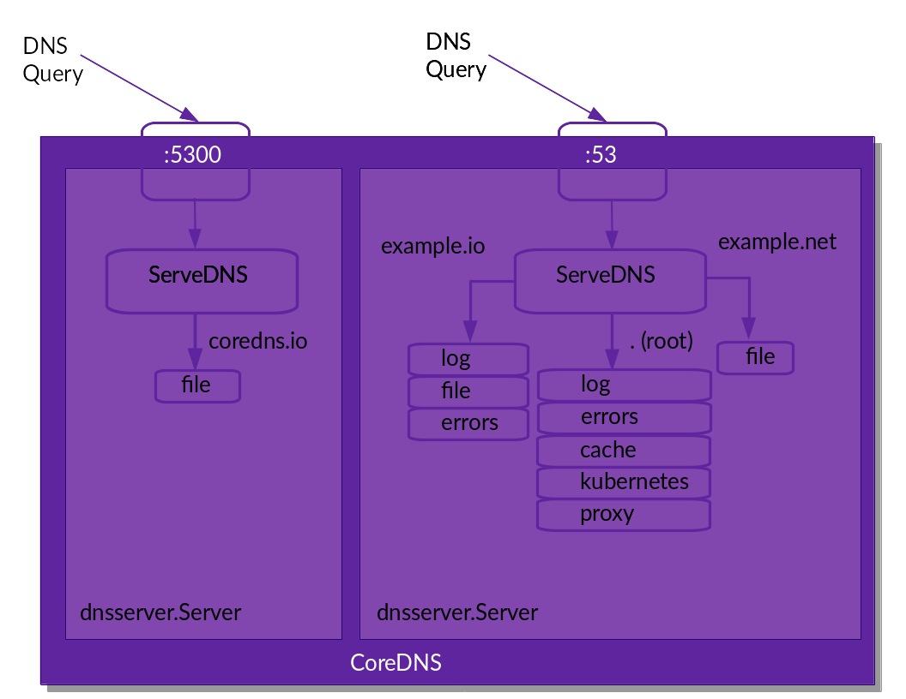

# 理解CoreDNS

## 什么是CoreDNS【官方解释】

CoreDNS 是一个 DNS 服务器。它是用[Go](https://golang.org/)编写的。

CoreDNS 不同于其他 DNS 服务器，例如（所有优秀的） [BIND](https://www.isc.org/bind/)、 [Knot](https://www.knot-dns.cz/)、 [PowerDNS](https://www.powerdns.com/)和 [Unbound](https://www.unbound.net/)（技术上是解析器，但仍然值得一提），因为它非常灵活，几乎所有功能都外包到插件中。

插件可以是独立的，也可以协同工作以执行“DNS 功能”。

那么什么是“DNS 功能”？就 CoreDNS 而言，我们将其定义为一个实现 CoreDNS Plugin API 的软件。实现的功能可能会有很大的偏差。有些插件本身不会创建响应，例如[metrics](https://coredns.io/plugins/metrics)或 [cache](https://coredns.io/plugins/cache)，但会添加功能。然后有一些插件*会*生成响应。这些也可以做任何事情：有与 [Kubernetes](https://coredns.io/plugins/kubernetes)通信以提供服务发现的插件，有从[文件](https://coredns.io/plugins/file)或[数据库](https://coredns.io/explugins/pdsql)读取数据的插件。

目前默认的 CoreDNS 安装中包含大约 30 个插件，但也有一大堆[外部](https://coredns.io/explugins)插件，您可以将它们编译到 CoreDNS 中以扩展其功能。

> CoreDNS 由插件提供支持。

编写新[插件](https://coredns.io/manual/toc/#writing-plugins)应该很容易，但需要了解 Go 并深入了解 DNS 的工作原理。CoreDNS 抽象出很多 DNS 细节，这样你就可以专注于编写你需要的插件功能


## 具有什么特点

- 主体文件仅一个二进制问文件，实现基本功能，其他功能都有插件实现
- Go语言编写，
- 有强大的云原生社区支持

|                                                              | CoreDNS  | BIND     |
| ------------------------------------------------------------ | -------- | -------- |
| 完整递归                                                     | 不支持   | 支持     |
| 动态更新                                                     | 不支持   | 支持     |
| 与 Kubernetes 集成                                           | 支持     | 不支持   |
| 与 Amazon Route 53 集成                                      | 支持     | 不支持   |
| DNS 安全扩展（Domain Name System Security Extension，DNSSEC）支持 | 有限支持 | 完全支持 |
| DNS over TLS（DoT）                                          | 支持     | 不支持   |


## 怎么去安装部署和使用

### 安装

二进制文件安装

- https://github.com/coredns/coredns/releases/latest

Docker

- https://hub.docker.com/r/coredns/coredns/

源码编译（不可取）

### 配置

#### 环境变量

CoreDNS 在其配置中支持环境变量替换。它们可以在 Corefile 中的任何地方使用。语法是（也支持`{\$ENV_VAR}`更像 Windows 的语法 ）。`{\%ENV_VAR\%}`CoreDNS 在解析 Corefile 时替换变量的内容。

#### 服务器语法模块

```yaml
.:1054 {
# Plugins defined here.
    bind lo
    whoami
}

.:1054 {
    bind eth0
    whoami
}
```


#### 语法实例



```c
coredns.io:5300 {
    file db.coredns.io
}

example.io:53 {
    log
    errors
    file db.example.io
}

example.net:53 {
    file db.example.net
}

.:53 {
    kubernetes
    forward . 8.8.8.8
    log
    errors
    cache
}
```

```
    .:53 {
        errors	#将错误日志发送至标准输出
        health {	#通过http://loaclhost:8080/health报告健康状态
          lameduck 5s
        }
        ready	#所有插件就绪后通过8181端口响应200 Ok报告就绪状态
        kubernetes cluster.local in-addr.arpa ip6.arpa {	#Kubernetes系统的本地区域及专用的解析配置
          pods insecure
          fallthrough in-addr.arpa ip6.arpa
        }
        prometheus :9153	#通过http://localhost:9153/metrics暴露指标数据
        forward . /etc/resolv.conf {	#非Kubernetes集群内部域名的转发逻辑
          max_concurrent 1000
        }
        cache 30	#启用解析缓存，缓存时长30s
        loop	#检测是否存在解析循环，如果有终止其过程
        reload	#Corefile内容改变时自动重载配置信息
        loadbalance	#轮询DNS域名解析，如果一个域名存在多个记录就轮询解析
    }

```


### 协议

```c
目前 CoreDNS 接受四种不同的协议：DNS、DNS over TLS (DoT)、DNS over HTTP/2 (DoH) 和 DNS over gRPC。您可以通过在区域名称前加上方案来指定服务器在服务器配置中应该接受的内容。

dns://对于纯 DNS（如果未指定方案，则为默认值）。
tls://对于基于 TLS 的 DNS，请参阅RFC 7858。
https://对于基于 HTTPS 的 DNS，请参阅RFC 8484。
grpc://用于基于 gRPC 的 DNS。
```


### 转发 

```c
在这种情况下，我们希望所有命中 CoreDNS 的查询都转发到 8.8.8.8 或 9.9.9.9：
  . {
    forward . 8.8.8.8 9.9.9.9
    log
}


. {
    forward example.org 8.8.8.8
    forward . /etc/resolv.conf
    log
}

```

### systemd管理

```bash
 [root@tiny-server coredns]# cat /usr/lib/systemd/system/coredns.service
 [Unit]
 Description=CoreDNS
 Documentation=https://coredns.io/manual/toc/
 After=network.target
 ​
 [Service]
 # Type设置为notify时，服务会不断重启
 # 关于type的设置，可以参考https://www.freedesktop.org/software/systemd/man/systemd.service.html#Options
 Type=simple
 User=root
 # 指定运行端口和读取的配置文件
 ExecStart=/home/coredns/coredns -dns.port=53 -conf /home/coredns/Corefile
 Restart=on-failure
 ​
 [Install]
 WantedBy=multi-user.target
```


## 插件

https://help.aliyun.com/document_detail/380963.html


| 参数                       | 描述                                                         |
| :------------------------- | :----------------------------------------------------------- |
| **errors**                 | 错误信息到标准输出。                                         |
| **health**                 | CoreDNS自身健康状态报告，默认监听端口8080，一般用来做健康检查。您可以通过`http://localhost:8080/health`获取健康状态。 |
| **ready**                  | CoreDNS插件状态报告，默认监听端口8181，一般用来做可读性检查。可以通过`http://localhost:8181/ready`获取可读状态。当所有插件都运行后，ready状态为200。 |
| **kubernetes**             | CoreDNS Kubernetes插件，提供集群内服务解析能力。             |
| **prometheus**             | CoreDNS自身metrics数据接口。可以通过`http://localhost:9153/metrics`获取prometheus格式的监控数据。 |
| **forward**（或**proxy**） | 将域名查询请求转到预定义的DNS服务器。默认配置中，当域名不在Kubernetes域时，将请求转发到预定义的解析器（/etc/resolv.conf）中。默认使用宿主机的/etc/resolv.conf配置。 |
| **cache**                  | DNS缓存。                                                    |
| **loop**                   | 环路检测，如果检测到环路，则停止CoreDNS。                    |
| **reload**                 | 允许自动重新加载已更改的Corefile。编辑ConfigMap配置后，请等待两分钟以使更改生效。 |
| **loadbalance**            | 循环DNS负载均衡器，可以在答案中随机A、AAAA、MX记录的顺序。   |

> 默认插件
>
> 一旦你有了一个`coredns`二进制文件，你就可以使用`-plugins`标志来列出所有编译的插件。如果没有`Corefile`（请参阅[配置](https://coredns.io/manual/toc/#configuration)），CoreDNS 将加载 [*whoami*](https://coredns.io/plugins/whoami)插件，该插件将响应客户端的 IP 地址和端口。所以为了测试，我们启动 CoreDNS 在端口 1053 上运行并使用以下命令向它发送查询`dig`：

### whoami

> 当*whoami*返回响应时，它将在附加部分中将您客户端的 IP 地址作为 A 或 AAAA 记录。
>
> 回复总是有一个空的答案部分。端口和传输作为 SRV 记录包含在附加部分中，传输可以是“tcp”或“udp”。
>
> 

```c
example.org {
    whoami
}


当查询“example.org A”时，CoreDNS 将响应：

;; QUESTION SECTION:
;example.org.   IN       A

;; ADDITIONAL SECTION:
example.org.            0       IN      A       10.240.0.1
_udp.example.org.       0       IN      SRV     0 0 40212


```


### kubernetes

> https://coredns.io/plugins/kubernetes/

```txt
kubernetes [ZONES...] {
    endpoint URL
    tls CERT KEY CACERT
    kubeconfig KUBECONFIG [CONTEXT]
    namespaces NAMESPACE...
    namespace_labels EXPRESSION
    labels EXPRESSION
    pods POD-MODE
    endpoint_pod_names
    ttl TTL
    noendpoints
    fallthrough [ZONES...]
    ignore empty_service
}
```

- `endpoint`

  用来指定k8s集群的apiserver地址，如https://10.31.88.1:6443，当然也可以是域名等其他形式，如果不配置，那么默认情况下会使用对应的`service account`去连接**当前k8s集群内**的apiserver，如果不是在k8s集群中部署，那么就会连接失败。

- `tls`

  `CERT KEY CACERT`是远程 k8s 连接的 TLS 证书、密钥和 CA 证书文件名。如果前面的`endpoint`没有配置，那么这个配置项会被忽略。

- `kubeconfig`

  `KUBECONFIG [CONTEXT]`使用 kubeconfig 文件验证与远程 k8s 集群的连接。 `[CONTEXT]`是可选配置的，如果未设置，则将使用 `kubeconfig`中默认的`[CONTEXT]`。它支持 TLS、用户名和密码或基于令牌的身份验证。

  如果前面的`endpoint`没有配置，那么这个配置项会被忽略。

- `namespaces`

  `NAMESPACE [NAMESPACE…]` 用来限制对外暴露的命名空间，多个命名空间之间使用空格间隔。如果不配置的话，则会暴露所有的命名空间。

- `namespace_labels`

  `namespace_labels EXPRESSION`可以限定DNS的查询范围，仅有匹配`labels`的`命名空间`才能被查询到。

- `labels`

  `labels EXPRESSION`可以限定DNS的查询范围，仅有匹配`lalels`的`service`才能被查询到。

> 注意这里的`labels`匹配的是`service`中的`labels`，而前面的`labels`匹配的是`namespace`中的`labels`。这两个`labels`的配置写法可以和使用`kubectl命令`中的`-l`参数完全一致。
>
> 如果要使用多个labels匹配规则，注意不要使用空格，而是对应的表达式进行匹配：
>
> -l, --selector='': Selector (label query) to filter on, supports '=', '==', and '!='.(e.g. -l key1=value1,key2=value2)

- `pods`

  `pods POD-MODE`设置处理基于 IP 的 pod A 记录的模式，例如客户端向coredns查询域名`1-2-3-4.ns.pod.cluster.local.`，该参数用于控制响应的结果，提供此选项是为了方便在直接连接到 pod 时使用 SSL 证书。

  **POD-MODE **有效值：

  - `disabled`： 默认。不处理 pod 请求，总是返回`NXDOMAIN`
  - `insecure`：总是从请求中返回带有 IP 的 A 记录（不检查 k8s），即查询域名`1-2-3-4.ns.pod.cluster.local.`的时候，不论是否存在一个IP地址为1.2.3.4的pod，都返回这个结果给客户端。如果与通配符 SSL 证书一起被恶意使用，此选项很容易被滥用。提供此选项是为了向后兼容 kube-dns。
  - `verified`: 如果在同一个命名空间中存在匹配 IP 的 Pod，则返回 A 记录，即查询域名`1-2-3-4.ns.pod.cluster.local.`的时候，只有当该ns中确实存在一个IP地址为1.2.3.4的pod，才返回这个结果给客户端，否则返回`NXDOMAIN`。与`insecure`模式相比，此选项需要更多的内存，因为它需要监控所有的pods。

- `endpoint_pod_names`

  使用`endpoints`所对应的pod名称作为A记录中的端点名称，例如， `endpoint-name.my-service.namespace.svc.cluster.local. in A 1.2.3.4`

  在没有配置该参数的情况下，`endpoints`名称选择如下：优先使用`endpoints`的hostname，如果`endpoints`没有配置hostname，则使用 IP 地址的虚线形式（例如，`1-2-3-4.my-service.namespace.svc.cluster.local.`）

  如果配置了该参数，则`endpoints`名称选择如下：优先使用`endpoints`的hostname，如果`endpoints`没有配置hostname，则使用`endpoints`对应的pod名称，如果pod名称不存在或者长度超过63，则使用 IP 地址的虚线形式。

- `ttl`

  设置标准的DNS域名TTL，默认值为 5 秒。允许的最小 TTL 为 0 秒，最大值为 3600 秒。将 TTL 设置为 0 将防止记录被缓存（如果查询的客户端遵循DNS规范）。

- `noendpoints`

  配置该参数将禁用对K8S集群中的`endpoints`记录功能，因此所有`endpoints`查询和`headless`服务查询都将返回 NXDOMAIN。

- `fallthrough [ZONES…]`

  正常情况下一个客户端对CoreDNS发起了一个DNS查询，如果该记录不存在，那么就会直接返回一个NXDOMAIN的响应。

  但是我们可以通过配置`fallthrough`参数来将这些NXDOMAIN的域名转发到配置块中的下一个插件。

  > 例如在fallthrough插件后面还使用了诸如file插件之类的配置了DNS解析，那么这个请求就会转发到file插件进行查询并响应

  `zones`参数可以用来控制哪些域的域名会被`fallthrough`插件转发，留空的情况下是所有的域名都会被转发，当然也可以指定部分域名如(for example `in-addr.arpa` and `ip6.arpa`)，此时就只有`in-addr.arpa` 和 `ip6.arpa`的查询出现NXDOMAIN才会被转发到下一个插件进行查询

- `ignore empty_service`

  如果一个service当中没有任何可用的endpoints（即关联的所有pods都不是ready状态），那么会返回一个NXDOMAIN。

  这个配置项的主要作用就是让这类不正常的服务域名查询的时候能够返回NXDOMAIN响应码，从而触发配置的其他插件（如上面提到的`fallthrough`）进行组合操作。


### prometheus

> https://coredns.io/plugins/metrics/

```bash
. {
    prometheus localhost:9253
}
```

使用*prometheus，*您可以从 CoreDNS 和任何具有它们的插件中导出指标。指标的默认位置是`localhost:9153`。指标路径固定为`/metrics`.

除了[Prometheus Go 客户端](https://prometheus.io/docs/guides/go-application/)导出的默认 Go 指标外，还导出了以下指标：

- `coredns_build_info{version, revision, goversion}`- 有关 CoreDNS 本身的信息。
- `coredns_panics_total{}`- 恐慌总数。
- `coredns_dns_requests_total{server, zone, proto, family, type}`- 查询总数。
- `coredns_dns_request_duration_seconds{server, zone, type}`- 处理每个查询的持续时间。
- `coredns_dns_request_size_bytes{server, zone, proto}`- 请求的大小（以字节为单位）。
- `coredns_dns_do_requests_total{server, zone}`- 设置了 DO 位的查询
- `coredns_dns_response_size_bytes{server, zone, proto}`- 以字节为单位的响应大小。
- `coredns_dns_responses_total{server, zone, rcode, plugin}`- 每个区域、rcode 和插件的响应。
- `coredns_dns_https_responses_total{server, status}`- 每个服务器的响应和 http 状态代码。
- `coredns_plugin_enabled{server, zone, name}`- 指示是否在每个服务器和区域的基础上启用插件。

几乎每个计数器都有一个标签`zone`，它是用于请求/响应的区域名称。

使用的额外标签是：

- `server`正在识别负责请求的服务器。这是一个格式化为服务器监听地址的字符串：`<scheme>://[<bind>]:<port>`。即对于“正常”的 DNS 服务器，这是`dns://:53`. 如果您使用的是*绑定*插件，则会包含一个 IP 地址，例如：`dns://127.0.0.53:53`.

- `proto`它保存响应的传输（“udp”或“tcp”）

- `family`传输的地址族 ( )（1 = IP（IP 版本 4），2 = IP6（IP 版本 6））。

- `type`它包含查询类型。它包含最常见的类型（A、AAAA、MX、SOA、CNAME、PTR、TXT、NS、SRV、DS、DNSKEY、RRSIG、NSEC、NSEC3、HTTPS、IXFR、AXFR 和 ANY）和“其他”其他类型。

- ```
  status
  ```

  其中包含 https 状态代码。可能的值是：

  - 200 - 请求已处理，
  - 404 - 请求在验证时被拒绝，
  - 400 - 请求 DNS 消息转换失败，
  - 500 - 处理以无响应结束。

- 标签`plugin`包含向客户端写入的插件的名称。如果服务器进行了写入（例如出错），则该值为空。

如果启用监控，未进入插件链的查询将以假名“dropped”导出（没有结束点 - 这绝不是有效的域名）。

启用*prometheus*插件后，其他插件可能会导出其他统计信息。这些统计数据记录在每个插件的自述文件中。

每个服务器块只能使用一次此插件。

### redis

> https://coredns.io/explugins/redis/

*redis*启用从 redis 数据库读取区域数据。这个插件应该位于*plugins.cfg*中*etcd的旁边*

记录在了另外一个文件夹里，外部插件

### file

```c
example.org {
    file db.example.org
    log
}
```


