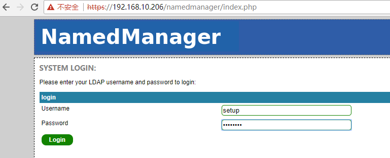
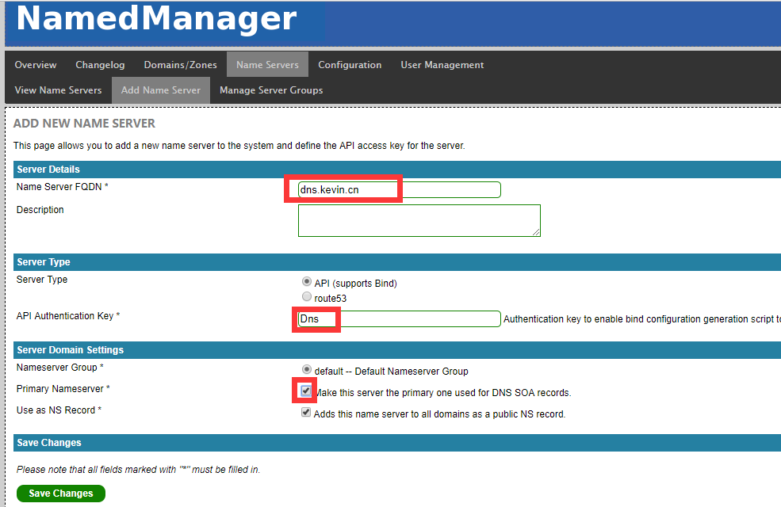
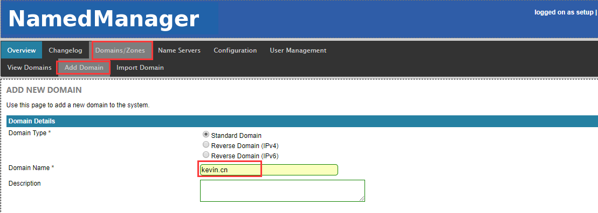
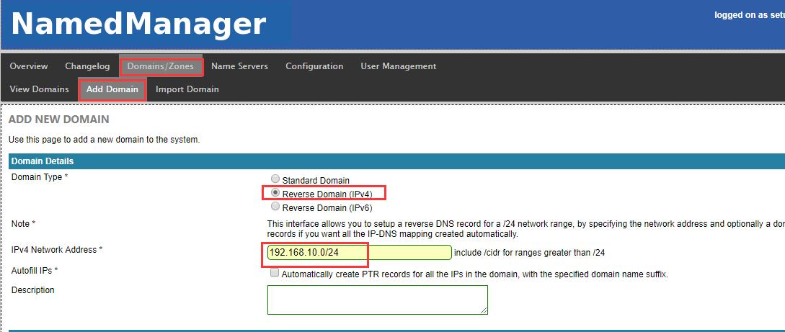

# Bind9之Web管理NamedManager


NamedManager 是一个基于Web的DNS管理系统，**可用来添加、调整和删除DNS的zones/records数据。**它使用Bind作为底层DNS服务，提供一个现代Ajax的Web界面，支持 IPv4和IPv6。该应用程序很稳定，在生产环境中使用没有任何问题。过多的介绍在此就不做说明了，下面说下NamedManager环境部署过程：

## 1）下载NamedManager的rpm安装包

```bash
[root@dns ~]# hostname
dns.kevin.cn
 
[root@dns named]# cat /etc/hosts
127.0.0.1   localhost localhost.localdomain localhost4 localhost4.localdomain4
::1         localhost localhost.localdomain localhost6 localhost6.localdomain6
192.168.10.206 dns.kevin.cn
 
[root@dns ~]# ifconfig |grep 192.168
          inet addr:192.168.10.206  Bcast:192.168.10.255  Mask:255.255.255.0
 
[root@dns named]# ping dns.kevin.cn
PING dns.kevin.cn (192.168.10.206) 56(84) bytes of data.
64 bytes from dns.kevin.cn (192.168.10.206): icmp_seq=1 ttl=64 time=0.027 ms
64 bytes from dns.kevin.cn (192.168.10.206): icmp_seq=2 ttl=64 time=0.043 ms
......
  
[root@dns ~]# cd /usr/local/src/
[root@dns src]# wget http://repos.jethrocarr.com/pub/amberdms/linux/centos/6/amberdms-custom/i386/namedmanager-bind-1.8.0-1.el6.noarch.rpm
[root@dns src]# wget http://repos.jethrocarr.com/pub/amberdms/linux/centos/6/amberdms-custom/i386/namedmanager-www-1.8.0-1.el6.noarch.rpm
  
[root@dns src]# ll
total 1352
-rw-r--r--. 1 root root  109584 Dec 22  2013 namedmanager-bind-1.8.0-1.el6.noarch.rpm
-rw-r--r--. 1 root root 1270108 Dec 22  2013 namedmanager-www-1.8.0-1.el6.noarch.rpm
```

## 2）安装namedmanager

```
[root@dns src]# yum install perl httpd mod_ssl mysql-server php php-intl php-ldap php-mysql php-soap php-xml
  
修改/etc/httpd/conf/httpd.conf
[root@dns src]# vim /etc/httpd/conf/httpd.conf
......
ServerName dns.kevin.cn:80
  
[root@dns src]# service mysqld start
[root@dns src]# service httpd start
[root@dns src]# lsof -i:3306
COMMAND   PID  USER   FD   TYPE DEVICE SIZE/OFF NODE NAME
mysqld  16589 mysql   10u  IPv4  77732      0t0  TCP *:mysql (LISTEN)
[root@dns src]# lsof -i:80
COMMAND   PID   USER   FD   TYPE DEVICE SIZE/OFF NODE NAME
httpd   16621   root    4u  IPv6  77759      0t0  TCP *:http (LISTEN)
httpd   16623 apache    4u  IPv6  77759      0t0  TCP *:http (LISTEN)
httpd   16624 apache    4u  IPv6  77759      0t0  TCP *:http (LISTEN)
httpd   16625 apache    4u  IPv6  77759      0t0  TCP *:http (LISTEN)
httpd   16626 apache    4u  IPv6  77759      0t0  TCP *:http (LISTEN)
httpd   16627 apache    4u  IPv6  77759      0t0  TCP *:http (LISTEN)
httpd   16628 apache    4u  IPv6  77759      0t0  TCP *:http (LISTEN)
httpd   16629 apache    4u  IPv6  77759      0t0  TCP *:http (LISTEN)
httpd   16630 apache    4u  IPv6  77759      0t0  TCP *:http (LISTEN)
  
[root@dns src]# chkconfig mysqld on
[root@dns src]# chkconfig httpd on
  
[root@dns src]# mysqladmin -u root password 123456
  
[root@dns src]# rpm -Uvh namedmanager-www-1.8.0-1.el6.noarch.rpm
[root@dns src]# cd /usr/share/namedmanager/resources/
[root@dns resources]# ./autoinstall.pl
autoinstall.pl
  
This script setups the NamedManager database components:
 * NamedManager MySQL user
 * NamedManager database
 * NamedManager configuration files
  
THIS SCRIPT ONLY NEEDS TO BE RUN FOR THE VERY FIRST INSTALL OF NAMEDMANAGER.
DO NOT RUN FOR ANY OTHER REASON
  
Please enter MySQL root password (if any): 123456        //输入mysql密码
Searching ../sql/ for latest install schema...
../sql//version_20131222_install.sql is the latest file and will be used for the install.
Importing file ../sql//version_20131222_install.sql
Creating user...
Updating configuration file...
DB installation complete!
  
You can now login with the default username/password of setup/setup123 at http://localhost/namedmanager
  
  
[root@dns resources]# cd /usr/local/src/
[root@dns src]# yum install bind php-process
[root@dns src]# rpm -Uvh namedmanager-bind-1.8.0-1.el6.noarch.rpm
  
  
修改/etc/named.conf
[root@dns src]# cp /etc/named.conf /etc/named.conf.bak
[root@dns src]# vim /etc/named.conf
options {
        listen-on port 53 { any; };
//      listen-on-v6 port 53 { ::1; };
        directory "/var/named";
        dump-file       "/var/named/data/cache_dump.db";
        statistics-file "/var/named/data/named_stats.txt";
        memstatistics-file "/var/named/data/named_mem_stats.txt";
        allow-query     { any; };
        allow-query-cache     { any; };         //DNS查询的缓存功能。实际上不建议开启此功能，即删除这一行配置。如果打开了，当DNS解析修改后，因为缓存原因，需等待一段时间才能生效。
        recursion yes;
        forward first;
        forwarders {
            223.5.5.5;
            223.6.6.6;
            8.8.8.8;
            8.8.4.4;
          };
 
        dnssec-enable yes;
        dnssec-validation yes;
        dnssec-lookaside auto;
 
        bindkeys-file "/etc/named.iscdlv.key";
        managed-keys-directory "/var/named/dynamic";
 
        };
  
logging {                           
        channel default_debug {
        file "data/named.run";
        severity dynamic;
        };
};
  
zone "." {
        type hint;      
        file "named.ca";
        };
  
include "/etc/named.rfc1912.zones";
include "/etc/named.root.key";
include "/etc/named.namedmanager.conf";
```

==========================================================

```
如果要bind可以在chroot的模式下运行
[root@dns src]# yum install bind-chroot
 
建立“/etc/named.namedmanager.conf”文件的硬连接
[root@dns src]# ln /etc/named.namedmanager.conf /var/named/chroot/etc/named.namedmanager.conf
 
如果不建立硬连接named启动时，会提示找不到“/etc/named.namedmanager.conf”。
这是因为：
bind-chroot是bind的一个功能，使bind可以在一个chroot的模式下运行。也就是说,bind运行时的/(根)目录,并不是系统真正的/(根)目录，只是系统中的一个子目录而已。
这样做的目的是为了提高安全性。因为在chroot的模式下，bind可以访问的范围仅限于这个子目录的范围里，无法进一步提升,进入到系统的其他目录中。
 
chroot可以改变程序运行时所参考的根目录(/)位置，即将某个特定的子目录作为程序的虚拟根目录，并且对程序运行时可以使用的系统资源，用户权限和所在目录进行严
格控制，程序只在这个虚拟的根目录下具有权限，一旦跳出该目录就无任何权限。例如在centos中，/var/name/chroot实际上是根目录(/)的虚拟目录，所以虚拟目录中的
/etc目录实际上是/var/named/chroot/etc目录，而/var/named目录实际上是/var/named/chroot/var/named目录。chroot功能的优点是：如果有黑客通过Bind侵入系统，也只能被限定在chroot目录及其子目录中，其破坏力也仅局限在该虚拟目录中，不会威胁到整个服务器
的安全。
```

==========================================================

## 3）启动named服务

```
[root@dns src]# service named start
[root@dns src]# chkconfig named on
[root@dns src]# lsof -i:53
COMMAND   PID  USER   FD   TYPE DEVICE SIZE/OFF NODE NAME
named   16864 named   20u  IPv4  81946      0t0  TCP localhost:domain (LISTEN)
named   16864 named   21u  IPv4  81948      0t0  TCP 192.168.10.206:domain (LISTEN)
named   16864 named  512u  IPv4  81945      0t0  UDP localhost:domain
named   16864 named  513u  IPv4  81947      0t0  UDP 192.168.10.206:domain
 
修改/etc/namedmanager/config-bind.php
[root@dns src]# cp /etc/namedmanager/config-bind.php /etc/namedmanager/config-bind.php.bak
[root@dns src]# vim /etc/namedmanager/config-bind.php
.......
$config["api_url"]      = "http://192.168.10.206/namedmanager";          // 应用程序的安装位置
$config["api_server_name"]  = "dns.kevin.cn";                            // 此处必须与httpd配置里的Name Server名称一致
$config["api_auth_key"]     = "Dns";
......
```

## 4）设置防火墙

```
namedmanager部署机本机要么关闭iptables，要么安装如下设置：
[root@dns src]# setenforce 0
[root@dns src]# getenforce
[root@dns src]# vim /etc/sysconfig/selinux
.......
SELINUX=disabled
 
[root@dns src]# iptables -F
[root@dns src]# iptables -P INPUT DROP
[root@dns src]# iptables -P FORWARD DROP
[root@dns src]# iptables -A INPUT -m state --state ESTABLISHED,RELATED -j ACCEPT
[root@dns src]# iptables -A INPUT -i lo -p all -j ACCEPT
[root@dns src]# iptables -A INPUT -p icmp -j ACCEPT
[root@dns src]# iptables -A INPUT -p tcp --dport 22 -j ACCEPT
[root@dns src]# iptables -A INPUT -p tcp --dport 53 -j ACCEPT
[root@dns src]# iptables -A INPUT -p udp --dport 53 -j ACCEPT
[root@dns src]# iptables -A INPUT -p tcp --dport 80 -j ACCEPT
[root@dns src]# iptables -A INPUT -p tcp --dport 443 -j ACCEPT
 
禁用IPV6。添加域名记录（正向解析与反向解析）。设置开机启动服务，并重启服务器。
[root@dns src]# vim /etc/modprobe.d/dist.conf         //文件结尾添加如下内容：
......
alias net-pf-10 off
alias ipv6 off
chkconfig ip6tables off
 
[root@dns src]# chkconfig httpd on
[root@dns src]# chkconfig mysqld on
[root@dns src]# chkconfig named on
 
[root@dns src]# init 6      //或者执行"reboot"
```

## 5）访问namedmanager

访问 http://192.168.10.206/namedmanager ，**默认用户名和密码（setup，setup123）**。不要忘记在用户管理中修改用户名和密码。



**接着设置API key（如下图。设置邮箱地址和API key，这个key是在上面的/etc/namedmanager/config-bind.php文件中设置的）**


添加服务器。Name Server FQDN的名称要和httpd中的ServerName一致。（如下添加部署机的主机名或者ip地址都可以）




**添加正向域名解析**



**添加反向域名解析（如果有多个ip段的客户机，那么就如下图添加多个反向解析配置）**



**查看正反向解析域名添加情况**

****

**上面已经成功添加了正反向解析域名，现在尝试添加一些域名的A记录和PTR记录**

**先添加A正向解析记录**

****

****

**由于上面在添加A正向解析的时候，已经勾选了PTR反向解析（如果没有勾选，则需要手动添加PTR反向解析记录），故这时候已经有了上面那几个域名的反向解析记录了：**

****

****

**如上，已经添加了几个正反向解析记录，现在到namedmanager部署机器本机上查看相关的正反向解析配置：**

```bash
[root@dns ~]# cd /var/named/
[root@dns named]# ll
total 40
-rw-r--r--. 1 root  root   490 Apr  7 14:48 10.168.192.in-addr.arpa.zone
drwxr-x---. 7 root  named 4096 Apr  7 13:37 chroot
drwxrwx---. 2 named named 4096 Apr  7 13:39 data
drwxrwx---. 2 named named 4096 Apr  7 14:40 dynamic
-rw-r--r--. 1 root  root   455 Apr  7 14:45 kevin.cn.zone
-rw-r-----. 1 root  named 3289 Apr 11  2017 named.ca
-rw-r-----. 1 root  named  152 Dec 15  2009 named.empty
-rw-r-----. 1 root  named  152 Jun 21  2007 named.localhost
-rw-r-----. 1 root  named  168 Dec 15  2009 named.loopback
drwxrwx---. 2 named named 4096 Jan 22 20:57 slaves
 
A记录的正向解析配置为：
[root@dns named]# cat kevin.cn.zone
$ORIGIN kevin.cn.
$TTL 120
@       IN SOA dns.kevin.cn. wangshibo.kevin.com. (
            2018040703 ; serial
            21600 ; refresh
            3600 ; retry
            604800 ; expiry
            120 ; minimum ttl
        )
 
; Nameservers
 
kevin.cn.   86400 IN NS dns.kevin.cn.
 
; Mailservers
 
 
; Reverse DNS Records (PTR)
 
 
; CNAME
 
 
; HOST RECORDS
 
db01    120 IN A 192.168.10.205
db02    120 IN A 192.168.10.209
dns 120 IN A 192.168.10.206
web01   120 IN A 192.168.10.202
web02   120 IN A 192.168.10.203
 
 
 
PTR记录的反向解析配置为：
[root@dns named]# cat 10.168.192.in-addr.arpa.zone
$ORIGIN 10.168.192.in-addr.arpa.
$TTL 120
@       IN SOA dns.kevin.cn. wangshibo.kevin.com. (
            2018040704 ; serial
            21600 ; refresh
            3600 ; retry
            604800 ; expiry
            120 ; minimum ttl
        )
 
; Nameservers
 
10.168.192.in-addr.arpa.    86400 IN NS dns.kevin.cn.
 
; Mailservers
 
 
; Reverse DNS Records (PTR)
 
202 120 IN PTR web01.kevin.cn.
203 120 IN PTR web02.kevin.cn.
205 120 IN PTR db01.kevin.cn.
206 120 IN PTR dns.kevin.cn.
209 120 IN PTR db02.kevin.cn.
 
; CNAME
 
 
; HOST RECORDS
```

**5）设置客户机的DNS配置**

```bash
将namedmanager本机以及所有的客户机的DNS地址都设置成192.168.10.206（即namedmanager部署机的ip地址）
[root@storage01 ~]# ifconfig|grep 192
          inet addr:192.168.10.202  Bcast:192.168.10.255  Mask:255.255.255.0
 
[root@storage01 ~]# cat /etc/resolv.conf
domain kevin.cn
search kevin.cn
nameserver 192.168.10.206
 
[root@storage01 ~]# ping www.baidu.com                         //这里走的是DNS配置中的forwarders转发的解析
PING www.a.shifen.com (14.215.177.38) 56(84) bytes of data.
64 bytes from 14.215.177.38: icmp_seq=1 ttl=49 time=37.6 ms
64 bytes from 14.215.177.38: icmp_seq=2 ttl=49 time=37.5 ms
64 bytes from 14.215.177.38: icmp_seq=3 ttl=49 time=37.4 ms
.....
 
[root@storage01 ~]# ping web02.kevin.cn
PING web02.kevin.cn (192.168.10.203) 56(84) bytes of data.
64 bytes from web02.kevin.cn (192.168.10.203): icmp_seq=1 ttl=64 time=0.136 ms
64 bytes from web02.kevin.cn (192.168.10.203): icmp_seq=2 ttl=64 time=0.212 ms
64 bytes from web02.kevin.cn (192.168.10.203): icmp_seq=3 ttl=64 time=0.132 ms
.....
 
在客户机上检查下正反向解析是否成功：
[root@storage01 ~]# host 192.168.10.209
209.10.168.192.in-addr.arpa domain name pointer db02.kevin.cn.
 
[root@storage01 ~]# host db01.kevin.cn
db01.kevin.cn has address 192.168.10.205
```

## **注意一下：**

1）以上是在单机部署的BindManager服务，如果是线上环境的话，建议在多台机器上部署（至少两台机器）同样的BindManger服务，比如BindManager01、BindManager02两台机器；
2）在客户机的/etc/resolv.conf文件里将DNS地址配置成其中的一个BindManager部署机的ip地址，比如配置成BindManager01地址；
3）将BindManager01的正反向解析文件实时同步到BindManager02机器上（直接同步/var/named这个目录即可）；两台机器的BindaManger相关服务都要是启动状态。
4）如果BindManager01服务器发生故障，不能正常提供DNS解析服务。此时，可以迅速将BindManager02的ip地址修改成BindManager01的ip地址。这样就能很快的实现故障转移了。

