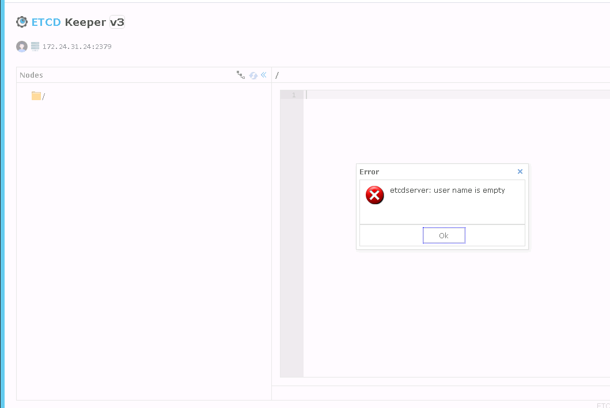

# etcd安装etcdkeeper

## 安装etcd keeper

github地址：https://github.com/evildecay/etcdkeeper

安装简单，步骤简短。

## 获取安装包

wget https://github.com/evildecay/etcdkeeper/releases/download/v0.7.6/etcdkeeper-v0.7.6-linux_x86_64.zip

## 解压安装包

    unzip etcdkeeper-v0.7.6-linux_x86_64.zip 
    mv etcdkeeper /usr/local/ 
    cd /usr/local/etcdkeeper 
    chmod +x etcdkeeper

## 编辑systemd文件

    cd /lib/systemd/system
     
    vim etcdkeeper.service
     
    [Unit]
    Description=etcdkeeper service
    After=network.target
    [Service]
    Type=simple
    ExecStart=/usr/local/etcdkeeper/etcdkeeper -h 0.0.0.0 -p 8888
    ExecReload=/bin/kill -HUP $MAINPID
    KillMode=process
    Restart=on-failure
    PrivateTmp=true
    [Install]
    WantedBy=multi-user.target

## 启动参数

      Usage of etcdkeeper.exe:
      -h string
            host name or ip address (default: "0.0.0.0", the http server addreess, not etcd address)
      -p int
            port (default 8080)
      -sep string
            Separator (default "/")
      -usetls
            use tls (only v3)
      -cacert string
            verify certificates of TLS-enabled secure servers using this CA bundle (only v3)
      -cert string
            identify secure client using this TLS certificate file (only v3)
      -key string
            identify secure client using this TLS key file (only v3)
      -auth bool
            use etcd auth
      -timeout int
            ETCD client connect timeout

## 访问测试

http://172.24.31.13:8888/etcdkeeper/

## etcdkeeper访问开启鉴权的etcd

https://github.com/evildecay/etcdkeeper/issues/57

如果etcd集群开启了鉴权。(etcdctl --endpoints=http://127.0.0.1:2379 auth enable)

那么etcdkeeper启动时需要添加参数-auth true

如果etcd集群开启了鉴权，但是etcdkeeper没有添加参数-auth true，及时输入了正确的用户名和密码，也会出现以下情况：

