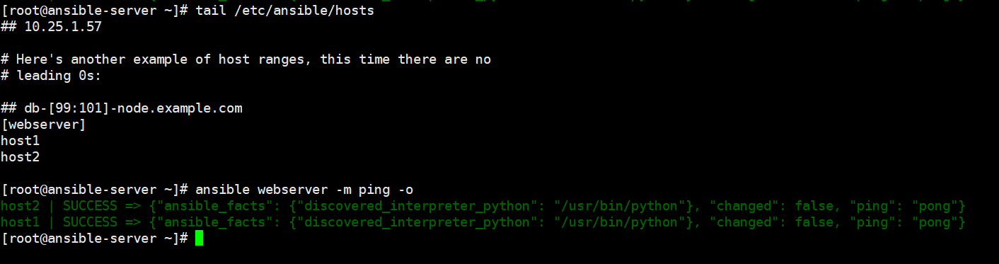
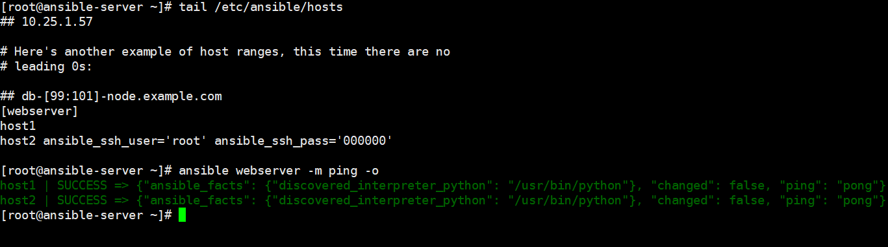
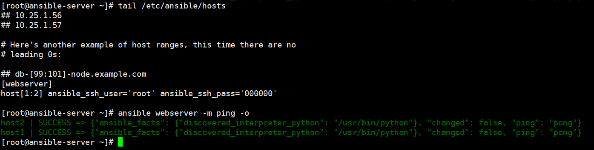
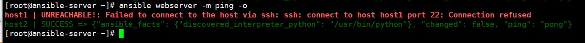
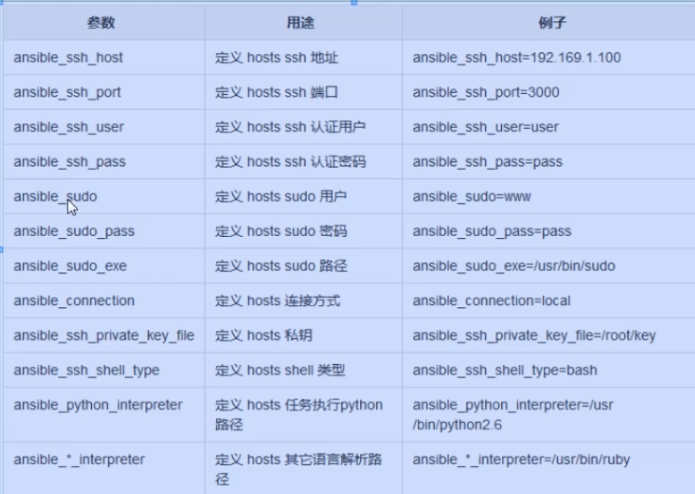
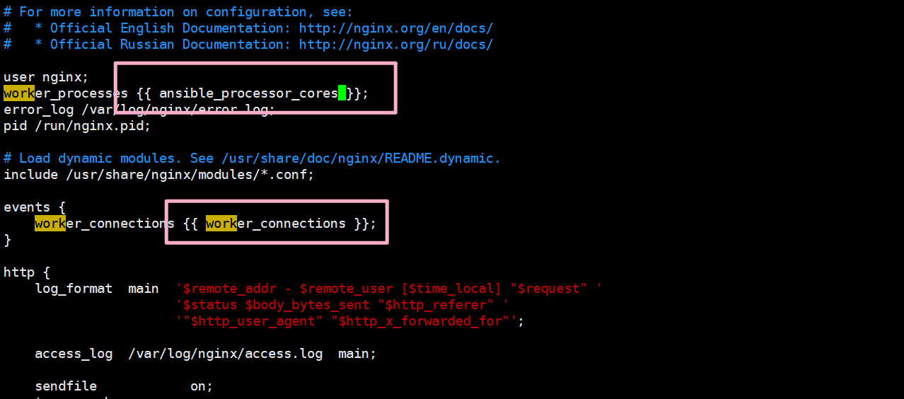

# ansible自动化运维


# 1-简介

## **Logo** 


## 介绍

ansible是新出现的自动化运维工具，基于**Python**开发，集合了众多运维工具（puppet、cfengine、chef、func、fabric）的优点，
实现了批量系统配置、批量程序部署、批量运行命令等功能。
无客户端。

我们要学一些Ansible的安装和一些基本概念,然后我们会开始研究一些真正有意思的东西 – **playbook**,配置管理,部署以及语法编排.我们将会学习如何使用/usr/bin/ansible执行ad-hoc并行命令,我们还会学习ansible的核心有什么样的模块可供使用.当然以后你也可以写你自己的模块,我们会在后期讲到.

## 工作原理


# 2-部署

##  **ns resolve**

```bash
172.16.100.12 ansible-server
172.16.100.13 host1
172.16.100.14 host2
```

### ansible-server 

配置域名解析

### ansible 客户机

**无需配置**

## 安装ansible

ansible服务器

```bash
yum install -y epel-release
安装epel源，如果您在非学校环境，请使用下方阿里YUM
rm  -rf /etc/yum.repos.d/*
wget -O /etc/yum.repos.d/epel.repo http://mirrors.aliyun.com/repo/epel-7.repo
wget -O /etc/yum.repos.d/CentOS-Base.repo http://mirrors.aliyun.com/repo/Centos-7.repo 

yum install -y ansible

     检测部署是否完成                 
rpm -ql ansible   列出所有文件
rpm -qc ansible    查看配置文件
ansible --help     查看ansible帮助
ansible-doc -l       看所有模块（A10，华为，docker，EC2，aws等等广大厂商设备）
ansible-doc -s yum     看yum模块，了解其功能
```

# 3-ssh-key

**ssh-keygen    //产出公钥**

**ssh-copy-id IP地址  //推送公钥**

  这一步也可以不做就是ansible 的时候需要输入密码

# 4-ansible基础

## 1.★定义主机清单

```bash
vim /etc/ansible/hosts
host1
```

## 2.测试连通性

```bash
ansible host1 -m ping  -o 
```

## 3.简洁输出

```bash
[root@ansible-server ~]# ansible hos1 -m ping -o 
# -o 简洁输出
[WARNING]: Could not match supplied host pattern, ignoring: hos1
[WARNING]: No hosts matched, nothing to do
[root@ansible-server ~]# ansible host1 -m ping -o
host1 | SUCCESS => {"ansible_facts": {"discovered_interpreter_python": "/usr/bin/python"}, "changed": false, "ping": "pong"}
[root@ansible-server ~]# ansible host1 -m ping 
host1 | SUCCESS => {
    "ansible_facts": {
        "discovered_interpreter_python": "/usr/bin/python"
    }, 
    "changed": false, 
    "ping": "pong"
}
[root@ansible-server ~]# ansible host2 -m ping # 未添加hosts
[WARNING]: Could not match supplied host pattern, ignoring: host2
[WARNING]: No hosts matched, nothing to do

```


## 4.★know_hosts

```bash
[root@ansible-server ~]# ansible host1 -m ping -u root -k -o  # 没放进hosts,需要输入密码
# -k 交互式密码输入
SSH password: 
host1 | SUCCESS => {"ansible_facts": {"discovered_interpreter_python":"/usr/bin/python"}, "changed": false, "ping": "pong"}
```

去掉（yes/no）的询问

```bash
vim /etc/ssh/ssh_config
	StrictHostKeyChecking no    //写入的内容
systemctl restart sshd       //重启sshd
```


## 5.错误示范

ansible host4 -m ping -u root -k -o      //失败，主机清单未标注主机。

## 6.请注意ping和ssh

ping  ICMP：网际消息管理协议 **4层**

ssh ；应用层安全连接 **7层**

关闭host1主机的sshd进程，进行ping连通性测试。

再使用ansible对host1进行联通测试时，却是失败的。

结论ansible的ping，是探测ssh程序是否连接。不是icmp协议

ansible host1 -m ping -u root -k

## 7.高并发

```
ansible webserver -m ping -om -f 2
-f 2 并发两个线程
```


# 5-Inventory -主机清单

**含义**

清查;存货清单;财产目录;主机清单

## /etc/ansible/hosts

### 1 增加主机组

官方链接:http://docs.ansible.com/ansible/intro_inventory.html#

```
vim /etc/ansible/hosts

[webserver]
host1
host2

ansible webserver -m ping -u root -k -o
```



### 2 增加用户名 密码

```bash
vim /etc/ansible/hosts                         //注意您的密码与我这里不同。


[webserver]
host1
host2 ansible_ssh_user='root' ansible_ssh_pass='000000'


[webserver]
host[1:2] ansible_ssh_user='root' ansible_ssh_pass='000000' //正则写法host[1:2] 代表host1 和host2


```






### 3 增加端口

请将host1的sshd程序端口修改为2222
```bash
# vim /etc/ssh/sshd_config
[root@host1 ~]# grep Port /etc/ssh/sshd_config 
#Port 22
#GatewayPorts no
[root@host1 ~]# sed -i 's/^#Port 22/Port 2222/g' /etc/ssh/sshd_config 
[root@host1 ~]# grep Port /etc/ssh/sshd_config 
Port 2222
#GatewayPorts no
[root@host1 ~]# netstat -tlunp
Active Internet connections (only servers)
Proto Recv-Q Send-Q Local Address           Foreign Address         State       PID/Program name    
tcp        0      0 0.0.0.0:2222            0.0.0.0:*               LISTEN      18214/sshd          
tcp        0      0 127.0.0.1:25            0.0.0.0:*               LISTEN      7126/master         
tcp6       0      0 :::2222                 :::*                    LISTEN      18214/sshd          
tcp6       0      0 ::1:25                  :::*                    LISTEN      7126/master         
udp        0      0 0.0.0.0:68              0.0.0.0:*                           6769/dhclient       
udp        0      0 127.0.0.1:323           0.0.0.0:*                           5990/chronyd        
udp6       0      0 ::1:323                 :::*                                5990/chronyd   
```
一个报错  fatal: Cannot bind any address.

```bash
-- Unit sshd.service has begun starting up.
Nov 06 20:50:21 host1 sshd[18141]: error: Bind to port 2222 on 0.0.0.0 failed: Permission denied.
Nov 06 20:50:21 host1 sshd[18141]: error: Bind to port 2222 on :: failed: Permission denied.
Nov 06 20:50:21 host1 sshd[18141]: fatal: Cannot bind any address.
Nov 06 20:50:21 host1 systemd[1]: sshd.service: main process exited, code=exited, status=255/n/a
Nov 06 20:50:21 host1 systemd[1]: Failed to start OpenSSH server daemon.
-- Subject: Unit sshd.service has failed
-- Defined-By: systemd
-- Support: http://lists.freedesktop.org/mailman/listinfo/systemd-devel
-- 
-- Unit sshd.service has failed.
-- 
-- The result is failed.
Nov 06 20:50:21 host1 systemd[1]: Unit sshd.service entered failed state.
Nov 06 20:50:21 host1 systemd[1]: sshd.service failed.
# selinux没关闭
[root@host1 ~]# getenforce 
Enforcing
[root@host1 ~]# setenforce 0
[root@host1 ~]# systemctl restart sshd
[root@host1 ~]# 
```

ansible webserver -m ping -o    //失败，因为默认端口已更改

```
[root@ansible-server ~]# ansible webserver -m ping -o
host1 | UNREACHABLE!: Failed to connect to the host via ssh: ssh: connect to host host1 port 22: Connection refused
host2 | SUCCESS => {"ansible_facts": {"discovered_interpreter_python": "/usr/bin/python"}, "changed": false, "ping": "pong"}
```



vim /etc/ansible/hosts

```bash
[webserver]
host1 ansible_ssh_user='root' ansible_ssh_pass='000000' ansible_ssh_port='2222'
host2 ansible_ssh_user='root' ansible_ssh_pass='000000
```

请将用户名密码和端口回复原状

### 4 组:变量

ansible内部变量可以帮助我们简化主机清单的设置

vim /etc/ansible/hosts

```bash
[webserver]
host1 ansible_ssh_port='2222'
host2
[webserver:vars]
ansible_ssh_user='root'
ansible_ssh_pass='000000'


[root@ansible-server ~]# ansible webserver -m ping -o
host2 | SUCCESS => {"ansible_facts": {"discovered_interpreter_python": "/usr/bin/python"}, "changed": false, "ping": "pong"}
host1 | SUCCESS => {"ansible_facts": {"discovered_interpreter_python": "/usr/bin/python"}, "changed": false, "ping": "pong"}

```

常用变量



### 5 子分组

将不同的分组进行组合

vim /etc/ansible/hosts

```bash
[apache]
host[1:2]
[nginx]
host[3:4]
[webserver:children]
apache
nginx
[webserver:vars]
ansible_ssh_user='root'
ansible_ssh_pass='666666'
```


### 6 自定义主机列表

vim hostlist

```bash
[dockers]
host1
host2
[dockers:vars]
ansible_ssh_user='root'
ansible_ssh_pass='666666'
```


引用 hostlist

ansible -i hostlist docker -m ping -o

```bash
[root@ansible-server project]# ansible docker -i hostlist -m ping -o
host1 | SUCCESS => {"ansible_facts": {"discovered_interpreter_python": "/usr/bin/python"}, "changed": false, "ping": "pong"}
host2 | SUCCESS => {"ansible_facts": {"discovered_interpreter_python": "/usr/bin/python"}, "changed": false, "ping": "pong"}
[root@ansible-server project]# tail hostlist 
[docker]
host1 ansible_ssh_port='2222'
host2
[docker:vars]
ansible_ssh_user='root'
ansible_ssh_pass='000000'

```

# 6-Ad-Hoc-点对点模式

## 简介

临时的，在ansible中是指需要快速执行的单条命令，并且不需要保存的命令。对于复杂的命令则为 playbook。

## 1.shell模块

### 帮助 :ansible-doc shell

ansible webserver -m shell -a 'hostname' -o    获取主机名

```bash
[root@ansible-server project]# ansible webserver -m shell -a 'hostname' -o 
host1 | CHANGED | rc=0 | (stdout) host1
host2 | CHANGED | rc=0 | (stdout) host2

```

ansible host2 -m shell -a 'yum -y install httpd' -o     部署apache

```bash
[root@ansible-server project]# ansible host2 -m shell -a 'yum -y install httpd' -o
host2 | CHANGED | rc=0 | (stdout) Loaded plugins: fastestmirror\nLoading mirror speeds from cached hostfile\n * base: mirrors.njupt.edu.cn\n * extras: mirrors.njupt.edu.cn\n * updates: mirrors.njupt.edu.cn\nResolving Dependencies\n--> Running transaction check\n---> Package httpd.x86_64 0:2.4.6-97.el7.centos.1 will be installed\n--> Processing Dependency: httpd-tools = 2.4.6-97.el7.centos.1 for package: httpd-2.4.6-97.el7.centos.1.x86_64\n--> Processing Dependency: /etc/mime.types for package: httpd-2.4.6-97.el7.centos.1.x86_64\n--> Processing Dependency: libaprutil-1.so.0()(64bit) for package: httpd-2.4.6-97.el7.centos.1.x86_64\n--> Processing Dependency: libapr-1.so.0()(64bit) for package: httpd-2.4.6-97.el7.centos.1.x86_64\n--> Running transaction check\n---> Package apr.x86_64 0:1.4.8-7.el7 will be installed\n---> Package apr-util.x86_64 0:1.5.2-6.el7 will be installed\n---> Package httpd-tools.x86_64 0:2.4.6-97.el7.centos.1 will be installed\n---> Package mailcap.noarch 0:2.1.41-2.el7 will be installed\n--> Finished Dependency Resolution\n\nDependencies Resolved\n\n================================================================================\n Package           Arch         Version                     Repository     Size\n================================================================================\nInstalling:\n httpd             x86_64       2.4.6-97.el7.centos.1       updates       2.7 M\nInstalling for dependencies:\n apr               x86_64       1.4.8-7.el7                 base          104 k\n apr-util          x86_64       1.5.2-6.el7                 base           92 k\n httpd-tools       x86_64       2.4.6-97.el7.centos.1       updates        93 k\n mailcap           noarch       2.1.41-2.el7                base           31 k\n\nTransaction Summary\n================================================================================\nInstall  1 Package (+4 Dependent packages)\n\nTotal download size: 3.0 M\nInstalled size: 10 M\nDownloading packages:\n--------------------------------------------------------------------------------\nTotal                                              400 kB/s | 3.0 MB  00:07     \nRunning transaction check\nRunning transaction test\nTransaction test succeeded\nRunning transaction\n  Installing : apr-1.4.8-7.el7.x86_64                                       1/5 \n  Installing : apr-util-1.5.2-6.el7.x86_64                                  2/5 \n  Installing : httpd-tools-2.4.6-97.el7.centos.1.x86_64                     3/5 \n  Installing : mailcap-2.1.41-2.el7.noarch                                  4/5 \n  Installing : httpd-2.4.6-97.el7.centos.1.x86_64                           5/5 \n  Verifying  : apr-1.4.8-7.el7.x86_64                                       1/5 \n  Verifying  : mailcap-2.1.41-2.el7.noarch                                  2/5 \n  Verifying  : httpd-2.4.6-97.el7.centos.1.x86_64                           3/5 \n  Verifying  : apr-util-1.5.2-6.el7.x86_64                                  4/5 \n  Verifying  : httpd-tools-2.4.6-97.el7.centos.1.x86_64                     5/5 \n\nInstalled:\n  httpd.x86_64 0:2.4.6-97.el7.centos.1                                          \n\nDependency Installed:\n  apr.x86_64 0:1.4.8-7.el7                      apr-util.x86_64 0:1.5.2-6.el7   \n  httpd-tools.x86_64 0:2.4.6-97.el7.centos.1    mailcap.noarch 0:2.1.41-2.el7   \n\nComplete!
```


##  2.复制模块

帮助:ansible-doc copy

ansible webserver -m copy -a 'src=/etc/hosts dest=/tmp/2.txt owner=root group=bin mode=777' 显示结果为黄色

```bash
[root@ansible-server project]# ansible webserver -m copy -a 'src=/etc/hosts dest=/tmp/2.txt owner=root group=bin mode=777'
host1 | CHANGED => {
    "ansible_facts": {
        "discovered_interpreter_python": "/usr/bin/python"
    }, 
    "changed": true, 
    "checksum": "f860ae5ed3b5fe5aa2a501766b591ec0a20cb703", 
    "dest": "/tmp/2.txt", 
    "gid": 1, 
    "group": "bin", 
    "md5sum": "3a0eec6a636281278dfab559ba2b3441", 
    "mode": "0777", 
    "owner": "root", 
    "secontext": "unconfined_u:object_r:admin_home_t:s0", 
    "size": 227, 
    "src": "/root/.ansible/tmp/ansible-tmp-1636247504.99-19123-41538794854096/source", 
    "state": "file", 
    "uid": 0
}
host2 | CHANGED => {
    "ansible_facts": {
        "discovered_interpreter_python": "/usr/bin/python"
    }, 
    "changed": true, 
    "checksum": "f860ae5ed3b5fe5aa2a501766b591ec0a20cb703", 
    "dest": "/tmp/2.txt", 
    "gid": 1, 
    "group": "bin", 
    "md5sum": "3a0eec6a636281278dfab559ba2b3441", 
    "mode": "0777", 
    "owner": "root", 
    "secontext": "unconfined_u:object_r:admin_home_t:s0", 
    "size": 227, 
    "src": "/root/.ansible/tmp/ansible-tmp-1636247504.99-19124-103220643222625/source", 
    "state": "file", 
    "uid": 0
}

```

第二遍拷贝变为绿色

```bash
[root@ansible-server project]# ansible webserver -m copy -a 'src=/etc/hosts dest=/tmp/4.txt owner=root group=bin mode=777' 
host1 | SUCCESS => {
    "ansible_facts": {
        "discovered_interpreter_python": "/usr/bin/python"
    }, 
    "changed": false, 
    "checksum": "f860ae5ed3b5fe5aa2a501766b591ec0a20cb703", 
    "dest": "/tmp/4.txt", 
    "gid": 1, 
    "group": "bin", 
    "mode": "0777", 
    "owner": "root", 
    "path": "/tmp/4.txt", 
    "secontext": "unconfined_u:object_r:admin_home_t:s0", 
    "size": 227, 
    "state": "file", 
    "uid": 0
}
host2 | SUCCESS => {
    "ansible_facts": {
        "discovered_interpreter_python": "/usr/bin/python"
    }, 
    "changed": false, 
    "checksum": "f860ae5ed3b5fe5aa2a501766b591ec0a20cb703", 
    "dest": "/tmp/4.txt", 
    "gid": 1, 
    "group": "bin", 
    "mode": "0777", 
    "owner": "root", 
    "path": "/tmp/4.txt", 
    "secontext": "unconfined_u:object_r:admin_home_t:s0", 
    "size": 227, 
    "state": "file", 
    "uid": 0
}

```

备份选项：更改只会会出现备份文件

```bash
[root@ansible-server ~]# ansible webserver -m copy -a 'src=/etc/hosts dest=/tmp/3.txt owner=root group=bin mode=777 backup=yes' -o
host1 | SUCCESS => {"ansible_facts": {"discovered_interpreter_python": "/usr/bin/python"}, "changed": false, "checksum": "f860ae5ed3b5fe5aa2a501766b591ec0a20cb703", "dest": "/tmp/3.txt", "gid": 1, "group": "bin", "mode": "0777", "owner": "root", "path": "/tmp/3.txt", "secontext": "unconfined_u:object_r:admin_home_t:s0", "size": 227, "state": "file", "uid": 0}
host2 | SUCCESS => {"ansible_facts": {"discovered_interpreter_python": "/usr/bin/python"}, "changed": false, "checksum": "f860ae5ed3b5fe5aa2a501766b591ec0a20cb703", "dest": "/tmp/3.txt", "gid": 1, "group": "bin", "mode": "0777", "owner": "root", "path": "/tmp/3.txt", "secontext": "unconfined_u:object_r:admin_home_t:s0", "size": 227, "state": "file", "uid": 0}
[root@ansible-server ~]# vim /etc/hosts
[root@ansible-server ~]# ansible webserver -m copy -a 'src=/etc/hosts dest=/tmp/3.txt owner=root group=bin mbackup=yes' -o
host1 | CHANGED => {"ansible_facts": {"discovered_interpreter_python": "/usr/bin/python"}, "backup_file": "/tmp/3.txt.21182.2021-11-07@13:06:38~", "changed": true, "checksum": "be5eba1832a36e96ebcd692291d5bda883ff9dce", "dest": "/tmp/3.txt", "gid": 1, "group": "bin", "md5sum": "e8b7a89ed43c177ac8a4be103dfa52a1", "mode": "0777", "owner": "root", "secontext": "unconfined_u:object_r:admin_home_t:s0", "size": 247, "src": "/root/.ansible/tmp/ansible-tmp-1636261597.61-20645-53667315115035/source", "state": "file", "uid": 0}
host2 | CHANGED => {"ansible_facts": {"discovered_interpreter_python": "/usr/bin/python"}, "backup_file": "/tmp/3.txt.20917.2021-11-07@13:06:38~", "changed": true, "checksum": "be5eba1832a36e96ebcd692291d5bda883ff9dce", "dest": "/tmp/3.txt", "gid": 1, "group": "bin", "md5sum": "e8b7a89ed43c177ac8a4be103dfa52a1", "mode": "0777", "owner": "root", "secontext": "unconfined_u:object_r:admin_home_t:s0", "size": 247, "src": "/root/.ansible/tmp/ansible-tmp-1636261597.61-20646-208918405690401/source", "state": "file", "uid": 0}
```


## 3.用户模块

### 帮助

ansible-doc user

```bash
name=名字
password=加密后的密码
state=状态
shell=shell
append=yes 追加也等于修改
comment=描述
```


### 创建用户

ansible host1 -m user -a 'name=qianfeng state=present'

```bash
[root@ansible-server ~]# ansible host1 -m user -a 'name=qf state=present'
host1 | CHANGED => {
    "ansible_facts": {
        "discovered_interpreter_python": "/usr/bin/python"
    }, 
    "changed": true, 
    "comment": "", 
    "create_home": true, 
    "group": 1000, 
    "home": "/home/qf", 
    "name": "qf", 
    "shell": "/bin/bash", 
    "state": "present", 
    "system": false, 
    "uid": 1000
}
```


### 删除用户

ansible host1 -m user -a 'name=qf state=absent'

```bash
[root@ansible-server ~]# ansible host1 -m user -a 'name=qf state=absent'
host1 | CHANGED => {
    "ansible_facts": {
        "discovered_interpreter_python": "/usr/bin/python"
    }, 
    "changed": true, 
    "force": false, 
    "name": "qf", 
    "remove": false, 
    "state": "absent"
}

```


### 修改密码

#### 1.生成加密密码

echo '777777' | openssl passwd -1 -stdin   

```bash
[root@ansible-server ~]# echo 'P@ssw0rd' | openssl passwd -1 -stdin 
$1$MTh9Rv1G$qn2S.2ploclm1IueHyW9b/
```


#### 2.修改密码

ansible host1 -m user -a 'name=qfpassword="$1$MTh9Rv1G$qn2S.2ploclm1IueHyW9b/"'

```bash
[root@ansible-server ~]# ansible webserver -m user -a 'name=qf password="$1$MTh9Rv1G$qn2S.2ploclm1IueHyW9b/" state=present' 
host2 | SUCCESS => {
    "ansible_facts": {
        "discovered_interpreter_python": "/usr/bin/python"
    }, 
    "append": false, 
    "changed": false, 
    "comment": "", 
    "group": 1000, 
    "home": "/home/qf", 
    "move_home": false, 
    "name": "qf", 
    "password": "NOT_LOGGING_PASSWORD", 
    "shell": "/bin/bash", 
    "state": "present", 
    "uid": 1000
}
host1 | CHANGED => {
    "ansible_facts": {
        "discovered_interpreter_python": "/usr/bin/python"
    }, 
    "append": false, 
    "changed": true, 
    "comment": "", 
    "group": 1000, 
    "home": "/home/qf", 
    "move_home": false, 
    "name": "qf", 
    "password": "NOT_LOGGING_PASSWORD", 
    "shell": "/bin/bash", 
    "state": "present", 
    "uid": 1000
}
```


这个时候在host1就创建了一个用户qianfeng 密码是：P@ssw0rd

```bash
[root@ansible-server ~]# ansible webserver -m user -a 'name=qf password="$1$MTh9Rv1G$qn2S.2ploclm1IueHyW9b/" state=present shell=/bin/nologin' 
host1 | CHANGED => {
    "ansible_facts": {
        "discovered_interpreter_python": "/usr/bin/python"
    }, 
    "append": false, 
    "changed": true, 
    "comment": "", 
    "group": 1000, 
    "home": "/home/qf", 
    "move_home": false, 
    "name": "qf", 
    "password": "NOT_LOGGING_PASSWORD", 
    "shell": "/bin/nologin", 
    "state": "present", 
    "uid": 1000
}
host2 | CHANGED => {
    "ansible_facts": {
        "discovered_interpreter_python": "/usr/bin/python"
    }, 
    "append": false, 
    "changed": true, 
    "comment": "", 
    "group": 1000, 
    "home": "/home/qf", 
    "move_home": false, 
    "name": "qf", 
    "password": "NOT_LOGGING_PASSWORD", 
    "shell": "/bin/nologin", 
    "state": "present", 
    "uid": 1000
}

```


## 4.软件包管理

### 帮助

ansible-doc yum

state= absent 删除 latest 最新版 present 安装最新版

### 升级所有包

ansible host1 -m yum -a 'name="*" state=latest'    //升级所有包

```bash
[root@ansible-server ~]# ansible host1 -m yum -a 'name="*" state=latest'
.....不测试了。。容易崩

```

#### 给host1安装apache

ansible host1 -m yum -a 'name="httpd" state=latest'         //给host1安装apache

```bash
[root@ansible-server ~]# ansible host1 -m yum -a 'name="httpd" state=latest'
host1 | CHANGED => {
    "ansible_facts": {
        "discovered_interpreter_python": "/usr/bin/python"
    }, 
    "changed": true, 
    "changes": {
        "installed": [
            "httpd"
        ], 
        "updated": []
    }, 
    "msg": "", 
    "obsoletes": {
        "iwl7265-firmware": {
            "dist": "noarch", 
            "repo": "@anaconda", 
            "version": "22.0.7.0-69.el7"
        }
    }, 
    "rc": 0, 
    "results": [
        "Loaded plugins: fastestmirror\nLoading mirror speeds from cached hostfile\n * base: mirrors.njupt.edu.cn\n * extras: mirrors.njupt.edu.cn\n * updates: mirrors.njupt.edu.cn\nResolving Dependencies\n--> Running transaction check\n---> Package httpd.x86_64 0:2.4.6-97.el7.centos.1 will be installed\n--> Processing Dependency: httpd-tools = 2.4.6-97.el7.centos.1 for package: httpd-2.4.6-97.el7.centos.1.x86_64\n--> Processing Dependency: /etc/mime.types for package: httpd-2.4.6-97.el7.centos.1.x86_64\n--> Processing Dependency: libaprutil-1.so.0()(64bit) for package: httpd-2.4.6-97.el7.centos.1.x86_64\n--> Processing Dependency: libapr-1.so.0()(64bit) for package: httpd-2.4.6-97.el7.centos.1.x86_64\n--> Running transaction check\n---> Package apr.x86_64 0:1.4.8-7.el7 will be installed\n---> Package apr-util.x86_64 0:1.5.2-6.el7 will be installed\n---> Package httpd-tools.x86_64 0:2.4.6-97.el7.centos.1 will be installed\n---> Package mailcap.noarch 0:2.1.41-2.el7 will be installed\n--> Finished Dependency Resolution\n\nDependencies Resolved\n\n================================================================================\n Package           Arch         Version                     Repository     Size\n================================================================================\nInstalling:\n httpd             x86_64       2.4.6-97.el7.centos.1       updates       2.7 M\nInstalling for dependencies:\n apr               x86_64       1.4.8-7.el7                 base          104 k\n apr-util          x86_64       1.5.2-6.el7                 base           92 k\n httpd-tools       x86_64       2.4.6-97.el7.centos.1       updates        93 k\n mailcap           noarch       2.1.41-2.el7                base           31 k\n\nTransaction Summary\n================================================================================\nInstall  1 Package (+4 Dependent packages)\n\nTotal download size: 3.0 M\nInstalled size: 10 M\nDownloading packages:\n--------------------------------------------------------------------------------\nTotal                                              596 kB/s | 3.0 MB  00:05     \nRunning transaction check\nRunning transaction test\nTransaction test succeeded\nRunning transaction\n  Installing : apr-1.4.8-7.el7.x86_64                                       1/5 \n  Installing : apr-util-1.5.2-6.el7.x86_64                                  2/5 \n  Installing : httpd-tools-2.4.6-97.el7.centos.1.x86_64                     3/5 \n  Installing : mailcap-2.1.41-2.el7.noarch                                  4/5 \n  Installing : httpd-2.4.6-97.el7.centos.1.x86_64                           5/5 \n  Verifying  : apr-1.4.8-7.el7.x86_64                                       1/5 \n  Verifying  : mailcap-2.1.41-2.el7.noarch                                  2/5 \n  Verifying  : httpd-2.4.6-97.el7.centos.1.x86_64                           3/5 \n  Verifying  : apr-util-1.5.2-6.el7.x86_64                                  4/5 \n  Verifying  : httpd-tools-2.4.6-97.el7.centos.1.x86_64                     5/5 \n\nInstalled:\n  httpd.x86_64 0:2.4.6-97.el7.centos.1                                          \n\nDependency Installed:\n  apr.x86_64 0:1.4.8-7.el7                      apr-util.x86_64 0:1.5.2-6.el7   \n  httpd-tools.x86_64 0:2.4.6-97.el7.centos.1    mailcap.noarch 0:2.1.41-2.el7   \n\nComplete!\n"
    ]
}

```

### 删除软件包

```bash
ansible host1 -m yum -a 'name="httpd" state=absent'    
```


## 5.服务模块

### 启动

ansible host1 -m service -a 'name=httpd state=started'    //启动

### 开机自启

ansible host1 -m service -a 'name=httpd state=started enabled=yes' //开机自启

### 停止

ansible host2 -m service -a 'name=httpd state=stopped'                //停止

### 重启

ansible host2 -m service -a 'name=httpd state=restarted'         //重启

### 开机禁止启动

ansible host2 -m service -a 'name=httpd state=started enabled=no'     //开机禁止启动

## 6.文件模块

### 帮助:ansible-doc file

```
state= Choices: absent, directory, file, hard, link, touch
```


ansible host1 -m file -a 'path=/tmp/88.txt mode=777 state=touch'  //创建文件

```bash
[root@ansible-server ~]# ansible host1 -m file -a 'path=/tmp/88.txt mode=777 state=touch'
host1 | CHANGED => {
    "ansible_facts": {
        "discovered_interpreter_python": "/usr/bin/python"
    }, 
    "changed": true, 
    "dest": "/tmp/88.txt", 
    "gid": 0, 
    "group": "root", 
    "mode": "0777", 
    "owner": "root", 
    "secontext": "unconfined_u:object_r:user_tmp_t:s0", 
    "size": 0, 
    "state": "file", 
    "uid": 0
}
```


ansible host1 -m file -a 'path=/tmp/99 mode=777 state=directory'

```bash
[root@ansible-server ~]# ansible host1 -m file -a 'path=/tmp/99 mode=777 state=directory'
host1 | CHANGED => {
    "ansible_facts": {
        "discovered_interpreter_python": "/usr/bin/python"
    }, 
    "changed": true, 
    "gid": 0, 
    "group": "root", 
    "mode": "0777", 
    "owner": "root", 
    "path": "/tmp/99", 
    "secontext": "unconfined_u:object_r:user_tmp_t:s0", 
    "size": 6, 
    "state": "directory", 
    "uid": 0
}

```


## 7.收集模块

### 查询所有信息

ansible host1 -m setup    //查询所有信息

```bash
太多了，全部信息都有
```


ansible host -m setup -a 'filter=ansible_all_ipv4_addresses'     //查看ip

```bash
[root@ansible-server ~]# ansible host1 -m setup -a 'filter=ansible_all_ipv4_addresses'
host1 | SUCCESS => {
    "ansible_facts": {
        "ansible_all_ipv4_addresses": [
            "172.16.100.13"
        ], 
        "discovered_interpreter_python": "/usr/bin/python"
    }, 
    "changed": false
}

```


```bash
[root@ansible-server ~]# ansible host1 -m setup -a 'filter=ansible_processor'
host1 | SUCCESS => {
    "ansible_facts": {
        "ansible_processor": [
            "0", 
            "GenuineIntel", 
            "Intel(R) Core(TM) i5-8300H CPU @ 2.30GHz"
        ], 
        "discovered_interpreter_python": "/usr/bin/python"
    }, 
    "changed": false
}
```


# 7.YAML-YAML Ain’t Markup Language-非标记语言

## YMAL语法

### 列表
```yaml
fruits:
    - Apple 
    - Orange
    - Strawberry
    - Mango
```
### 字典

```yaml
martin:
    name: Martin D'vloper
    job: Developer
    skill: Elite
```


### 示例1

需求

通过YAML编写一个简单的剧本，完成web的部署，配置，启动的全过程。

#### ansible服务器

##### 准备工作

```bash
ansible all -m yum -a 'name=httpd state=removed' -o   //清理一下环境

yum install -y httpd                                                        //准备配置文件

mkdir apache

cd apache

cp -rf /etc/httpd/conf/httpd.conf .

grep '^Listen' httpd.conf           //修改配置，用作推送

```


##### 编写剧本

vim apache.yaml

```yaml
- hosts: webserver
  tasks:
  - name: install apache packages
    yum: name=httpd state=present
  - name: copy apache conf
    copy: src=./httpd.conf dest=/etc/httpd/conf/httpd.conf
  - name: ensure apache is running
    service: name=httpd state=started enabled=yes
```

##### 检验语法

ansible-playbook apache.yaml  --syntax-check  // 检验语法

```bash
[root@ansible-server project]# ansible-playbook apache.yaml --syntax-check 

playbook: apache.yaml

```


##### 列出任务

ansible-playbook apache.yaml --list-tasks

```bash
[root@ansible-server project]# ansible-playbook apache.yaml --list-tasks

playbook: apache.yaml

  play #1 (webserver): webserver	TAGS: []
    tasks:
      install Apache Package	TAGS: []
      copy apache conf	TAGS: []
      ensure apache is running	TAGS: []
```

##### 列出host

 ansible-playbook  -i hostlist apache.yaml --list-hosts

```bash
[root@ansible-server project]# ansible-playbook  -i hostlist apache.yaml --list-hosts

playbook: apache.yaml

  play #1 (webserver): webserver	TAGS: []
    pattern: [u'webserver']
    hosts (2):
      host2
      host1

```


##### 执行

ansible-playbook -i hostlist apache.yaml 

```bash
[root@ansible-server project]# ansible-playbook -i hostlist apache.yaml 

PLAY [webserver] **************************************************************************************************

TASK [Gathering Facts] ********************************************************************************************
ok: [host1]
ok: [host2]

TASK [install Apache Package] *************************************************************************************
changed: [host1]
changed: [host2]

TASK [copy apache conf] *******************************************************************************************
ok: [host1]
ok: [host2]

TASK [ensure apache is running] ***********************************************************************************
changed: [host1]
changed: [host2]

PLAY RECAP ********************************************************************************************************
host1                      : ok=4    changed=2    unreachable=0    failed=0    skipped=0    rescued=0    ignored=0   
host2                      : ok=4    changed=2    unreachable=0    failed=0    skipped=0    rescued=0    ignored=0   


```

##### 访问

http://192.168.2.142:8080/         //注意端口

##### handlers

​	如果配置文件发生变化。

Listen  9000

##### 再次执行

ansible-playbook apache.yaml   //再次执行，命令成功，但配置未生效，所以要增加处理程序。设置触发器

```bash
[root@ansible-server project]# ansible-playbook -i hostlist apache.yaml 

PLAY [webserver] **************************************************************************************************

TASK [Gathering Facts] ********************************************************************************************
ok: [host2]
ok: [host1]

TASK [install Apache Package] *************************************************************************************
ok: [host1]
ok: [host2]

TASK [copy apache conf] *******************************************************************************************
changed: [host2]
changed: [host1]

TASK [ensure apache is running] ***********************************************************************************
ok: [host2]
ok: [host1]

PLAY RECAP ********************************************************************************************************
host1                      : ok=4    changed=1    unreachable=0    failed=0    skipped=0    rescued=0    ignored=0   
host2                      : ok=4    changed=1    unreachable=0    failed=0    skipped=0    rescued=0    ignored=0   

[root@ansible-server project]# ansible -i hostlist webserver -m shell -a 'netstat -tlunp' 
host2 | CHANGED | rc=0 >>
Active Internet connections (only servers)
Proto Recv-Q Send-Q Local Address           Foreign Address         State       PID/Program name    
tcp        0      0 0.0.0.0:22              0.0.0.0:*               LISTEN      6961/sshd           
tcp        0      0 127.0.0.1:25            0.0.0.0:*               LISTEN      7120/master         
tcp6       0      0 :::80                   :::*                    LISTEN      22510/httpd         
tcp6       0      0 :::22                   :::*                    LISTEN      6961/sshd           
tcp6       0      0 ::1:25                  :::*                    LISTEN      7120/master         
udp        0      0 0.0.0.0:68              0.0.0.0:*                           20664/dhclient      
udp        0      0 127.0.0.1:323           0.0.0.0:*                           6003/chronyd        
udp6       0      0 ::1:323                 :::*                                6003/chronyd        
host1 | CHANGED | rc=0 >>
Active Internet connections (only servers)
Proto Recv-Q Send-Q Local Address           Foreign Address         State       PID/Program name    
tcp        0      0 0.0.0.0:2222            0.0.0.0:*               LISTEN      18214/sshd          
tcp        0      0 127.0.0.1:25            0.0.0.0:*               LISTEN      7126/master         
tcp6       0      0 :::2222                 :::*                    LISTEN      18214/sshd          
tcp6       0      0 :::80                   :::*                    LISTEN      23590/httpd         
tcp6       0      0 ::1:25                  :::*                    LISTEN      7126/master         
udp        0      0 0.0.0.0:68              0.0.0.0:*                           20891/dhclient      
udp        0      0 127.0.0.1:323           0.0.0.0:*                           5990/chronyd        
udp6       0      0 ::1:323                 :::*                                5990/chronyd    
```

##### 触发器

apache.yaml

notify :

handlers:

```yaml
- hosts: webserver
  tasks:
  - name: install Apache Package
    yum: name=httpd state=latest
  - name: copy apache conf
    copy: src=./httpd.conf dest=/etc/httpd/conf/httpd.conf
    notify: restart apache service for shoulong
  - name: ensure apache is running
    service: name=httpd state=started enabled=yes
  handlers:
  - name: restart apache server for shoulong
    service: name=httpd state=restarted

```

```bash
[root@ansible-server project]# ansible-playbook -i hostlist apache.yaml 

PLAY [webserver] **************************************************************************************************

TASK [Gathering Facts] ********************************************************************************************
ok: [host2]
ok: [host1]

TASK [install Apache Package] *************************************************************************************
ok: [host2]
ok: [host1]

TASK [copy apache conf] *******************************************************************************************
changed: [host2]
changed: [host1]

TASK [ensure apache is running] ***********************************************************************************
ok: [host2]
ok: [host1]

RUNNING HANDLER [restart apache service for shoulong] *************************************************************
changed: [host1]
changed: [host2]

PLAY RECAP ********************************************************************************************************
host1                      : ok=5    changed=2    unreachable=0    failed=0    skipped=0    rescued=0    ignored=0   
host2                      : ok=5    changed=2    unreachable=0    failed=0    skipped=0    rescued=0    ignored=0   


```

# 8.Role-角色扮演

## **简介** 

roles则是在ansible中，playbooks的目录组织结构。
 将代码或文件进行模块化，成为roles的文件目录组织结构，
 易读，代码可重用，层次清晰。

## **目标**

通过role远程部署nginx并配置

## 1.目录结构

```bash
[root@ansible-server ~]# tree roles/
roles/
├── nginx
│   ├── files
│   │   └── index.html
│   ├── handlers
│   │   └── main.yaml
│   ├── tasks
│   │   └── main.yaml
│   ├── templates
│   │   └── nginx.conf
│   └── vars
│       └── main.yaml
└── site.yaml

6 directories, 6 files
[root@ansible-server ~]# 

```

### 准备目录结构

```bash
mkdir roles/nginx/{files,handlers,tasks,templates,vars} -p

touch roles/site.yaml roles/nginx/{handlers,tasks,vars}/main.yaml

echo   123 > roles/nginx/files/index.html

yum install -y nginx && cp /etc/nginx/nginx.conf roles/nginx/templates/nginx.conf.j2

```

## **2.编写任务**

vim roles/nginx/tasks/main.yaml

template模块 比copy多了个变量功能

```yaml
---
- name: install epel-release package
  yum: name=epel-release state=latest

- name: install nginx package
  yum: name=nginx state=latest

- name: copy index.html
  copy: src=index.html dest=/usr/share/nginx/html/index.html

- name: copy nginx.conf template
  template: src=nginx.conf.j2 dest=/etc/nginx/nginx.conf
  notify: restart nginx

- name: make sure nginx service running
  service: name=nginx state=started enabled=yes

```


## **3.准备配置文件**

vim roles/nginx/templates/nginx.conf.j2

```bash
[root@ansible-server ~]# ansible webserver -m setup -a 'filter=ansible_processor_cores'
host1 | SUCCESS => {
    "ansible_facts": {
        "ansible_processor_cores": 1, 
        "discovered_interpreter_python": "/usr/bin/python"
    }, 
    "changed": false
}
host2 | SUCCESS => {
    "ansible_facts": {
        "ansible_processor_cores": 1, 
        "discovered_interpreter_python": "/usr/bin/python"
    }, 
    "changed": false
}

```




## **4.编写变量**

vim roles/nginx/vars/main.yaml

```yaml
work_connections: 10240                                    
```

## **5.编写处理程序**

```yaml
---
- name: restart nginx
  service: name=nginx state=restarted                                        
```

## **6.编写剧本**

vim roles/site.yaml

```yaml
- hosts: webserver
  roles:
  - nginx

```

## **7.实施**

cd roles

ansible-playbook site.yaml --syntax-check   //测试

```bash
[root@ansible-server roles]# ansible-playbook site.yaml --syntax-check 

playbook: site.yaml

```

ansible-playbook site.yaml             //实施剧本

```bash
[root@ansible-server roles]# ansible-playbook site.yaml 

PLAY [webserver] **************************************************************************************************

TASK [Gathering Facts] ********************************************************************************************
ok: [host1]
ok: [host2]

TASK [nginx : install epel-release package] ***********************************************************************
changed: [host2]
changed: [host1]

TASK [install nginx package] **************************************************************************************
ok: [host1]
ok: [host2]

TASK [nginx : copy index.html] ************************************************************************************
ok: [host2]
ok: [host1]

TASK [copy nginx.conf template] ***********************************************************************************
changed: [host1]
changed: [host2]

TASK [make sure nginx service running] ****************************************************************************
changed: [host1]
changed: [host2]

RUNNING HANDLER [restart nginx] ***********************************************************************************
changed: [host2]
changed: [host1]

PLAY RECAP ********************************************************************************************************
host1                      : ok=7    changed=4    unreachable=0    failed=0    skipped=0    rescued=0    ignored=0   
host2                      : ok=7    changed=4    unreachable=0    failed=0    skipped=0    rescued=0    ignored=0   

[root@ansible-server roles]# 

```

# 9.提高内容

了解行业背景知识

＝＝采购服务器并托管＝＝
1. 了解DELL常见服务器的价格、型号、配置（CPU，内存、硬盘、支持的RAID功能）(3款)
2. 了解HP常见服务器的价格、型号、配置（CPU，内存、硬盘、支持的RAID功能）（3款）
3. 了解常见的硬盘接口类型、速率、价格如：ATA, SATA, SCSI, SAS, FC（3款）
4. 了解国内主要是北京托管商的信息如：厂商名称、托管的价格、地理位置（光环新网/世纪互联）（3家）

＝＝云主机＝＝
1. 了解青云qingcloud.com如价格、基本部署
2. 了解阿里云价格、基本部署
3. 了解阿亚马逊云价格、基本部署
4. 了解腾讯云价格、基本部署

＝＝DNS 解析＝＝
1. 了解国内主要的DNS ISP如万网、新网、DNSPOD、阿里DNS
2. 申请自己的域名，学习在DNS管理界面上添加各种记录

＝＝CDN 技术＝＝
1.了解国内主要的3家CDN ISP，对比其价格、性能、市场的占有率等
2.了解主要CDN购买及使用方式
3.了解反向代理技术Varnish原理及部署
4.查看126.com，sina.com, baidu.com使用的代理机制

## 如何在ansible中，使用不同的用户登录不同的主机？

在主机清单里设置
[webservers`]
asdf.example.com  ansible_port=5000   ansible_user=alice  ansible_pass=123456
jkl.example.com   ansible_port=5001   ansible_user=bob   ansible_pass=654321

## 如何加密hosts主机清单文件

[root@node1 ansible]# cat db_hosts
localhost ansible_connection=local
[root@node1 ansible]# ansible-vault encrypt db_hosts 
New Vault password: 
Confirm New Vault password: 
Encryption successful
[root@node1 ansible]# ansible -i db_hosts localhost -m ping
ERROR! Decryption failed
Decryption failed
[root@node1 ansible]# ansible -i db_hosts --ask-vault-pass localhost -m ping
Vault password: 
localhost | SUCCESS => {
    "changed": false, 
    "ping": "pong"
}
[root@node1 ansible]# cat db_hosts 
$ANSIBLE_VAULT;1.1;AES256
61663966666265363465653064386666326234353433346163633838366532366236313032303636
6437313333333936396164663031633566613233343161650a333163333732616130343762636135
30303864663138643661393234336433313465623830333832663165393964353961323261373130
3135626236626435640a396338616563646532623966333337366365636665663563666432333539
61663632633130623733316232353836663366623136636432616332376266383263356264303765
6133616235363066356164653232326139643862653464623037

## 判断主机地址为10.18.46.37的主机。关闭该主机

- hosts: webserver
  tasks:
  - name: "shut down 10.18.46.37 systems"
    command: /usr/sbin/init 0
    when: ansible_all_ipv4_addresses == "10.18.46.37"

## 循环创建多个用户

- hosts: host1
  tasks:
  - name: add several users
    user: name={{ item }} state=present groups=wheel
    with_items:
       - testuser1
       - testuser2

