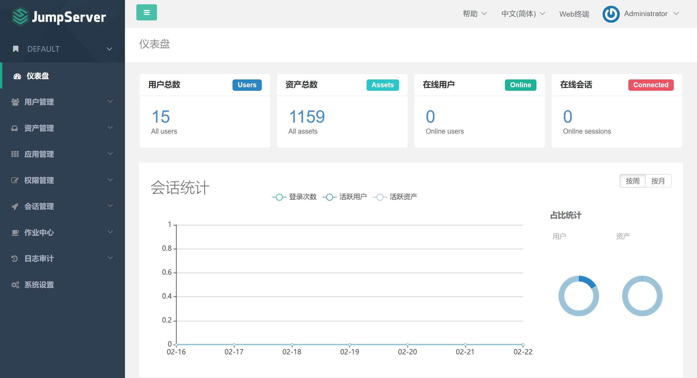

# JumperServer概览

## Over View

- 开源：零门槛，线上快速获取和安装；
- 分布式：轻松支持大规模并发访问；
- 无插件：仅需浏览器，极致的 Web Terminal 使用体验；
- 多云支持：一套系统，同时管理不同云上面的资产；
- 云端存储：审计录像云端存储，永不丢失；
- 多租户：一套系统，多个子公司和部门同时使用；
- 多应用支持：数据库，Windows远程应用，Kubernetes。

## Function List

注：带有 X-Pack 标识的功能为 JumpServer                堡垒机企业版功能。

| 身份验证                                    Authentication   |                           登录认证                           | 资源统一登录和认证；LDAP / AD 认证；RADIUS 认证；实现单点登录（OpenID 认证、CAS 认证）；SSO                                        对接；扫码登录（企业微信认证、钉钉认证和飞书认证）； |
| ------------------------------------------------------------ | :----------------------------------------------------------: | :----------------------------------------------------------: |
| 多因⼦认证                                                   |            MFA 二次认证（Google Authenticator）；            |                                                              |
| RADIUS 二次认证；短信（阿里云、腾讯云）二次认证；X-Pack      |                                                              |                                                              |
| 登录复核                                                     |   用户登录 JumpServer 系统行为受管理员的监管与控制；X-Pack   |                                                              |
| 登录限制                                                     |      用户登录来源 IP 受管理员控制（支持黑 / 白名单）；       |                                                              |
| 授权控制                                    Authorization    |                          多维度授权                          | 可对用户、用户组、资产、资产节点、应用以及系统用户进行授权； |
| 资产授权                                                     | 资产树以树状结构进行展示；资产和节点均可灵活授权；节点内资产自动继承授权；子节点自动继承父节点授权； |                                                              |
| 数据库授权                                                   |                  支持 MySQL数据库应用授权；                  |                                                              |
| 支持 Oracle、PostgreSQL、MariaDB 数据库应用授权；X-Pack      |                                                              |                                                              |
| 应用授权                                                     |                  实现更细粒度的应用级授权；                  |                                                              |
| Kubernetes 授权                                              |        支持用户通过 JumpServer 连接 Kubernetes 集群；        |                                                              |
| RemoteApp 远程应用                                           | 针对 Windows 系统实现更细粒度的应用级授权，并对应用操作录像进行回放审计；X-Pack |                                                              |
| 动作授权                                                     | 实现对授权资产的文件上传、下载以及连接动作的控制；支持剪切板复制 / 粘贴（Windows 资产）； |                                                              |
| 时间授权                                                     |               实现对授权资源使用时间段的限制；               |                                                              |
| 特权指令                                                     |             实现对特权指令的使用，支持黑白名单；             |                                                              |
| 命令过滤                                                     |           实现对授权系统用户所执行的命令进行控制；           |                                                              |
| 文件传输与管理                                               |     支持 SFTP 文件上传 / 下载；支持 Web SFTP 文件管理；      |                                                              |
| 工单管理                                                     | 支持对用户登录请求行为进行控制；支持授权工单申请；支持二级审批流程；X-Pack |                                                              |
| 组织管理                                                     |        实现多租户管理与权限隔离；全局组织功能；X-Pack        |                                                              |
| 访问控制                                                     |   支持对通过 SSH 和 Telnet 协议登录的资产进行复核；X-Pack    |                                                              |
| 账号管理                                    Accounting       |                         集中账号管理                         |           系统用户管理（包含普通用户和特权用户）；           |
| ⽤户⻆⾊                                                     |        支持超级管理员、超级审计员、普通用户三种角色；        |                                                              |
| 支持超级管理员、超级审计员、组织管理员、组织审计员、普通用户五种角色；X-Pack |                                                              |                                                              |
| 统⼀密码管理                                                 |   资产密码托管；⾃动⽣成密码；密码自动推送；密码过期设置；   |                                                              |
| 改密计划                                                     | 资产和数据库定期批量修改密码；生成随机密码；多种密码策略；X-Pack |                                                              |
| 多云资产纳管                                                 |           对私有云、公有云资产⾃动统⼀纳管；X-Pack           |                                                              |
| 收集⽤户                                                     |              ⾃定义任务定期收集主机⽤户；X-Pack              |                                                              |
| 账号管理                                                     |  统⼀对资产主机的⽤户密码进行查看、更新、测试等操作；X-Pack  |                                                              |
| 安全审计                                    Auditing         |                           登录审计                           | 支持对用户登录到 JumpServer 系统的日志进行审计；支持将审计信息收集至 Syslog； |
| 操作审计                                                     |                      用户操作行为审计；                      |                                                              |
| 会话审计                                                     |  ⽀持在线会话内容审计；历史会话内容审计；支持会话水印信息；  |                                                              |
| 录像审计                                                     | 支持对 Linux、Windows 等资产操作的录像进行回放审计；支持对 RemoteApp X-Pack、MySQL、Kubernetes                                        等应用操作的录像进行回放审计；支持将录像上传至公有云； |                                                              |
| 指令审计                                                     |     支持对资产和应用等操作的命令进⾏审计；高危命令告警；     |                                                              |
| ⽂件传输审计                                                 |            ⽀持对⽂件的上传 / 下载记录进⾏审计；             |                                                              |
| 实时监控                                                     | 支持管理员 / 审计员实时监控用户的操作行为，并可进行实时中断，以提升用户操作的安全性； |                                                              |

## Environment Requirement

| OS Version    | Linux Kerner | Soft Requirement                      |
| ------------- | ------------ | ------------------------------------- |
| Linux Release | >= 4.0       | wget curl tar gettext iptables python |

[^硬件配置：]:   操作系统centos 7.8  Python = 3.6.x  Mysql Server ≥ 5.6  Mariadb Server ≥ 5.5.56  Redis

## Databases

| DB      | Version |      | Cache | Version |                      |
| ------- | ------- | ---- | ----- | ------- | -------------------- |
| MySQL   | >= 5.7  |      | Redis | >= 5.0  | MySql和Mariadb二选一 |
| MariaDB | >= 10.2 |      |       |         | MySql和Mariadb二选一 |
| Redis   |         |      |       |         | 缓存功能             |

