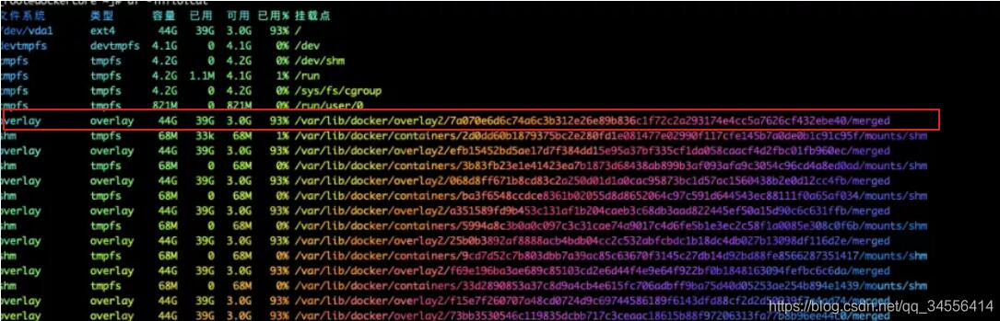
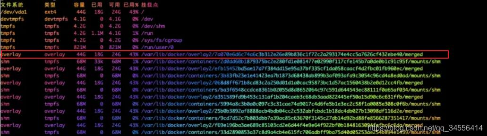

# Docker 清理环境操作

**开始清理，需要慎重！**

列出无用的卷

> docker volume ls -qf dangling=true

清理无用的卷

> docker volume rm $(docker volume ls -qf dangling=true)

清理无用的镜像

> docker rmi $(docker images | grep '^\<none\>' | awk '{print $3}')

继续清理

> docker system prune
>
> docker volume prune

以上足够使用，其他命令不要知道了！

**补充知识：****Docker 一文教你清理docker空间释放磁盘空间**

**如何清理docker目录**

docker 目录已经占满系统盘，又不好迁移，问下有没有快捷的解决方案，答案是有的。以下是我整理的经典案列，适合生产以及测试使用。编写清理docker 日志脚本如下：

```
[root@www ~]# cat clean_docker_log_space.log 
#!/bin/bash
docker_log_files=$(find /var/lib/docker/containers/ -name '*-json.log')
docker_logs_size=$(find /var/lib/docker/containers/ -name '*-json.log' | xargs du -sc | tail -1 |awk '{print $1,"K"}')
free -h && sync && echo 1 > /proc/sys/vm/drop_caches  #释放系统缓存
 
echo -e "\033[32mThe docker log total size is $docker_logs_size\033[0m"
 
for log in $docker_log_files
  do
   echo "Now is cleaning docker log,docker core logs:$log"
    cat /dev/null > $log
    systemctl reload docker #加载docker服务，不影响已经docker
  done 
 
free -h
```

运行结果如下：

```
[root@www ~]# ./clean_docker_log_space.log 
       total    used    free   shared buff/cache  available
Mem:      976M    598M    112M    6.8M    264M    157M
Swap:     511M     66M    445M
The docker log total size is 80 K
Now is cleaning docker log,docker core logs:/var/lib/docker/containers/7538f077348e3c9722fb90ed4b0a5c3d60d72112e989526767c63d55f5a76f3e/7538f077348e3c9722fb90ed4b0a5c3d60d72112e989526767c63d55f5a76f3e-json.log
Now is cleaning docker log,docker core logs:/var/lib/docker/containers/235d20190027e757a203f1b4d4093335fb92ba515f7a501448c36c1332c622a2/235d20190027e757a203f1b4d4093335fb92ba515f7a501448c36c1332c622a2-json.log
Now is cleaning docker log,docker core logs:/var/lib/docker/containers/685a7af447ce884de1e9bbeb5d4ca0ca99860096f71c33b4f9a4d15a427c5e00/685a7af447ce884de1e9bbeb5d4ca0ca99860096f71c33b4f9a4d15a427c5e00-json.log
       total    used    free   shared buff/cache  available
Mem:      976M    599M    176M    6.8M    200M    168M
Swap:     511M     66M    445M
 
[root@www ~]# find /var/lib/docker/containers/ -name '*-json.log' | xargs du -sc | tail -1 |awk '{print $1,"K"}'
0 K
```

建议把脚本加Linux 定时任务里面每周清理一次，这个就可以保证docker 不产生而外的日志文件。


**生产环境如下所示**

df -TH docker 使用系统磁盘的93%



执行脚本 clean_docker_log_space.log ，执行清理脚本之后df -TH，docker 使用系统磁盘的43%



**docker部署建议**

最后建议大家在部署docker 的应用建议在docker自定义配置目录

```
#首先，挂载容量的磁盘，挂载目录选择/data
[root@www ~]# mkdir -p /data
#停止docker
[root@www ~]# systemctl stop docker
 
#将数据移到新目录
[root@www ~]# mv /var/lib/docker /data
#修改配置,增加 --graph /data
[root@www ~]# vim /usr/lib/systemd/system/docker.service
ExecStart=/usr/bin/dockerd -H fd:// --containerd=/run/containerd/containerd.sock --graph /data 
 
[root@www ~]# systemctl daemon-reload
[root@www ~]# systemctl start docker 
[root@www ~]# systemctl enable docker.service 
Created symlink from /etc/systemd/system/multi-user.target.wants/docker.service to /usr/lib/systemd/system/docker.service.
 
```

