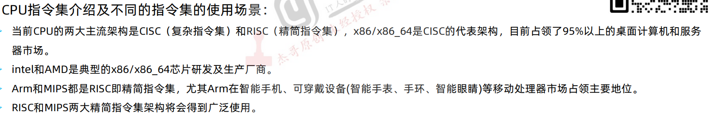
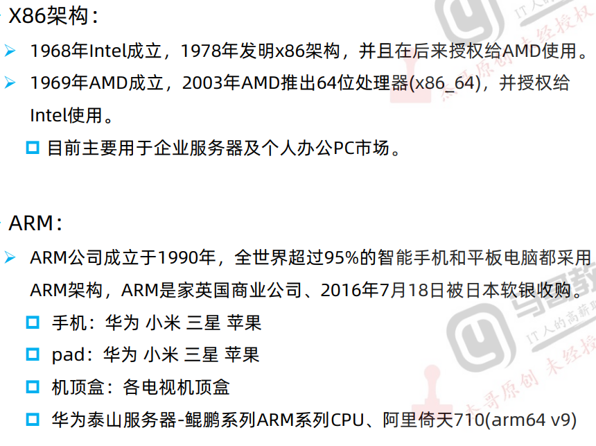
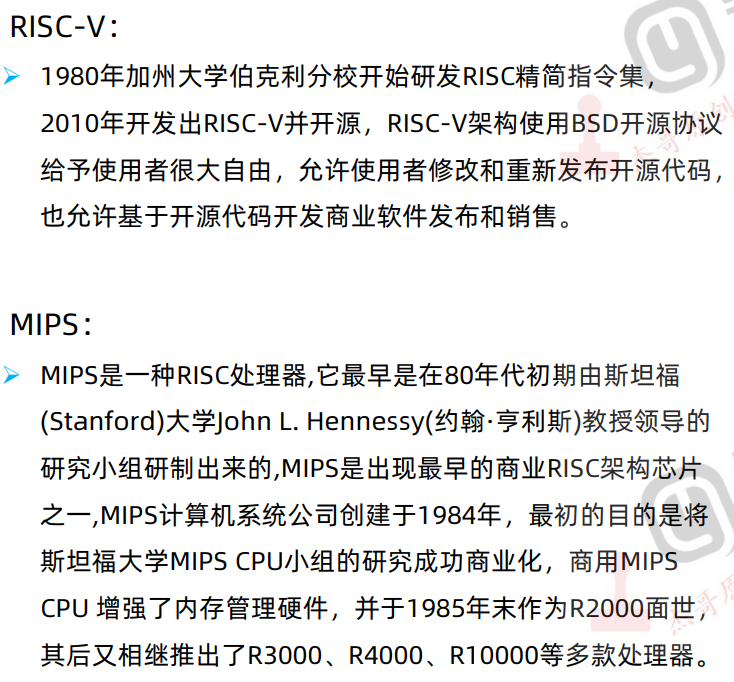
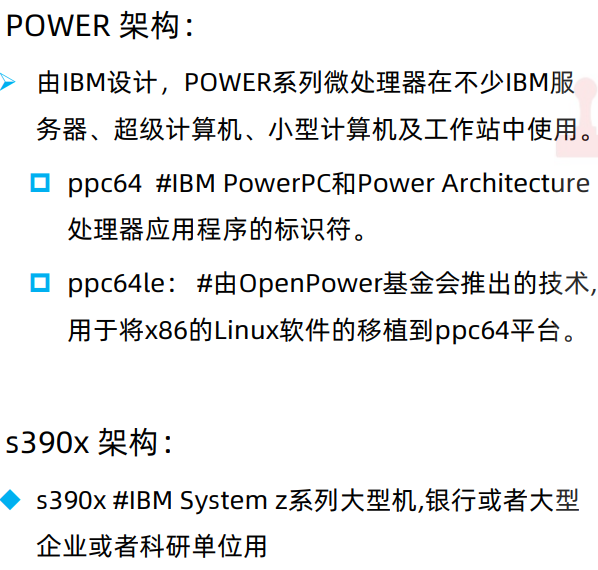
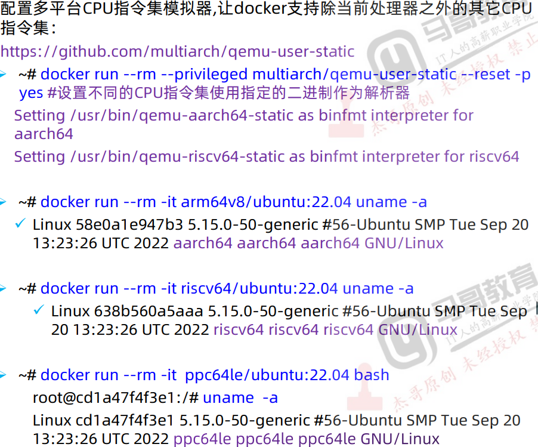
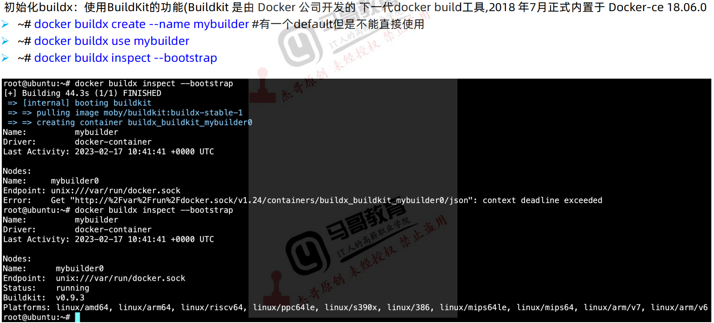
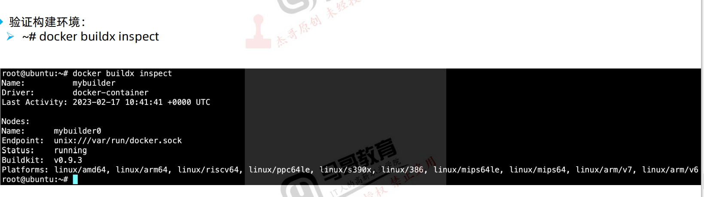
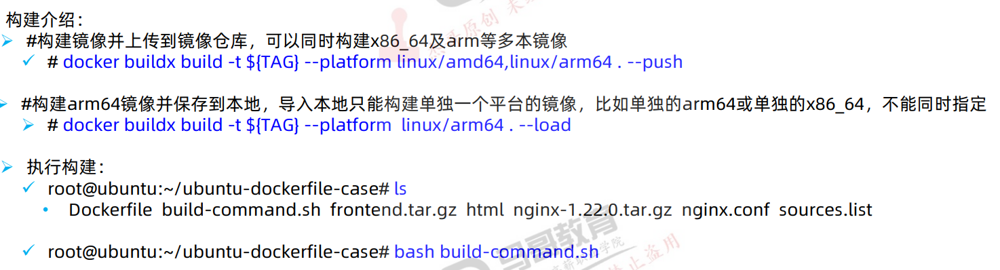

# 一次构建出x86及arm镜像

## CPU指令集介绍及不同的指令集的使用场景












## 镜像构建基础环境及不同CPU指令集实现环境准备

### 安装Docker

```bash
curl -sSL get-docker.geekery.cn | bash
```

### 安装CPU指令集模拟平台

```bash
qemu-user-static: 是一个可以在当前操作系统来运行其他架构的一个仿真器，可以通过x86的机器编译出其他不同架构的docker镜像
binfmt-support: 解析不同系统的二进制文件给内核运行，再将执行结果给用户进程
```








## 同时构建x86_64及ARM平台容器镜像




## 在x86上交叉编译ARM版本的开发环境构建

> 要注意必须使用正确的底包镜像
>
> - arm32v7/ubuntu:22.04
> - arm64v8/ubuntu:16.04 

```bash
# 64位的：
docker run -it --rm -v /usr/bin/qemu-aarch64-static:/usr/bin/qemu-aarch64-static arm64v8/ubuntu:16.04 bash

# 32位的：
docker run -it --rm -v /usr/bin/qemu-arm-static:/usr/bin/qemu-arm-static arm32v7/ubuntu:22.04 bash
```


