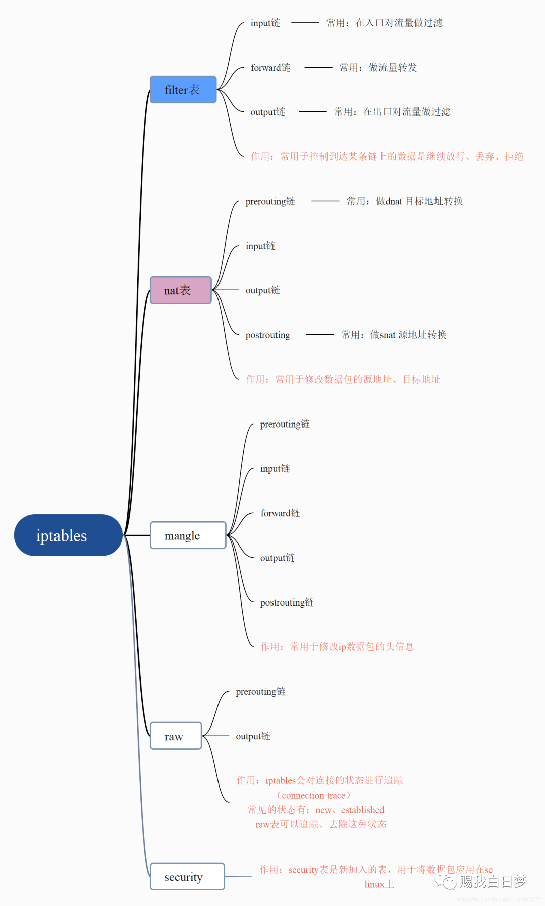
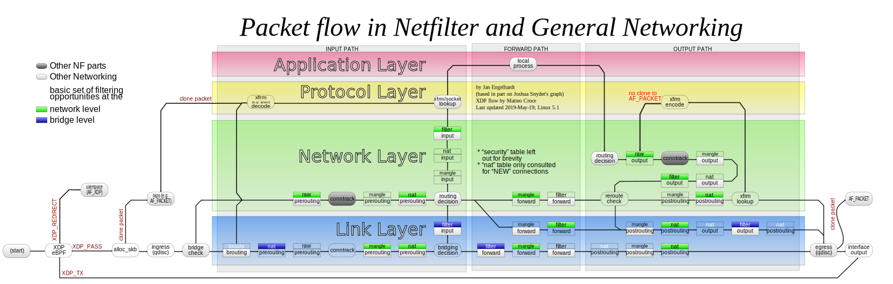
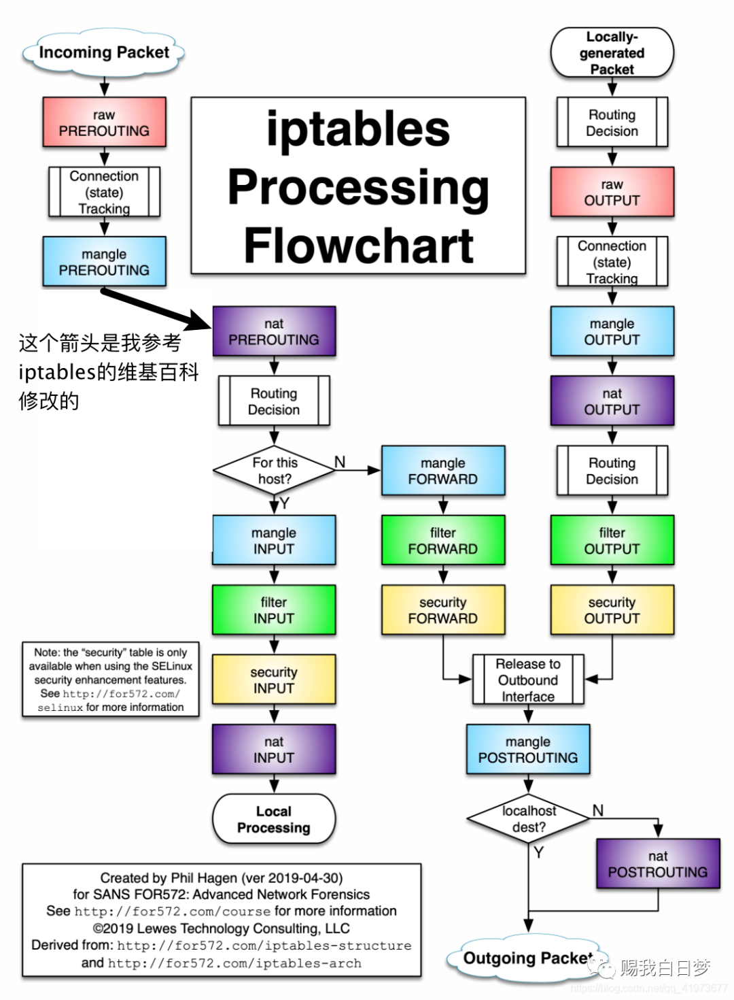
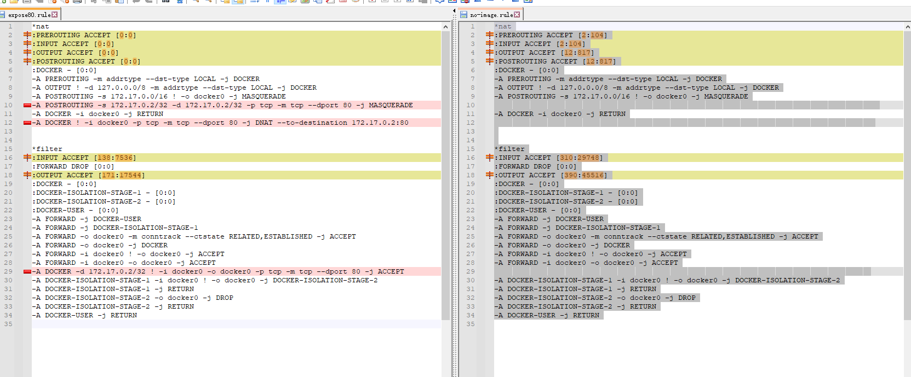

# 手撕Docker网络

> docker网络使用的是iptables实现
>
> docker0是个网桥
>
> veth-pair技术绑定和跨越netns

# 前提

> 本文并非小白所看懂的,有一定的门槛，如果不熟悉以下的前提，你可能看不懂本文，如果有什么困难请巩固基础，前提如下：

- 熟练使用iptables基本模块
- 熟练使用docker命令
- 熟练使用基本的docker网络
- 懂基本的docker网络
- 对net - namespace有一定的了解

# 本文内容不包括

- veth - pair 技术
- docker0网桥是啥
- docker网络是啥
- docker存储技术
- docker计算资源
- docker应用

# 本文内容仅包括

- 手撕iptables让一个docker容器上网，解释和说明为什么这样做。

# 什么是iptables

简单的说就是：iptables 是一个简单、灵活、实用的命令行工具，可以用来配置、控制 linux 防火墙。

## iptables的五表五链及流量走向

iptables中总共有4张表还有5条链，我们可以在链上加不同的规则。

五张表：filter表、nat表、mangle表、raw表、security表

五条链：prerouting、input、output、forward、postrouting



摘自iptables的wiki百科中的图



我知道很多人都看不懂，没关系，大家只要关注图中的蓝色部分：流量大走向如下：

`raw prerouting` -> `conntrack` -> `mangle prerouting` -> `nat prerouting` - >`decision 路由选择` -> 可能是input，也可能是output。




这并不复杂。但是在这想该怎么办之前，我们得先搞清楚，通常情况下我们会对流量做那些控制？无非如下：

1. 丢弃来自xxx的流量
2. 丢弃去往xxx的流量
3. 只接收来自xxx的流量
4. 在刚流量流入时，将目标地址改写成其他地址
5. 在流量即将流出前，将源地址改写成其他地址
6. 将发往A的数据包，转发给B

等等等等，如果你足够敏感，你就能发现，上面这六条干预策略，`filter`、`nat`这两张表已经完全能满足我们的需求了，我们只需要在这两张表的不同链上加自己的规则就行，如下：

1. 丢弃来自xxx的流量（`filter表INPUT链`）
2. 丢弃去往xxx的流量（`filter表OUTPUT链`）
3. 只接收来自xxx的流量（`filter表INPUT链`）
4. 在刚流量流入时，将目标地址改写成其他地址（`nat表prerouting链`）
5. 在流量即将流出前，将源地址改写成其他地址（`nat表postrouting链`）
6. 将发往A的数据包，转发给B（`filter表forward链`）

# docker iptables规则

## 默认的docker规则

```ini
##地址转发表nat中的规则链及默认
*nat
#PREROUTING规则链默认策略是ACCEPT
:PREROUTING ACCEPT [2:104]
#INPUT规则链默认策略是ACCEPT
:INPUT ACCEPT [2:104]
#OUTPUT规则链默认策略是ACCEPT
:OUTPUT ACCEPT [12:817]
#POSTROUTING规则链默认策略是ACCEPT
:POSTROUTING ACCEPT [12:817]
#DOCKER规则链默认策略是ACCEPT
:DOCKER - [0:0]
#######################在PREROUTING规则链中添加的规则###########################
##-m表示使用扩展模块进行数据包匹配，到达本机的数据包，如果目标地址类型是本地局域网，则指定到DOCKER链
-A PREROUTING -m addrtype --dst-type LOCAL -j DOCKER
#######################在OUTPUT规则链中添加的规则###########################
-A OUTPUT ! -d 127.0.0.0/8 -m addrtype --dst-type LOCAL -j DOCKER
#######################在POSTROUTING规则链中添加的规则###########################
##这条规则是为了使容器和外部网络通信
#将源地址为172.17.0.0/16的包（也就是从Docker容器产生的包），并且不是从docker0网卡发出的
#进行源地址转换，转换成主机网卡的地址。限制了容器实例的IP范围，这是为了区分Docker宿主机上有多个bridge网络的情况。
-A POSTROUTING -s 172.17.0.0/16 ! -o docker0 -j MASQUERADE
############################在DOCKER规则链中添加的规则###########################
#由docker0接口输入的数据包，返回到调用链；-i指定了要处理来自哪个接口的数据包
-A DOCKER -i docker0 -j RETURN


###############################################################################
##规则表中的链及默认策略
*filter
:INPUT ACCEPT [310:29748]
:FORWARD DROP [0:0]
:OUTPUT ACCEPT [390:45516]
:DOCKER - [0:0]
:DOCKER-ISOLATION-STAGE-1 - [0:0]
:DOCKER-ISOLATION-STAGE-2 - [0:0]
:DOCKER-USER - [0:0]
############################在FORWARD规则链中添加的规则###########################
##数据包全部指定到DOCKER-USER链 # DOCKER-USER 为空
-A FORWARD -j DOCKER-USER
##数据包全部指定到DOCKER-ISOLATION-STAGE-1链
-A FORWARD -j DOCKER-ISOLATION-STAGE-1
## 状态
-A FORWARD -o docker0 -m conntrack --ctstate RELATED,ESTABLISHED -j ACCEPT
##由docker0接口输出的数据包，指定到DOCKER链
-A FORWARD -o docker0 -j DOCKER
##由docker0接口输入的数据包，且不是由docker0接口输出的数据包，允许通过
-A FORWARD -i docker0 ! -o docker0 -j ACCEPT
##由docker0接口输入的数据包，且由docker0接口输出的数据包，允许通过
-A FORWARD -i docker0 -o docker0 -j ACCEPT
####################在DOCKER-ISOLATION-STAGE-1规则链中添加的规则#################
##由docker0接口输入的数据包，且不是由docker0接口输出的数据包，指定到DOCKER-ISOLATION-STAGE-2链
##也就是要处理来自docker0的数据包，但是不是由docker0输出的数据包
-A DOCKER-ISOLATION-STAGE-1 -i docker0 ! -o docker0 -j DOCKER-ISOLATION-STAGE-2
##数据包直接返回到调用链
-A DOCKER-ISOLATION-STAGE-1 -j RETURN
####################在DOCKER-ISOLATION-STAGE-2规则链中添加的规则#################
##由docker0接口输出的数据包，丢弃掉
-A DOCKER-ISOLATION-STAGE-2 -o docker0 -j DROP
##数据包直接返回到调用链
-A DOCKER-ISOLATION-STAGE-2 -j RETURN
############################在DOCKER-USER规则链中添加的规则###########################
##直接返回到调用链
-A DOCKER-USER -j RETURN

```

**Docker的DOCKER链**

仅处理从宿主机到docker0的IP数据包。

 **Docker的DOCKER-ISOLATION链（隔离在不同的bridge网络之间的通信）**

可以看到，为了隔离在不同的bridge网络之间的通信，Docker提供了两个DOCKER-ISOLATION实现。

DOCKER-ISOLATION-STAGE-1链过滤源地址是bridge网络（默认docker0）的数据包，匹配的数据包再进入DOCKER-ISOLATION-STAGE-2链处理；

不匹配就返回到父链FORWARD。

在DOCKER-ISOLATION-STAGE-2链中，进一步处理目的地址是bridge网络(默认是docker0)的数据包，匹配的数据包表示该数据包是从一个bridge网络的网桥发出，到另一个bridge网络的网桥，这样的数据包来自其他bridge网络，将被直接DROP；

不匹配的数据包就返回到父链FORWARD继续进行后续处理。

Docker的DOCKER-USER链**

Docker启动时，会加载DOCKER链和DOCKER-ISOLATION（现在是DOCKER-ISOLATION-STAGE-1）链中的过滤规则，并使之生效。绝对禁止修改这里的过滤规则。

如果用户要补充Docker的过滤规则，强烈建议追加到DOCKER-USER链。

DOCKER-USER链中的过滤规则，将先于Docker默认创建的规则被加载（在上面的规则一览中，DOCKER_USER链被最早APPEND到规则链中），从而能够覆盖Docker在DOCKER链和DOCKER-ISOLATION链中的默认过滤规则。

例如，Docker启动后，默认任何外部source IP都被允许转发，从而能够从该source IP连接到宿主机上的任何Docker容器实例。如果只允许一个指定的IP访问容器实例，可以插入路由规则到DOCKER-USER链中，从而能够在DOCKER链之前被加载。


## 当我暴露一个端口

```ini
*nat
:PREROUTING ACCEPT [0:0]
:INPUT ACCEPT [0:0]
:OUTPUT ACCEPT [0:0]
:POSTROUTING ACCEPT [0:0]
:DOCKER - [0:0]
-A PREROUTING -m addrtype --dst-type LOCAL -j DOCKER
-A OUTPUT ! -d 127.0.0.0/8 -m addrtype --dst-type LOCAL -j DOCKER
-A POSTROUTING -s 172.17.0.0/16 ! -o docker0 -j MASQUERADE
-A POSTROUTING -s 172.17.0.2/32 -d 172.17.0.2/32 -p tcp -m tcp --dport 80 -j MASQUERADE
-A DOCKER -i docker0 -j RETURN
-A DOCKER ! -i docker0 -p tcp -m tcp --dport 80 -j DNAT --to-destination 172.17.0.2:80


*filter
:INPUT ACCEPT [138:7536]
:FORWARD DROP [0:0]
:OUTPUT ACCEPT [171:17544]
:DOCKER - [0:0]
:DOCKER-ISOLATION-STAGE-1 - [0:0]
:DOCKER-ISOLATION-STAGE-2 - [0:0]
:DOCKER-USER - [0:0]
-A FORWARD -j DOCKER-USER
-A FORWARD -j DOCKER-ISOLATION-STAGE-1
-A FORWARD -o docker0 -m conntrack --ctstate RELATED,ESTABLISHED -j ACCEPT
-A FORWARD -o docker0 -j DOCKER
-A FORWARD -i docker0 ! -o docker0 -j ACCEPT
-A FORWARD -i docker0 -o docker0 -j ACCEPT
-A DOCKER -d 172.17.0.2/32 ! -i docker0 -o docker0 -p tcp -m tcp --dport 80 -j ACCEPT
-A DOCKER-ISOLATION-STAGE-1 -i docker0 ! -o docker0 -j DOCKER-ISOLATION-STAGE-2
-A DOCKER-ISOLATION-STAGE-1 -j RETURN
-A DOCKER-ISOLATION-STAGE-2 -o docker0 -j DROP
-A DOCKER-ISOLATION-STAGE-2 -j RETURN
-A DOCKER-USER -j RETURN


```

## diff



我们会发现增加了3条规则

```bash
*nat
# PREROUTING
# DNAT 进入规则链进行改包dst 为目标地址
-A DOCKER ! -i docker0 -p tcp -m tcp --dport 80 -j DNAT --to-destination 172.17.0.2:80
#  80端口 MASQUERADE转换, SNAT
-A POSTROUTING -s 172.17.0.2/32 -d 172.17.0.2/32 -p tcp -m tcp --dport 80 -j MASQUERADE

*filter
# 默认转发规则会自动丢弃
:FORWARD DROP [0:0]
# 若符合条件就让他转发， 
-A DOCKER -d 172.17.0.2/32 ! -i docker0 -o docker0 -p tcp -m tcp --dport 80 -j ACCEPT
```


# 解释netns

Linux 网络命名空间

Linux 命名空间 是 Docker 实现容器使用的底层技术之一，命名空间中有一种称为 网络命名空间 ，可用来实现容器间的网络隔离。

什么是网络命名空间，按照官方文档的说法：
1

    A network namespace is logically another copy of the network stack, with its own routes, firewall rules, and network devices.

2

    Network namespaces provide isolation of the system resources associated with networking: network devices, IPv4 and IPv6 protocol stacks, IP routing tables, firewall rules, the /proc/net directory (which is a symbolic link to /proc/PID/net), the
    /sys/class/net directory, various files under /proc/sys/net, port numbers (sockets), and so on.

简单可以理解为系统刚启动时只有一个全局的网络命名空间，这个命名空间包含网络协议栈，网络接口，路由表，防火墙规则，以及一些网络配置等。

系统提供了 ip netns 命令可以用来添加新的网络命名空间。

初始时，没有其他的网络命名空间：

    root@ubuntu21:~# ip netns ls

我们现在来用 ip netns add 创建一个名为 netns0 的网络命名空间：

    root@ubuntu21:~# ip netns add netns0
    root@ubuntu21:~# ip netns ls
    netns0

接着用 ip netns exec 命令在这个网络命名空间执行一些命令看下这个网络命名空间有什么东西：

   

    root@ubuntu21:~# ip netns exec netns0 ip link
    1: lo: <LOOPBACK> mtu 65536 qdisc noop state DOWN mode DEFAULT group default qlen 1000
        link/loopback 00:00:00:00:00:00 brd 00:00:00:00:00:00
        
    root@ubuntu21:~# ip netns exec netns0 ip route
    Error: ipv4: FIB table does not exist.
    Dump terminated
    
    root@ubuntu21:~# ip netns exec netns0 iptables -L
    Chain INPUT (policy ACCEPT)
    target     prot opt source               destination         
    
    Chain FORWARD (policy ACCEPT)
    target     prot opt source               destination         
    
    Chain OUTPUT (policy ACCEPT)
    target     prot opt source               destination      

可以看到这个命名空间

    只有一个环回接口 lo。
    路由表为空【将换回接口 lo up 后可以看到】。
    iptables 规则为空。

与我们的全局网络命名空间完全不一样！

如下图所示：
在这里插入图片描述
上图中的根网络命名空间就是我们主机上的全局网络空间，有两个网口 lo 和 eth0，一套路由表和 iptables 规则。右边就是我们刚创建的 netns0 网络命名空间。

是不是很神奇？将网络命名空间和一个进程关联后，这个进程就拥有自己的网口，路由表，iptables 规则等，就像一个独立的系统一样，是不是我们就可以将它称为一个容器了？！没错，就是这样子！
将容器连接到主机

现在这个容器只有一个环回接口 lo，无法与主机通信，多没意思，我们来给它加一个网口。

先来创建一对虚拟以太网口【veth】：


    root@ubuntu21:~# ip link add veth0 type veth peer name ceth0
    root@ubuntu21:~# ip link ls
    1: lo: <LOOPBACK,UP,LOWER_UP> mtu 65536 qdisc noqueue state UNKNOWN mode DEFAULT group default qlen 1000
        link/loopback 00:00:00:00:00:00 brd 00:00:00:00:00:00
    ...
    7: ceth0@veth0: <BROADCAST,MULTICAST,M-DOWN> mtu 1500 qdisc noop state DOWN mode DEFAULT group default qlen 1000
        link/ether ee:91:1e:b9:0d:7c brd ff:ff:ff:ff:ff:ff
    8: veth0@ceth0: <BROADCAST,MULTICAST,M-DOWN> mtu 1500 qdisc noop state DOWN mode DEFAULT group default qlen 1000
        link/ether 7e:c4:14:4d:71:b9 brd ff:ff:ff:ff:ff:ff

创建的这对虚拟网口 veth0 和 ceth0 在根网络命名空间。这对虚拟网口简单来说就是发往 veth0 的数据包会从 ceth0 收到，反之亦然。

接下来我们将 ceth0 放到容器的命名空间中：


    root@ubuntu21:~# ip link set ceth0 netns netns0
    root@ubuntu21:~# ip link
    1: lo: <LOOPBACK,UP,LOWER_UP> mtu 65536 qdisc noqueue state UNKNOWN mode DEFAULT group default qlen 1000
        link/loopback 00:00:00:00:00:00 brd 00:00:00:00:00:00
    ...
    8: veth0@if7: <BROADCAST,MULTICAST> mtu 1500 qdisc noop state DOWN mode DEFAULT group default qlen 1000
        link/ether 7e:c4:14:4d:71:b9 brd ff:ff:ff:ff:ff:ff link-netns netns0
    root@ubuntu21:~# ip netns exec netns0 ip link ls
    1: lo: <LOOPBACK> mtu 65536 qdisc noop state DOWN mode DEFAULT group default qlen 1000
        link/loopback 00:00:00:00:00:00 brd 00:00:00:00:00:00
    7: ceth0@if8: <BROADCAST,MULTICAST> mtu 1500 qdisc noop state DOWN mode DEFAULT group default qlen 1000
        link/ether ee:91:1e:b9:0d:7c brd ff:ff:ff:ff:ff:ff link-netnsid 0

可以看到根命名空间少了网口 ceth0 ，容器内多了一个网口 ceth0。

然后我们给 veth0 配上 172.18.0.11/16 地址，给容器内的 ceth0 配上 172.18.0.10/16 地址：

    root@ubuntu21:~# ip link set veth0 up
    root@ubuntu21:~# ip addr add 172.18.0.11/16 dev veth0
    
    root@ubuntu21:~# ip netns exec netns0 ip link set lo up
    root@ubuntu21:~# ip netns exec netns0 ip link set ceth0 up
    root@ubuntu21:~# ip netns exec netns0 addr add 172.18.0.10/16 dev ceth0

这样主机和容器之间就可以互 ping 了：

    root@ubuntu21:~# ip netns exec netns0 ping 172.18.0.11
    PING 172.18.0.11 (172.18.0.11) 56(84) bytes of data.
    64 bytes from 172.18.0.11: icmp_seq=1 ttl=64 time=0.186 ms
    64 bytes from 172.18.0.11: icmp_seq=2 ttl=64 time=0.089 ms
    64 bytes from 172.18.0.11: icmp_seq=3 ttl=64 time=0.086 ms
    ^C
    --- 172.18.0.11 ping statistics ---
    3 packets transmitted, 3 received, 0% packet loss, time 2046ms
    rtt min/avg/max/mdev = 0.086/0.120/0.186/0.046 ms


​    
    root@ubuntu21:~# ping 172.18.0.10
    PING 172.18.0.10 (172.18.0.10) 56(84) bytes of data.
    64 bytes from 172.18.0.10: icmp_seq=1 ttl=64 time=0.070 ms
    64 bytes from 172.18.0.10: icmp_seq=2 ttl=64 time=0.078 ms
    64 bytes from 172.18.0.10: icmp_seq=3 ttl=64 time=0.070 ms
    ^C
    --- 172.18.0.10 ping statistics ---
    3 packets transmitted, 3 received, 0% packet loss, time 2053ms
    rtt min/avg/max/mdev = 0.070/0.072/0.078/0.003 ms

就是这样的情形：

在这里插入图片描述
使用网桥将多个容器连接起来

接下来我们重复上面的操作，创建另一个容器：

    ip netns add netns1
    ip link add veth1 type veth peer name ceth1
    ip link set ceth1 netns netns1
    ip link set veth1 up
    ip addr add 172.18.0.21/16 dev veth1
    
    ip netns exec netns1 ip link set lo up
    ip netns exec netns1 ip link set ceth1 up
    ip netns exec netns1 ip addr add 172.18.0.20/16 dev ceth1

此时却发现它和主机不能互 ping 成功，两个容器之间也不能互 ping 成功：

    root@ubuntu21:~# ip netns exec netns1 ping 172.18.0.21
    PING 172.18.0.21 (172.18.0.21) 56(84) bytes of data.
    ^C
    --- 172.18.0.21 ping statistics ---
    2 packets transmitted, 0 received, 100% packet loss, time 1021ms
    
    root@ubuntu21:~# ping 172.18.0.20
    PING 172.18.0.20 (172.18.0.20) 56(84) bytes of data.
    ^C
    --- 172.18.0.20 ping statistics ---
    2 packets transmitted, 0 received, 100% packet loss, time 1010ms
    
    root@ubuntu21:~# ip netns exec netns0 ping 172.18.0.20
    PING 172.18.0.20 (172.18.0.20) 56(84) bytes of data.
    ^C
    --- 172.18.0.20 ping statistics ---
    2 packets transmitted, 0 received, 100% packet loss, time 1030ms
    
    root@ubuntu21:~# ip netns exec netns1 ping 172.18.0.10
    PING 172.18.0.10 (172.18.0.10) 56(84) bytes of data.
    ^C
    --- 172.18.0.10 ping statistics ---
    2 packets transmitted, 0 received, 100% packet loss, time 1019ms

这是怎么回事？

查看主机上的路由表如下：

    172.18.0.0/16 dev veth0 proto kernel scope link src 172.18.0.11 
    172.18.0.0/16 dev veth1 proto kernel scope link src 172.18.0.21 

原来由于 veth0 和 veth1 在同一个网段，于是就有两条主机路由。
在这里插入图片描述

在 ping 172.18.0.20 时使用的是第一条路由，本来 ping 的是第二个容器，ICMP 请求却发到第一个容器了！当然 ping 不通了！

那么如何让两个容器之间可以通信呢？

因为它们在同一个网段，我们想到可以将 veth0 和 veth1 加入一个网桥，这样相当于有一个网桥将两个容器连接起来了！

于是将 veth0 和 veth1 的IP地址去掉：

    root@ubuntu21:~# ip addr del 172.18.0.11/16 dev veth0  
    root@ubuntu21:~# ip addr del 172.18.0.21/16 dev veth1  

创建一个网桥将它们加入：

    root@ubuntu21:~# ip link add br0 type bridge
    root@ubuntu21:~# ip link set br0 up
    root@ubuntu21:~# ip link set veth0 master br0
    root@ubuntu21:~# ip link set veth1 master br0

这样它们之间就能互 ping 了！

    root@ubuntu21:~# ip netns exec netns0 ping 172.18.0.20
    PING 172.18.0.20 (172.18.0.20) 56(84) bytes of data.
    64 bytes from 172.18.0.20: icmp_seq=1 ttl=64 time=0.097 ms
    64 bytes from 172.18.0.20: icmp_seq=2 ttl=64 time=0.120 ms
    ^C
    --- 172.18.0.20 ping statistics ---
    2 packets transmitted, 2 received, 0% packet loss, time 1002ms
    rtt min/avg/max/mdev = 0.097/0.108/0.120/0.011 ms
    root@ubuntu21:~# 
    root@ubuntu21:~# ip netns exec netns1 ping 172.18.0.10 
    PING 172.18.0.10 (172.18.0.10) 56(84) bytes of data.
    64 bytes from 172.18.0.10: icmp_seq=1 ttl=64 time=0.073 ms
    64 bytes from 172.18.0.10: icmp_seq=2 ttl=64 time=0.106 ms
    ^C
    --- 172.18.0.10 ping statistics ---
    2 packets transmitted, 2 received, 0% packet loss, time 1021ms
    rtt min/avg/max/mdev = 0.073/0.089/0.106/0.016 ms

就是如下的情形：
在这里插入图片描述
说明： 如果 ping 不通，使用如下的命令【我使用的是 Ubuntu 21.10，已经安装了 Docker 】

    iptables -P FORWARD ACCEPT

将 iptables filter 表 FORWARD 链默认策略改为 ACCEPT。


# 实战1

> 创建一个无端口暴露的容器，使用规则进行暴露
>
> 1、创建容器
>
> 2、找到容器ip
>
> 3、增加DNAT规则
>
> 4、允许流量转发
>
> 5、增加或不增加SNAT规则

## 环境

```bash
root@k8s-server:/home/k8s# docker images
REPOSITORY   TAG       IMAGE ID       CREATED         SIZE
nginx        latest    080ed0ed8312   2 days ago      142MB
ubuntu       latest    08d22c0ceb15   3 weeks ago     77.8MB
centos       latest    5d0da3dc9764   18 months ago   231MB
root@k8s-server:/home/k8s# docker network ls
NETWORK ID     NAME      DRIVER    SCOPE
6d1ca89f3ca6   bridge    bridge    local
a349e5ce162c   host      host      local
b9d430ff5078   none      null      local
root@k8s-server:/home/k8s# ip addr
1: lo: <LOOPBACK,UP,LOWER_UP> mtu 65536 qdisc noqueue state UNKNOWN group default qlen 1000
    link/loopback 00:00:00:00:00:00 brd 00:00:00:00:00:00
    inet 127.0.0.1/8 scope host lo
       valid_lft forever preferred_lft forever
    inet6 ::1/128 scope host
       valid_lft forever preferred_lft forever
2: ens33: <BROADCAST,MULTICAST,UP,LOWER_UP> mtu 1500 qdisc fq_codel state UP group default qlen 1000
    link/ether 00:0c:29:f5:5c:61 brd ff:ff:ff:ff:ff:ff
    inet 192.168.23.149/24 brd 192.168.23.255 scope global ens33
       valid_lft forever preferred_lft forever
    inet6 fe80::20c:29ff:fef5:5c61/64 scope link
       valid_lft forever preferred_lft forever
3: docker0: <NO-CARRIER,BROADCAST,MULTICAST,UP> mtu 1500 qdisc noqueue state DOWN group default
    link/ether 02:42:09:4f:5c:f7 brd ff:ff:ff:ff:ff:ff
    inet 172.17.0.1/16 brd 172.17.255.255 scope global docker0
       valid_lft forever preferred_lft forever
    inet6 fe80::42:9ff:fe4f:5cf7/64 scope link
       valid_lft forever preferred_lft forever
```

## 创建并找到IP地址

如下可见ip为172.17.0.2，因为默认规则的原因，可以直接访问

```bash
root@k8s-server:/home/k8s# docker run -it -d nginx
a4c75fc842e48970021d8422d2da5b36846215bc8cd69d4647cf92efb0164e34
root@k8s-server:/home/k8s# docker inspect a4 | grep -i addr
            "LinkLocalIPv6Address": "",
            "SecondaryIPAddresses": null,
            "SecondaryIPv6Addresses": null,
            "GlobalIPv6Address": "",
            "IPAddress": "172.17.0.2",
            "MacAddress": "02:42:ac:11:00:02",
                    "IPAddress": "172.17.0.2",
                    "GlobalIPv6Address": "",
                    "MacAddress": "02:42:ac:11:00:02",
root@k8s-server:/home/k8s# iptables -A DOCKER ! -i docker0 -p tcp -m tcp --dport 80 -j DNAT --to-destination 172.17.0.2:80 -t nat
root@k8s-server:/home/k8s# curl 172.17.0.2
<!DOCTYPE html>
<html>
<head>
<title>Welcome to nginx!</title>
<style>
html { color-scheme: light dark; }
body { width: 35em; margin: 0 auto;
font-family: Tahoma, Verdana, Arial, sans-serif; }
</style>
</head>
<body>
<h1>Welcome to nginx!</h1>
<p>If you see this page, the nginx web server is successfully installed and
working. Further configuration is required.</p>

<p>For online documentation and support please refer to
<a href="http://nginx.org/">nginx.org</a>.<br/>
Commercial support is available at
<a href="http://nginx.com/">nginx.com</a>.</p>

<p><em>Thank you for using nginx.</em></p>
</body>
</html>
root@k8s-server:/home/k8s#


```


## 增加DNAT规则

然后我们发现在宿主机内已经可以被访问到，但是web端并不能访问，这是因为iptables在本机访问的时候不走forward阶段，直接道道应用，所以直接访问

```bash
root@k8s-server:/home/k8s# iptables -A DOCKER ! -i docker0 -p tcp -m tcp --dport 80 -j DNAT --to-destination 172.17.0.2:80 -t nat
root@k8s-server:/home/k8s# curl 192.168.23.149
<!DOCTYPE html>
<html>
<head>
<title>Welcome to nginx!</title>
<style>
html { color-scheme: light dark; }
body { width: 35em; margin: 0 auto;
font-family: Tahoma, Verdana, Arial, sans-serif; }
</style>
</head>
<body>
<h1>Welcome to nginx!</h1>
<p>If you see this page, the nginx web server is successfully installed and
working. Further configuration is required.</p>

<p>For online documentation and support please refer to
<a href="http://nginx.org/">nginx.org</a>.<br/>
Commercial support is available at
<a href="http://nginx.com/">nginx.com</a>.</p>

<p><em>Thank you for using nginx.</em></p>
</body>
</html>


```


修改允许流量转发，

第一条规则是允许全部的流量转发，能够进行访问，但是显然这是不安全的。所以应该对符合条件的流量进行单个限制，

添加完之后，此时应该是web端已经可以访问了，但是通过抓包发现，src地址竟然是172.17.0.2，显然是不合理的

```bash
iptables -P FORWARD ACCEPT 
# 或
-A DOCKER -d 172.17.0.2/32 ! -i docker0 -o docker0 -p tcp -m tcp --dport 80 -j ACCEPT
```

增加或不增加SNAT规则

```bash
 符合要求的80端口都SNAT
-A DOCKER -d 172.17.0.2/32 ! -i docker0 -o docker0 -p tcp -m tcp --dport 80 -j ACCEPT
```

这时，容器正常被使用

# 本实验用的流量跟踪方法

```bash

iptables -A DOCKER ! -i docker0 -p tcp -m tcp --dport 80 -j DNAT --to-destination 172.17.0.2:80 -t nat
iptables -A DOCKER -d 172.17.0.2/32 ! -i docker0 -o docker0 -p tcp -m tcp --dport 80 -j ACCEPT -t filter

iptables -D DOCKER ! -i docker0 -p tcp -m tcp --dport 80 -j DNAT --to-destination 172.17.0.2:80 -t nat
iptables -D DOCKER -d 172.17.0.2/32 ! -i docker0 -o docker0 -p tcp -m tcp --dport 80 -j ACCEPT -t filter

iptables -I DOCKER -t nat  -j LOG --log-prefix "nat-DOCKER "
iptables -D DOCKER -t nat  -j LOG --log-prefix "nat-DOCKER "

iptables -I INPUT -t nat  -j LOG --log-prefix "nat-INPUT "
iptables -D INPUT -t nat  -j LOG --log-prefix "nat-INPUT "

iptables -I FORWARD -t filter  -j LOG --log-prefix "filter-FORWARD "
iptables -D FORWARD -t filter  -j LOG --log-prefix "filter-FORWARD "

iptables -I PREROUTING -t nat  -j LOG --log-prefix "nat-PREROUTING "
iptables -D PREROUTING -t nat  -j LOG --log-prefix "nat-PREROUTING "


iptables -I POSTROUTING -t nat  -j LOG --log-prefix "nat-POSTROUTING "
iptables -D POSTROUTING -t nat  -j LOG --log-prefix "nat-POSTROUTING "


iptables -I DOCKER -t filter  -j LOG --log-prefix "filter-DOCKER "
iptables -D DOCKER -t filter  -j LOG --log-prefix "filter-DOCKER "


iptables -I DOCKER-ISOLATION-STAGE-2 -t filter  -j LOG --log-prefix "filter-DOCKER-ISOLATION-STAGE-2 "
iptables -D DOCKER-ISOLATION-STAGE-2 -t filter  -j LOG --log-prefix "filter-DOCKER-ISOLATION-STAGE-2 "


iptables -P FORWARD ACCEPT
iptables -P FORWARD DROP


```

