# 把容器变成物理机

本文的主题是把容器变成物理机，根据所学的知识。以及通过各种搜索引擎。他们都告诉我们，这是不可能的。这真的是不可能的吗？我不信，那我就要创造奇迹。请继续往下看。本文将教你如何把容器变成物理机。

这里只讲硬货，不废话！！！

## 什么是容器

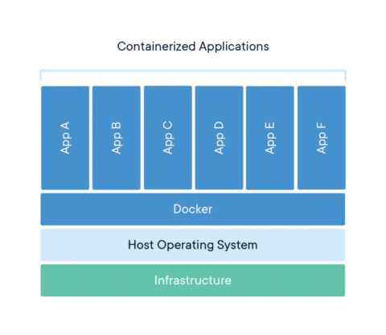

​    简单来说，容器是一个隔离的操作系统沙盒，目的是[隔离所有操作系统的进程](https://medium.com/@saschagrunert/demystifying-containers-part-i-kernel-space-2c53d6979504)，那么我们也可以称容器的名称为**被隔离的进程**，在不同维度隔离级别有6个。隔离进程的名称空间是内核提供的功能，必须内核支持才可以。也就是说容器的内核跟宿主机的是同一个内核。Docker官方把它称作集装箱，我觉得这非常的形象，他们都工作在Linux 内核这条船上。

  既然现在知道容器是个什么了，接下来要了解的是容器的运行逻辑。在用法上，一般把软件包直接放到容器内，然后在容器启动的时候，执行一个命令或者某个脚本文件，熟悉docker的人如果自己动手构建过自己的容器，就会知道CMD命令和ENTRYPOINT这个指令是定义docker的启动之后的执行逻辑。然后docker会安装启动之后的逻辑执行，若这个进程exit了，那么这个容器的运行状态也是exit状态。但是这些对我们本文的主题来讲并不重要。

  docker的资源限制是通过cgroup来实现的，但是这也是针对运行状态的容器才会有资源消耗，我们是要转化这个容器，对我们的操作而言并不重要，另外顺便提一嘴，cgroup也是Linux内核的功能。

  在空间占用方向上，通常一个容器只需要几MB到数10MB不等，而咱们操作系统都需要G这个单位去计算，这是为什么呢？后面将会说容器与操作系统共享的几个文件和目录，这个是它变小的关键。

Docker的六个维度的隔离

| 内容  | 备注                       | 内核版本 |
| ----- | -------------------------- | -------- |
| PID   | 进程编号                   | 2.6.24   |
| NET   | 网络设备、网络协议栈、端口 | 2.6.29   |
| IPC   | 信号量、消息队列、共享内存 | 2.6.19   |
| MOUNT | 文件系统                   | 2.4.19   |
| UTS   | 用户名和主机域             | 2.6.19   |
| USER  | 操作系统的用户和用户组     | 3.8.x    |


为什么容器比物理机占用空间小呢？这个问题涉及到了Linux设计架构，linus大佬在设计Linux的时候将Linux分成了rootfs，内核，vfs（虚拟文件系统）几部分，当然这又是一个巨大的话题，毕竟内核源码超过2760万行，想了解具体逻辑，这并不简单。我们需要知道，虚拟文件系统包括/proc /dev /sys /dev/pts，且不仅仅包括这些，因为过于复杂，对于容器来讲，只需要了解这几个即可。

- /sys 他是内核的接口，是一个虚拟文件系统，由内核生成。
- /proc 这个是内存和进程保存的地方，也就是物理硬件的RAM。
- /dev 这个目录里存储了物理硬件的抽象为文件。
- /dev/pts 这里面存储了一些虚拟终端

总之这些目录必须存在且由内核生成。刚刚聊到容器占用磁盘空间会比物理机小很多，根本原因是因为物理机是已经启动起来了，大部分文件在物理机种都已经包含，包括内核模块都不需要安装，这些东西对于一个已经启动了的容器来讲是完全不必要的。另外一个方面就是容器内部极度精简，所以到你们看到的时候就只有几十MB。我们今天要做的步骤就有这一步，将所有缺少了的东西全部补全。


## 什么是物理机

  相对而言，物理机抽象概念上来讲是一个完整的操作系统。包括容器内的全部内容，并且包括各种物理硬件的驱动，EFI或者bios引导，内核模块，内核源码。

  总而言之，它是一个标准，它是用来定义“**完整的系统**”。


## 容器和虚拟机机区别和联系

从用户眼里来看，它们相同的部分是都具有文件系统，都能运行应用程序。在我看来，这只是浅尝辄止罢了。

我不想用传统的眼光看待它们，又是通过运行模式啦，又是通过运行速度，又是性能损耗啦。我觉得这些都是没有太大意义的。这些比较讲了操作系统和容器出现之后的事情，而不是在创造创造这个东西之前。

我要做鲁迅笔下的勇士，不管是蜘蛛还是螃蟹，在尝之前都不知道什么味道，而不是要把尝了之后的味道从侧面告诉大家 “吃螃蟹的人比较多“，”几乎没有吃蜘蛛的人”。而我们就到**尝**这个阶段，来比较吃螃蟹和吃蜘蛛的口感，这往往是世俗之人忘记了的根本。


**让我们来重新认识操作系统吧**。


从时间发生的顺序来讲，首先你按了开机键。bios开始从主板芯片CMOS里加载。然后开始读取硬盘里的esp分区，根据grub引导，找到系统内核，开始加载内核，生成vfs文件系统，加载init进程，开机解锁。这时，完整的操作系统就可以运行了。

那么容器的启动过程呢？ docker run -it --rm alpine bash?么，不不不。首先他会将rootfs以及overlay进行叠加，放到宿主机系统的某个目录。然后调用内核api生成六个名称空间，将部分系统文件映射到容器内部（fs名称空间内），调用内核生成vfs，然后执行bash进程，这个是这条命令要干的事。

现在我将这俩进行对比，我们补全容器在启动过程中跟物理机不同的地方，这样是不是容器就能像是物理机一样运行了呢？答案是肯定的。让我们实际操作一下试试。


## 我们需要做什么

- 制作一个容纳这个容器的磁盘
  - 分区表
  - 分区类型
  - 更新fstab

- 生成rootfs，并补全缺少的目录和vfs
  - bindmount
  - /sys
  - /proc
  - /dev
  - /dev/pts
  - /etc/reslove.conf
  - hostname
  - /etc/fstab
- 补全内核
  - linux-image
  - linux-header
- 补全进程管理器
  - systemd
- 补全init进程
  - init
- 补全网络管理
  - NetworkManager
- 补全grub引导
  - grub-install
- 重启测试
  - 独立测试

## 开始干

### 制作一个容纳这个容器的磁盘

这一步我们通过VMware生成vmdk硬盘并使用DiskGenius进行分区。

#### VMware步骤：

创建一个空的虚拟机然后增加磁盘，这里我们用50G，实测1G都用不了。

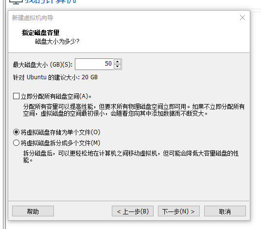

开启EFI引导

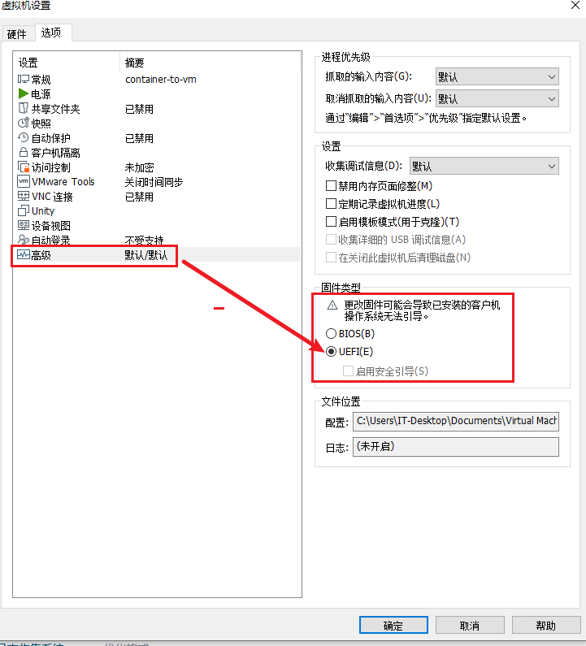


最终我的虚拟机配置是这样的。

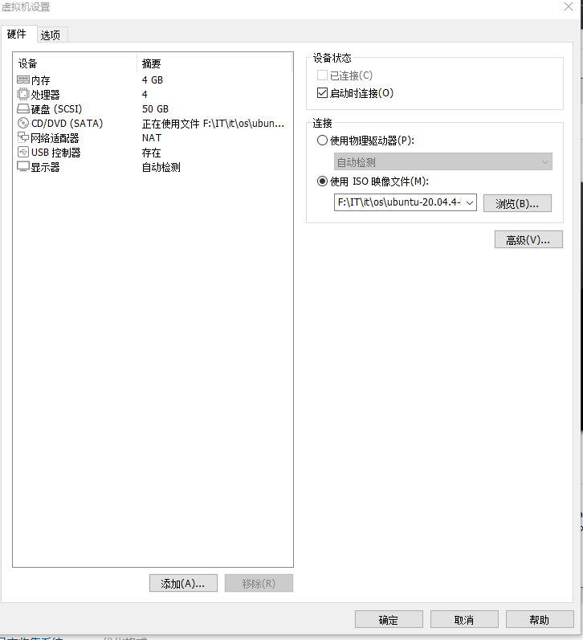


#### DiskGenius步骤

在diskgenius里面选择打开刚刚创建的vmdk文件

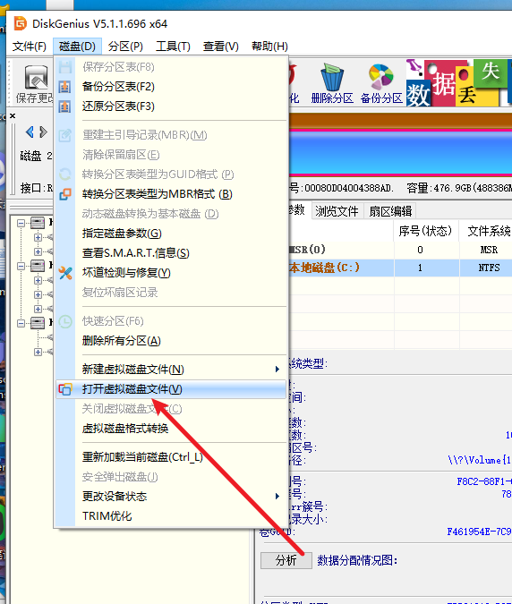

转换为GPT分区表

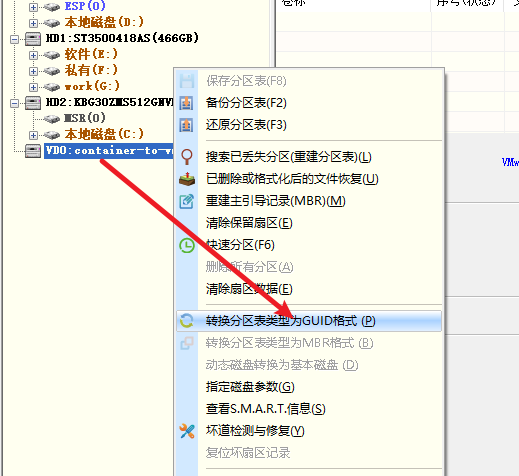

分区结果展示，我这里使用了1G的esp分区，49G的根分区

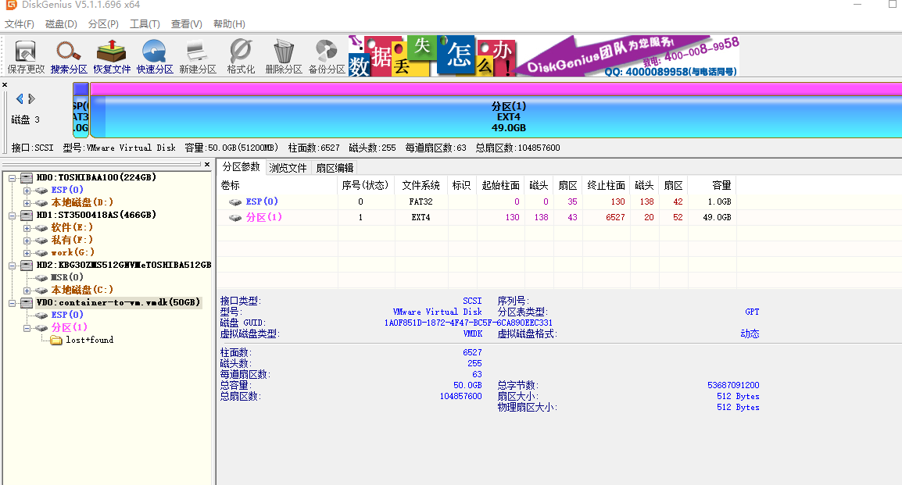

这样我们的磁盘准备工作就完成了。


### 生成rootfs

#### 回到VMware，开机使用iso镜像进行引导，进入体验模式。如下图所示。

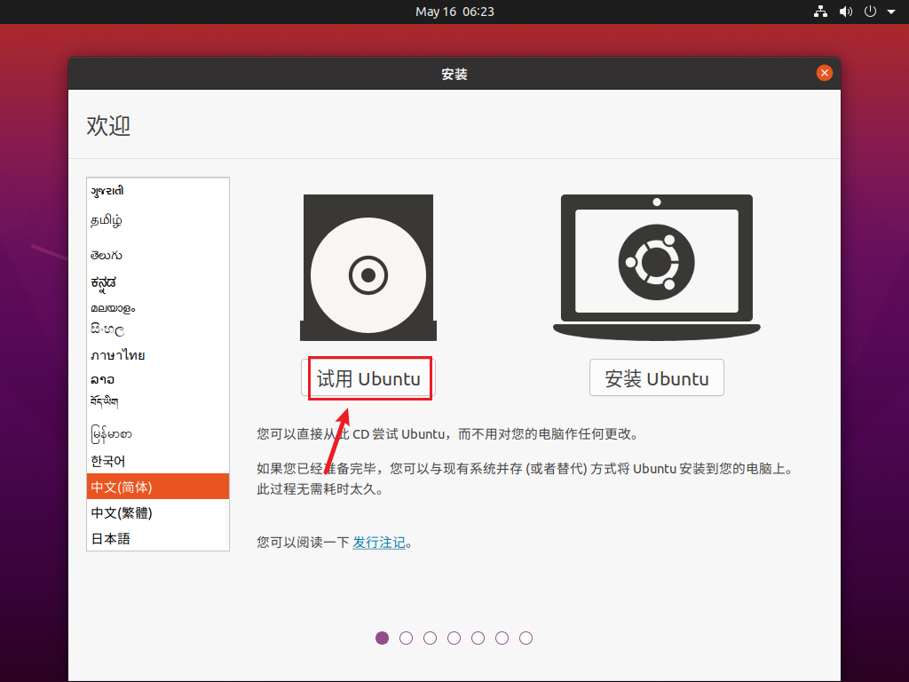


#### 安装docker

```bash
apt update
# 安装docker
apt install curl -y && curl -sSL get.docker.com | bash

```

#### 分区挂载

```bash
# 查看我们刚刚创建的硬盘分区名称
root@ubuntu:~# lsblk
NAME   MAJ:MIN RM   SIZE RO TYPE MOUNTPOINT
loop0    7:0    0   2.2G  1 loop /rofs
loop1    7:1    0     4K  1 loop /snap/bare/5
loop2    7:2    0    62M  1 loop /snap/core20/1611
loop3    7:3    0  54.2M  1 loop /snap/snap-store/558
loop4    7:4    0 346.3M  1 loop /snap/gnome-3-38-2004/115
loop5    7:5    0  91.7M  1 loop /snap/gtk-common-themes/1535
loop6    7:6    0    47M  1 loop /snap/snapd/16292
sda      8:0    0    50G  0 disk
├─sda1   8:1    0     1G  0 part
└─sda2   8:2    0    49G  0 part 
sr0     11:0    1   3.6G  0 rom  /cdrom
root@ubuntu:~# mount /dev/sda2 /mnt/
root@ubuntu:~# mkdir -pv /mnt/boot/efi
mkdir: 已创建目录 '/mnt/boot'
mkdir: 已创建目录 '/mnt/boot/efi'
root@ubuntu:~# mount /dev/sda1 /mnt/boot/efi/
root@ubuntu:~# df -h
文件系统        容量  已用  可用 已用% 挂载点
udev            1.9G     0  1.9G    0% /dev
tmpfs           389M  1.9M  388M    1% /run
/dev/sr0        3.6G  3.6G     0  100% /cdrom
/dev/loop0      2.2G  2.2G     0  100% /rofs
/cow            1.9G  776M  1.2G   40% /
tmpfs           1.9G     0  1.9G    0% /dev/shm
tmpfs           5.0M  4.0K  5.0M    1% /run/lock
tmpfs           1.9G     0  1.9G    0% /sys/fs/cgroup
tmpfs           1.9G     0  1.9G    0% /tmp
/dev/loop1      128K  128K     0  100% /snap/bare/5
/dev/loop2       62M   62M     0  100% /snap/core20/1611
/dev/loop3       55M   55M     0  100% /snap/snap-store/558
/dev/loop6       47M   47M     0  100% /snap/snapd/16292
/dev/loop5       92M   92M     0  100% /snap/gtk-common-themes/1535
/dev/loop4      347M  347M     0  100% /snap/gnome-3-38-2004/115
tmpfs           389M   60K  389M    1% /run/user/999
tmpfs           389M     0  389M    0% /run/user/0
/dev/sda2        49G   16K   46G    1% /mnt
/dev/sda1      1022M  4.0K 1022M    1% /mnt/boot/efi

```

#### 创建rootfs

使用当前最新镜像23.10

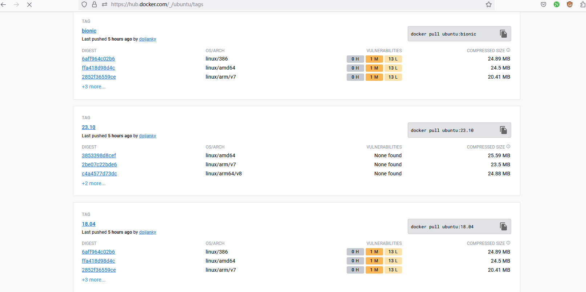


```bash
root@ubuntu:~# cd /mnt/
root@ubuntu:/mnt# docker export $(docker create ubuntu:23.10) | tar -C . -xvf -


```

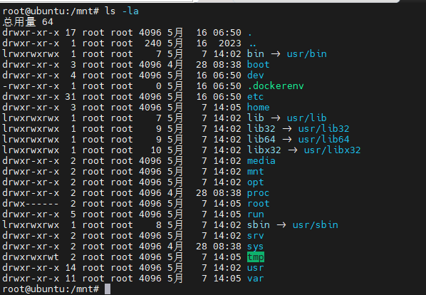


### 临时代替内核补全vfs

```bash
for i in run sys proc dev dev/shm dev/pts; do echo "mount /$i"; mount --bind /$i /mnt/$i; done
root@ubuntu:/mnt# findmnt | grep mnt
│ │ └─/run/snapd/ns/snap-store.mnt         nsfs[mnt:[4026532702]] nsfs            rw
├─/mnt                                     /dev/sda2              ext4            rw,relatime
│ ├─/mnt/boot/efi                          /dev/sda1              vfat            rw,relatime,fmask=0022,dmask=0022,codepage=437,iocharset=iso8859-1,shortname=mixed,errors=remount-ro
│ ├─/mnt/run                               tmpfs                  tmpfs           rw,nosuid,nodev,noexec,relatime,size=398272k,mode=755,inode64
│ ├─/mnt/sys                               sysfs                  sysfs           rw,nosuid,nodev,noexec,relatime
│ ├─/mnt/proc                              proc                   proc            rw,nosuid,nodev,noexec,relatime
│ └─/mnt/dev                               udev                   devtmpfs        rw,nosuid,noexec,relatime,size=1952868k,nr_inodes=488217,mode=755,inode64
│   ├─/mnt/dev/shm                         tmpfs                  tmpfs           rw,nosuid,nodev,inode64
│   └─/mnt/dev/pts                         devpts                 devpts          rw,nosuid,noexec,relatime,gid=5,mode=620,ptmxmode=000

root@ubuntu:/mnt#

```

### 进入rootfs补全系统文件

#### 使用下面的命令进入新的根分区

```bash
# chroot /mnt/
```

#### 补全DNS配置

```bash
root@ubuntu:/# echo "nameserver 8.8.8.8" > /etc/resolv.conf
```

#### 补全挂载的配置文件

```bash
root@ubuntu:/# echo "/dev/sda2 / ext4 defaults 0 1" >> /etc/fstab
root@ubuntu:/# echo "/dev/sda1 /boot/efi vfat umask=0077,shortname=winnt 0 2" >> /etc/fstab
root@ubuntu:/# cat /etc/fstab
# UNCONFIGURED FSTAB FOR BASE SYSTEM
/dev/sda2 / ext4 defaults 0 1 
/dev/sda1 /boot/efi vfat umask=0077,shortname=winnt 0 2
```

#### 安装dialog

```bash
root@ubuntu:/# apt install dialog
```


#### 安装时区

```bash
 apt install tzdata
 
 Configuring tzdata
------------------

Please select the geographic area in which you live. Subsequent configuration questions will narrow this down by presenting a list of cities, representing the time zones in which they are located.

  1. Africa  2. America  3. Antarctica  4. Arctic  5. Asia  6. Atlantic  7. Australia  8. Europe  9. Indian  10. Pacific  11. US  12. Etc
Geographic area: 5

Please select the city or region corresponding to your time zone.

  1. Aden      9. Baghdad   17. Chita       25. Dushanbe     33. Irkutsk    41. Kashgar       49. Macau         57. Omsk        65. Riyadh         73. Tashkent     81. Urumqi
  2. Almaty    10. Bahrain  18. Choibalsan  26. Famagusta    34. Istanbul   42. Kathmandu     50. Magadan       58. Oral        66. Sakhalin       74. Tbilisi      82. Ust-Nera
  3. Amman     11. Baku     19. Chongqing   27. Gaza         35. Jakarta    43. Khandyga      51. Makassar      59. Phnom_Penh  67. Samarkand      75. Tehran       83. Vientiane
  4. Anadyr    12. Bangkok  20. Colombo     28. Harbin       36. Jayapura   44. Kolkata       52. Manila        60. Pontianak   68. Seoul          76. Tel_Aviv     84. Vladivostok
  5. Aqtau     13. Barnaul  21. Damascus    29. Hebron       37. Jerusalem  45. Krasnoyarsk   53. Muscat        61. Pyongyang   69. Shanghai       77. Thimphu      85. Yakutsk
  6. Aqtobe    14. Beirut   22. Dhaka       30. Ho_Chi_Minh  38. Kabul      46. Kuala_Lumpur  54. Nicosia       62. Qatar       70. Singapore      78. Tokyo        86. Yangon
  7. Ashgabat  15. Bishkek  23. Dili        31. Hong_Kong    39. Kamchatka  47. Kuching       55. Novokuznetsk  63. Qostanay    71. Srednekolymsk  79. Tomsk        87. Yekaterinburg
  8. Atyrau    16. Brunei   24. Dubai       32. Hovd         40. Karachi    48. Kuwait        56. Novosibirsk   64. Qyzylorda   72. Taipei         80. Ulaanbaatar  88. Yerevan
Time zone: 69


Current default time zone: 'Asia/Shanghai'
Local time is now:      Tue May 16 15:12:32 CST 2023.
Universal Time is now:  Tue May 16 07:12:32 UTC 2023.
Run 'dpkg-reconfigure tzdata' if you wish to change it.

Setting up tzdata-icu (2023c-4exp1ubuntu1) ...

```

#### 安装systemd进程管理器 和 init进程

```bash
apt install systemd init

```

安装tar

```
apt install tar
```


#### 安装最新Linux内核

这时我们会看到很多的依赖包下载下来了，439M+。

安装过程种会有很多报错，需要安装其他依赖。

```bash
root@ubuntu:/# apt install linux-image-6.2.0-21-generic linux-headers-6.2.0-21-generic
Reading package lists... Done
Building dependency tree... Done
Reading state information... Done
The following additional packages will be installed:
  adduser busybox-initramfs cpio dmsetup gettext-base grub-common grub-gfxpayload-lists grub-pc grub-pc-bin grub2-common initramfs-tools initramfs-tools-bin initramfs-tools-core klibc-utils kmod
  libbrotli1 libdevmapper1.02.1 libefiboot1 libefivar1 libelf1 libfreetype6 libfuse3-3 libklibc libkmod2 libpng16-16 libssl3 libzstd1 linux-base linux-headers-6.2.0-21 linux-modules-6.2.0-21-generic
  os-prober systemd-hwe-hwdb ucf udev zstd
Suggested packages:
  liblocale-gettext-perl perl cron ecryptfs-utils libarchive-dev multiboot-doc grub-emu mtools xorriso desktop-base console-setup bash-completion fuse3 fdutils linux-doc | linux-source-6.2.0
  linux-tools linux-modules-extra-6.2.0-21-generic
The following NEW packages will be installed:
  adduser busybox-initramfs cpio dmsetup gettext-base grub-common grub-gfxpayload-lists grub-pc grub-pc-bin grub2-common initramfs-tools initramfs-tools-bin initramfs-tools-core klibc-utils kmod
  libbrotli1 libdevmapper1.02.1 libefiboot1 libefivar1 libelf1 libfreetype6 libfuse3-3 libklibc libkmod2 libpng16-16 libssl3 linux-base linux-headers-6.2.0-21 linux-headers-6.2.0-21-generic
  linux-image-6.2.0-21-generic linux-modules-6.2.0-21-generic os-prober systemd-hwe-hwdb ucf udev zstd
The following packages will be upgraded:
  libzstd1
1 upgraded, 36 newly installed, 0 to remove and 6 not upgraded.
Need to get 81.5 MB of archives.
After this operation, 439 MB of additional disk space will be used.
Do you want to continue? [Y/n]


```

#### 安装NetworkManager网络管理

```bash

apt install network-manager
```


#### 生成引导目录，安装efi引导

错误示范，和解决方法

```bash
# 出错示范，如果出现这个问题，需要一个带有EFI系系统，来修复这个efi，网络上种种使用bios修复，其实是使用了grub-bios引导。
# 解决方法是安装grub-pc-bin安装包，使用--removable 选项
root@ubuntu:/# grub-install --removable /dev/sda
Installing for i386-pc platform.
grub-install: warning: this GPT partition label contains no BIOS Boot Partition; embedding won't be possible.
grub-install: warning: Embedding is not possible.  GRUB can only be installed in this setup by using blocklists.  However, blocklists are UNRELIABLE and their use is discouraged..
grub-install: error: will not proceed with blocklists.


apt install grub-pc-bin
apt install grub-efi-amd64
grub-install --target=x86_64-efi --efi-directory=/boot/efi --bootloader-id=GRUB --recheck --no-floppy


grub-install --target=x86_64-efi --bootloader-id=Shoulong --recheck --no-floppy
```


#### 设置密码

```bash
passwd
```

#### 重启测试


## 效果展示


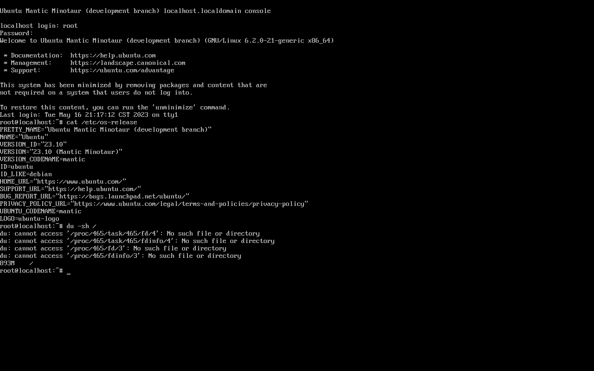

## 总结脚本


快速挂载

```bash
mount /dev/sda2 /mnt/
mount /dev/sda1 /mnt/boot/efi/
for i in run sys proc dev dev/shm dev/pts; do echo "mount /$i"; mount --bind /$i /mnt/$i; done

```


最后，因为Linus大佬设计系统的兼容性真的是太好了，真的可以容器和宿主机之间随意变换。致敬大佬（鞠躬）。
这样就做成了不到800M+的一个系统，是不是比官方的mini版更加迷你呢？

有疑问或有需求或有工作推荐可以dd我。

