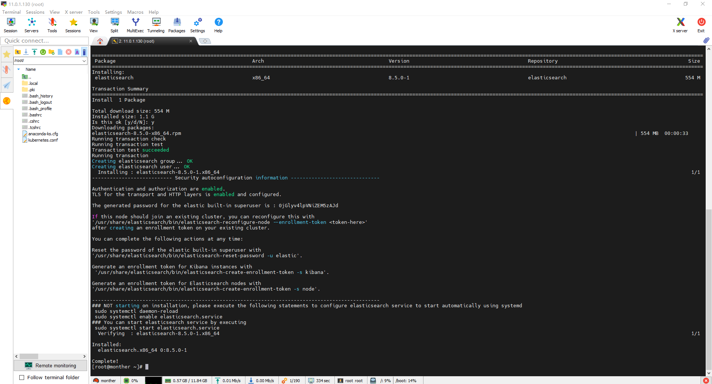

# EFK安装过程记录，监听netflow

## 说明

一般我们需要进行日志分析场景：直接在日志文件中 grep、awk 就可以获得自己想要的信息。但在规模较大也就是日志量多而复杂的场景中，此方法效率低下，面临问题包括日志量太大如何归档、文本搜索太慢怎么办、如何多维度查询。需要集中化的日志管理，所有服务器上的日志收集汇总。常见解决思路是建立集中式日志收集系统，将所有节点上的日志统一收集，管理，访问。
Elastic Stack包含：

- Elasticsearch 是个开源分布式搜索引擎，提供搜集、分析、存储数据三大功能。它的特点有：分布式，零配置，自动发现，索引自动分片，索引副本机制，restful风格接口，多数据源，自动搜索负载等。详细可参考Elasticsearch权威指南
- Logstash 主要是用来日志的搜集、分析、过滤日志的工具，支持大量的数据获取方式。一般工作方式为c/s架构，client端安装在需要收集日志的主机上，server端负责将收到的各节点日志进行过滤、修改等操作在一并发往elasticsearch上去。
  Kibana 也是一个开源和免费的工具，Kibana可以为 Logstash 和 ElasticSearch 提供的日志分析友好的 Web 界面，可以帮助汇总、分析和搜索重要数据日志。
- Beats在这里是一个轻量级日志采集器，其实Beats家族有6个成员，早期的ELK架构中使用Logstash收集、解析日志，但是Logstash对内存、cpu、io等资源消耗比较高。相比
- Logstash，Beats所占系统的CPU和内存几乎可以忽略不计

## 相关网站

- https://www.elastic.co/cn/downloads/
- https://www.elastic.co/cn/downloads/elasticsearch
- https://www.elastic.co/guide/en/elasticsearch/reference/8.5/rpm.html#rpm-repo

## 构建yum源

```bash
rpm --import https://artifacts.elastic.co/GPG-KEY-elasticsearch

[elasticsearch]
name=Elasticsearch repository for 8.x packages
baseurl=https://artifacts.elastic.co/packages/8.x/yum
gpgcheck=1
gpgkey=https://artifacts.elastic.co/GPG-KEY-elasticsearch
enabled=1
autorefresh=1
type=rpm-md
```

## Pre阶段

```bash
systemctl stop firewalld
systemctl disable firewalld
setenforce 0
sed -i 's/SELINUX.*/SELINUX=disabled/g' /etc/selinux/conf
```


## 安装ES

- https://www.elastic.co/cn/downloads/elasticsearch

```bash
[root@monther ~]# yum list --showduplicates elasticsearch
Loaded plugins: fastestmirror
Loading mirror speeds from cached hostfile
 * base: mirrors.aliyun.com
 * epel: mirrors.bfsu.edu.cn
 * extras: ftp.sjtu.edu.cn
 * updates: ftp.sjtu.edu.cn
Available Packages
elasticsearch.x86_64                                                                                   8.0.0-1                                                                                   elasticsearch
elasticsearch.x86_64                                                                                   8.0.1-1                                                                                   elasticsearch
elasticsearch.x86_64                                                                                   8.1.0-1                                                                                   elasticsearch
elasticsearch.x86_64                                                                                   8.1.1-1                                                                                   elasticsearch
elasticsearch.x86_64                                                                                   8.1.2-1                                                                                   elasticsearch
elasticsearch.x86_64                                                                                   8.1.3-1                                                                                   elasticsearch
elasticsearch.x86_64                                                                                   8.2.0-1                                                                                   elasticsearch
elasticsearch.x86_64                                                                                   8.2.1-1                                                                                   elasticsearch
elasticsearch.x86_64                                                                                   8.2.2-1                                                                                   elasticsearch
elasticsearch.x86_64                                                                                   8.2.3-1                                                                                   elasticsearch
elasticsearch.x86_64                                                                                   8.3.0-1                                                                                   elasticsearch
elasticsearch.x86_64                                                                                   8.3.1-1                                                                                   elasticsearch
elasticsearch.x86_64                                                                                   8.3.2-1                                                                                   elasticsearch
elasticsearch.x86_64                                                                                   8.3.3-1                                                                                   elasticsearch
elasticsearch.x86_64                                                                                   8.4.0-1                                                                                   elasticsearch
elasticsearch.x86_64                                                                                   8.4.1-1                                                                                   elasticsearch
elasticsearch.x86_64                                                                                   8.4.2-1                                                                                   elasticsearch
elasticsearch.x86_64                                                                                   8.4.3-1                                                                                   elasticsearch
elasticsearch.x86_64                                                                                   8.5.0-1                                                                                   elasticsearch
# 运行命令
yum install elasticsearch-8.4.3-1

Running transaction
Creating elasticsearch group... OK
Creating elasticsearch user... OK
  Installing : elasticsearch-8.4.3-1.x86_64                                                                                                                                                               1/1
warning: ignoring JAVA_HOME=/usr/share/elasticsearch/jdk; using bundled JDK
warning: ignoring JAVA_HOME=/usr/share/elasticsearch/jdk; using bundled JDK
--------------------------- Security autoconfiguration information ------------------------------

Authentication and authorization are enabled.
TLS for the transport and HTTP layers is enabled and configured.

The generated password for the elastic built-in superuser is : 1cIh96+PjMLVhT2DGQyT

If this node should join an existing cluster, you can reconfigure this with
'/usr/share/elasticsearch/bin/elasticsearch-reconfigure-node --enrollment-token <token-here>'
after creating an enrollment token on your existing cluster.

You can complete the following actions at any time:

Reset the password of the elastic built-in superuser with
'/usr/share/elasticsearch/bin/elasticsearch-reset-password -u elastic'.

Generate an enrollment token for Kibana instances with
 '/usr/share/elasticsearch/bin/elasticsearch-create-enrollment-token -s kibana'.

Generate an enrollment token for Elasticsearch nodes with
'/usr/share/elasticsearch/bin/elasticsearch-create-enrollment-token -s node'.

-------------------------------------------------------------------------------------------------
### NOT starting on installation, please execute the following statements to configure elasticsearch service to start automatically using systemd
 sudo systemctl daemon-reload
 sudo systemctl enable elasticsearch.service
### You can start elasticsearch service by executing
 sudo systemctl start elasticsearch.service
warning: ignoring JAVA_HOME=/usr/share/elasticsearch/jdk; using bundled JDK
warning: ignoring JAVA_HOME=/usr/share/elasticsearch/jdk; using bundled JDK
  Verifying  : elasticsearch-8.4.3-1.x86_64                                                                                                                                                               1/1

Installed:
  elasticsearch.x86_64 0:8.4.3-1

Complete!

```




## 配置ES

```bash
[root@monther ~]# grep -v \# /etc/elasticsearch/elasticsearch.yml | grep -v ^$
cluster.name: es-cluster
node.name: es-node-1
path.data: /var/lib/elasticsearch
path.logs: /var/log/elasticsearch
network.host: 11.0.1.130
http.port: 9200
xpack.security.enabled: false
xpack.security.enrollment.enabled: false
xpack.security.http.ssl:
  enabled: false
  keystore.path: certs/http.p12
xpack.security.transport.ssl:
  enabled: false
  verification_mode: certificate
  keystore.path: certs/transport.p12
  truststore.path: certs/transport.p12
cluster.initial_master_nodes: ["es01"]
http.host: 0.0.0.0
```

## ES报错和处理

- 在线json美化工具     https://toolgg.com/json-beautifier.html

### ①

```bash
{
    "@timestamp": "2022-11-03T01:39:22.213Z",
    "log.level": "ERROR",
    "message": "uncaught exception in thread [process reaper (pid 9710)]",
    "ecs.version": "1.2.0",
    "service.name": "ES_ECS",
    "event.dataset": "elasticsearch.server",
    "process.thread.name": "process reaper (pid 9710)",
    "log.logger": "org.elasticsearch.bootstrap.ElasticsearchUncaughtExceptionHandler",
    "elasticsearch.node.name": "es-node-1",
    "error.type": "java.security.AccessControlException",
    "error.message": "access denied (\"java.lang.RuntimePermission\" \"modifyThread\")",
    "error.stack_trace": "java.security.AccessControlException: access denied (\"java.lang.RuntimePermission\" \"modifyThread\")\n\tat java.base/java.security.AccessControlContext.checkPermission(AccessControlContext.java:485)\n\tat java.base/java.security.AccessController.checkPermission(AccessController.java:1068)\n\tat java.base/java.lang.SecurityManager.checkPermission(SecurityManager.java:411)\n\tat org.elasticsearch.securesm@8.5.0/org.elasticsearch.secure_sm.SecureSM.checkThreadAccess(SecureSM.java:166)\n\tat org.elasticsearch.securesm@8.5.0/org.elasticsearch.secure_sm.SecureSM.checkAccess(SecureSM.java:120)\n\tat java.base/java.lang.Thread.checkAccess(Thread.java:2360)\n\tat java.base/java.lang.Thread.setDaemon(Thread.java:2308)\n\tat java.base/java.lang.ProcessHandleImpl.lambda$static$0(ProcessHandleImpl.java:103)\n\tat java.base/java.util.concurrent.ThreadPoolExecutor$Worker.<init>(ThreadPoolExecutor.java:637)\n\tat java.base/java.util.concurrent.ThreadPoolExecutor.addWorker(ThreadPoolExecutor.java:928)\n\tat java.base/java.util.concurrent.ThreadPoolExecutor.processWorkerExit(ThreadPoolExecutor.java:1021)\n\tat java.base/java.util.concurrent.ThreadPoolExecutor.runWorker(ThreadPoolExecutor.java:1158)\n\tat java.base/java.util.concurrent.ThreadPoolExecutor$Worker.run(ThreadPoolExecutor.java:642)\n\tat java.base/java.lang.Thread.run(Thread.java:1589)\n\tat java.base/jdk.internal.misc.InnocuousThread.run(InnocuousThread.java:186)\n"
}

日志显示因为

The system environment variables are not available to Log4j due to security restrictions: java.security.AccessControlException: access denied ("java.lang.RuntimePermission" "getenv.*")The system environment variables are not available to Log4j due to security restrictions: java.security.AccessControlException: access denied ("ja
va.lang.RuntimePermission" "getenv.*")The system environment variables are not available to Log4j due to security restrictions: java.security.AccessControlException: access denied ("java.lang.RuntimePermission" "getenv.*")The system environment variables are not available to Log4j due to security restrictions: java.security.AccessControlException: access denied ("java.lang.RuntimePermission" "getenv.*")
 ----
 由于安全限制，系统环境变量对 Log4j 不可用：java.security.AccessControlException: access denied ("java.lang.RuntimePermission" "getenv.*")
 系统环境变量因安全限制对Log4j不可用：java.security.AccessControlException: access denied ("java.lang.RuntimePermission" "getenv.*") 
 由于安全限制，系统环境变量对 Log4j 不可用： java.security.AccessControlException: access denied ("java.lang.RuntimePermission" "getenv.*") 
 由于安全限制，系统环境变量对 Log4j 不可用： java.security.AccessControlException: access denied ("java.lang.RuntimePermission" "getenv.*")
 
 
 解决方案 安装8.4.3  ---------- 8.5.0有bug
 

```

## 安装Kibana


```bash
[root@monther ~]# yum list --showduplicates kibana
Loaded plugins: fastestmirror
Loading mirror speeds from cached hostfile
 * base: mirrors.aliyun.com
 * epel: mirrors.bfsu.edu.cn
 * extras: ftp.sjtu.edu.cn
 * updates: ftp.sjtu.edu.cn
Available Packages
kibana.x86_64                                                                                      8.0.0-1                                                                                       elasticsearch
kibana.x86_64                                                                                      8.0.1-1                                                                                       elasticsearch
kibana.x86_64                                                                                      8.1.0-1                                                                                       elasticsearch
kibana.x86_64                                                                                      8.1.1-1                                                                                       elasticsearch
kibana.x86_64                                                                                      8.1.2-1                                                                                       elasticsearch
kibana.x86_64                                                                                      8.1.3-1                                                                                       elasticsearch
kibana.x86_64                                                                                      8.2.0-1                                                                                       elasticsearch
kibana.x86_64                                                                                      8.2.1-1                                                                                       elasticsearch
kibana.x86_64                                                                                      8.2.2-1                                                                                       elasticsearch
kibana.x86_64                                                                                      8.2.3-1                                                                                       elasticsearch
kibana.x86_64                                                                                      8.3.0-1                                                                                       elasticsearch
kibana.x86_64                                                                                      8.3.1-1                                                                                       elasticsearch
kibana.x86_64                                                                                      8.3.2-1                                                                                       elasticsearch
kibana.x86_64                                                                                      8.3.3-1                                                                                       elasticsearch
kibana.x86_64                                                                                      8.4.0-1                                                                                       elasticsearch
kibana.x86_64                                                                                      8.4.1-1                                                                                       elasticsearch
kibana.x86_64                                                                                      8.4.2-1                                                                                       elasticsearch
kibana.x86_64                                                                                      8.4.3-1                                                                                       elasticsearch
kibana.x86_64                                                                                      8.5.0-1                                                                                       elasticsearch
[root@monther ~]# yum install kibana-8.4.3-1^C

```


## 配置kibana

```bash

[root@monther ~]# vim /etc/kibana/kibana.yml
[root@monther ~]# grep -v \# /etc/kibana/kibana.yml | grep -v ^$
server.port: 5601
server.host: "0.0.0.0"
elasticsearch.hosts: ["http://11.0.1.130:9200"]
logging:
  appenders:
    file:
      type: file
      fileName: /var/log/kibana/kibana.log
      layout:
        type: json
  root:
    appenders:
      - default
      - file
pid.file: /run/kibana/kibana.pid
i18n.locale: "zh-CN"
[root@monther ~]# systemctl restart kibana

```

## 安装FileBeat


```bash

[root@monther ~]# yum list --showduplicates filebeat
Loaded plugins: fastestmirror
Loading mirror speeds from cached hostfile
 * base: mirrors.aliyun.com
 * epel: mirrors.bfsu.edu.cn
 * extras: ftp.sjtu.edu.cn
 * updates: ftp.sjtu.edu.cn
Available Packages
filebeat.x86_64                                                                                     8.0.0-1                                                                                      elasticsearch
filebeat.x86_64                                                                                     8.0.1-1                                                                                      elasticsearch
filebeat.x86_64                                                                                     8.1.0-1                                                                                      elasticsearch
filebeat.x86_64                                                                                     8.1.1-1                                                                                      elasticsearch
filebeat.x86_64                                                                                     8.1.2-1                                                                                      elasticsearch
filebeat.x86_64                                                                                     8.1.3-1                                                                                      elasticsearch
filebeat.x86_64                                                                                     8.2.0-1                                                                                      elasticsearch
filebeat.x86_64                                                                                     8.2.1-1                                                                                      elasticsearch
filebeat.x86_64                                                                                     8.2.2-1                                                                                      elasticsearch
filebeat.x86_64                                                                                     8.2.3-1                                                                                      elasticsearch
filebeat.x86_64                                                                                     8.3.0-1                                                                                      elasticsearch
filebeat.x86_64                                                                                     8.3.1-1                                                                                      elasticsearch
filebeat.x86_64                                                                                     8.3.2-1                                                                                      elasticsearch
filebeat.x86_64                                                                                     8.3.3-1                                                                                      elasticsearch
filebeat.x86_64                                                                                     8.4.0-1                                                                                      elasticsearch
filebeat.x86_64                                                                                     8.4.1-1                                                                                      elasticsearch
filebeat.x86_64                                                                                     8.4.2-1                                                                                      elasticsearch
filebeat.x86_64                                                                                     8.4.3-1                                                                                      elasticsearch
filebeat.x86_64                                                                                     8.5.0-1                                                                                      elasticsearch


```

## FileBeat配置

```bash
[root@monther ~]# filebeat modules list
Enabled:

Disabled:
activemq
apache
auditd
aws
awsfargate
azure
barracuda


filebeat modules enable nginx
filebeat setup

[root@monther ~]# grep -v \# /etc/filebeat/filebeat.yml | grep -v ^$
filebeat.inputs:
- type: filestream
  id: my-filestream-id
  enabled: false
  paths:
    - /var/log/*.log
filebeat.config.modules:
  path: ${path.config}/modules.d/*.yml
  reload.enabled: false
setup.template.settings:
  index.number_of_shards: 1
tags: ["nginx"]
setup.kibana:
  host: "localhost:5601"
output.elasticsearch:
  hosts: ["11.0.1.130:9200"]
processors:
  - add_host_metadata:
      when.not.contains.tags: forwarded
  - add_cloud_metadata: ~
  - add_docker_metadata: ~
  - add_kubernetes_metadata: ~

```

