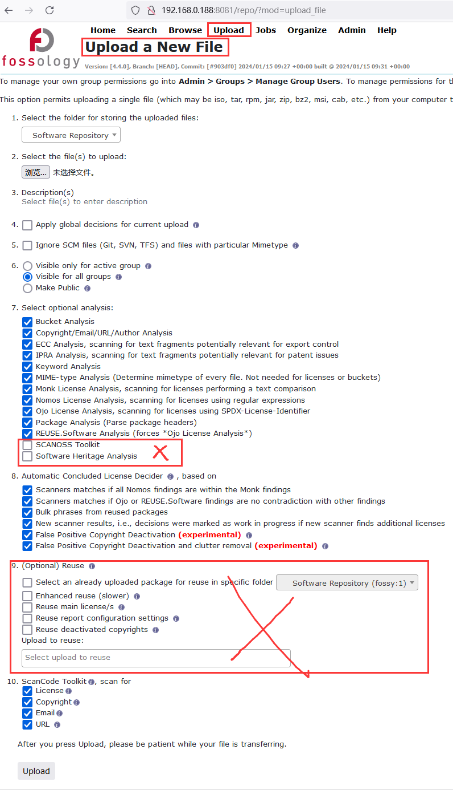
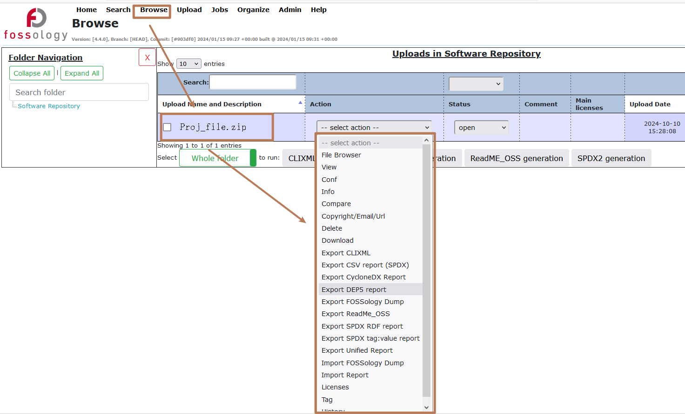

# Fossy平台离线部署分析

## 压缩包上传检测方法




## 下载报告

经过测试DEP5更直观。




## 可否离线工作

| 组件名称                            | 离线工作状态 | 功能描述                                                     | 问题描述                                                    | 备注                                                    |
| ----------------------------------- | ------------ | ------------------------------------------------------------ | ----------------------------------------------------------- | ------------------------------------------------------- |
| Copyright/Email/URL/Author Analysis | 正常工作     | 分析文件中的版权、电子邮件、网址和作者信息                   |                                                             |                                                         |
| ECC Analysis                        | 正常工作     | 扫描文本片段，寻找与出口控制相关的潜在内容                   |                                                             |                                                         |
| IPRA Analysis                       | 正常工作     | 扫描文本片段，寻找与专利问题相关的潜在内容                   |                                                             |                                                         |
| Keyword Analysis                    | 正常工作     | 关键词分析                                                   |                                                             |                                                         |
| MIME-type Analysis                  | 正常工作     | 确定每个文件的 MIME 类型，对于许可证或存储桶不是必需的       |                                                             |                                                         |
| Monk License Analysis               | 正常工作     | 通过文本比较扫描许可证                                       |                                                             |                                                         |
| Nomos License Analysis              | 正常工作     | 使用正则表达式扫描许可证                                     |                                                             |                                                         |
| Ojo License Analysis                | 正常工作     | 使用 SPDX-License-Identifier 格式扫描许可证                  |                                                             |                                                         |
| Package Analysis                    | 正常工作     | 解析包头信息                                                 |                                                             |                                                         |
| REUSE.Software Analysis             | 正常工作     | 强制执行 Ojo License Analysis                                |                                                             |                                                         |
| SCANOSS Toolkit                     | 不可工作     | 提供额外的扫描工具集，包括开源软件识别和漏洞检测             | 请求远程API https://osskb.org/api/scan/direct               | 不可勾选 7-SCANOSS Toolkit，可不运行这个组件            |
| SoftwareHeritage                    | 不可工作     | 通过请求远程 API 获取软件遗产信息，用于识别和归档源代码      | 请求远程API https://archive.softwareheritage.org 有速度限制 | 不可勾选 7-Software Heritage Analysis，可不运行这个组件 |
| Decider                             | 正常工作     | 用于决策分析，确定哪些文件需要进一步处理，通常是单线程工作，速度较慢 |                                                             |                                                         |

## 一些官方未修复bug的解决方法

### scancode

/root/.cache Permission denied

解决方法 

在官方的文件基础上增加环境变量

```bash
SCANCODE_CACHE='/home/fossy/.cache
```


