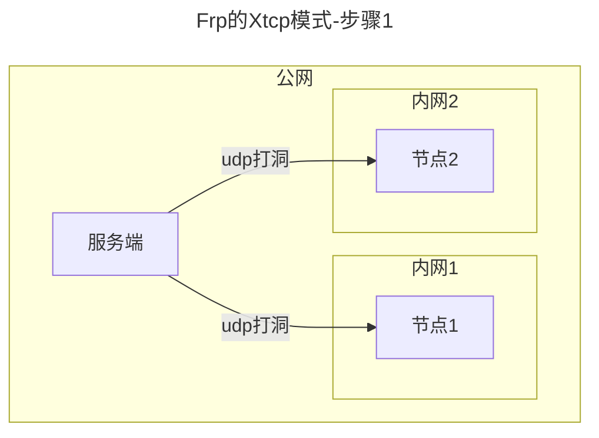
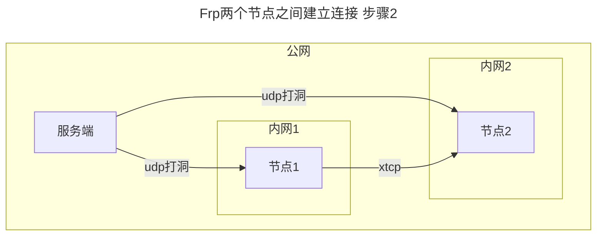
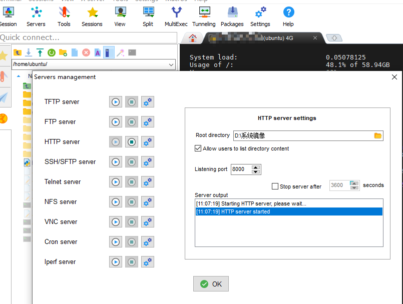
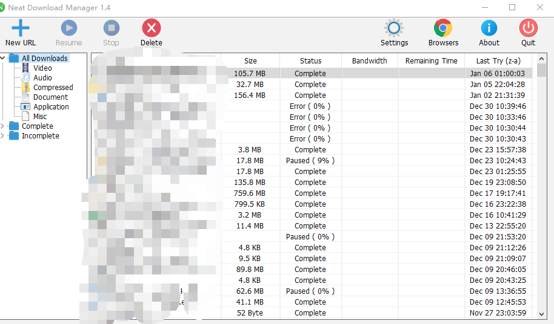

# Frp实现p2p穿透流量不经过公网服务器

> 从公网买服务器的时候经常遇到带宽太小的问题，国内的网络又非常的慢，导致每MB的价格非常的昂贵，搭建frp服务器总会被流量低速卡脖子卡脖子，有一天我看到Frp提供了一个叫Xtcp的传输模式，这种模式可以点对点的传输流量而流量不经过公网服务器，只要两台个人电脑都可以被穿透就可以，这让我非常感兴趣，解决了带宽卡脖子的问题。下面对这种使用xtcp协议实现流量穿透内网的方式进行简单探究。

## 原理解析

### 步骤1 打通两个节点的内网（udp打洞）


### 步骤2 两个节点之间建立连接


## 搭建过程

下载二进制程序 frps，这里面的frps是Server上使用的，也就是服务器上面运行的程序，frpc是Client上使用的也就是客户端版本

```bash
https://github.com/fatedier/frp/releases/tag/v0.54.0
```

### 服务器配置

```toml
# 正常配置即可
[common]
bind_port = 7000
# 启用面板
dashboard_port = 7500
# 面板登录名和密码
dashboard_user = admin
dashboard_pwd = '面板密码'
# 使用http代理并使用8888端口进行穿透
vhost_http_port = 8889
# 使用https代理并使用9999端口进行穿透
vhost_https_port = 9999
# 日志路径
log_file = ./frps.log
# 日志级别
log_level = info
# 日志最大保存天数
log_max_days = 2
# 认证超时时间
authentication_timeout = 900
# 认证token，客户端需要和此对应,要长，建议在 https://paper-dragon.github.io/RandomPassword/ 生成
token="abc123abc"
# 最大连接数
max_pool_count = 5
max_ports_per_client = 0


```

命令行启动

```bash
./frps -c ./frps.toml
```


### 节点A（访问者）配置

配置文件

```toml
serverAddr = "frp.myauth.top"
serverPort = 7000
auth.method = "token"

# auth token
auth.token = "abc123abc"

[[visitors]]
name = "p2p_ssh_visitor"
type = "xtcp"
# 要访问的 P2P 代理的名称
serverName = "shoulong_p2p_tcp"
secretKey = "abcdefg"
# 绑定本地端口以访问 SSH 服务
bindAddr = "127.0.0.1"
bindPort = 8080
```


命令行启动

```bash
./frpc -c frpc.toml
```


### 节点B（服务提供者）配置

配置文件

```toml
serverAddr = "124.220.42.103"
serverPort = 7000
auth.method = "token"

# auth token
auth.token = "abcdefg"


[[proxies]]
name = "shoulong_p2p_tcp"
type = "xtcp"
secretKey = "abcdefg"
localIP = "127.0.0.1"
localPort = 8000
# If not empty, only visitors from specified users can connect.
# Otherwise, visitors from same user can connect. '*' means allow all users.
allowUsers = ["*"]
```

命令行启动

```bash
./frpc -c frpc.toml
```

启动服务器

如果安装了Python程序可以使用内置http模块快速启动一个http服务器，问题接踵而来，这个内置server是单线程的，无法多线程下载。

```bash
python -m http.server
```

然后换成了MobaXterm的内置服务器，本站刚好提供了激活方法，仅供学习使用（https://www.geekery.cn/free-service/tools.html）,这个服务器支持多线程处理文件，支持分段下载。就非常nice。




## 验证

在访问者主机上启动程序之后浏览器访问  http://127.0.0.1:8080 访问到 节点B启动的服务器，则证明启动成功。这时可以上一个多线程下载工具暴力下载文件，用于测试网络速度的上限。



经过测试，流量确实远远突破了服务器速度的上线，简直就是国内烂透了的网络的福音，终于可以自由的传输数据了。
