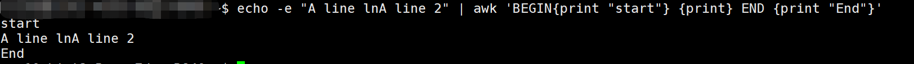
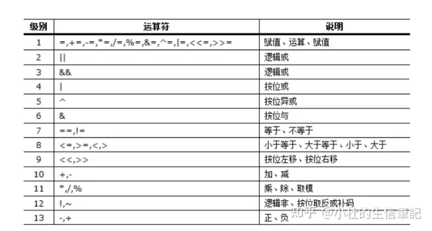

# awk语言学习笔记01

**awk**是一种编程语言，用于在linux/unix下对文本和数据进行处理。数据可以来自标准输入(stdin)、一个或多个文件，或其它命令的输出。它支持用户自定义函数和动态正则表达式等先进功能，是linux/unix下的一个强大编程工具。它在命令行中使用，但更多是作为脚本来使用。awk有很多内建的功能，比如数组、函数等，这是它和C语言的相同之处，灵活性是awk最大的优势。

## awk命令格式和选项

**语法形式**

```text
awk [options] 'script' var=value file(s)
awk [options] -f scriptfile var=value file(s)
```

### **常用命令选项**

> **-F** **fs**   fs指定输入分隔符，fs可以是字符串或正则表达式，如-F:
> **-v** **var=value**   赋值一个用户定义变量，将外部变量传递给awk
> **-f** **scripfile**  从脚本文件中读取awk命令
> **-m[fr]** **val**   对val值设置内在限制，-mf选项限制分配给val的最大块数目；-mr选项限制记录的最大数目。这两个功能是Bell实验室版awk的扩展功能，在标准awk中不适用。

### **awk模式和操作**

awk脚本是由模式和操作组成的。

**模式可以是以下任意一个：**

- /正则表达式/：使用通配符的扩展集。
- 关系表达式：使用运算符进行操作，可以是字符串或数字的比较测试。
- 模式匹配表达式：用运算符`~`（匹配）和`~!`（不匹配）。
- BEGIN语句块、pattern语句块、END语句块：参见[awk的工作原理](http://man.linuxde.net/awk#awk的工作原理)

**操作由一个或多个命令、函数、表达式组成，之间由换行符或分号隔开，并位于大括号内，主要部分是：**

- 变量或数组赋值
- 输出命令
- 内置函数
- 控制流语句

### awk脚本基本结构

```abap
awk 'NEGIN{print "start"} pattern{commands } END {print "end"}'  file 
```

一个awk脚本通常由：BEGIN语句块、能够使用模式匹配的通用语句块、END语句块3部分组成，这三个部分是可选的。任意一个部分都可以不出现在脚本中，脚本通常是被**单引号**或**双引号**中，例如：

```text
awk 'BEGIN{ i = 0 } {i++ } END {print i}' file 
awk "BEGIN{ i = 0 } {i++ } END {print i}" file
```

### awk的工作原理

```text
awk 'BEGIN{ commands } pattern{ commands } END{ commands }'
```

- 第一步：执行`BEGIN{ commands }`语句块中的语句；
- 第二步：从文件或标准输入(stdin)读取一行，然后执行`pattern{ commands }`语句块，它逐行扫描文件，从第一行到最后一行重复这个过程，直到文件全部被读取完毕。
- 第三步：当读至输入流末尾时，执行`END{ commands }`语句块。

> **BEGIN语句块**在awk开始从输入流中读取行**之前**被执行，这是一个可选的语句块，比如变量初始化、打印输出表格的表头等语句通常可以写在BEGIN语句块中。
> **END语句块**在awk从输入流中读取完所有的行**之后**即被执行，比如打印所有行的分析结果这类信息汇总都是在END语句块中完成，它也是一个可选语句块。
> **pattern语句块**中的通用命令是最重要的部分，它也是可选的。如果没有提供pattern语句块，则默认执行`{ print }`，即打印每一个读取到的行，awk读取的每一行都会执行该语句块。

```text
echo -e "A line lnA line 2" | awk 'BEGIN{print "start"} {print} END {print "End"}' 
start
A line lnA line 2
End
```



当使用不带参数的`print`时，它就打印当前行，当`print`的参数是以逗号进行分隔时，打印时则以空格作为定界符。在awk的print语句块中双引号是被当作拼接符使用，例如：

```text
echo | awk '{ var1="v1"; var2="v2"; var3="v3"; print var1,var2,var3; }' 
v1 v2 v3
```

**双引号拼接使用：**

```text
echo | awk '{ var1="v1"; var2="v2"; var3="v3"; print var1"="var2"="var3; }'
v1=v2=v3
```

{ }类似一个循环体，会对文件中的每一行进行迭代，通常变量初始化语句（如：i=0）以及打印文件头部的语句放入BEGIN语句块中，将打印的结果等语句放在END语句块中。

### awk内置变量（预定义变量）

> [A][N][P][G]表示第一个支持变量的工具，[A]=awk、[N]=nawk、[P]=POSIXawk、[G]=gawk

```text
$n 当前记录的第n个字段，比如n为1表示第一个字段，n为2表示第二个字段。 
$0 这个变量包含执行过程中当前行的文本内容。
[N] ARGC 命令行参数的数目。
[G] ARGIND 命令行中当前文件的位置（从0开始算）。
[N] ARGV 包含命令行参数的数组。
[G] CONVFMT 数字转换格式（默认值为%.6g）。
[P] ENVIRON 环境变量关联数组。
[N] ERRNO 最后一个系统错误的描述。
[G] FIELDWIDTHS 字段宽度列表（用空格键分隔）。
[A] FILENAME 当前输入文件的名。
[P] FNR 同NR，但相对于当前文件。
[A] FS 字段分隔符（默认是任何空格）。
[G] IGNORECASE 如果为真，则进行忽略大小写的匹配。
[A] NF 表示字段数，在执行过程中对应于当前的字段数。
[A] NR 表示记录数，在执行过程中对应于当前的行号。
[A] OFMT 数字的输出格式（默认值是%.6g）。
[A] OFS 输出字段分隔符（默认值是一个空格）。
[A] ORS 输出记录分隔符（默认值是一个换行符）。
[A] RS 记录分隔符（默认是一个换行符）。
[N] RSTART 由match函数所匹配的字符串的第一个位置。
[N] RLENGTH 由match函数所匹配的字符串的长度。
[N] SUBSEP 数组下标分隔符（默认值是34）。
```


```text
echo -e "line1 f2 f3nline2 f4 f5nline3 f6 f7" | awk '{print "Line No:"NR", No of fields:"NF, "$0="$0, "$1="$1, "$2="$2, "$3="$3}' 
Line No:1, No of fields:3 $0=line1 f2 f3 $1=line1 $2=f2 $3=f3
Line No:2, No of fields:3 $0=line2 f4 f5 $1=line2 $2=f4 $3=f5
Line No:3, No of fields:3 $0=line3 f6 f7 $1=line3 $2=f6 $3=f7
```

使用`print $NF`可以打印出一行中的最后一个字段，使用`$(NF-1)`则是打印倒数第二个字段，其他以此类推：

```text
echo -e "line1 f2 f3n line2 f4 f5" | awk '{print $NF}'
f3
f5

echo -e "line1 f2 f3n line2 f4 f5" | awk '{print $(NF-1)}'
f2
f4
```

打印每一行的第二和第三个字段：

```text
awk '{ print $2,$3 }' filename
```

统计文件中的行数：

```text
awk 'END{ print NR }' filename
```

以上命令只使用了END语句块，在读入每一行的时，awk会将NR更新为对应的行号，当到达最后一行NR的值就是最后一行的行号，所以END语句块中的NR就是文件的行数。

一个每一行中第一个字段值累加的例子：

```text
seq 5 | awk 'BEGIN{ sum=0; print "总和：" } { print $1"+"; sum+=$1 } END{ print "等于"; print sum }' 
总和：
1+
2+
3+
4+
5+
等于
15
```

### 将外部变量值传递给awk

借助**`-v`选项**，可以将外部值（并非来自stdin）传递给awk：

```text
VAR=10000
echo | awk -v VARIABLE=$VAR '{ print VARIABLE }'
```

另一种传递外部变量方法：

```text
var1="aaa"
var2="bbb"
echo | awk '{ print v1,v2 }' v1=$var1 v2=$var2
```

当输入来自于文件时使用：

```text
awk '{ print v1,v2 }' v1=$var1 v2=$var2 filename
```

以上方法中，变量之间用空格分隔作为awk的命令行参数跟随在BEGIN、{}和END语句块之后。

------

### awk运算与判断 

作为一种程序设计语言所应具有的特点之一，awk支持多种运算，这些运算与C语言提供的基本相同。awk还提供了一系列内置的运算函数（如log、sqr、cos、sin等）和一些用于对字符串进行操作（运算）的函数（如length、substr等等）。这些函数的引用大大的提高了awk的运算功能。作为对条件转移指令的一部分，关系判断是每种程序设计语言都具备的功能，awk也不例外，awk中允许进行多种测试，作为样式匹配，还提供了模式匹配表达式~（匹配）和~!（不匹配）。作为对测试的一种扩充，awk也支持用逻辑运算符。

### 算术运算符

| 运算符 | 描述                       |
| ------ | -------------------------- |
| + -    | 加，减                     |
| * / &  | 乘，除与求余               |
| + - !  | 一元加，减和逻辑非         |
| ^ ***  | 求幂                       |
| ++ --  | 增加或减少，作为前缀或后缀 |

例：

```text
awk 'BEGIN{a="b";print a++,++a;}'
0 2
```

注意：所有用作算术运算符进行操作，操作数自动转为数值，所有非数值都变为0

### 赋值运算符 

| 运算符                  | 描述     |
| ----------------------- | -------- |
| = += -= *= /= %= ^= **= | 赋值语句 |

例：

```text
a+=5; 等价于：a=a+5; 其它同类
```

### 逻辑运算符

| 运算符 | 描述   |
| ------ | ------ |
| \|\|   | 逻辑或 |
| &&     | 逻辑与 |

例：

```text
awk 'BEGIN{a=1;b=2;print (a>5 && b<=2),(a>5 || b<=2);}'
0 1
```

### 正则运算符 

| 运算符 | 描述                             |
| ------ | -------------------------------- |
| ~ ~!   | 匹配正则表达式和不匹配正则表达式 |

例：

```text
awk 'BEGIN{a="100testa";if(a ~ /^100*/){print "ok";}}'
ok
```

### 关系运算符 

| 运算符          | 描述       |
| --------------- | ---------- |
| < <= > >= != == | 关系运算符 |

例：

```text
awk 'BEGIN{a=11;if(a >= 9){print "ok";}}'
ok
```

注意：> < 可以作为字符串比较，也可以用作数值比较，关键看操作数如果是字符串就会转换为字符串比较。两个都为数字才转为数值比较。字符串比较：按照ASCII码顺序比较。

### 其它运算符 

| 运算符 | 描述                 |
| ------ | -------------------- |
| $      | 字段引用             |
| 空格   | 字符串连接符         |
| ?:     | C条件表达式          |
| in     | 数组中是否存在某键值 |

例：

```text
awk 'BEGIN{a="b";print a=="b"?"ok":"err";}'
ok
awk 'BEGIN{a="b";arr[0]="b";arr[1]="c";print (a in arr);}'
0
awk 'BEGIN{a="b";arr[0]="b";arr["b"]="c";print (a in arr);}'
1
```

### 运算级优先级表



------

持续更新！！！