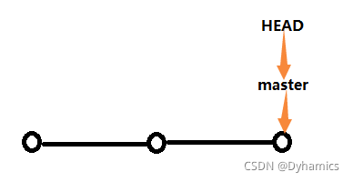
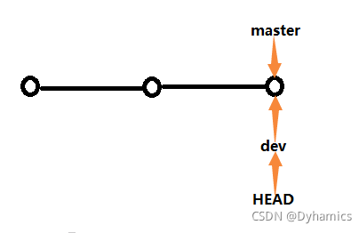
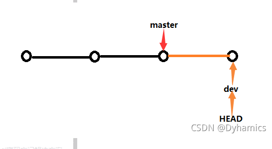
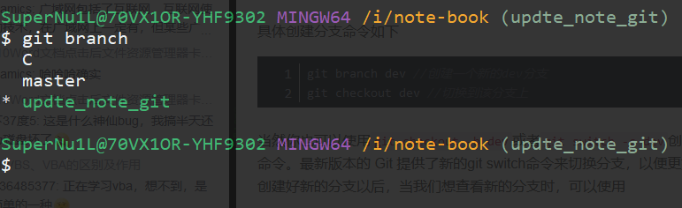
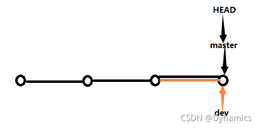
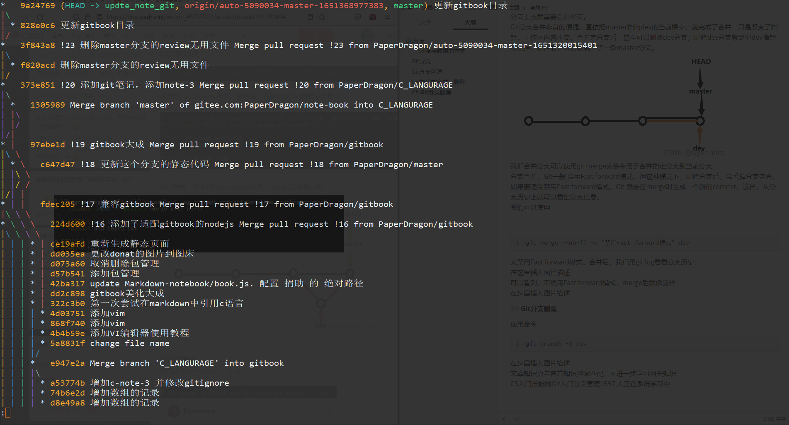
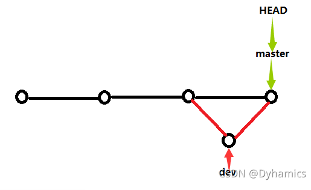
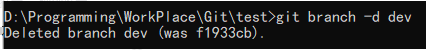

# Git分支管理合并与删除命令

几乎所有的版本控制系统都以某种形式支持分支。 使用分支意味着你可以把你的工作从开发主线上分离开来，以免影响开发主线。 在很多版本控制系统中，这是一个略微低效的过程——常常需要完全创建一个源代码目录的副本。对于大项目来说，这样的过程会耗费很多时间。而Git的分支模型则别具一格，创建分支非常的快，在不同分支之间切换也十分的快，这一优势也使得Git鼓励人们更多地使用分支。

### Git保存数据的方式

在了解分支之前，让我们先来看看Git是如何保存数据的。我的理解是我们每次提交到Git的文件，它并不是只保存每次文件中的差异，而是类似于照片那样将整个文件都在重新保存一份

## Git分支

Git 会把仓库中的每次提交串成一条时间线，这条时间线就是一个分支。在 Git 里，每个仓库都会有一个主分支，即master分支。HEAD严格来说不是指向提交，而是指向master，master才是指向提交的，所以，HEAD指向的就是当前分支。
一开始的时候，master分支是一条线，Git 用master指向最新的提交，再用HEAD指向master，就能确定当前分支，以及当前分支的提交点，如下图：



每次提交，master分支都会向前移动一步，这样，随着你不断提交，master分支的线也越来越长。

## Git分支创建

当我们创建新的分支，例如dev时，Git 新建了一个指针叫dev，指向master相同的提交，再把HEAD指向dev，就表示当前分支在dev上，如下图：



所以Git 创建一个分支很快，因为除了增加一个dev指针，改变HEAD的指向，工作区的文件则没有任何变化。
在创建完新的分支以后，对工作区的修改和提交就是针对dev分支了，比如新提交一次后，dev指针往前移动一步，而master指针不变，如下图：



具体创建分支命令如下

```bash
    git branch dev //创建一个新的dev分支
    git checkout dev //切换到该分支上
```

当然你也可以使用git checkout -b dev或者git switch -c dev创建dev并切换，相当于以上两条命令。最新版本的 Git 提供了新的git switch命令来切换分支，以便更好的与git checkout 进行区分。
创建好新的分支以后，当我们想查看新的分支时，可以使用


```bash
    git branch
```

该命令会列出所有的分支，而当前分支前面会标一个*号。

在分支之间来回切换使用git switch master或者git checkout 分支名

## Git的分支合并、删除

注意：当我们在dev分支提交修改的文件切换回主分支是查看不到的，此时如果想提交到主分支上去就需要合并分支。
Git分支合并非常的便捷，直接把master指向dev的当前提交，就完成了合并，只是改变了指针，工作区内容不变，合并完分支后，甚至可以删除dev分支。删除dev分支就是把dev指针给删掉，删掉后，我们就剩下了一条master分支。



我们合并分支可以使用git merge该命令用于合并指定分支到当前分支。
分支合并，Git一般 会用Fast forward模式，但这种模式下，删除分支后，会丢掉分支信息。如果要强制禁用Fast forward模式，Git 就会在merge时生成一个新的commit，这样，从分支历史上就可以看出分支信息。
我们可以使用


```bash
    git merge --no-ff -m "禁用Fast forward模式" dev
```

来禁用Fast forward模式。合并后，我们用git log看看分支历史：



可以看到，不使用Fast forward模式，merge后就像这样：



## Git分支删除

使用命令

```bash
git branch -d dev
```


