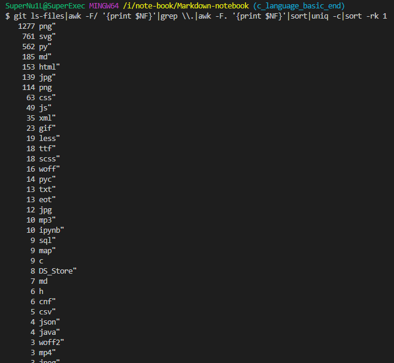

# Git识别项目的语言类型及文件占比

最近在做代码分析，想知道一个git仓库的语言类型，相信大家都见过这个：

图中列出了不同的文件类型在代码仓中的占比，那如何实现这个功能呢？

结果研究，我写了一个脚本如下：

```bash
git ls-files|awk -F/ '{print $NF}'|grep \\.|awk -F. '{print $NF}'|sort|uniq -c|sort -rk 1
```

解释

```bash
# git查询文件后缀的数量，用以区分项目使用的语言。

# 列出git的文件
# git ls-files \

# 按照‘/’分割并取出最后一个，即文件名
# |awk -F/ '{print $NF}' \
# 筛选出有后缀的文件
# |grep \\. \
# 按照‘.’分割并取出最后一个，即后缀名
# |awk -F. '{print $NF}' \
# 排序去重统计
# |sort|uniq -c \
# 按统计结果再次排序
# |sort -rk 1
```
```bash
# 完整命令，在已经git clone的目录下执行：
git ls-files|awk -F/ '{print $NF}'|grep \\.|awk -F. '{print $NF}'|sort|uniq -c|sort -rk 1
```


运行效果如下，每一种后缀的文件数量都被统计出来了：


ps: 如果不想下载全部代码，请使用git的sparse-checkout功能。
