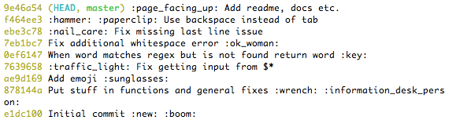
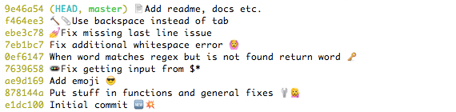

# emojify


## [Emoji on the command line    😱 ](https://www.mianshigee.com/project/emojify/#emoji-on-the-command-line-scream) 

THIS IS A VERY USEFUL SCRIPT. IT WILL ABSOLUTELY BOOST YOUR PRODUCTIVITY AND HELP YOU IN YOUR DAILY WORK.

  😉 

Basically, emojify substitutes emoji aliases that many services (like [GitHub](https://github.com/)) use for emoji raw characters.


## [Installation](https://www.mianshigee.com/project/emojify/#installation)

[emojify](https://www.mianshigee.com/mrowa44/emojify/blob/master/emojify) is a shell script, so put it somewhere and make sure it's added to your `$PATH`.

Here's a one-liner:

```
$ sudo sh -c "curl https://raw.githubusercontent.com/mrowa44/emojify/master/emojify -o /usr/local/bin/emojify && chmod +x /usr/local/bin/emojify"
```

If you're on OS X, emojify is also on [Homebrew](http://brew.sh/):

```
$ brew install emojify
```

For Arch Linux users, a PKGBUILD is available in the [AUR](https://aur.archlinux.org/packages/emojify/):

```
$ pacaur -S emojify
```

Since https://github.com/mrowa44/emojify/pull/18/ emojify requires bash version above 4. The old version can still be found here: https://github.com/mrowa44/emojify/tree/old_bash_support but it's not recommended.


## [Usage](https://www.mianshigee.com/project/emojify/#usage)

Here's a clever example:

```
$ emojify "Hey, I just :raising_hand: you, and this is :scream: , but here's my :calling: , so :telephone_receiver: me, maybe?"
```

would output:

> Hey, I just      🙋   you, and this is      😱   , but here's my      📲   , so      📞   me, maybe?

Or maybe:

```
$ emojify "To :bee: , or not to :bee: : that is the question... To take :muscle: against a :ocean: of troubles, and by opposing, end them?"
```

> To      🐝   , or not to      🐝   : that is the question... To take      💪   against a      🌊   of troubles, and by opposing, end them?

Or you could run it through git log with something like:

```
$ git log --oneline --color | emojify | less -r
```

and go from this dull thing:

[](https://github.com/mrowa44/emojify/raw/master/img/before.png)

to this:

[](https://github.com/mrowa44/emojify/raw/master/img/after.png)

To have an alias that does that for you, add something like:

```
log = ! git log --oneline --color | emojify | less -r
```

to your `.gitconfig`.

Note: if you want colors you need to specify the `--color` option.

To invoke help run `emojify -h`.

## [ ](https://www.mianshigee.com/project/emojify/#contributing)Contributing

The project can be tested using [bats](https://github.com/sstephenson/bats#installing-bats-from-source):

```
$ bats emojify_tests.bats
```

[Shellcheck](https://www.shellcheck.net/) can be used for linting the shell script:

```
$ shellcheck --exclude=SC1117 emojify
```

## [Related](https://www.mianshigee.com/project/emojify/#related)

- [pyemojify](https://github.com/lord63/pyemojify) - python port


## [License](https://www.mianshigee.com/project/emojify/#license)

MIT