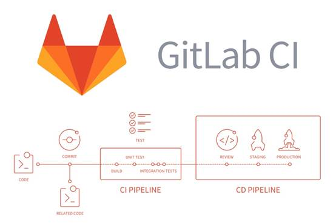
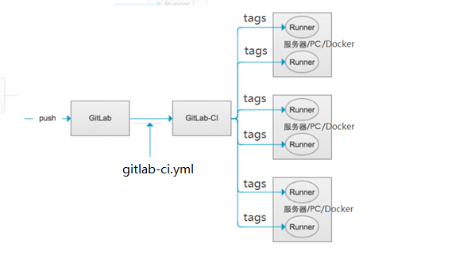
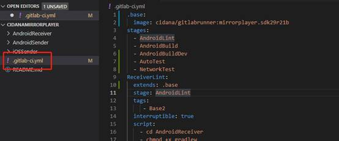
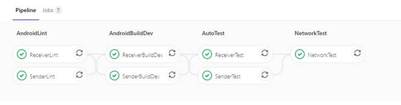
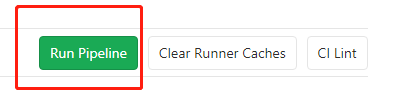
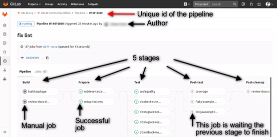
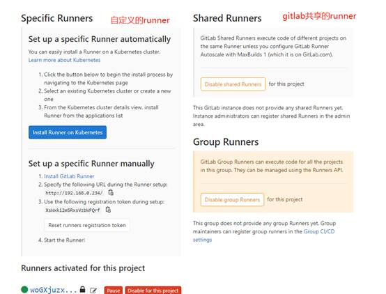
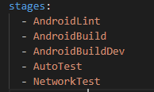
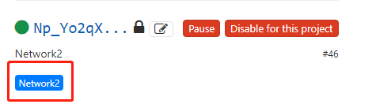
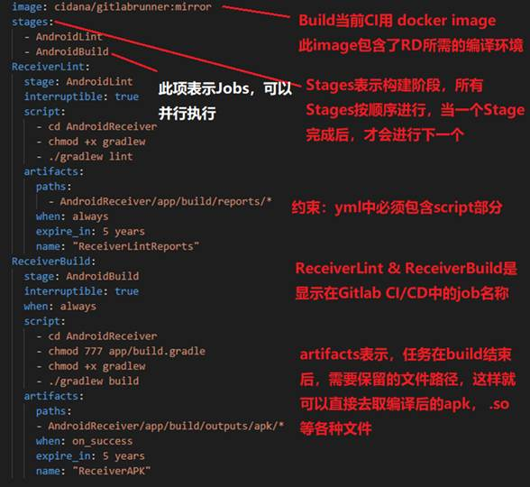

官方文档url：https://docs.gitlab.com/ee/ci

# 一. 概念介绍

## 0.   Gitlab 触发 CI 流程图

 

## 1.1 gitlab-ci && 自动化部署工具的运行机制

以gitlab-ci为例：

(1)         通过在项目根目录下配置.gitlab-ci.yml文件，可以控制ci流程的不同阶段，例如install/检查/编译/打包等。gitlab平台会扫描.gitlab-ci.yml文件，并据此处理ci流程。

(2)         ci流程在每次团队成员push/merge后之后触发。每当push/merge一次，gitlab-ci都会检查项目下有没有.gitlab-ci.yml文件，如果有，它会执行你在里面编写的脚本，并完整地走一遍从Lint=> build=>Test的流程

(3)         gitlab-ci提供了指定ci运行平台的机制，它提供了一个叫gitlab-runner的软件，只要在对应的平台(机器或docker)上下载并运行这个命令行软件，并输入从gitlab交互界面获取的token,就可以把当前机器和对应的gitlab-ci流程绑定，也即：每次跑ci都在这个平台上进行。

(4)         gitlab-ci的所有流程都是可视化的，每个流程节点的状态可以在gitlab的交互界面上看到，包括执行成功或失败。如下图所示,因为它的执行看上去就和多节管道一样，所以我们通常用“pipeline”来称呼它

(5)         不同push/merge所触发的CI流程不会互相影响，也就是说，每一次push引发的CI流程并不会因为接下来另一位同事的push而阻断，它们是互不影响的。这一个特点方便让测试同学根据不同版本进行测试。

(6)         pipeline不仅能被动触发，也是可以手动触发的。

## 1.2 自动化部署的优势
(1)实现更好代码质量:
我们可以把Lint或其他的代码检查加到pipeline流程中，每当团队成员提交和合并一次，pipeline都会触发一次并对代码做一次全面检测，这样可以实现更好的控制代码质量了。
(2)持续交付

# 二.知识预备

gitlab-ci的基本概念就以上内容，接下来介绍一个gitlab-ci用例所需要的知识。

(1)gitlab-ci涉及的抽象概念

(2) .gitlab-ci.yml配置的特定关键字

## 2.1 gitlab-ci涉及的概念

首先要了解的是gitlab-ci中涉及的一些基本概念

1.Pipeline & Job

Pipeline是Gitlab根据项目的.gitlab-ci.yml文件执行的流程，它由许多个任务节点组成, 而这些Pipeline上的每一个任务节点，都是一个独立的Job

Job在YML中的配置我们将会在下面介绍，现在需要知道的是：每个Job都会配置一个stage属性，来表示这个Job所处的阶段。

一个Pipleline有若干个stage,每个stage上有至少一个Job，如下图所示：

 

2.Runner

Runner可以理解为：在特定机器上根据项目的.gitlab-ci.yml文件，对项目执行pipeline的程序。Runner可以分为两种： Specific Runner 和 Shared Runner

l Shared Runner是Gitlab平台提供的免费使用的runner程序，它由Google云平台提供支持，每个开发团队有十几个。对于公共开源项目是免费使用的，如果是私人项目则有每月2000分钟的CI时间上限。（**一般我们私有的gitlab不会用到**）

l Specific Runner是我们自定义的，在自己选择的机器上运行的runner程序，gitlab给我们提供了一个叫gitlab-runner的命令行软件，只要在对应机器上下载安装这个软件，并且运行gitlab-runner register命令，然后输入从gitlab-ci交互界面获取的token进行注册, 就可以在自己的机器上远程运行pipeline程序了。

Shared Runner是所有项目都可以使用的，而Specific Runner只能针对特定项目运行

 

## 2.2 gitlab-ci.yml配置的特定关键字

这些关键字会在.gitlab-ci.yml中使用，并用来控制一个pipeline具体的运作过程

gitlab提供了很多配置关键字，其中最基础和常用的有这么几个

l stages

l stage

l script

l tags

那么在Gitlab交互界面中能够看到如下展示

Script：

它是当前pipeline节点运行的shell脚本（以项目根目录为上下文执行）。

这个script是控制CI流程的核心，所有的工作：从安装，编译到部署都是通过script中定义的shell脚本来完成的。

如果脚本执行成功，pipeline就会进入下一个Job节点，如果执行失败那么pipeline就会终止

Tags：

tags是当前Job的标记，这个tags关键字是很重要，因为gitlab的runner会通过tags去判断能否执行当前这个Job

可以在gitlab的面板中能看到当前激活的runner的信息

**Gitlab项目首页=> setting => CI/CD => Runners**

 

## 2.3 简易gitlab-ci.yml解释

# 三.注意事项

Runner pull_policy = "if-not-present"

\# setting time zone
 ENV TZ Asia/Shanghai
 apt install -y tzdata
 /bin/cp /usr/share/zoneinfo/Asia/Shanghai /etc/localtime
 echo 'Asia/Shanghai' >/etc/timezone