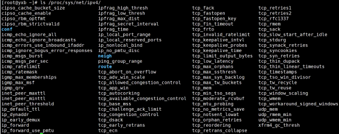
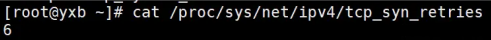
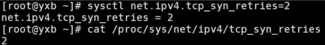
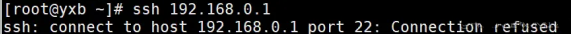
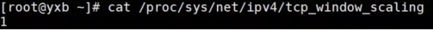
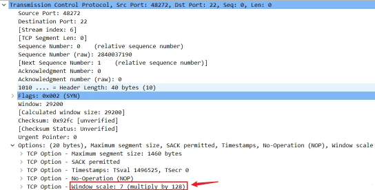
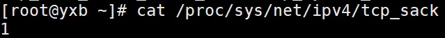
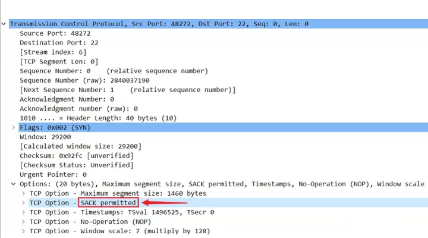
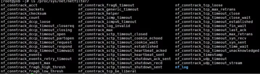
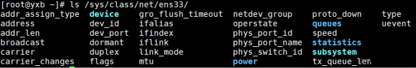

# Linux内核子系统 - 网络

> 某教育内核讨论区：https://kernel.0voice.com/forum.php?mod=guide&view=newthread
>
> netfilter参数详解： https://www.kernel.org/doc/html/latest/networking/nf_conntrack-sysctl.html#proc-sys-net-netfilter-nf-conntrack-variables 已经摘录部分
>
> 部分来源： https://zhuanlan.zhihu.com/p/561781463
>
> 致谢： https://www.zhihu.com/people/linuxwang-xian-sheng
>
> 源地址： https://juejin.cn/post/6993124663878484005
>
> 


## Linux内核中的TCP参数

### /Proc/sys/net/ipv4/

`/Proc/sys/net/ipv4/`存放着`TCP`参数的文件,目录中的内容用来添加网络设置，在其中的许多设置，可以用来阻止对系统的攻击，或用来设置系统的路由功能。



`tcp_syn_retries` 客户端发起`SYN`连接，如果超时会进行重传，重传的次数




接着我们使用`sysctl net.ipv4.tcp_syn_retries=2`把这个参数修改为`2`测试一下



接着我们来验证一下，我们去`ssh`一台不存在的主机，因为`ssh`也是基于`tcp` 



通过`wireshark`抓包可以看到，果然重传了`2`个数据包


`net.ipv4.tcp_window_scaling`启用或关闭窗口扩大因子选项







`Net.ipv4.tcp_sack`启用或关闭选择确认`（Selective Acknowledgement， SACK）`选项



| 名称                       | 默认值            | 建议值                 | 描述                                                         |
| -------------------------- | ----------------- | ---------------------- | ------------------------------------------------------------ |
| tcpsyn_retries             | 5                 | 1                      | 对于一个新建连接，内核要发送多少个SYN连接请求才决定放弃。不应该大于255,默认值是5，对应于180毫秒左右时间。（对于大负载而物理通信良好的网络来说，这个值偏高，可以修改为2。这个值仅仅是针对对外的连接，对进来的连接，是由tcp_retries1决定） |
| tcp_synack_retries         | 5                 | 1                      | 对于远端的连接请求SYN，内核会发送SYN+ACK数据包，以确认收到上一个SYN连接请求包。这是所谓的三次握手机制的第二个步骤。这里决定内核再放弃之前所发送出的SYN+ACK数目。不应该大于255，默认值是5，对应于180秒左右时间。 |
| tcp_keepalive_time         | 7200              | 600                    | TCP发送keepalive探测消息的间隔时间（秒），用于确认TCP连接是否有效。防止两边建立连接但不发送数据的攻击。 |
| tcp_keepalive_probes       | 9                 | 3                      | TCP发送keepalive探测消息的间隔时间（秒），用于确认TCP连接是否有效。 |
| tcp_keepalive_intvl        | 74                | 15                     | 探测消息未获得响应时，重发该消息的间隔时间（秒）。默认值为75秒。 (对于普通应用来说,这个值有一些偏大,可以根据需要改小.特别是web类服务器需要改小该值,15是个比较合适的值) |
| tcp_retries1               | 3                 | 3                      | 放弃回应一个TCP连接请求前﹐需要进行多少次重试。RFC 规定最低的数值是3 |
| tcp_retries2               | 15                | 5                      | 在丢弃激活(已建立通讯状况)的TCP连接之前﹐需要进行多少次重试。默认值为15，根据RTO的值来决定，相当于13-30分钟(RFC1122规定，必须大于100秒) (这个值根据目前的网络设置,可以适当地改小,我的网络内修改为了5) |
| tcp_orphan_retries         | 7                 | 3                      | 在近端丢弃TCP连接之前﹐要进行多少次重试。默认值是7个﹐相当于 50秒 - 16分钟﹐视 RTO 而定。如果您的系统是负载很大的web服务器﹐那么也许需要降低该值,这类 sockets 可能会耗费大量的资源。另外参的考tcp_max_orphans。 |
| tcp_fin_timeout            | 60                | 2                      | 对于本端断开的socket连接，TCP保持在FIN-WAIT-2状态的时间。对方可能会断开连接或一直不结束连接或不可预料的进程死亡。默认值为 60 秒 |
| tcp_max_tw_buckets         | 180000            | 36000                  | 系统在同时所处理的最大 timewait sockets 数目。如果超过此数的话，time-wait socket  会被立即砍除并且显示警告信息。之所以要设定这个限制﹐纯粹为了抵御那些简单的 DoS  攻击﹐不过﹐如果网络条件需要比默认值更多﹐则可以提高它(或许还要增加内存)。(事实上做NAT的时候最好可以适当地增加该值) |
| tcp_tw_recycle             | 0                 | 1                      | 打开快速 TIME-WAIT sockets 回收。除非得到技术专家的建议或要求﹐请不要随意修改这个值。(做NAT的时候，建议打开它) |
| tcp_tw_reuse               | 0                 | 1                      | 表示是否允许重新应用处于TIME-WAIT状态的socket用于新的TCP连接(这个对快速重启动某些服务,而启动后提示端口已经被使用的情形非常有帮助) |
| tcp_max_orphans            | 8192              | 32768                  | 系统所能处理不属于任何进程的TCP  sockets最大数量。假如超过这个数量，那么不属于任何进程的连接会被立即reset，并同时显示警告信息。之所以要设定这个限制，纯粹为了抵御那些简单的 DoS 攻击，千万不要依赖这个或是人为的降低这个限制。如果内存大更应该增加这个值。(这个值Redhat  AS版本中设置为32768,但是很多防火墙修改的时候,建议该值修改为2000) |
| tcp_abort_on_overflow      | 0                 | 0                      | 当守护进程太忙而不能接受新的连接，就象对方发送reset消息，默认值是false。这意味着当溢出的原因是因为一个偶然的猝发，那么连接将恢复状态。只有在你确信守护进程真的不能完成连接请求时才打开该选项，该选项会影响客户的使用。(对待已经满载的sendmail,apache这类服务的时候,这个可以很快让客户端终止连接,可以给予服务程序处理已有连接的缓冲机会,所以很多防火墙上推荐打开它) |
| tcp_synookies              | 0                 | 1                      | 只有在内核编译时选择了CONFIG_SYNCOOKIES时才会发生作用。当出现syn等候队列出现溢出时象对方发送syncookies。目的是为了防止syn flood攻击。 |
| tcp_stdurg                 | 0                 | 0                      | 使用 TCP urg pointer 字段中的主机请求解释功能。大部份的主机都使用老旧的 BSD解释，因此如果您在 Linux 打开它，或会导致不能和它们正确沟通。 |
| tcp_max_syn_backlog        | 1024              | 16384                  | 对于那些依然还未获得客户端确认的连接请求，需要保存在队列中最大数目。对于超过 128Mb 内存的系统，默认值是 1024 ，低于 128Mb 的则为  128。如果服务器经常出现过载，可以尝试增加这个数字。假如您将此值设为大于  1024，最好修改include/net/tcp.h里面的TCP_SYNQ_HSIZE，以保持TCP_SYNQ_HSIZE*16(SYN  Flood攻击利用TCP协议散布握手的缺陷，伪造虚假源IP地址发送大量TCP-SYN半打开连接到目标系统，最终导致目标系统Socket队列资源耗尽而无法接受新的连接。为了应付这种攻击，现代Unix系统中普遍采用多连接队列处理的方式来缓冲(而不是解决)这种攻击，是用一个基本队列处理正常的完全连接应用(Connect()和Accept()  )，是用另一个队列单独存放半打开连接。这种双队列处理方式和其他一些系统内核措施(例如Syn-Cookies/Caches)联合应用时，能够比较有效的缓解小规模的SYN Flood攻击(事实证明) |
| tcp_window_scaling         | 1                 | 1                      | 该文件表示设置tcp/ip会话的滑动窗口大小是否可变。参数值为布尔值，为1时表示可变，为0时表示不可变。tcp/ip通常使用的窗口最大可达到65535字节，对于高速网络，该值可能太小，这时候如果启用了该功能，可以使tcp/ip滑动窗口大小增大数个数量级，从而提高数据传输的能力(RFC 1323)。 |
| tcp_timestamps             | 1                 | 1                      | Timestamps 用在其它一些东西中，可以防范那些伪造的sequence号码。一条1G的宽带线路或许会重遇到带 out-of-line数值的旧sequence  号码(假如它是由于上次产生的)。Timestamp 会让它知道这是个 ‘旧封包’。(该文件表示是否启用以一种比超时重发更精确的方法（RFC  1323）来启用对RTT的计算；为了实现更好的性能应该启用这个选项。) |
| tcp_sack                   | 1                 | 1                      | 使用 Selective ACK，它可以用来查找特定的遗失的数据报— 因此有助于快速恢复状态。该文件表示是否启用有选择的应答（Selective  Acknowledgment），这可以通过有选择地应答乱序接收到的报文来提高性能，这样可以让发送者只发送丢失的报文段。对于广域网通信来说这个选项应该启用，但是这会增加对 CPU 的占用。 |
| tcp_fack                   | 1                 | 1                      | 打开FACK拥塞避免和快速重传功能。注意，当tcp_sack设置为0的时候，这个值即使设置为1也无效，这个是TCP连接靠谱的核心功能 |
| tcp_dsack                  | 1                 | 1                      | 允许TCP发送”两个完全相同”的SACK。                            |
| tcp_ecn                    | 0                 | 0                      | TCP的直接拥塞通告功能。                                      |
| tcp_reordering             | 3                 | 6                      | TCP流中重排序的数据报最大数量。 一般有看到推荐把这个数值略微调整大一些 |
| tcp_retans_collapse        | 1                 | 0                      | 对于某些有bug的打印机提供针对其bug的兼容性。一般不需要这个支持,可以关闭它 |
| tcp_wmem：mindefaultmax    | 4096 16384 131072 | 8192 131072 16777216   | 发送缓存设置。 min：为TCP socket预留用于发送缓冲的内存最小值。每个tcp socket都可以在建议以后都可以使用它。默认值为4096(4K)。  default：为TCP socket预留用于发送缓冲的内存数量，默认情况下该值会影响其它协议使用的net.core.wmem_default  值，一般要低于net.core.wmem_default的值。默认值为16384(16K)。 max: 用于TCP  socket发送缓冲的内存最大值。该值不会影响net.core.wmem_max，”静态”选择参数SO_SNDBUF则不受该值影响。默认值为131072(128K)。对于服务器而言，增加这个参数的值对于发送数据很有帮助 |
| tcprmem：mindefaultmax     | 4096 87380 174760 | 32768 131072 16777216  | 接收缓存设置。同tcp_wmem                                     |
| tcp_mem：mindefaultmax     | 根据内存计算      | 786432 1048576 1572864 | low：当TCP使用了低于该值的内存页面数时，TCP不会考虑释放内存。即低于此值没有内存压力。(理想情况下，这个值应与指定给 tcp_wmem 的第 2 个值相匹配 - 这第 2 个值表明，最大页面大小乘以最大并发请求数除以页大小 (131072 300 /  4096)。 )  pressure：当TCP使用了超过该值的内存页面数量时，TCP试图稳定其内存使用，进入pressure模式，当内存消耗低于low值时则退出pressure状态。(理想情况下这个值应该是 TCP 可以使用的总缓冲区大小的最大值 (204800 300 / 4096)。 ) high：允许所有tcp  sockets用于排队缓冲数据报的页面量。(如果超过这个值，TCP 连接将被拒绝，这就是为什么不要令其过于保守 (512000 *300 /  4096) 的原因了。 在这种情况下，提供的价值很大，它能处理很多连接，是所预期的 2.5 倍；或者使现有连接能够传输 2.5 倍的数据。 |
| tcp_app_win                | 31                | 31                     | 保留max(window/2^tcp_app_win, mss)数量的窗口由于应用缓冲。当为0时表示不需要缓冲。 |
| tcp_adv_win_scale          | 2                 | 2                      | 计算缓冲开销。                                               |
| tcp_low_latency            | 0                 | 0                      | 允许 TCP/IP 栈适应在高吞吐量情况下低延时的情况；这个选项一般情形是的禁用。 |
| tcp_westwood               | 0                 | 0                      | 启用发送者端的拥塞控制算法，它可以维护对吞吐量的评估，并试图对带宽的整体利用情况进行优化；对于 WAN 通信来说应该启用这个选项。 |
| tcp_bic                    | 0                 | 0                      | 为快速长距离网络启用 Binary Increase Congestion；这样可以更好地利用以 GB 速度进行操作的链接；对于 WAN 通信应该启用这个选项。 |
| ip_forward                 | 0                 | 1                      | NAT必须开启IP转发支持，把该值写1                             |
| ip_local_port_range:minmax | 32768 61000       | 1024 65000             | 表示用于向外连接的端口范围，默认比较小，这个范围同样会间接用于NAT表规模。 |
| ip_conntrack_max           | 65535             | 65535                  | 系统支持的最大ipv4连接数，默认65536（事实上这也是理论最大值），同时这个值和你的内存大小有关，1G以上内存这个值都是默认65536 |

`/Proc/sys/net/netfilter/`是对`netfilter`的参数配置，具体可以参照Linux内核文档




### 修改内核参数的方法

1. 使用 `echo value` 方式直接追加到文件中。 如 `echo "1" > /proc/sys/net/ipv4/tcp_syn_retries` ，但是这种方式设备重启后，会恢复成默认值。
2. 把参数添加到 `/etc/sysctl.conf` 中，然后执行 `sysctl -p` 使参数生效。这种方式是永久有效的。
3. 使用`systcl`命令进行修改，例如修改SYN重传次数`sysctl net.ipv4.tcp_syn_retries=n`

### 查看Linux系统的统计信息

下面的`eth0`换成需要查看的网卡

```text
sys/class/net/eth0/statistics/rx_packets 收到的数据包数量

sys/class/net/eth0/statistics/tx_packets 传输的数据包数量

sys/class/net/eth0/statistics/rx_bytes 接收的字节数

sys/class/net/eth0/statistics/tx_bytes 传输的字节数

sys/class/net/eth0/statistics/rx_dropped 收包时丢弃的数据包

sys/class/net/eth0/statistics/tx_dropped 发包时丢弃的数据包
```

Linux网卡的参数可以在`/sys/class/net/`进入对应网卡目录去查看，比如网卡的`MAC地址`，`速率(speed)`,`MTU`等等




