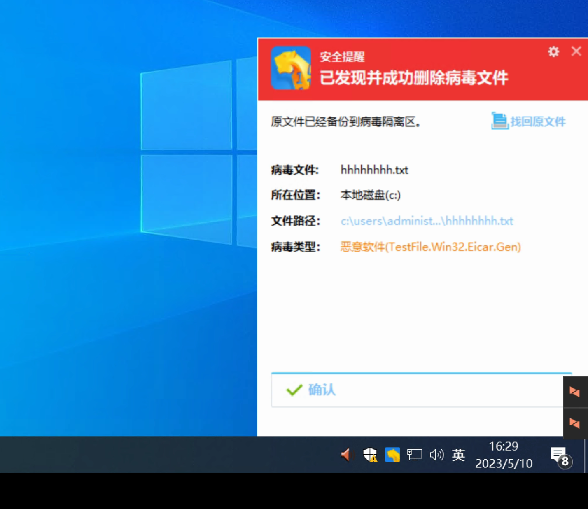
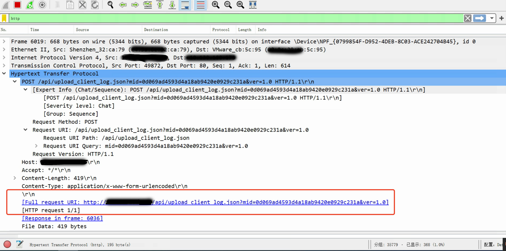
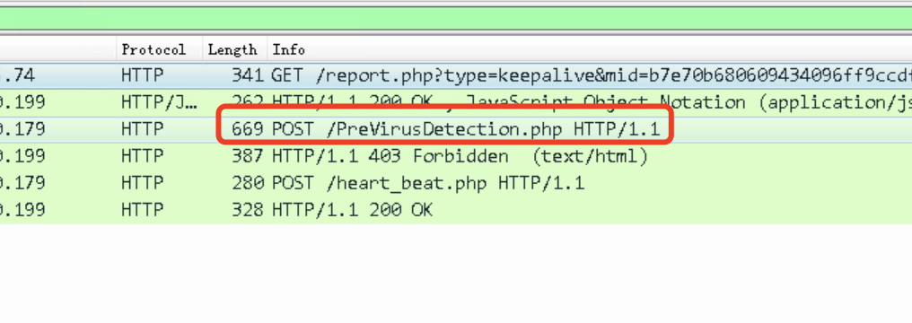
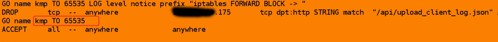
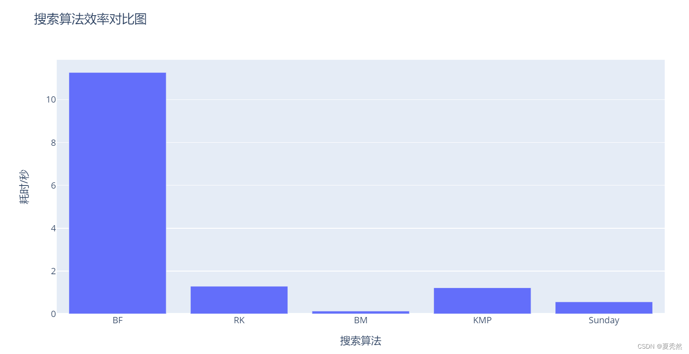
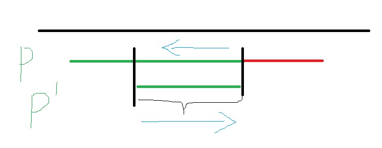
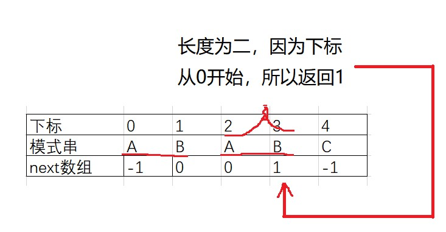
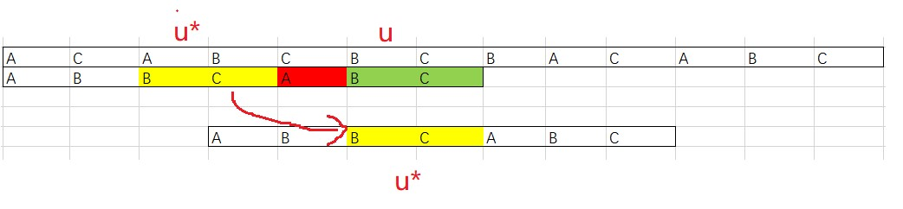
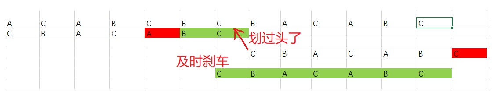

# iptables拦截内网奇虎软件病毒上报

## 案例初衷

整理旧的项目，手里的内容实在太多了，整理一下这个案例。

这个东西开始是别人介绍的一个小项目，作用是要从中间流量阻止来自客户机 **奇虎360**的查毒软件向主服务器病毒上报。



具体是这样的流程

```flow
c=>start: 客户机
r=>operation: My Operation
cond=>condition: Linux主机？
是否包含上报字符
remove=>inputoutput: 丢弃数据包

s=>operation: 病毒收集控制服务器


c->cond->s
cond(yes)->remove
cond(no)->s

```

经过`tcpdump`抓包显示**奇虎360**客户机向服务器上报病毒的渠道是http协议，


信息如下：

```text
http://[病毒收集server]:80/api/upload_client_log.json？mid=balabala&ver=1.0 # 上报查杀日志
```





吐槽几句，是tcp明文传输，我不禁想，这传输也太落后了，查杀病毒自己还不安全上传病毒样本的渠道竟然是明文的，这靠谱么？到底是查杀病毒还是协助病毒扩散。哎，国产软件的悲哀，看不见的地方全是偷工减料。往往国企还花重金去购买这种垃圾软件，悲哀啊。

得，吐槽几句得了。

tcpdump明文的话这事情就好解决了。

我准备用iptables的string模块去分析和拦截数据包。靠iptables强大的转发能力，并发个几万没问题的。


## 使用方法

开启ip_forward内核转发让这个Linux主机成为一个会自动学习路由表的交换机。

临时开启：

```
sysctl net.ipv4.ip_forward = 1
```

永久开启:

```bash
cat <<EOF > /etc/sysctl.d/open_ip_forward.conf
net.ipv4.ip_forward = 1
EOF
```


添加规则

```bash
iptables -A FORWARD -p tcp -m string --string "/api/upload_client_log.json" --algo bm --to 65535 -j DROP
```

这时已经拦截成功

如何验证和记录拦截呢？

使用LOG处理方法让日志发送到文件系统

```bash
vi /etc/syslog.conf  
kern.=notice   /var/log/firewall.log  
```

```bash
iptables –A FORWARD  –j LOG --log-level 5 --log-prefix ”IPTABLES FORWARD -> ”  # -I在最前面插入规则，这条规则将会最先被执行
```

实时查看流量变化

```bash
watch -n 1 iptables -nxvL FORWARD
```



## 深入研究

### 两种字符串匹配算法

iptables支持kmp和bm两种字符串搜索算法

引用 https://blog.csdn.net/weixin_45616285/article/details/128242976 的一张效率对比图片



两种方法和案例来自 https://www.cnblogs.com/AD-milk/p/13040713.html

#### KMP

朴素做法虽然简单，但主串与模式串的指针都要来回移动。我们去书上找东西一般都是一眼扫过去，有没有什么办法可以让主串的指针不往回走，降低比较的趟数？


在上面这个例子中，很明显更快的做法是在第一次匹配失败之后，跳过第二次匹配，进行第三次匹配。也就是说，应该向后移动两格而不是一格。KMP的思想就在于利用已知信息，不把"搜索位置"移回已经比较过的位置，继续向后移。


我们可以利用模式串自身的特点，利用已经匹配过的结果来减少枚举过程，跳过不可能成功的比较，加速匹配过程。画个抽象点的图：



在主串指针不往后退的前提下， 我们的模式串指针最多回退到哪里就可以继续进行匹配呢？

如上图，回退之后的字符串肯定是要能与主串匹配成功的。也就是说它与之前的模式串有着交集。从图中可以看到，P串的后缀与P'的前缀相同。那个这个问题：在已有N个匹配成功的结果下，第N+1个字符匹配失败时，模式串应该退回到第？个匹配成功的结果下？也就转换成了：模式串的各个字串中，能使前后缀相等的最大长度是多少？

我们用next数组来存储回退到的下标



虽然说1那里应该等于0，但其实这时候已经退无可退了。所以应该退出循环，让主串指针向前走一位，开始新一轮比较。

利用这个next数组，比如我们比较到下标3的时候发现不匹配，没关系，我们退一步。退一步之后就到了下标1(回退看的next应该是已经匹配成功的那个，也就是看下标2存的是几)，如果这时候还不匹配，那我们就会退回到-1，也就是说，这轮匹配失败了，主串可以往前走了。

看看代码就清楚了

```c++
int strStr(string haystack, string needle)
{
	if (!needle.size()) return 0;
	if (!haystack.size()) return -1;
	vector<int> next(needle.size());
	next[0] = -1;
	//求next数组
	for (int i = 1, j = -1; i < needle.size(); i++)
	{
		while (j >= 0 && needle[i]!=needle[j+1])
		{
			//不匹配就退一步看看
			j = next[j];
		}
		if (needle[i] == needle[j + 1])
		{
			//匹配成功就继续往后走
			//看看还能不能匹配成功
			j++;
		}
		next[i] = j;
	}
	//开始匹配
	for (int i = 0, j = -1; i < haystack.size(); i++)
	{
		while (j != -1 && haystack[i] != needle[j+1])
		{
			//不匹配咱就回退
			j = next[j];
		}
		if (haystack[i] == needle[j+1])
		{
			j++;
		}
		if (j == needle.size() - 1)
		{
			return i-j;
		}
	}
	return -1;
}
```

#### BM

虽然KMP比较出名，但其实只是因为它比较难懂而已。在效率上有很多的算法都比它要好。现在介绍的BM算法，其效率就要比KMP好上3到4倍。

BM算法包含两部分：坏字符规则和好后缀规则

##### 坏字符规则

BM算法与我们平常接触的字符串比较方法不同，它是按模式串从大到小的顺序，倒着比的。这样做也是有好处的，起码直观上是这样感觉的。就像做算数选择题，出卷老师为了让你花的时间久一点，故意把正确答案放到C跟D上。所以聪明点的做法应该是先算C跟D。这跟这个比较方法有点类似。

考虑下面这张图：


别忘了我们是从模式串最大的开始往后匹配，所以这里先比较了C和D。这个时候，有意思的来了，这个 `D` 在模式串中就没有出现过，是一个`坏字符`，有它在的字串可能不匹配。

惹不起还躲不起吗？溜之大吉，模式串直接移动五位，重新匹配。一下移动这么多，是不是特别的爽？

但你千万不要以为只有没在模式串中出现过的才叫`坏字符`,实际上这个只是从后往前第一个不匹配的字符。一旦发生不匹配，坏字符规则的做法是模式串指针继续往回走，找到第一个与其匹配的字符停止，然后再继续新一轮的匹配。

也就是说，移动的距离等于：`当前模式串的下标(Si) - 往回走找到的第一个与当前不匹配字符匹配的下标(Xi)`。如果没有找到，则减数为-1。

这么一想，好像用坏字符规则就万事大吉了。但因为实际代码中，我们不会每次不匹配都会往前找，那样太耗费时间，取而代之的是使用散列表纪录不同字符在模式串中“最后出现的位置”,并不是 Si 的位置往前查找的第一个位置，所以可能会出现 Xi 大于 Si  的情况。比如上图的例子，主串"ABABDABABCAB",模式串"ABABC"当从左开始数的一个B不匹配时，找到的A的下标是最后一次在模式串中出现的下标(也就是最后一个a的位置，比A大)。这时候，模式串非但不往前滑动，还回退了。为了解决这个问题，我们需要`好后缀`来帮忙。(实际上，两个规则都可以独立使用，如果坏字符你是往回遍历而不是保存在散列表里面的话)

##### 好后缀规则



当遇到上图的情况时，我们依然可以用坏字符规则来移动，但这次让我们来看看好后缀是如何工作的？

我们把在主串中已经匹配成功的字符串用` u`标记，现在要做的是找到模式串中与其匹配的`u*`如果找到了，那模式串就滑动到使得`u*`与u对齐的位置。如果不匹配，那么溜之大吉，直接移动一个模式串长度的位置。虽然一次移动那么多是很爽，但这样做有可能错过可以匹配的情况。



实际上这里应该跟KMP一样，如果模式串中前缀与好后缀的后缀相同，那么就移动相应位置使其匹配。


#### 算法取舍

BM算法相对于KMP算法有以下几个优点：

1. BM算法在实际应用中的平均时间复杂度要低于KMP算法。在最坏情况下，KMP算法的时间复杂度为O(m+n)，其中m和n分别为模式串和文本串的长度。而BM算法的平均时间复杂度为O(n/m)，其中m为模式串长度，n为文本串长度。
2. BM算法在预处理阶段比KMP算法更快。BM算法的预处理时间复杂度为O(m)，而KMP算法的预处理时间复杂度为O(m)。
3. BM算法的匹配过程中利用了坏字符规则和好后缀规则，而KMP算法仅利用了好前缀规则。因此，在实际应用中，BM算法的匹配速度更快。

需要注意的是，BM算法的最坏时间复杂度为O(mn)，在某些情况下可能会比KMP算法慢。此外，BM算法需要额外的空间来存储坏字符规则和好后缀规则，而KMP算法只需要额外的空间来存储next数组。因此，在空间限制比较严格的情况下，KMP算法可能更加适用。
链接：https://www.zhihu.com/question/586324372/answer/2912326435

### 查找的范围

--from offset

从数据包的第几个字节开始找

--to offset

查到数据包的第几个字节，默认是全部

## 案例


### 测试iptables 防火墙的拦截关键词是否成功。

#### 如何使用
我们暂定封建关键词是 vname
#### 启动测试服务器
```bash
docker run -it --rm -p 8000:8000  jockerdragon/webapi:tester
```
测试过程
```bash
# GET测试
[root@monther ~]# curl  192.168.157.129:8000
This is Flask Test Server
[/] -> show this menu
[/get] -> include keyword vvnnaammee
[/post] -> post to Test server
[root@monther ~]# curl 192.168.157.129:8000/get
cccccvname[root@monther ~]#

#POST测试
[root@monther ~]# curl -X POST 192.168.157.129:8000/post -H 'Content-Type: application/x-www-form-urlencoded'       -d 'vname=1232131'
[response.form.data] -> None
[response.form] -> ImmutableMultiDict([('vname', '1232131')])
[response] -> <Request 'http://192.168.157.129:8000/post' [POST]>
[requests.data] -> b''
```
#### 在ROUTER上增加封禁规则
```bash
iptables -A FORWARD -p tcp -m string --string "vname" --algo bm --to 65535 -j DROP
````
#### 效果是 GET /get 失效 POST中带有vname关键词失效

## 案例后端开发过程

Dockerfile
```dockerfile
FROM python:3.10.11
MAINTAINER <jockerdragon 2678885646@qq.com>
RUN pip install --upgrade pip
RUN pip install flask requests
EXPOSE 8000
WORKDIR /
ADD ./app.py /
CMD ["sh","-c","python app.py"]
```
 app.py
```python
root@ub-server:~# cat app.py
from flask import Flask, request

app = Flask(__name__)
#app.config['DEBUG'] = True
app.config['MAX_CONTENT_LENGTH'] = 1024000000

app.config.update(
    DEBUG=True,
    USE_X_SENDFILE=True,
#    MAX_CONTENT_LENGTH=2*1024*1024*1024
        )

@app.route('/post', methods=['POST'])
def post_post_handler():
    data = request.form.get('data')
    # 处理POST数据
    print(request.form)
    return f"[response.form.data] -> {data} \n[response.form] -> {request.form}\n[response] -> {request}\n[requests.data] -> {request.data}\n"


@app.route('/', methods=['GET'])
def root_get_handler():
    data = request.args.get('data')
    # 处理GET数据
    response = 'This is Flask Test Server\n[/] -> show this menu\n[/get] -> include keyword vvnnaammee\n[/post] -> post to Test server\n'
    return response

@app.route('/get', methods=['GET'])
def get_get_handler():
    data = request.args.get('data')
    # 处理GET数据
    response = 'cccccvname'
    return response

if __name__ == '__main__':
    app.run(host='0.0.0.0', port=8000)

```

