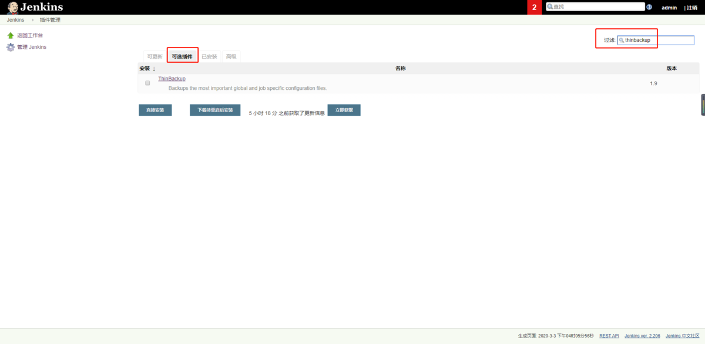
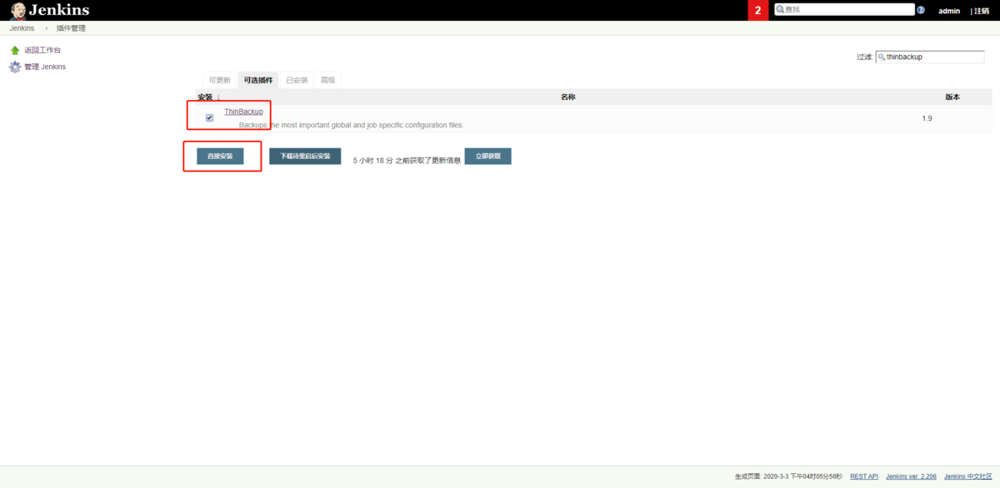
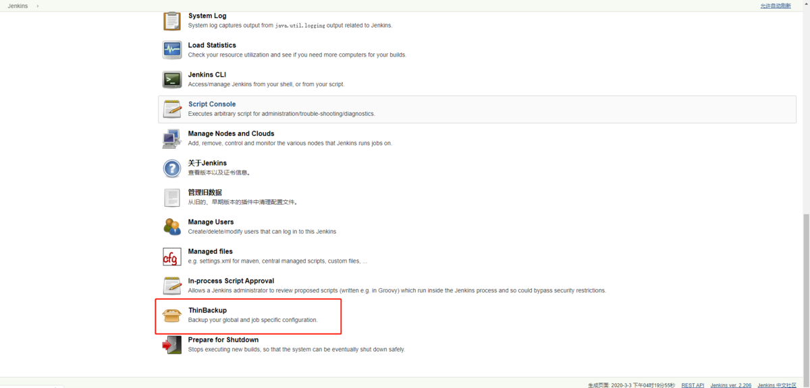
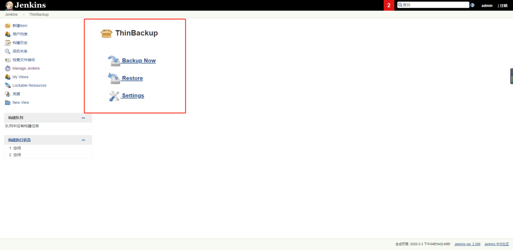
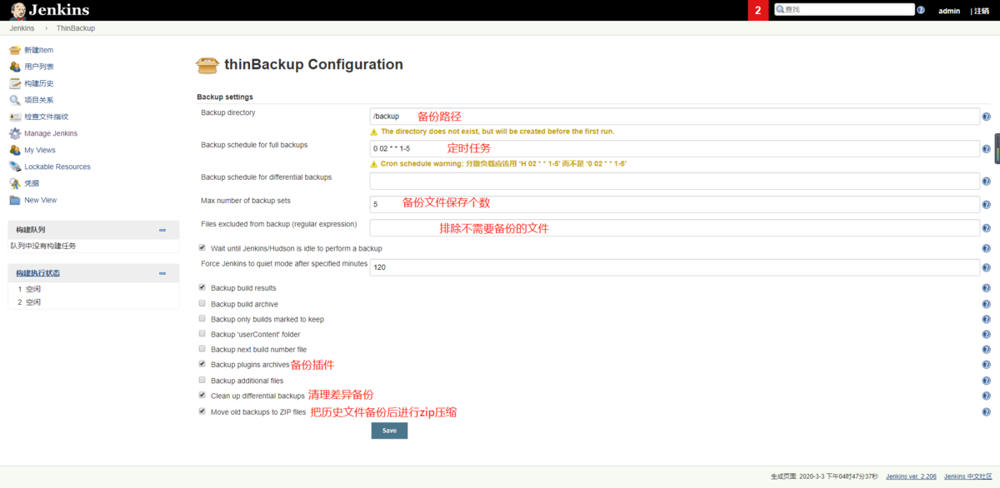
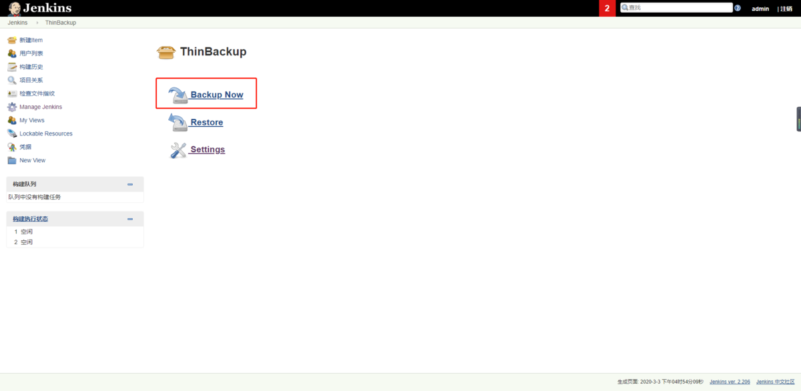
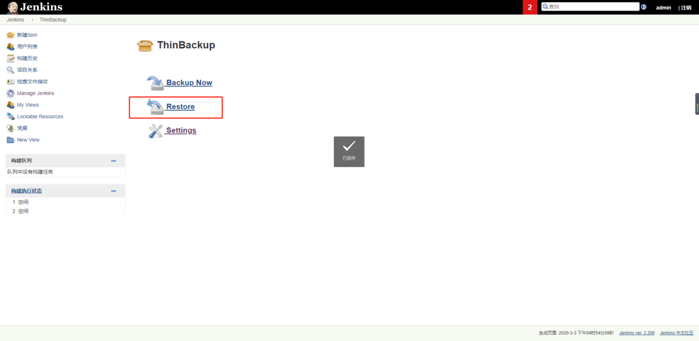
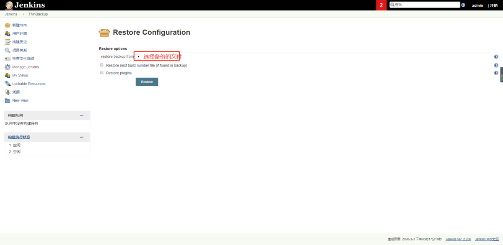
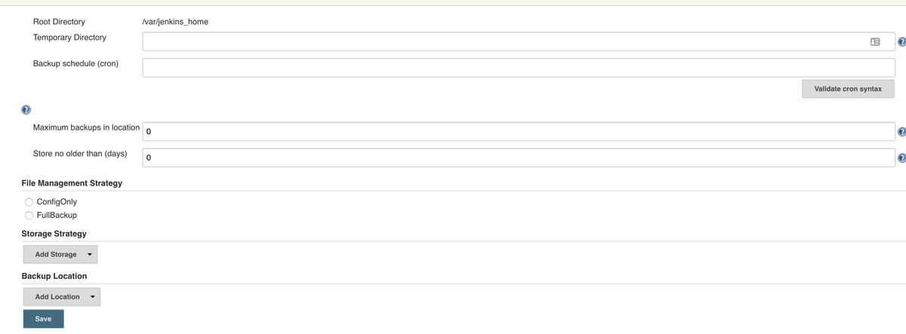
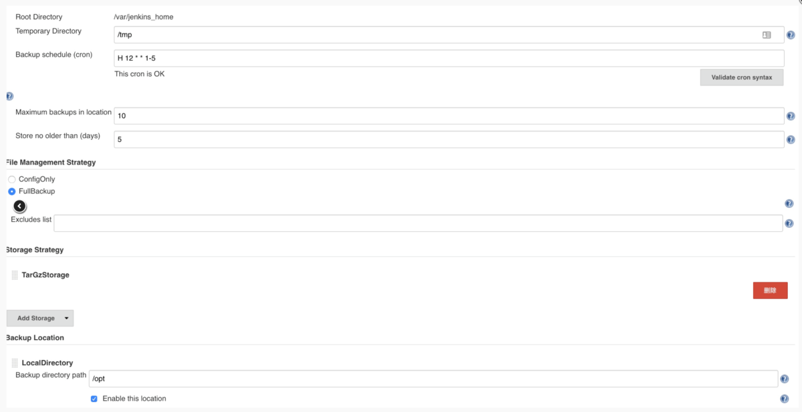

# Jenkins备份

　**1.手动备份**

　　比较简单就像上述迁移步骤那样，把原始机器上的数据打包。打包后有两种选择，第一种是在原始机器上，其他路径下创建一个文件夹，把数据丢进去。例如原始机器上的数据是存储在/home/jenkins，我们打包后可以放到/home/backups，这样做的好处是如果误删了Jenkins，我们可以到backups下找回原始数据；第二种是将打包的文件拷贝到另外一台物理机上，这样做的好处是如果原始机器宕机了，我们可以在另外一台机器上找到备份文件，在最短的时间内恢复工作。

```bash


```

　**2.自动备份**

　　相对于手动备份，我们也可以编写脚本实现自动备份，例如Linux系统中，使用shell脚本，如下命令可以实现备份：

```bash
　　cp -r /home/jenkins/需要备份的文件夹名 /home/backups/目标文件夹名
　　
```

# Jenkins备份与恢复


当Jenkins在用起来的时候，我们很难保证它不会出故障，除了故障怎么快速恢复呢？作为运维，备份极其重要。但Jenkins本身不提供备份的功能，所以这里就需要借助Jenkins自带的插件来进行备份恢复，Jenkins自带的插件有thinbackup和periodic backup。下面进行分别介绍

### 一、通过插件ThinBackup进行备份恢复

**1.以管理员的身份登录Jenkins，点击系统管理—>插件管理—->可选插件—>(过滤里面输入ThinBackup进行查找)**



查找thinbackup.png


**2.勾选ThinBackup—>点击直接安装**



安装thinbackup.png

 等待安装完成。
**3.点击系统管理—>选择ThinBackup插件**



选择插件.png


> 可以看到有三个选项:
>  Backup Now: 手动立即备份
>  Restore: 恢复备份
>  Settings: 备份参数的设置



查看thinbackup.png

**4.创建备份目录**

> 创建备份目录，并对目录递归属主属组权限

```bash
mkdir /backup
chown -R jenkins.jenkins /backup
```

**5.设置定时备份，周一至周五的凌晨2点进行备份（可排除不需要备份的文件）**



thinbackup设置.png


**6.手动备份**



手动备份.png


> 手动备份完后，在服务器上的备份目录中就可以找到备份的文件

```csharp
[root@localhost~]# cd /backup
[root@localhost backup]# ls
FULL-2020-03-03_16-58
[root@localhost backup]#
```

> 查看备份了有哪些文件

```csharp
[root@localhost backup] cd FULL-2020-03-03_16-58/
[root@localhost FULL-2020-03-03_16-58] ls
config.xml
credentials.xml
github-plugin-configuration.xml
hudson.maven.MavenModuleSet.xml
hudson.model.UpdateCenter.xml
hudson.plugins.build_timeout.operations.BuildStepOperation.xml
hudson.plugins.emailext.ExtendedEmailPublisher.xml
hudson.plugins.git.GitSCM.xml
hudson.plugins.git.GitTool.xml
hudson.plugins.gradle.Gradle.xml
hudson.plugins.timestamper.TimestamperConfig.xml
hudson.scm.SubversionSCM.xml
hudson.tasks.Ant.xml
hudson.tasks.Mailer.xml
hudson.tasks.Maven.xml
```

**7.恢复**



恢复.png




选择备份文件.png


> 备份文件是以日期+时间节点组成的文件名，我们恢复什么时间段的，点击进行恢复。

#### 二、通过Periodic Backup进行恢复

备份除了上面提到的插件还有一个插件是Periodic Backup，安装Periodic Backup和安装thinbackup一样，安装完成后可以在系统管理菜单下面有一个Periodic Backup Manager菜单
 **1.打开Periodic Backup Manager，第一次打开是没有任何东西的，需要我们自己去建立一个规则，点击Configure**



Periodic Backup配置.jpg


> 配置项跟简单：
>  Temporary Directory: 临时目录
>  Backup schedule (cron): 进行备份cron的表达式，填写完成后点击Validate cron syntax进行验证
>  Maximum backups in location: 最大位置备份，保留多少个备份文件
>  Store no older than (days): 保留的时间
>  File Management Strategy: 备份策略
>  ConfigOnly: 只备份配置文件
>  FullBackup: 进行全量备份，可以通过Excludes list中填入Ant风格表达式，排除不希望备份的文件，多个表达式使用分号分隔
>  Storage Strategy: 存储策略，就是是否需要进行压缩存储
>  Backup Location: 备份的位置，都是本地目录



配置.png
