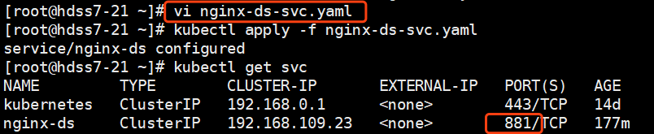

# kubernetes进阶（一）kubectl工具使用详解

## **管理k8s核心资源的三种基本方法：**

### 陈述式-主要依赖命令行工具

--可以满足90%以上的使用场景，但是缺点也很明显：

　　命令冗长，复杂，难以记忆

　　特定场景下，无法实现管理需求

　　对资源的增、删、查操作比较容易，改比较麻烦，需要patch来使用json串来更改。

　　**1.1 查看名称空间** 查询时，为了避免重名，需要指定名称空间。

```
# kubectl get namespace
简写：
# kubectl get ns
```


 

 

　　**1.2 查询命名空间中的资源**，使用-n 指定命名空间

```
# kubectl get all -n default
# kubectl get pods -n default
# kubectl get nodes -n default
```

 

　　**1.3 创建命名空间**

```
# kubectl create ns app
```


 

 

　　**1.4 删除命名空间**

```
# kubectl delete ns app
```


 

 　**1.5 创建一个deployment类型的pod控制器**：PS:1.16版本以后，控制器有变化，具体变化参考k8s官网。

　　 pod控制器类型参考：https://www.cnblogs.com/weiyiming007/p/10246118.html

```
# kubectl create deployment nginx-dp --image=harbor.od.com/public/nginx:v1.7.9 -n kube-public
# kubectl get deploy -n kube-public
```


 

 

 

　　**1.6 查看pod控制器或者pod概览信息** : -o wide

```
# kubectl get deploy -o wide -n kube-public
# kubectl get pod -o wide -n kube-public
```


 

 

 

　　**1.7 查看pod控制器、pod、service等资源的详细信息**：describe

```
# kubectl describe deploy nginx-dp -n kube-public
# kubectl describe pod nginx-dp-5dfc689474-4bhfh -n kube-public
# kubectl describe svc nginx-dp -n kube-public　
```

　详细信息太多，就不截图了。

 

　　**1.8 进入pod容器，用法和docker exec一致**，但是需要使用-n 指定命名空间

```
# kubectl exec -ti nginx-dp-5dfc689474-4bhfh /bin/bash -n kube-public
```


 

 

 

　　**1.9 删除pod容器**，此删除，只是删除了pod容器，并没有删除pod控制器，所以此操作相当于删除pod后，pod控制器在拉起一个新的pod。

```
# kubectl delete pods nginx-dp-5dfc689474-4bhfh -n kube-public
```


 

 

 可以看到我们删除pod以后，pod控制器又帮我们从新拉起了一个新的pod，想要完全删除，需要删除pod控制器。

 

　　**1.10 删除pod控制器**

```
# kubectl delete deploy nginx-dp -n kube-public
```


 

可以看到，当我们删除了pod控制器以后，pod容器也随之被删除了。

 

　　**1.11 扩容pod --replicas=数量**

```
# kubectl scale deployment nginx-dp --replicas=2 -n kube-public
```


 

 

 

 

 

　　**1.12 管理service资源 service资源**：为pod资源提供稳定的接入点

```
# kubectl create deploy nginx-dp --image=harbor.od.com/public/nginx:v1.7.9
# kubectl expose deploy nginx-dp --port=80 -n kube-public
```


 

 看到我们已经创建了一个service资源，可以通过192.168.234.234的80，访问到后面pod，为了解决pod漂移导致IP变化的问题。

可以使用ipvsadm -Ln来查看：nq为ipvs调度算法中的一种，其他调度算法请自行查阅。


 

 

我们通过删除pod的方式，让pod漂移到另一台node节点，再来查看一下：


 

 可以看到，虽然pod漂移了，但是service资源提供的接入点是不变的，这得益于ipvs的强大。


 

 

 

 

 　**1.13 查看资源配置清单详细信息**：-o yaml

```
# kubectl get pod nginx-dp-5dfc689474-c5r9r -o yaml -n kube-public
# kubectl get deploy nginx-dp -o yaml -n kube-public
# kubectl get svc -o yaml -n kube-public
```

 

　　**1.14 查看属性的定义及用法**：例：查看service资源下metadata的定义及用法

```
# kubectl explain service.metadata
```


 

### **声明式-依赖统一资源配置清单(manifest) yaml/json**

　　**2.1 创建一个svc资源配置清单**

```
# vi nginx-ds-svc.yaml
```


```
apiVersion: v1
kind: Service
metadata:
  labels:
    app: nginx-ds
  name: nginx-ds
  namespace: default
spec:
  ports:
  - port: 80
    protocol: TCP
    targetPort: 80
  selector:
    app: nginx-ds
  sessionAffinity: None
  type: ClusterIP
```


```
# kubectl create -f nginx-ds-svc.yaml
```


 

 

```
# kubectl get svc nginx-ds -o yaml -n default
```


 

 　**2.2 离线修改资源配置清单：**

　　修改资源配置清单后可以使用apply应用。

这里增加一个知识点，就是kube-apiserver这个服务当中，有一个限制端口范围的参数：--service-node-port-range 10-29999，这个参数在使用apply修改资源配置清单的时候，会有作用

如果修改后的资源配置清单中的port不在这个范围，会报错，修改这个以后，重启kube-apiserver即可。

```
# vi nginx-ds-svc.yaml #将对外暴露的端口改为881
# kubectl apply -f nginx-ds-svc.yaml
```

可以看到端口从80变成了881

 

 

 修改资源配置清单分为在线修改和离线修改（推荐离线修改）：

　　**2.3 在线修改：**我这里使用在线修改，将端口修改为888

```
# kubectl edit svc nginx-ds -n default
```


 

 　2.4 删除资源：

　　　　2.4.1 陈述式：

```
# kubectl delete svc nginx-ds -n default
```

　　　　2.4.2 声明式：

```
# kubectl delete -f nginx-ds-svc.yaml
```

 

### GUI式-主要依赖图形化操作界面(web界面)

此处省略一张图