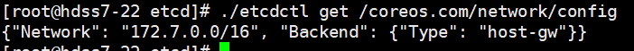
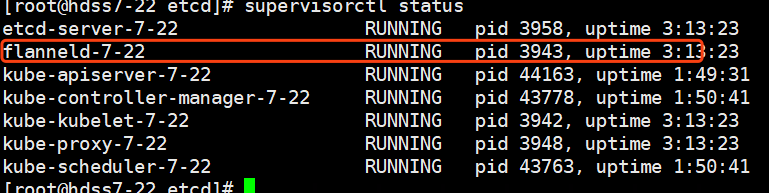
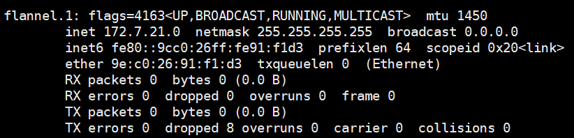
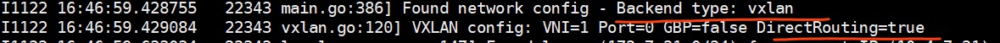

# kubernetes进阶（二）核心网络插件Flannel

**网络插件Flannel介绍：https://www.kubernetes.org.cn/3682.html**

首先，flannel利用Kubernetes API或者etcd用于存储整个集群的网络配置，其中最主要的内容为设置集群的网络地址空间。例如，设定整个集群内所有容器的IP都取自网段“10.1.0.0/16”。

接着，flannel在每个主机中运行flanneld作为agent，它会为所在主机从集群的网络地址空间中，获取一个小的网段subnet，本主机内所有容器的IP地址都将从中分配。

然后，flanneld再将本主机获取的subnet以及用于主机间通信的Public IP，同样通过kubernetes API或者etcd存储起来。

最后，flannel利用各种backend mechanism，例如udp，vxlan等等，跨主机转发容器间的网络流量，完成容器间的跨主机通信。

 

## 一、下载flannel插件

在所有node节点安装flannel插件，本次环境在hdss7-21，hdss7-22上：

```
# cd /opt/src
# wget https://github.com/coreos/flannel/releases/download/v0.11.0/flannel-v0.11.0-linux-amd64.tar.gz
# mkdir /opt/flannel-v0.11.0
# tar xf flannel-v0.11.0-linux-amd64.tar.gz -C /opt/flannel-v0.11.0/
# ln -s /opt/flannel-v0.11.0/ /opt/flannel
# cd /opt/flannel
# mkdir cert
```

因为要和apiserver通信，所以要配置client证书：

```
cert]# scp hdss7-200:/opt/certs/ca.pem . 

cert]# scp hdss7-200:/opt/certs/client.pem .

cert]# scp hdss7-200:/opt/certs/client-key.pem .
```

编辑环境变量env文件：红色部分根据node节点信息修改


```
# vi subnet.env

FLANNEL_NETWORK=172.7.0.0/16
FLANNEL_SUBNET=172.7.21.1/24
FLANNEL_MTU=1500
FLANNEL_IPMASQ=false
```


编辑启动脚本：红色部分根据node节点信息修改，并且eth0信息根据本机网卡信息修改

```
# vi flanneld.sh 
```


```
#!/bin/sh
./flanneld \
  --public-ip=10.4.7.21 \
  --etcd-endpoints=https://10.4.7.12:2379,https://10.4.7.21:2379,https://10.4.7.22:2379 \
  --etcd-keyfile=./cert/client-key.pem \
  --etcd-certfile=./cert/client.pem \
  --etcd-cafile=./cert/ca.pem \
  --iface=eth0 \
  --subnet-file=./subnet.env \
  --healthz-port=2401
```


```
# chmod u+x flanneld.sh
```

创建日志存放目录：

```
# mkdir -p /data/logs/flanneld
```

在etcd中增加网络配置信息：

```
# cd /opt/etcd
```

测试使用 host-gw模型：

```
# ./etcdctl set /coreos.com/network/config '{"Network": "172.7.0.0/16", "Backend": {"Type": "host-gw"}}'
```

查看网络模型配置：

```
# ./etcdctl get /coreos.com/network/config
```



 

 

编辑supervisor启动脚本：红色部分记得修改

```
# vi /etc/supervisord.d/flannel.ini
```


```
[program:flanneld-7-21]
command=/opt/flannel/flanneld.sh                             ; the program (relative uses PATH, can take args)
numprocs=1                                                   ; number of processes copies to start (def 1)
directory=/opt/flannel                                       ; directory to cwd to before exec (def no cwd)
autostart=true                                               ; start at supervisord start (default: true)
autorestart=true                                             ; retstart at unexpected quit (default: true)
startsecs=30                                                 ; number of secs prog must stay running (def. 1)
startretries=3                                               ; max # of serial start failures (default 3)
exitcodes=0,2                                                ; 'expected' exit codes for process (default 0,2)
stopsignal=QUIT                                              ; signal used to kill process (default TERM)
stopwaitsecs=10                                              ; max num secs to wait b4 SIGKILL (default 10)
user=root                                                    ; setuid to this UNIX account to run the program
redirect_stderr=true                                         ; redirect proc stderr to stdout (default false)
stdout_logfile=/data/logs/flanneld/flanneld.stdout.log       ; stderr log path, NONE for none; default AUTO
stdout_logfile_maxbytes=64MB                                 ; max # logfile bytes b4 rotation (default 50MB)
stdout_logfile_backups=4                                     ; # of stdout logfile backups (default 10)
stdout_capture_maxbytes=1MB                                  ; number of bytes in 'capturemode' (default 0)
stdout_events_enabled=false                                  ; emit events on stdout writes (default false)
```


更新supervisor配置：

```
# supervisorctl update
```



 

 

**这里需要修改iptables优化SNAT规则，否则在访问时，其他节点记录的是node节点的ip 10.4.7.21，而不是pod集群内部的172.7.21.x，红色部分按需修改**

```
# yum install iptables-services -y
# iptables -t nat -D POSTROUTING -s 172.7.21.0/24 ! -o docker0 -j MASQUERADE
# iptables -t nat -I POSTROUTING -s 172.7.21.0/24 ! -d 172.7.0.0/16 ! -o docker0 -j MASQUERADE
# iptables-save |grep -i postrouting
# iptables-save > /etc/sysconfig/iptables
```

修改后会影响到docker原本的iptables链的规则，所以需要重启docker服务

```
# systemctl restart docker
```

 

配置vxlan模型：

```
# cd /opt/etcd
# ./etcdctl set /coreos.com/network/config  '{"Network": "172.7.0.0/16", "Backend": {"Type": "vxlan"}}'
```

重启flanneld：

```
# supervisorctl restart flanneld-7-21
```

可以发现多了一块网卡，这块网卡就是vxlan用于隧道通信的虚拟网卡：




配置vxlan跟host-gw混合模型：

```
# ./etcdctl set /coreos.com/network/config  '{"Network": "172.7.0.0/16", "Backend": {"Type": "vxlan","Directrouting": true}}'
```

重启flanneld：

```
# supervisorctl restart flanneld-7-21
```



 