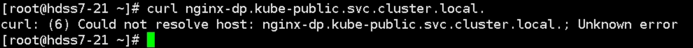
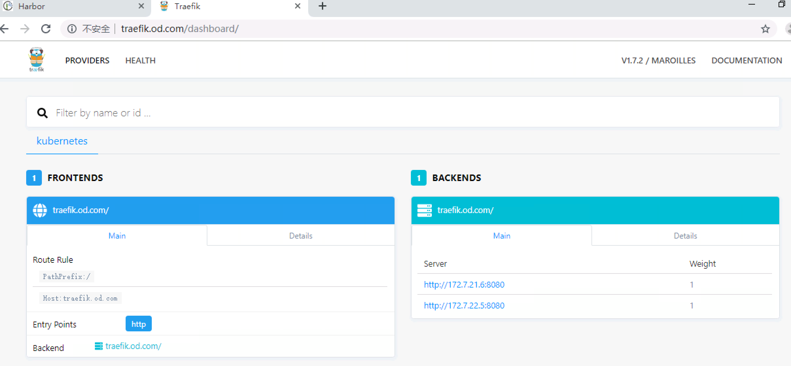

# kubernetes进阶（四）服务暴露-ingress控制器之traefik

上一章我们测试了在集群内部解析service名称，

下面我们测试在集群外部解析：



 

 根本解析不到，因为我们外部用的dns是10.4.7.11，也就是我们的自建bind dns，这个DNS服务器上也没有响应的搜索域。

如何能让集群外部访问nginx-dp？

这里有两种服务暴露方式：修改工作模式，在kube-proxy中修改，并重启

1、使用nodeport方式，但是这种方式不能使用ipvs，只能使用iptables，iptables只能使用rr调度方式。原理相当于端口映射，将容器内的端口映射到宿主机上的某个端口。

2、使用ingress，但是只能工作在七层网络下，建议暴露http, https可以使用前端nginx来做证书方面的卸载 ---推荐使用

Ingress是基于域名和URL路径，将用户的请求转发至特定的service资源。

 

下面我们部署traefik：[GITHUB官方地址](https://github.com/containous/traefik)  在hdss7-200上执行：

下载镜像：

```
# docker pull traefik:v1.7.2-alpine
# docker tag add5fac61ae5 harbor.od.com/public/traefik:v1.7.2
# docker push harbor.od.com/public/traefik:v1.7.
```

创建资源配置清单：

1.rbac.yaml

```
# cd /data/k8s-yaml/traefik/
# vi rbac.yaml
```


```
apiVersion: v1
kind: ServiceAccount
metadata:
  name: traefik-ingress-controller
  namespace: kube-system
---
apiVersion: rbac.authorization.k8s.io/v1beta1
kind: ClusterRole
metadata:
  name: traefik-ingress-controller
rules:
  - apiGroups:
      - ""
    resources:
      - services
      - endpoints
      - secrets
    verbs:
      - get
      - list
      - watch
  - apiGroups:
      - extensions
    resources:
      - ingresses
    verbs:
      - get
      - list
      - watch
---
kind: ClusterRoleBinding
apiVersion: rbac.authorization.k8s.io/v1beta1
metadata:
  name: traefik-ingress-controller
roleRef:
  apiGroup: rbac.authorization.k8s.io
  kind: ClusterRole
  name: traefik-ingress-controller
subjects:
- kind: ServiceAccount
  name: traefik-ingress-controller
  namespace: kube-system
```


2.ds.yaml

```
# vi ds.yaml
```


```
apiVersion: extensions/v1beta1
kind: DaemonSet
metadata:
  name: traefik-ingress
  namespace: kube-system
  labels:
    k8s-app: traefik-ingress
spec:
  template:
    metadata:
      labels:
        k8s-app: traefik-ingress
        name: traefik-ingress
    spec:
      serviceAccountName: traefik-ingress-controller
      terminationGracePeriodSeconds: 60
      containers:
      - image: harbor.od.com/public/traefik:v1.7.2
        name: traefik-ingress
        ports:
        - name: controller
          containerPort: 80
          hostPort: 81
        - name: admin-web
          containerPort: 8080
        securityContext:
          capabilities:
            drop:
            - ALL
            add:
            - NET_BIND_SERVICE
        args:
        - --api
        - --kubernetes
        - --logLevel=INFO
        - --insecureskipverify=true
        - --kubernetes.endpoint=https://10.4.7.10:7443
        - --accesslog
        - --accesslog.filepath=/var/log/traefik_access.log
        - --traefiklog
        - --traefiklog.filepath=/var/log/traefik.log
        - --metrics.prometheus
```


3.svc.yaml

```
# vi svc.yaml
```


```
kind: Service
apiVersion: v1
metadata:
  name: traefik-ingress-service
  namespace: kube-system
spec:
  selector:
    k8s-app: traefik-ingress
  ports:
    - protocol: TCP
      port: 80
      name: controller
    - protocol: TCP
      port: 8080
      name: admin-web
```


4.ingress.yaml

```
# vi ingress.yaml
```


```
apiVersion: extensions/v1beta1
kind: Ingress
metadata:
  name: traefik-web-ui
  namespace: kube-system
  annotations:
    kubernetes.io/ingress.class: traefik
spec:
  rules:
  - host: traefik.od.com
    http:
      paths:
      - path: /
        backend:
          serviceName: traefik-ingress-service
          servicePort: 8080
```


 

然后到node节点上创建资源：

```
# kubectl create -f http://k8s-yaml.od.com/traefik/rbac.yaml
# kubectl create -f http://k8s-yaml.od.com/traefik/ds.yaml
# kubectl create -f http://k8s-yaml.od.com/traefik/svc.yaml
# kubectl create -f http://k8s-yaml.od.com/traefik/ingress.yaml
```

 

配置nginx解析：hdss7-11,hdss7-12

```
# vi /etc/nginx/conf.d/od.com.conf
```


```
upstream default_backend_traefik {
    server 10.4.7.21:81    max_fails=3 fail_timeout=10s;
    server 10.4.7.22:81    max_fails=3 fail_timeout=10s;
}
server {
    server_name *.od.com;
  
    location / {
        proxy_pass http://default_backend_traefik;
        proxy_set_header Host       $http_host;
        proxy_set_header x-forwarded-for $proxy_add_x_forwarded_for;
    }
}
```


 

在hdss7-11上添加域名解析：在ingress.yaml中的host值：

```
# vi /var/named/od.com.zone
```

在最后加上traefik的域名解析：


```
$ORIGIN od.com.
$TTL 600        ; 10 minutes
@               IN SOA  dns.od.com. dnsadmin.od.com. (
                                2019061804 ; serial
                                10800      ; refresh (3 hours)
                                900        ; retry (15 minutes)
                                604800     ; expire (1 week)
                                86400      ; minimum (1 day)
                                )
                                NS   dns.od.com.
$TTL 60 ; 1 minute
dns                A    10.4.7.11
harbor             A    10.4.7.200
k8s-yaml           A    10.4.7.200
traefik            A    10.4.7.10
```


```
# systemctl restart named
```

然后我们就可以在集群外，通过浏览器访问这个域名了：

```
http://traefik.od.com  #我们的宿主机的虚拟网卡指定了bind域名解析服务器
```



 

    分类:             [Kubernetes](https://www.cnblogs.com/slim-liu/category/1588426.html)