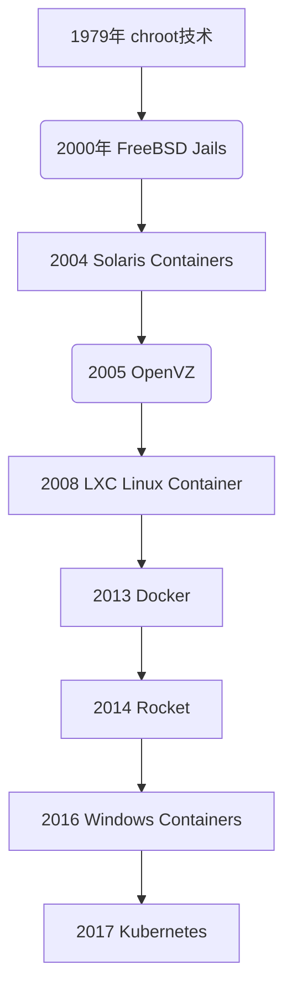

# NameSpace 资源隔离

- 只有实现如下隔离才能说应用程序是完全隔离的

| 内容  | 备注                       | 内核版本 |
| ----- | -------------------------- | -------- |
| PID   | 进程编号                   | 2.6.24   |
| NET   | 网络设备、网络协议栈、端口 | 2.6.29   |
| IPC   | 信号量、消息队列、共享内存 | 2.6.19   |
| MOUNT | 文件系统                   | 2.4.19   |
| UTS   | 用户名和主机域             | 2.6.19   |
| USER  | 操作系统的用户和用户组     | 3.8.x    |

容器技术发展 
