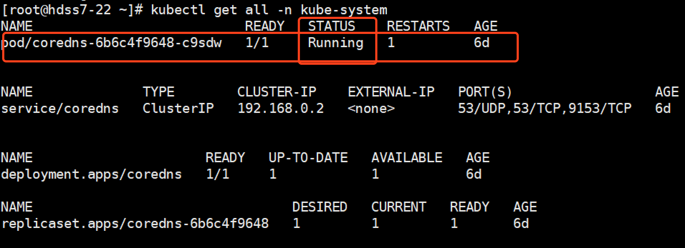
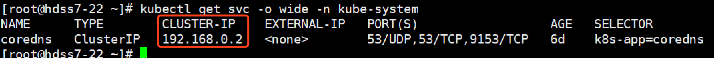
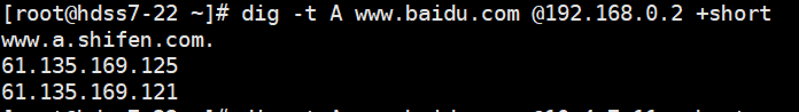
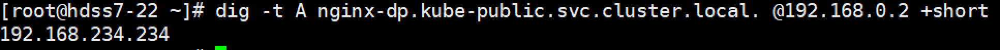
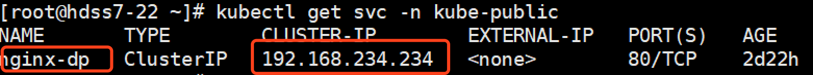
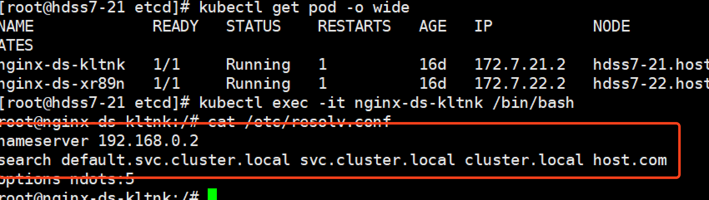

服务发现，说白了就是服务(应用)之间相互定位的过程。

服务发现需要解决的问题：

　　1、服务动态性强--容器在k8s中ip变化或迁移

　　2、更新发布频繁--版本迭代快

　　3、支持自动伸缩--大促或流量高峰

我们为了解决pod地址变化的问题，我们之前部署了service资源，将pod地址通过service资源暴露的固定地址，来解决以上问题，

那么，如何解决service资源名称和service资源暴露出来的集群网络IP做自动的对应呢，从而达到服务的自动发现呢？

在k8s中，coredns就是为了解决以上问题。

 

从coredns开始，我们采用向k8s中交付容器的方式，来部署服务，并且使用声明式的方式，来部署服务。

首先在hdss7-200上创建一个nginx虚拟主机，用来获取资源配置清单：

```
vi /etc/nginx/conf.d/k8s-yaml.od.com.conf
```


```
server {
    listen       80;
    server_name  k8s-yaml.od.com;

    location / {
        autoindex on;
        default_type text/plain;
        root /data/k8s-yaml;
    }
}
```


```
# mkdir -p /data/k8s-yaml/coredns# nginx -t
# nginx -s reload
```

添加域名解析：hdss-11上


```
# vi /var/named/od.com.zone
在最后添加一条解析记录

$ORIGIN od.com.
$TTL 600        ; 10 minutes
@               IN SOA  dns.od.com. dnsadmin.od.com. (
                                2019061803 ; serial
                                10800      ; refresh (3 hours)
                                900        ; retry (15 minutes)
                                604800     ; expire (1 week)
                                86400      ; minimum (1 day)
                                )
                                NS   dns.od.com.
$TTL 60 ; 1 minute
dns                A    10.4.7.11
harbor             A    10.4.7.200
k8s-yaml           A    10.4.7.200
```


```
# systemctl restart named
```

coredns github地址：

https://github.com/kubernetes/kubernetes/blob/master/cluster/addons/dns/coredns/coredns.yaml.base

 

在hdss7-200上部署coredns：

```
# cd /data/k8s-yaml/coredns
# docker pull docker.io/coredns/coredns:1.6.1
# docker tag c0f6e815079e harbor.od.com/public/coredns:v1.6.1
# docker push harbor.od.com/public/coredns:v1.6.1
```

然后编辑资源配置清单：可以从官网上参考资源配置清单

1.rbac.yaml--拿到集群相关权限

```
# vi rbac.yaml
```


```
apiVersion: v1
kind: ServiceAccount
metadata:
  name: coredns
  namespace: kube-system
  labels:
      kubernetes.io/cluster-service: "true"
      addonmanager.kubernetes.io/mode: Reconcile
---
apiVersion: rbac.authorization.k8s.io/v1
kind: ClusterRole
metadata:
  labels:
    kubernetes.io/bootstrapping: rbac-defaults
    addonmanager.kubernetes.io/mode: Reconcile
  name: system:coredns
rules:
- apiGroups:
  - ""
  resources:
  - endpoints
  - services
  - pods
  - namespaces
  verbs:
  - list
  - watch
---
apiVersion: rbac.authorization.k8s.io/v1
kind: ClusterRoleBinding
metadata:
  annotations:
    rbac.authorization.kubernetes.io/autoupdate: "true"
  labels:
    kubernetes.io/bootstrapping: rbac-defaults
    addonmanager.kubernetes.io/mode: EnsureExists
  name: system:coredns
roleRef:
  apiGroup: rbac.authorization.k8s.io
  kind: ClusterRole
  name: system:coredns
subjects:
- kind: ServiceAccount
  name: coredns
  namespace: kube-system
```


2.cm.yaml--configmap 对集群的相关配置

```
# vi cm.yaml
```


```
apiVersion: v1
kind: ConfigMap
metadata:
  name: coredns
  namespace: kube-system
data:
  Corefile: |
    .:53 {
        errors
        log
        health
        ready
        kubernetes cluster.local 192.168.0.0/16  #service资源cluster地址
        forward . 10.4.7.11   #上级DNS地址
        cache 30
        loop
        reload
        loadbalance
       }
```


3.dp.yaml---pod控制器

```
# vi dp.yaml
```


```
apiVersion: apps/v1
kind: Deployment
metadata:
  name: coredns
  namespace: kube-system
  labels:
    k8s-app: coredns
    kubernetes.io/name: "CoreDNS"
spec:
  replicas: 1
  selector:
    matchLabels:
      k8s-app: coredns
  template:
    metadata:
      labels:
        k8s-app: coredns
    spec:
      priorityClassName: system-cluster-critical
      serviceAccountName: coredns
      containers:
      - name: coredns
        image: harbor.od.com/public/coredns:v1.6.1
        args:
        - -conf
        - /etc/coredns/Corefile
        volumeMounts:
        - name: config-volume
          mountPath: /etc/coredns
        ports:
        - containerPort: 53
          name: dns
          protocol: UDP
        - containerPort: 53
          name: dns-tcp
          protocol: TCP
        - containerPort: 9153
          name: metrics
          protocol: TCP
        livenessProbe:
          httpGet:
            path: /health
            port: 8080
            scheme: HTTP
          initialDelaySeconds: 60
          timeoutSeconds: 5
          successThreshold: 1
          failureThreshold: 5
      dnsPolicy: Default
      volumes:
        - name: config-volume
          configMap:
            name: coredns
            items:
            - key: Corefile
              path: Corefile
```


4.svc.yaml---service资源

```
# vi svc.yaml
```


```
apiVersion: v1
kind: Service
metadata:
  name: coredns
  namespace: kube-system
  labels:
    k8s-app: coredns
    kubernetes.io/cluster-service: "true"
    kubernetes.io/name: "CoreDNS"
spec:
  selector:
    k8s-app: coredns
  clusterIP: 192.168.0.2
  ports:
  - name: dns
    port: 53
    protocol: UDP
  - name: dns-tcp
    port: 53
  - name: metrics
    port: 9153
    protocol: TCP
```


然后使用http请求资源配置清单yaml的方式来创建资源：在任意node节点上创建


```
# kubectl create -f http://k8s-yaml.od.com/coredns/rbac.yaml
# kubectl create -f http://k8s-yaml.od.com/coredns/cm.yaml
# kubectl create -f http://k8s-yaml.od.com/coredns/dp.yaml
# kubectl create -f http://k8s-yaml.od.com/coredns/svc.yaml
```


查看运行情况：

```
# kubectl get all -n kube-system
```



 

 查看coredns的cluster ip：

```
# kubectl get svc -o wide -n kube-system
```



 

 测试coredns：

```
# dig -t A www.baidu.com @192.168.0.2 +short
```



 

 看到已经可以解析到百度。

测试coredns解析service资源名称，首先查看kube-public下是否有service资源，如果没有，创建一个，使用kubectl expose nginx-dp --port=80 -n kube-public

```
# kubectl expose nginx-dp --port=80 -n kube-public
```

测试：使用coredns测试解析，需要使用SQDN规则

```
# dig -t A nginx-dp.kube-public.svc.cluster.local. @192.168.0.2 +short
```



 

 可以看到我们没有手动添加任何解析记录，我们nginx-dp的service资源的IP，已经被解析了：



 

 那么为什么呢？

推荐大家了解一下coredns都做了什么：[Kubernetes内部域名解析原理、弊端及优化方式](http://ccnuo.com/2019/08/25/CoreDNS：Kubernetes内部域名解析原理、弊端及优化方式/)

大家可以看到，当我进入到pod内部以后，我们会发现我们的dns地址是我们的coredns地址，以及搜索域：



 

 

 

现在，我们已经解决了在集群内部解析的问题，但是我们怎么做到在集群外部访问我们的服务呢？

接下来我们来学习k8s服务暴露。

 

 

 

 

 

 

 