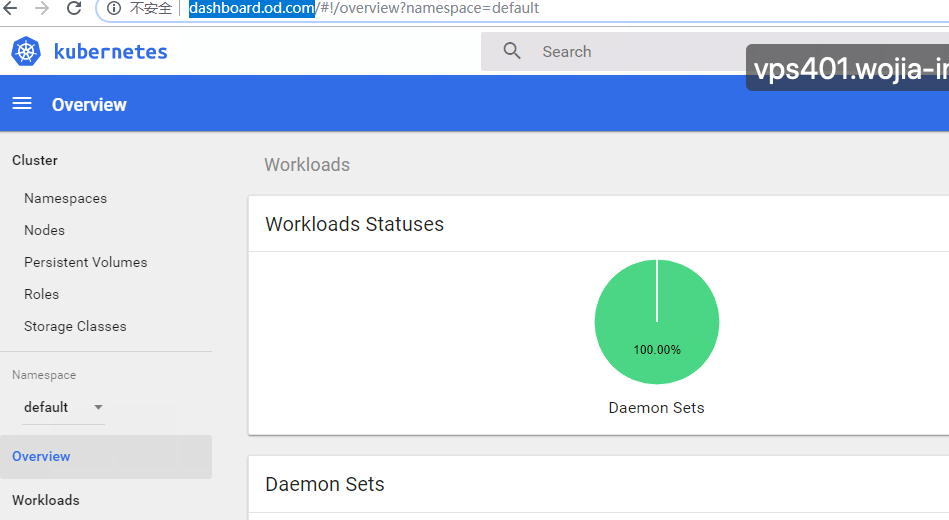
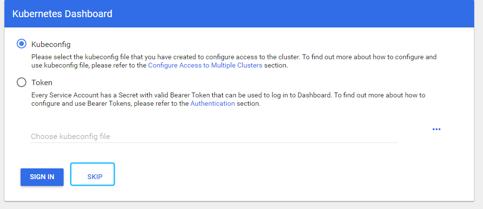
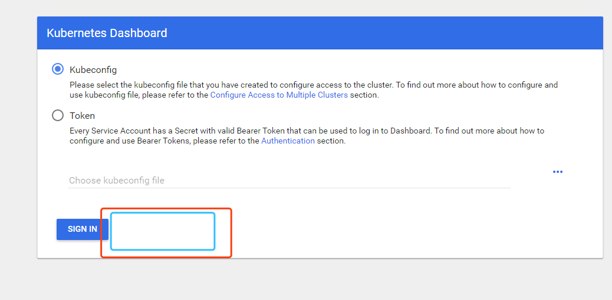
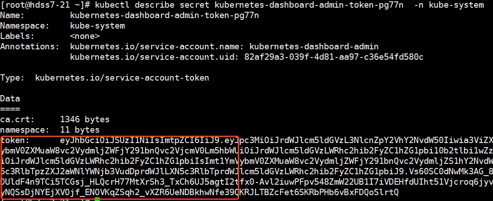
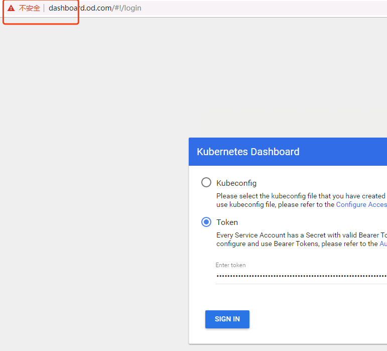
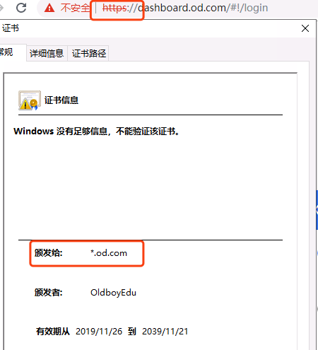
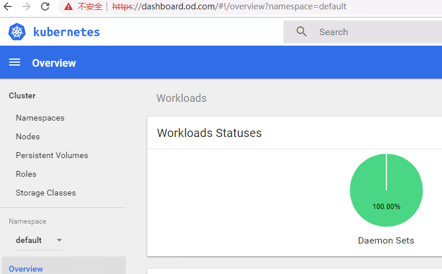

dashboard是k8s的可视化管理平台，是三种管理k8s集群方法之一

首先下载镜像上传到我们的私有仓库中：hdss7-200

```
# docker pull k8scn/kubernetes-dashboard-amd64:v1.8.3
# docker tag fcac9aa03fd6 harbor.od.com/public/dashboard:v1.8.3
# docker push harbor.od.com/public/dashboard:v1.8.3
```

编辑dashboard资源配置清单：

1、rbac.yaml

```
# vi rbac.yaml
```


```
# mkdir -p /data/k8s-yaml/dashboard
# cd /data/k8s-yaml/dashboard
apiVersion: v1
kind: ServiceAccount
metadata:
  labels:
    k8s-app: kubernetes-dashboard
    addonmanager.kubernetes.io/mode: Reconcile
  name: kubernetes-dashboard-admin
  namespace: kube-system
---
apiVersion: rbac.authorization.k8s.io/v1
kind: ClusterRoleBinding
metadata:
  name: kubernetes-dashboard-admin
  namespace: kube-system
  labels:
    k8s-app: kubernetes-dashboard
    addonmanager.kubernetes.io/mode: Reconcile
roleRef:
  apiGroup: rbac.authorization.k8s.io
  kind: ClusterRole
  name: cluster-admin
subjects:
- kind: ServiceAccount
  name: kubernetes-dashboard-admin
  namespace: kube-system
```


2、dp.yaml

```
# vi dp.yaml
```


```
apiVersion: apps/v1
kind: Deployment
metadata:
  name: kubernetes-dashboard
  namespace: kube-system
  labels:
    k8s-app: kubernetes-dashboard
    kubernetes.io/cluster-service: "true"
    addonmanager.kubernetes.io/mode: Reconcile
spec:
  selector:
    matchLabels:
      k8s-app: kubernetes-dashboard
  template:
    metadata:
      labels:
        k8s-app: kubernetes-dashboard
      annotations:
        scheduler.alpha.kubernetes.io/critical-pod: ''
    spec:
      priorityClassName: system-cluster-critical
      containers:
      - name: kubernetes-dashboard
        image: harbor.od.com/public/dashboard:v1.8.3
        resources:
          limits:
            cpu: 100m
            memory: 300Mi
          requests:
            cpu: 50m
            memory: 100Mi
        ports:
        - containerPort: 8443
          protocol: TCP
        args:
          # PLATFORM-SPECIFIC ARGS HERE
          - --auto-generate-certificates
        volumeMounts:
        - name: tmp-volume
          mountPath: /tmp
        livenessProbe:
          httpGet:
            scheme: HTTPS
            path: /
            port: 8443
          initialDelaySeconds: 30
          timeoutSeconds: 30
      volumes:
      - name: tmp-volume
        emptyDir: {}
      serviceAccountName: kubernetes-dashboard-admin
      tolerations:
      - key: "CriticalAddonsOnly"
        operator: "Exists"
```


3、svc.yaml

```
# vi svc.yaml
```


```
apiVersion: v1
kind: Service
metadata:
  name: kubernetes-dashboard
  namespace: kube-system
  labels:
    k8s-app: kubernetes-dashboard
    kubernetes.io/cluster-service: "true"
    addonmanager.kubernetes.io/mode: Reconcile
spec:
  selector:
    k8s-app: kubernetes-dashboard
  ports:
  - port: 443
    targetPort: 8443
```


4、ingress.yaml

```
# vi ingress.yaml
```


```
apiVersion: extensions/v1beta1
kind: Ingress
metadata:
  name: kubernetes-dashboard
  namespace: kube-system
  annotations:
    kubernetes.io/ingress.class: traefik
spec:
  rules:
  - host: dashboard.od.com
    http:
      paths:
      - backend:
          serviceName: kubernetes-dashboard
          servicePort: 443
```


创建资源：任意node

```
# kubectl create -f http://k8s-yaml.od.com/dashboard/rbac.yaml
# kubectl create -f http://k8s-yaml.od.com/dashboard/dp.yaml
# kubectl create -f http://k8s-yaml.od.com/dashboard/svc.yaml
# kubectl create -f http://k8s-yaml.od.com/dashboard/ingress.yaml
```

添加域名解析：

```
# vi /var/named/od.com.zone
dashboard          A    10.4.7.10
# systemctl restart named
```

通过浏览器访问：

[http://dashboard.od.com](http://dashboard.od.com/)



 

 

美好的点点点运维开始了~

 

但是，我们可以看到我们安装1.8版本的dashboard，默认是可以跳过验证的：



 

 

很显然，跳过登录，是不科学的，因为我们在配置dashboard的rbac权限时，绑定的角色是system:admin，这个是集群管理员的角色，权限很大，所以这里我们把版本换成1.10以上版本

下载1.10.1版本：

```
# docker pull loveone/kubernetes-dashboard-amd64:v1.10.1
# docker tag f9aed6605b81 harbor.od.com/public/dashboard:v1.10.1
# docker push harbor.od.com/public/dashboard:v1.10.1
```

修改dp.yaml重新应用，我直接用edit修改了，没有使用apply

```
# kubectl edit deploy kubernetes-dashboard -n kube-system
```

等待滚动发布完成后，在刷新dashboard页面：



 

 可以看到这里原来的skip跳过已经没有了，我们如果想登陆，必须输入token，那我们如何获取token呢：

 

```
# kubectl get secret  -n kube-system
# kubectl describe secret kubernetes-dashboard-admin-token-pg77n  -n kube-system
```



 

 这样我们就拿到了token，接下来我们试试能不能登录：

我们发现我们还是无法登录，原因是必须使用https登录，接下来我们需要申请证书：



 

 

接下来我们申请证书：

 依然使用cfssl来申请证书：hdss7-200

```
# cd /opt/certs/
# vi dashboard-csr.json
```


```
{
    "CN": "*.od.com",
    "hosts": [
    ],
    "key": {
        "algo": "rsa",
        "size": 2048
    },
    "names": [
        {
            "C": "CN",
            "ST": "beijing",
            "L": "beijing",
            "O": "od",
            "OU": "ops"
        }
    ]
}
```


```
# cfssl gencert -ca=ca.pem -ca-key=ca-key.pem -config=ca-config.json -profile=server dashboard-csr.json |cfssl-json -bare dashboard
```

然后拷贝到我们nginx的服务器上：7-11 7-12 都需要

```
# cd /etc/nginx/
# mkdir certs
# cd certs
# scp hdss7-200:/opt/cert/dash* ./
# cd /etc/nginx/conf.d/
# vi dashboard.od.com.conf
```


```
server {
    listen       80;
    server_name  dashboard.od.com;

    rewrite ^(.*)$ https://${server_name}$1 permanent;
}
server {
    listen       443 ssl;
    server_name  dashboard.od.com;

    ssl_certificate "certs/dashboard.pem";
    ssl_certificate_key "certs/dashboard-key.pem";
    ssl_session_cache shared:SSL:1m;
    ssl_session_timeout  10m;
    ssl_ciphers HIGH:!aNULL:!MD5;
    ssl_prefer_server_ciphers on;

    location / {
        proxy_pass http://default_backend_traefik;
        proxy_set_header Host       $http_host;
        proxy_set_header x-forwarded-for $proxy_add_x_forwarded_for;
    }
}
```


```
# nginx -t
# nginx -s reload
```

然后刷新页面：虽然证书无效(因为是自签证书)，但是已经是https了，试下我们刚才的token能不能登录了



 

 



 

 

可以登录了~

登录是登录了，但是我们要思考一个问题，我们使用rbac授权来访问dashboard,如何做到权限精细化呢？比如开发，只能看，不能摸，不同的项目组，看到的资源应该是不一样的，测试看到的应该是测试相关的资源。

我们在下一章详解sa授权和ua授权。

    分类:             [Kubernetes](https://www.cnblogs.com/slim-liu/category/1588426.html)