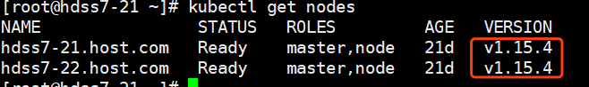
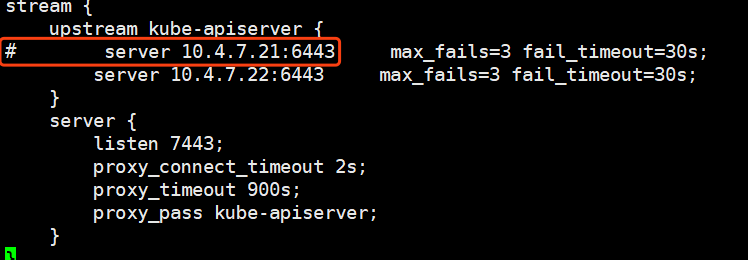
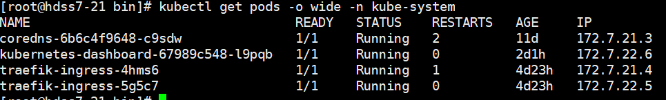
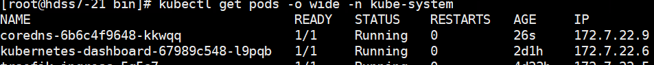
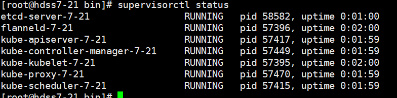
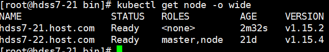

当我们遇到K8S有漏洞的时候，或者为了满足需求，有时候可能会需要升级或者降级版本，

为了减少对业务的影响，尽量选择在业务低谷的时候来升级：

首先准备好文件：我这里选择的是内网文件服务器上下载的，请自行下载所需的k8s源文件：3

这里演示更换一个节点：7-21

查看版本：将7-21更换成1.15.2



 

 

```
# cd /opt/src
```


```
# wget http://192.168.1.60:8080/day1/kubernetes-server-linux-amd64-v1.15.2.tar.gz
# tar -zxf kubernetes-server-linux-amd64-v1.15.2.tar.gz
# cd .. 
# cp -r kubernetes /opt/kubernetes-v1.15.2
# cd kubernetes-v1.15.2/
# rm -rf kubernetes-src.tar.gz
# cd server/bin/ 
# rm -rf *.tar
# rm -rf *tag
# mkdir cert conf
# cp /opt/kubernetes-v1.15.4/server/bin/cert/* ./cert/
# cp /opt/kubernetes-v1.15.4/server/bin/conf/* ./conf/
# cp /opt/kubernetes-v1.15.4/server/bin/*.sh /opt/kubernetes-v1.15.2/server/bin/
```


然后在nginx上摘除api-server的四层负载：7-11，7-12

```
# vi /etc/nginx/nginx.conf
```

把我们要升级的apiserver节点注释掉：



```
# nginx -t
# nginx -s reload
```

准备好后，摘除node，先看下哪个node上跑的pod少：我们这里一样多，那我们就搞7-21，



 

 

```
# kubectl delete node hdss7-21.host.com
```



 

我们的coredns已经从node7-21迁移到了7-22上，接下来我们更换软连接：

```
# rm -rf kubernetes
# ln -s /opt/kubernetes-v1.15.2 /opt/kubernetes
```

然后重启使用supervisor重启服务：生产上记得一个一个重启，我们这里为了方便，直接重启所有：

```
# supervisorctl restart all
```



 

 启动成功后，查看版本：



 

 可以看到node版本已经从1.15.4变更为了1.15.2，并且kubelet已经自动帮我们把节点加入到了集群，然后打开nginx负载，即可。