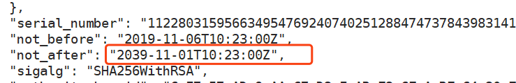

# 二进制安装kubernetes（七）部署知识点总结

1、k8s各个组件之间通信，在高版本中，基本都是使用TSL通信，所以申请证书，是必不可少的，而且建议使用二进制安装，或者在接手一套K8S集群的时候，第一件事情是检查证书有效期，证书过期或者TSL通信问题会报x509相关错误。

可以从k8s kubelet-kuberconfig 使用 echo '证书' | base64 -d 反解获得k8s证书(比如阿里云)

```
# cfssl-certinfo -domain=ca.pem -cert=client.pem
```



 

 

2、在安装k8s运算节点的时候，建议关闭kubelet节点的swap交换分区，否则要在启动脚本中指定--fail-swap-on="false"，在屋里内存足够大的情况下，建议关闭交换分区。

 

3、etcd在大规模集群中，可以跟apiserver、controller-manager、scheduler分开部署，但是apiserver、controller-manager、scheduler这三个服务，尽量部署在一起，因为controller-manager、scheduler跟apiserver通信是使用本机的127.0.0.1:8080端口进行通信，这样会节省网络资源。

 

4、linux内核版本大于3.8.X

 

5、使用supervisord管理服务的时候，为了避免在重启的时候出现端口存在(默认supervisord不会stop子进程)，需要在服务的.ini配置文件中添加以下两项：

```
killasgroup=true  #这个东西主要用于，supervisord管理的子进程，这个子进程本身还有，子进程。那么我们如果仅仅干掉supervisord的子进程的话，子进程的子进程，有可能会变成孤儿进程。所以咱们可以设置可个选项，把整个该子进程的，整个进程组都干掉。 设置为true的话，一般killasgroup也会被设置为true。需要注意的是，该选项发送的是stop信号，默认为false。。非必须设置。
stopasgroup=true  #这个和上面的stopasgroup类似，不过发送的是kill信号
```