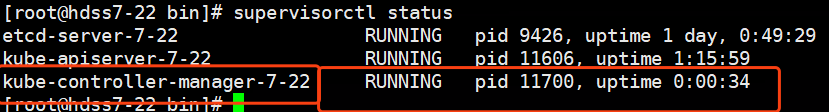

### Controller Manager简介

详细介绍请参考链接：[Kubernetes组件之kube-controller-manager](https://blog.csdn.net/bbwangj/article/details/82557705)

Controller  Manager作为集群内部的管理控制中心，负责集群内的Node、Pod副本、服务端点（Endpoint）、命名空间（Namespace）、服务账号（ServiceAccount）、资源定额（ResourceQuota）的管理，当某个Node意外宕机时，Controller Manager会及时发现并执行自动化修复流程，确保集群始终处于预期的工作状态。


 

 

 每个Controller通过API Server提供的接口实时监控整个集群的每个资源对象的当前状态，当发生各种故障导致系统状态发生变化时，会尝试将系统状态修复到“期望状态”。

 

controller-manager安装在apiserver节点服务器上，hdss7-21，22：

编辑controller-manager启动脚本：

```
# vi /opt/kubernetes/server/bin/kube-controller-manager.sh
```


```
#!/bin/sh
./kube-controller-manager \
  --cluster-cidr 172.7.0.0/16 \
  --leader-elect true \
  --log-dir /data/logs/kubernetes/kube-controller-manager \
  --master http://127.0.0.1:8080 \
  --service-account-private-key-file ./cert/ca-key.pem \
  --service-cluster-ip-range 192.168.0.0/16 \
  --root-ca-file ./cert/ca.pem \
  --v 2
```


执行权限：

```
# chmod +x /opt/kubernetes/server/bin/kube-controller-manager.sh
```

创建日志存储目录：

```
# mkdir -p /data/logs/kubernetes/kube-controller-manager
```

编辑supervisord启动脚本：红色字体部分根据部署主机修改

```
# vi /etc/supervisord.d/kube-conntroller-manager.ini
```


添加supervisord：

```
# supervisorctl update
```

检查状态：

```
# supervisorctl status
```



 

 

至此 controller manager已经部署完成，接下来部署kube-scheduler。