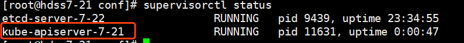
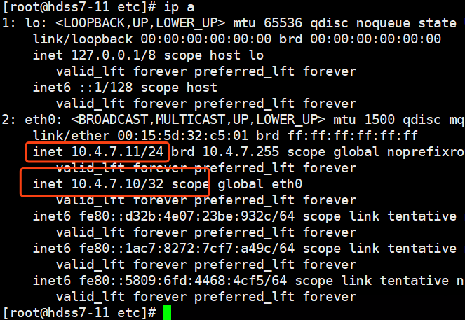
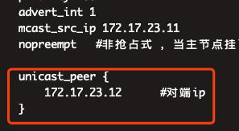

根据架构图，我们的apiserver部署在hdss7-21和hdss7-22上：

首先在hdss7-200上申请证书并拷贝到21和22上：

创建证书文件：

 

```
# cd /opt/certs
# vi client-csr.json
```


```
{
    "CN": "k8s-node",
    "hosts": [
    ],
    "key": {
        "algo": "rsa",
        "size": 2048
    },
    "names": [
        {
            "C": "CN",
            "ST": "beijing",
            "L": "beijing",
            "O": "od",
            "OU": "ops"
        }
    ]
}
```


申请证书：

```
# cfssl gencert -ca=ca.pem -ca-key=ca-key.pem -config=ca-config.json -profile=client client-csr.json |cfssl-json -bare client
# vi apiserver-csr.json
知识点：
这个证书目前专属于 apiserver加了一个 *.kubernetes.master 域名以便内部私有 DNS 解析使用(可删除)；至于很多人问过 kubernetes 这几个能不能删掉，答案是不可以的；因为当集群创建好后，default namespace 下会创建一个叫 kubenretes 的 svc，有一些组件会直接连接这个 svc 来跟 api 通讯的，证书如果不包含可能会出现无法连接的情况；其他几个 kubernetes 开头的域名作用相同
   hosts包含的是授权范围，不在此范围的的节点或者服务使用此证书就会报证书不匹配错误。
```


```
{
    "CN": "k8s-apiserver",
    "hosts": [
        "127.0.0.1",
        "192.168.0.1",
        "kubernetes.default",
        "kubernetes.default.svc",
        "kubernetes.default.svc.cluster",
        "kubernetes.default.svc.cluster.local",
        "10.4.7.10",
        "10.4.7.21",
        "10.4.7.22",
        "10.4.7.23"
    ],
    "key": {
        "algo": "rsa",
        "size": 2048
    },
    "names": [
        {
            "C": "CN",
            "ST": "beijing",
            "L": "beijing",
            "O": "od",
            "OU": "ops"
        }
    ]
}
```


```
# cfssl gencert -ca=ca.pem -ca-key=ca-key.pem -config=ca-config.json -profile=server apiserver-csr.json |cfssl-json -bare apiserver
```

下载kubernetes，放到21，22服务器上，官方地址：https://kubernetes.io/docs/tasks/tools/install-kubectl/#install-kubectl-binary-via-curl

我这里用的是1.15版本，下载后操作：21,22上操作

```
# cd /opt/src
# tar -zxf kubernetes-server-linux-amd64-v1.15.4.tar.gz -C ../
# cd ..
# mv kubernetes/ kubernetes-1.15
# ln -s /opt/kubernetes-1.15/ /opt/kubernete
```

创建证书和配置文件存放目录：

```
# mkdir /opt/kubernetes/server/bin/cert /opt/kubernetes/server/bin/conf
```

接下来拷贝证书，将apiserver证书拷贝到hdss7-21,7-22上：


```
# cd /opt/kubernetes/server/bin/cert# scp hdss7-200:/opt/certs/ca.pem ./
# scp hdss7-200:/opt/certs/apiserver.pem ./
# scp hdss7-200:/opt/certs/apiserver-key.pem ./
# scp hdss7-200:/opt/certs/ca-key.pem ./
# scp hdss7-200:/opt/certs/client-key.pem ./
# scp hdss7-200:/opt/certs/client.pem ./
```


进入配置文件目录：

```
# cd /opt/kubernetes/server/bin/conf
```

编辑配置文件：

```
# vi audit.yaml
```


```
apiVersion: audit.k8s.io/v1beta1 # This is required.
kind: Policy
# Don't generate audit events for all requests in RequestReceived stage.
omitStages:
  - "RequestReceived"
rules:
  # Log pod changes at RequestResponse level
  - level: RequestResponse
    resources:
    - group: ""
      # Resource "pods" doesn't match requests to any subresource of pods,
      # which is consistent with the RBAC policy.
      resources: ["pods"]
  # Log "pods/log", "pods/status" at Metadata level
  - level: Metadata
    resources:
    - group: ""
      resources: ["pods/log", "pods/status"]

  # Don't log requests to a configmap called "controller-leader"
  - level: None
    resources:
    - group: ""
      resources: ["configmaps"]
      resourceNames: ["controller-leader"]

  # Don't log watch requests by the "system:kube-proxy" on endpoints or services
  - level: None
    users: ["system:kube-proxy"]
    verbs: ["watch"]
    resources:
    - group: "" # core API group
      resources: ["endpoints", "services"]

  # Don't log authenticated requests to certain non-resource URL paths.
  - level: None
    userGroups: ["system:authenticated"]
    nonResourceURLs:
    - "/api*" # Wildcard matching.
    - "/version"

  # Log the request body of configmap changes in kube-system.
  - level: Request
    resources:
    - group: "" # core API group
      resources: ["configmaps"]
    # This rule only applies to resources in the "kube-system" namespace.
    # The empty string "" can be used to select non-namespaced resources.
    namespaces: ["kube-system"]

  # Log configmap and secret changes in all other namespaces at the Metadata level.
  - level: Metadata
    resources:
    - group: "" # core API group
      resources: ["secrets", "configmaps"]

  # Log all other resources in core and extensions at the Request level.
  - level: Request
    resources:
    - group: "" # core API group
    - group: "extensions" # Version of group should NOT be included.

  # A catch-all rule to log all other requests at the Metadata level.
  - level: Metadata
    # Long-running requests like watches that fall under this rule will not
    # generate an audit event in RequestReceived.
    omitStages:
      - "RequestReceived"
```


便携启动脚本：

```
# vi /opt/kubernetes/server/bin/kube-apiserver.sh
```


```
#!/bin/bash
./kube-apiserver \
  --apiserver-count 2 \
  --audit-log-path /data/logs/kubernetes/kube-apiserver/audit-log \
  --audit-policy-file ./conf/audit.yaml \
  --authorization-mode RBAC \
  --client-ca-file ./cert/ca.pem \
  --requestheader-client-ca-file ./cert/ca.pem \
  --enable-admission-plugins NamespaceLifecycle,LimitRanger,ServiceAccount,DefaultStorageClass,DefaultTolerationSeconds,MutatingAdmissionWebhook,ValidatingAdmissionWebhook,ResourceQuota \
  --etcd-cafile ./cert/ca.pem \
  --etcd-certfile ./cert/client.pem \
  --etcd-keyfile ./cert/client-key.pem \
  --etcd-servers https://10.4.7.12:2379,https://10.4.7.21:2379,https://10.4.7.22:2379 \
  --service-account-key-file ./cert/ca-key.pem \
  --service-cluster-ip-range 192.168.0.0/16 \
  --service-node-port-range 3000-29999 \
  --target-ram-mb=1024 \
  --kubelet-client-certificate ./cert/client.pem \
  --kubelet-client-key ./cert/client-key.pem \
  --log-dir  /data/logs/kubernetes/kube-apiserver \
  --tls-cert-file ./cert/apiserver.pem \
  --tls-private-key-file ./cert/apiserver-key.pem \
  --v 2
```


```
# chmod +x /opt/kubernetes/server/bin/kube-apiserver.sh
```

编写supervisord启动文件：红色部分对应主机修改

```
[program:kube-apiserver-7-21]
command=/opt/kubernetes/server/bin/kube-apiserver.sh            ; the program (relative uses PATH, can take args)
numprocs=1                                                      ; number of processes copies to start (def 1)
directory=/opt/kubernetes/server/bin                            ; directory to cwd to before exec (def no cwd)
autostart=true                                                  ; start at supervisord start (default: true)
autorestart=true                                                ; retstart at unexpected quit (default: true)
startsecs=30                                                    ; number of secs prog must stay running (def. 1)
startretries=3                                                  ; max # of serial start failures (default 3)
exitcodes=0,2                                                   ; 'expected' exit codes for process (default 0,2)
stopsignal=QUIT                                                 ; signal used to kill process (default TERM)
stopwaitsecs=10                                                 ; max num secs to wait b4 SIGKILL (default 10)
user=root                                                       ; setuid to this UNIX account to run the program
redirect_stderr=true                                            ; redirect proc stderr to stdout (default false)
stdout_logfile=/data/logs/kubernetes/kube-apiserver/apiserver.stdout.log        ; stderr log path, NONE for none; default AUTO
stdout_logfile_maxbytes=64MB                                    ; max # logfile bytes b4 rotation (default 50MB)
stdout_logfile_backups=4                                        ; # of stdout logfile backups (default 10)
stdout_capture_maxbytes=1MB                                     ; number of bytes in 'capturemode' (default 0)
stdout_events_enabled=false                                     ; emit events on stdout writes (default false)
```


创建日志存放目录：

```
# mkdir -p /data/logs/kubernetes/kube-apiserver
```

更新supervisord：

```
# supervisorctl update
```

检查是否启动：

```
# supervisorctl status
```



 

 

至此，kube-apiserver核心组件已经安装完成，接下来要对apiserver做高可用负载：

在hdss7-11,hdss7-12上部署nginx：

```
# yum install nginx -y
# vi /etc/nginx/nginx.conf
```

nginx四层负载，必须与http同级：


```
stream {
    upstream kube-apiserver {
        server 10.4.7.21:6443     max_fails=3 fail_timeout=30s;
        server 10.4.7.22:6443     max_fails=3 fail_timeout=30s;
    }
    server {
        listen 7443;
        proxy_connect_timeout 2s;
        proxy_timeout 900s;
        proxy_pass kube-apiserver;
    }
}
```


```
# nginx -t
# systemctl start nginx
# systemctl enable nginx
```

部署keepalived实现高可用：

```
 # yum install keepalived -y
# vi /etc/keepalived/check_port.sh
```


```
#!/bin/bash
#keepalived 监控端口脚本
#使用方法：
#在keepalived的配置文件中
#vrrp_script check_port {#创建一个vrrp_script脚本,检查配置
#    script "/etc/keepalived/check_port.sh 6379" #配置监听的端口
#    interval 2 #检查脚本的频率,单位（秒）
#}
CHK_PORT=$1
if [ -n "$CHK_PORT" ];then
        PORT_PROCESS=`ss -lnt|grep $CHK_PORT|wc -l`
        if [ $PORT_PROCESS -eq 0 ];then
                echo "Port $CHK_PORT Is Not Used,End."
                exit 1
        fi
else
        echo "Check Port Cant Be Empty!"
fi
```


```
# chmod +x /etc/keepalived/check_port.sh
```

编辑keepalived配置文件，注意主从配置文件不一样：

hdss7-11 主：

```
# vi /etc/keepalived/keepalived.conf
```


```
! Configuration File for keepalived

global_defs {
   router_id 10.4.7.11

}

vrrp_script chk_nginx {
    script "/etc/keepalived/check_port.sh 7443"
    interval 2
    weight -20
}

vrrp_instance VI_1 {
    state MASTER
    interface eth0
    virtual_router_id 251
    priority 100
    advert_int 1
    mcast_src_ip 10.4.7.11
    nopreempt   #非抢占式 ，当主节点挂了以后，从节点vip飘到从上，主节点恢复以后，不主动飘回主，需要手动重启keepalived

    authentication {
        auth_type PASS
        auth_pass 11111111
    }
    track_script {
         chk_nginx
    }
    virtual_ipaddress {
        10.4.7.10
    }
}
```


hdss7-12 从：


```
! Configuration File for keepalived
global_defs {
    router_id 10.4.7.12
}
vrrp_script chk_nginx {
    script "/etc/keepalived/check_port.sh 7443"
    interval 2
    weight -20
}
vrrp_instance VI_1 {
    state BACKUP
    interface eth0
    virtual_router_id 251
    mcast_src_ip 10.4.7.12
    priority 90
    advert_int 1
    authentication {
        auth_type PASS
        auth_pass 11111111
    }
    track_script {
        chk_nginx
    }
    virtual_ipaddress {
        10.4.7.10
    }
}
```


启动keepalived并配置开机自启：

```
# systemctl start keepalived
# systemctl enable keepalived
```

检查VIP情况：

7-11是主，现在vip绑定在主上，正常：



 

 如果keepalived出现脑裂问题，两台上面都有vip，可以加入以下配置，将多播修改成单播：



 

 

至此，apiserver部署完成，并且配置了负载高可用。下一章节部署kube-controller-manager。

 