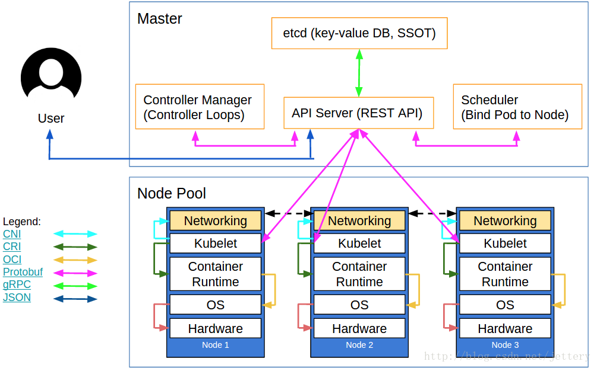
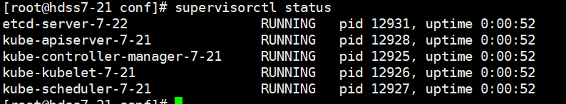
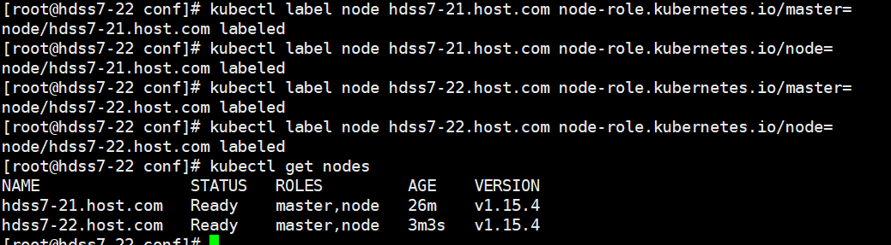

# 概述资料地址：https://blog.csdn.net/bbwangj/article/details/81904350



 

 

 

Kubelet组件运行在Node节点上，维持运行中的Pods以及提供kuberntes运行时环境，主要完成以下使命： 
 １．监视分配给该Node节点的pods 
 ２．挂载pod所需要的volumes 
 ３．下载pod的secret 
 ４．通过docker/rkt来运行pod中的容器 
 ５．周期的执行pod中为容器定义的liveness探针 
 ６．上报pod的状态给系统的其他组件 
 ７．上报Node的状态 

kubelet安装在node节点，我们的node跟apiserver在一起，这里安装在hdss7-21,22上：

首先，kubernetes依赖pause，我们先将此服务上传到们自己的docker私有仓库：

 

kubernetes中的pause容器主要为每个业务容器提供以下功能：

 

- 在pod中担任Linux命名空间共享的基础；
- 启用pid命名空间，开启init进程。

 

 

HDSS7-200上:

```
# docker pull kubernetes/pause
# docker tag f9d5de079539 harbor.od.com/public/pause:latest
# docker push harbor.od.com/public/pause:latest
```

 

首先在hdss7-200上申请证书：

```
# vi /opt/certs/kubelet-csr.json
```


```
{
    "CN": "k8s-kubelet",
    "hosts": [
    "127.0.0.1",
    "10.4.7.10",
    "10.4.7.21",
    "10.4.7.22",
    "10.4.7.23",
    "10.4.7.24",
    "10.4.7.25",
    "10.4.7.26",
    "10.4.7.27",
    "10.4.7.28"
    ],
    "key": {
        "algo": "rsa",
        "size": 2048
    },
    "names": [
        {
            "C": "CN",
            "ST": "beijing",
            "L": "beijing",
            "O": "od",
            "OU": "ops"
        }
    ]
}
```


申请证书：

```
# cfssl gencert -ca=ca.pem -ca-key=ca-key.pem -config=ca-config.json -profile=server kubelet-csr.json | cfssl-json -bare kubelet
```

拷贝证书到21，22上：

```
# cd /opt/kubernetes/server/bin/cert/
# scp hdss7-200:/opt/certs/kubelet.pem ./
# scp hdss7-200:/opt/certs/kubelet-key.pem ./
```

进入到conf目录执行以下命令：21，22上执行：

```
cert]# cd ../conf/
# kubectl config set-cluster myk8s \
  --certificate-authority=/opt/kubernetes/server/bin/cert/ca.pem \
  --embed-certs=true \
  --server=https://10.4.7.10:7443 \
  --kubeconfig=kubelet.kubeconfig
# kubectl config set-credentials k8s-node \
  --client-certificate=/opt/kubernetes/server/bin/cert/client.pem \
  --client-key=/opt/kubernetes/server/bin/cert/client-key.pem \
  --embed-certs=true \
  --kubeconfig=kubelet.kubeconfig 
# kubectl config set-context myk8s-context \
  --cluster=myk8s \
  --user=k8s-node \
  --kubeconfig=kubelet.kubeconfig
# kubectl config use-context myk8s-context --kubeconfig=kubelet.kubeconfig
```

hdss7-21上执行：PS：因为不论在哪个节点创建，已经同步到etcd上。

```
conf]# vi k8s-node.yaml
```


```
apiVersion: rbac.authorization.k8s.io/v1
kind: ClusterRoleBinding
metadata:
  name: k8s-node
roleRef:
  apiGroup: rbac.authorization.k8s.io
  kind: ClusterRole
  name: system:node
subjects:
- apiGroup: rbac.authorization.k8s.io
  kind: User
  name: k8s-node
```


```
# kubectl create -f k8s-node.yaml
```

检查k8s-node资源创建状态：

```
# kubectl get clusterrolebinding k8s-node -o yaml
```


 

 

 

编辑kubelet启动脚本：标红部分第二台要修改成对应的主机名

```
# vi /opt/kubernetes/server/bin/kubelet.sh
```


```
#!/bin/sh
./kubelet \
  --anonymous-auth=false \
  --cgroup-driver systemd \
  --cluster-dns 192.168.0.2 \
  --cluster-domain cluster.local \
  --runtime-cgroups=/systemd/system.slice \
  --kubelet-cgroups=/systemd/system.slice \
  --fail-swap-on="false" \
  --client-ca-file ./cert/ca.pem \
  --tls-cert-file ./cert/kubelet.pem \
  --tls-private-key-file ./cert/kubelet-key.pem \
  --hostname-override hdss7-21.host.com \
  --image-gc-high-threshold 20 \
  --image-gc-low-threshold 10 \
  --kubeconfig ./conf/kubelet.kubeconfig \
  --log-dir /data/logs/kubernetes/kube-kubelet \
  --pod-infra-container-image harbor.od.com/public/pause:latest \
  --root-dir /data/kubelet
```

执行权限：

```
# chmod u+x /opt/kubernetes/server/bin/kubelet.sh
```

创建日志存储目录：

```
# mkdir -p /data/logs/kubernetes/kube-kubelet
```

编辑supervisord启动文件：红色部分自行修改

```
# vi /etc/supervisord.d/kube-kubelet.ini
```


```
[program:kube-kubelet-7-21]
command=/opt/kubernetes/server/bin/kubelet.sh     ; the program (relative uses PATH, can take args)
numprocs=1                                        ; number of processes copies to start (def 1)
directory=/opt/kubernetes/server/bin              ; directory to cwd to before exec (def no cwd)
autostart=true                                    ; start at supervisord start (default: true)
autorestart=true                                ; retstart at unexpected quit (default: true)
startsecs=30                                      ; number of secs prog must stay running (def. 1)
startretries=3                                    ; max # of serial start failures (default 3)
exitcodes=0,2                                     ; 'expected' exit codes for process (default 0,2)
stopsignal=QUIT                                   ; signal used to kill process (default TERM)
stopwaitsecs=10                                   ; max num secs to wait b4 SIGKILL (default 10)
user=root                                         ; setuid to this UNIX account to run the program
redirect_stderr=true                              ; redirect proc stderr to stdout (default false)
stdout_logfile=/data/logs/kubernetes/kube-kubelet/kubelet.stdout.log   ; stderr log path, NONE for none; default AUTO
stdout_logfile_maxbytes=64MB                      ; max # logfile bytes b4 rotation (default 50MB)
stdout_logfile_backups=4                          ; # of stdout logfile backups (default 10)
stdout_capture_maxbytes=1MB                       ; number of bytes in 'capturemode' (default 0)
stdout_events_enabled=false                       ; emit events on stdout writes (default false)
```


```
# supervisorctl update
# supervisorctl status
```



 

给node打tag：

```
# kubectl label node hdss7-21.host.com node-role.kubernetes.io/master=
```



